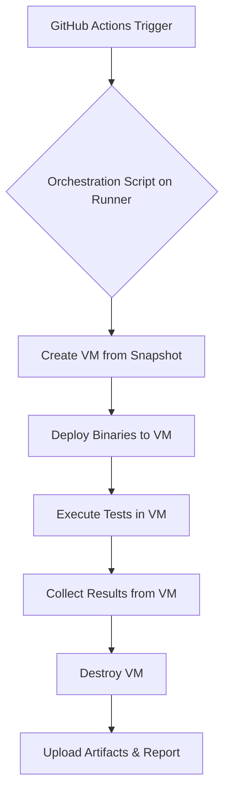

# ColdVox VM-Based Compositor Testing Infrastructure Design

## 1. Architecture Overview

This document outlines the design for a VM-based testing infrastructure to validate ColdVox's text injection backends across a matrix of Linux desktop compositors. The primary goal is to achieve reliable, automated testing with comprehensive coverage and maintainability.

The proposed architecture is centered around a self-hosted GitHub Actions runner that orchestrates the entire testing lifecycle using `libvirt/QEMU` for VM management and `Packer` for building reproducible VM images.

### 1.1. System Components

*   **CI Orchestrator**: The existing self-hosted GitHub Actions runner will be the brain of the operation. It will trigger test runs, manage the test matrix, and report results.
*   **VM Hypervisor**: `libvirt` with `QEMU/KVM` will be used on the host machine to provision and manage the virtual machines. This provides the necessary hardware-level virtualization for running full desktop environments.
*   **Image Builder**: `Packer` will be used to automate the creation of pre-configured QCOW2 VM images for each target environment.
*   **Test Execution Host**: The existing 32GB Nobara Linux machine will host the runner and the VMs.
*   **Test VMs**: Lightweight, snapshot-based VMs running different desktop compositors.

### 1.2. High-Level Workflow

The testing process will follow these steps for each compositor in the test matrix:

1.  **Trigger**: A CI workflow is triggered either by a nightly schedule, a `workflow_dispatch` event, or (for smoke tests) a pull request.
2.  **Provision**: The CI job creates a new VM from a pre-warmed, clean QCOW2 snapshot.
3.  **Deploy**: The latest ColdVox test binary and supporting test scripts are copied into the VM via `scp`.
4.  **Execute**: A test script is executed inside the VM, which sets up the environment, runs the `coldvox-text-injection` suite, and collects the results.
5.  **Collect**: Test logs, exit codes, and any other artifacts are packaged and copied back to the host.
6.  **Teardown**: The VM and its snapshot are destroyed, ensuring a clean slate for the next run.
7.  **Report**: The CI job aggregates the results from all compositors and presents a summary.



## 2. VM Infrastructure Specification

### 2.1. VM Provisioning and Management

*   **Hypervisor**: `libvirt` with `QEMU/KVM`. It is robust, well-supported, and ideal for our use case.
*   **Image Building**: `Packer` with the `qemu` builder. This ensures that our VM images are reproducible and version-controlled. Packer scripts will live in the ColdVox repository under a `packer/` directory.
*   **Base Images**: We will create "golden" QCOW2 images for each required OS/compositor combination. These images will be pre-configured with:
    *   A dedicated `testuser` with auto-login enabled.
    *   All necessary system dependencies for the compositor and ColdVox.
    *   CI-specific configurations (e.g., SSH access, Polkit rules).
    *   The required desktop environment.
*   **Snapshot Strategy**: For each test run, a temporary backing snapshot will be created from the golden image using `qemu-img create -f qcow2 -b base.qcow2 snapshot.qcow2`. This is extremely fast and guarantees a pristine environment for every test, preventing state leakage between runs.

### 2.2. Base OS and File Structure

To balance maintainability and compatibility, we will use a mix of Fedora and Arch Linux as base systems.

*   **Fedora Spins**: For KDE, GNOME, Sway, and XFCE, we will use the corresponding Fedora Spins. This standardizes the core toolchain and simplifies maintenance.
*   **Arch Linux**: For Hyprland, Arch Linux is the more natural fit and will be easier to configure.

**Proposed Directory Structure:**

```
coldvox/
├── packer/
│   ├── fedora-kde.pkr.hcl
│   ├── fedora-gnome.pkr.hcl
│   ├── fedora-sway.pkr.hcl
│   ├── fedora-xfce.pkr.hcl
│   ├── arch-hyprland.pkr.hcl
│   └── scripts/
│       ├── base-setup.sh         # Common setup
│       ├── polkit-rules.sh       # Install Polkit rules
│       └── compositor-setup.sh   # DE-specific setup
└── scripts/
    ├── ci-run-vm-test.sh         # Main orchestration script called by CI
    └── vm-run-tests.sh           # Script to be executed inside the VM
```

### 2.3. Resource Management

Given the 32GB RAM on the host system, we must manage resources carefully.

*   **VM Sizing**:
    *   **RAM**: 4GB per VM.
    *   **vCPUs**: 2 per VM.
*   **Concurrency**: To avoid host resource exhaustion, we will limit the number of concurrently running VMs. The GitHub Actions workflow will run the matrix jobs **sequentially** by default. With 4GB/VM, this allows for one active VM while leaving ample resources for the host OS and other tasks. If faster execution is needed, we can increase concurrency to 2-3 VMs after performance monitoring.
*   **Disk Space**: QCOW2 images are space-efficient. A cleanup job will be scheduled to run weekly to prune old snapshots and logs from the runner.

## 3. Compositor Matrix Definition

The following matrix will provide comprehensive coverage of the target environments.

| Compositor        | Session Type | Base OS            | Key Dependencies & Configuration                                                                                                                              |
| ----------------- | ------------ | ------------------ | ------------------------------------------------------------------------------------------------------------------------------------------------------------- |
| KDE Plasma        | X11          | Fedora KDE Spin    | `kwin_x11`, `plasma-desktop`, `xdg-desktop-portal-kde`. Ensure X11 session is default.                                                                          |
| KDE Plasma        | Wayland      | Fedora KDE Spin    | `kwin_wayland`, `plasma-desktop`, `xdg-desktop-portal-kde`. Ensure Wayland session is default.                                                                  |
| GNOME Shell       | Wayland      | Fedora Workstation | `gnome-shell` (Wayland), `mutter`, `xdg-desktop-portal-gnome`.                                                                                                 |
| GNOME Shell       | X11          | Fedora Workstation | `gnome-shell` (Xorg), `mutter`, `xdg-desktop-portal-gnome`. Requires `gdm-custom.conf` to disable Wayland.                                                       |
| Sway              | Wayland      | Fedora Sway Spin   | `sway`, `wlroots`, `xdg-desktop-portal-wlr`.                                                                                                                   |
| XFCE              | X11          | Fedora XFCE Spin   | `xfce4-session`, `xfwm4`, `xdg-desktop-portal-gtk`. A lightweight baseline for X11.                                                                            |
| Hyprland          | Wayland      | Arch Linux         | `hyprland`, `xdg-desktop-portal-hyprland`. Requires specific setup from Arch repositories.                                                                    |

## 4. Portal & Permission Management

Automating tests that interact with desktop security features is critical.

### 4.1. Polkit Rules

To grant ColdVox the necessary permissions for text injection and accessibility features without manual prompts, we will install custom Polkit rules in each VM image. These rules will grant specific permissions to the `testuser`.

**Example (`/etc/polkit-1/rules.d/99-coldvox-testing.rules`):**

```javascript
polkit.addRule(function(action, subject) {
    // Grant all permissions to the dedicated test user to avoid interactive prompts.
    // This is safe as the VMs are isolated and ephemeral.
    if (subject.user === "testuser") {
        // For AT-SPI bus access
        if (action.id == "org.gnome.atspi.Bus.RequestAddress") {
            return polkit.Result.YES;
        }
        // For remote desktop/input injection portals
        if (action.id.indexOf("org.freedesktop.portal.RemoteDesktop") != -1) {
            return polkit.Result.YES;
        }
        // Add more specific rules as discovered during implementation.
        // A broader, but less secure, initial rule could be:
        // return polkit.Result.YES;
    }
});
```

### 4.2. D-Bus Session Management

The test suite must run inside the correct D-Bus session. The `vm-run-tests.sh` script will ensure this by using `dbus-run-session` or by connecting to the existing user session bus.

### 4.3. Portal Readiness Validation

Before executing the main test suite, a pre-flight check in `vm-run-tests.sh` will validate that the required portals are running and accessible over D-Bus.

**Example Check:**

```bash
# In vm-run-tests.sh
echo "Validating xdg-desktop-portal readiness..."
if ! dbus-send --session --print-reply --dest=org.freedesktop.portal.Desktop /org/freedesktop/portal/desktop org.freedesktop.DBus.Peer.Ping > /dev/null; then
    echo "Error: xdg-desktop-portal not available on session bus."
    exit 1
fi
```

## 5. Test Execution Strategy

### 5.1. Test Data Flow

1.  **Build Once**: A `build` job in the CI workflow will compile the `coldvox-text-injection` binary in release mode.
2.  **Distribute**: The `ci-run-vm-test.sh` script will use `scp` to transfer the binary, `vm-run-tests.sh`, and any other dependencies to the active VM. An SSH key will be configured in the Packer image and added to GitHub Actions secrets for access.
3.  **Execute Remotely**: `ssh` will be used to execute `vm-run-tests.sh` inside the VM.
4.  **Aggregate**: The script inside the VM will archive all logs and test outputs into a single `.tar.gz` file.
5.  **Collect**: `scp` will pull the result archive back to the runner's workspace.

### 5.2. Compositor-Specific Handling

The `ci-run-vm-test.sh` script will take the compositor name (e.g., `kde-wayland`) as an argument. It will use this to select the correct VM image and potentially pass environment-specific flags to the script running inside the VM.

**Example `ci-run-vm-test.sh` snippet:**

```bash
#!/bin/bash
set -euo pipefail

COMPOSITOR="$1"
VM_NAME="coldvox-test-${COMPOSITOR}-${GITHUB_RUN_ID}"
BASE_IMAGE="/var/lib/libvirt/images/coldvox-${COMPOSITOR}.qcow2"
SNAPSHOT_IMAGE="/var/lib/libvirt/images/${VM_NAME}.qcow2"

# 1. Create snapshot
qemu-img create -f qcow2 -b "${BASE_IMAGE}" -F qcow2 "${SNAPSHOT_IMAGE}"

# 2. Define and start VM using virsh
virsh define --file "vms/${COMPOSITOR}.xml"
virsh start "${VM_NAME}"

# ... wait for SSH to be ready ...

# 3. Deploy and execute
scp -i ~/.ssh/id_testvm target/release/coldvox-text-injection testuser@<vm_ip>:~/
ssh -i ~/.ssh/id_testvm testuser@<vm_ip> "./vm-run-tests.sh"

# 4. Collect results
scp -i ~/.ssh/id_testvm testuser@<vm_ip>:/tmp/results.tar.gz "results/${COMPOSITOR}/"

# 5. Teardown
virsh destroy "${VM_NAME}"
rm "${SNAPSHOT_IMAGE}"
```

## 6. CI Integration Design

### 6.1. GitHub Actions Workflow

We will create a new workflow file, `.github/workflows/compositor-matrix.yml`.

*   **Triggers**:
    *   **Nightly**: `schedule: cron: '0 2 * * *'` for comprehensive runs.
    *   **Manual**: `workflow_dispatch` for on-demand runs.
*   **Jobs**:
    *   `build`: Compiles the Rust binary and test suite.
    *   `test-matrix`: A matrix job that depends on `build`. It will run the tests for each compositor.
        *   `strategy.fail-fast: false`: Ensures all tests run even if one fails.
        *   `strategy.max-parallel: 1`: Runs jobs sequentially to manage resources.
*   **PR Feedback (Smoke Test)**:
    *   A separate, non-blocking job in the main `ci.yml` will run a single, fast test (e.g., XFCE) on every PR. This provides quick feedback without tying up the runner for the full matrix.
    *   The result will be posted as a "check" but will not be a required check for merging.

**Example `.github/workflows/compositor-matrix.yml`:**

```yaml
name: Compositor Test Matrix

on:
  workflow_dispatch:
  schedule:
    - cron: '0 2 * * *' # 2 AM every day

jobs:
  build:
    runs-on: [self-hosted, Linux, X64]
    steps:
      - uses: actions/checkout@v3
      - name: Build test suite
        run: cargo build --release --bin coldvox-text-injection
      - uses: actions/upload-artifact@v3
        with:
          name: test-binary
          path: target/release/coldvox-text-injection

  test-matrix:
    needs: build
    runs-on: [self-hosted, Linux, X64, vm-host] # Custom label for the runner
    strategy:
      fail-fast: false
      matrix:
        compositor: [kde-x11, kde-wayland, gnome-wayland, gnome-x11, sway, xfce, hyprland]
    steps:
      - uses: actions/checkout@v3
      - uses: actions/download-artifact@v3
        with:
          name: test-binary
          path: target/release/
      - name: Run tests on ${{ matrix.compositor }}
        run: ./scripts/ci-run-vm-test.sh ${{ matrix.compositor }}
      - name: Upload results
        if: always() # Upload results even if the test fails
        uses: actions/upload-artifact@v3
        with:
          name: test-results-${{ matrix.compositor }}
          path: results/${{ matrix.compositor }}/
```

## 7. Implementation Phases

1.  **Phase 1: Foundation (Single Compositor)**
    *   **Goal**: Prove the end-to-end concept with one environment.
    *   **Tasks**:
        1.  Install and configure `libvirt/qemu` on the runner host.
        2.  Create a Packer build for a single, simple environment (Fedora XFCE).
        3.  Develop the initial `ci-run-vm-test.sh` and `vm-run-tests.sh` scripts.
        4.  Create the initial `compositor-matrix.yml` with just the XFCE job.
        5.  **Milestone**: A single green CI run that successfully provisions, tests, and cleans up an XFCE VM.

2.  **Phase 2: Expansion to Fedora Ecosystem**
    *   **Goal**: Cover all Fedora-based compositors.
    *   **Tasks**:
        1.  Create Packer builds for Fedora KDE, GNOME, and Sway.
        2.  Parameterize the orchestration scripts to handle the different environments.
        3.  Expand the CI matrix to include all Fedora-based compositors.
        4.  **Milestone**: The full Fedora-based matrix runs successfully on a nightly schedule.

3.  **Phase 3: Final Touches and Integration**
    *   **Goal**: Complete the matrix and integrate it fully.
    *   **Tasks**:
        1.  Create the Packer build for Arch Linux + Hyprland.
        2.  Add Hyprland to the CI matrix.
        3.  Implement the non-blocking PR smoke test in the main `ci.yml`.
        4.  Refine reporting, logging, and documentation.
        5.  Implement operational scripts for cleanup and basic monitoring.
        6.  **Milestone**: The full testing infrastructure is operational and meets all success criteria.

## 8. Operational Runbook

### 8.1. Maintenance

*   **Image Updates**: Packer configurations are version-controlled. Rebuild all VM images monthly to incorporate security patches and updates. This can be a manual process run by an engineer.
*   **Dependency Changes**: If ColdVox gains a new dependency, it must be added to the Packer `*-setup.sh` scripts and the images must be rebuilt.
*   **Disk Cleanup**: A cron job on the host machine should run weekly to delete old test artifacts and snapshots: `find /path/to/snapshots -mtime +7 -delete`.

### 8.2. Debugging

To debug a failed test in a specific environment (e.g., `kde-wayland`):

1.  Modify `ci-run-vm-test.sh` locally to comment out the final `virsh destroy` and `rm` commands.
2.  Run the script manually on the runner host: `./scripts/ci-run-vm-test.sh kde-wayland`.
3.  If the test fails, the VM will remain running.
4.  `ssh` into the VM (`ssh -i ~/.ssh/id_testvm testuser@<vm_ip>`) for interactive debugging.
5.  Inspect logs in `/tmp/test-results`, re-run commands, and investigate the environment state.

### 8.3. Monitoring

*   **Host Health**: Basic monitoring should be set up on the runner host to track:
    *   Disk Space (`df -h`)
    *   RAM Usage (`free -h`)
    *   CPU Load (`uptime`)
*   **Alerting**: Simple alerts can be configured via cron jobs that send an email if, for example, disk usage exceeds 90%. For now, manual monitoring is sufficient.

## 9. Success Criteria

The successful completion of this project will be defined by the following criteria:

*   **Reliability**: The full compositor matrix can run nightly without manual intervention.
*   **Coverage**: All 5 text injection backends are tested across the 7 defined compositor environments.
*   **Performance**: The entire test matrix completes in under 4 hours.
*   **Maintainability**: VM images and configurations can be updated systematically by editing files in the repository and running a build script.
*   **Integration**: The new testing workflow is seamlessly integrated with GitHub Actions and does not disrupt existing development workflows.