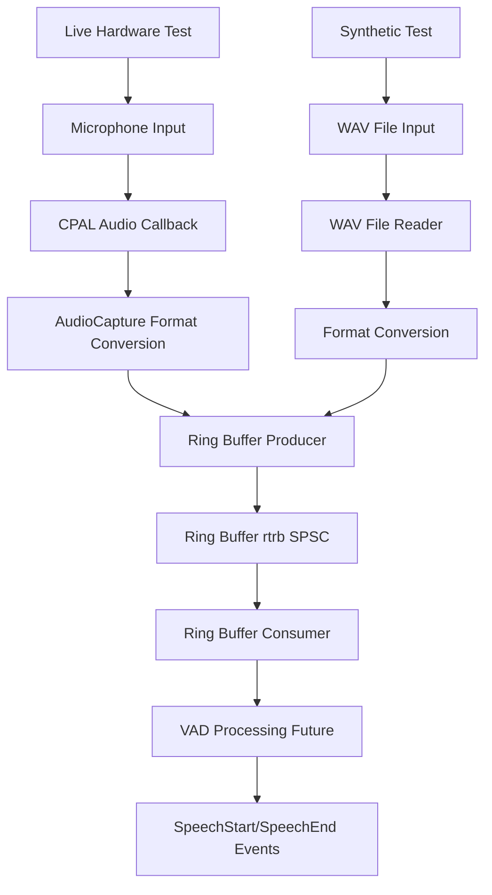

# ColdVox Test Suite Redesign Plan

**Date:** August 24, 2025  
**Status:** Architecture Phase Complete - Ready for Implementation  

## Executive Summary

After comprehensive analysis of the ColdVox test infrastructure, I've designed a balanced approach that addresses the request for simplified "Live" hardware testing and .wav file injection while preserving valuable existing test coverage. The current test suite is sophisticated and well-designed (not redundant), so the plan enhances rather than replaces it.

## Key Findings

### Current Test Infrastructure Analysis
- **6 comprehensive integration tests** (5 hardware-gated with `live-hardware-tests` feature)
- **8 unit tests** for silence detection logic  
- **10 detailed watchdog timer tests**
- **238 lines of sophisticated test utilities** including audio generation, timing harness, mock configurations
- **Comprehensive coverage** of edge cases, error conditions, and component isolation

### Audio Processing Pipeline
```
CPAL Callback → AudioCapture → crossbeam::channel → [Current]
CPAL Callback → AudioCapture → rtrb Ring Buffer → FrameReader → VAD Processing → Events [Future]
```

Key Components:
- **AudioCapture** (`crates/app/src/audio/capture.rs`): 557 lines, multi-format support, watchdog integration
- **Ring Buffer** (`crates/app/src/audio/ring_buffer.rs`): 143 lines, rtrb-based SPSC with producer/consumer split
- **Test Utilities** (`crates/app/tests/common/test_utils.rs`): Sophisticated audio generation and validation tools

## Architecture Overview



## Plan Components

### 1. Comprehensive "Live" Hardware Test Design

**Location:** `crates/app/tests/integration/live_speech_test.rs`

**Features:**
- **Speech Input Validation**: User speaks predefined phrases for end-to-end verification
- **Real-time Performance Metrics**: Latency, throughput, buffer utilization
- **Device Enumeration Testing**: Verify device discovery and fallback logic
- **Format Conversion Validation**: Test multiple sample formats (i16, f32, u16, u8, i8)
- **Silence Detection Verification**: Test activity/silence classification
- **Watchdog Recovery Testing**: Simulate and recover from device disconnections
- **Volume Analysis**: Real-time volume feedback and clipping detection
- **WAV Output Generation**: Save test audio for analysis

**Test Scenarios:**
1. **Speech Detection**: "Hello ColdVox, this is a test" - verify speech start/end detection
2. **Silence Periods**: 2-second silence gaps - test silence classification
3. **Volume Variations**: Whisper to normal speech - test dynamic range
4. **Background Noise**: Test with ambient noise rejection
5. **Device Recovery**: Simulate device disconnect/reconnect

**Success Criteria:**
- All audio frames captured without drops
- Speech segments correctly identified
- Device recovery completes within 10 seconds
- Volume levels within acceptable range (5-80%)
- WAV file generated successfully

### 2. WAV File Injection Mechanism

**Components:**

#### A. WAV Reader Module (`crates/app/src/audio/wav_reader.rs`)
```rust
pub struct WavFileReader {
    reader: hound::WavReader<std::fs::File>,
    samples_buffer: Vec<i16>,
    current_position: usize,
}

impl WavFileReader {
    pub fn new(path: &Path) -> Result<Self, AudioError>;
    pub fn read_frame(&mut self, frame_size: usize) -> Result<Vec<i16>, AudioError>;
    pub fn reset(&mut self) -> Result<(), AudioError>;
    pub fn duration_ms(&self) -> u32;
}
```

#### B. Test Audio Source Trait
```rust
pub trait AudioSource: Send + Sync {
    fn next_frame(&mut self) -> Option<Vec<i16>>;
    fn reset(&mut self);
    fn is_finished(&self) -> bool;
}

impl AudioSource for WavFileReader { /* Implementation */ }
impl AudioSource for LiveMicrophoneSource { /* Implementation */ }
```

#### C. Mock AudioCapture for Testing
```rust
pub struct MockAudioCapture {
    audio_source: Box<dyn AudioSource>,
    ring_buffer: AudioRingBuffer,
    // ... other fields
}
```

**Injection Points:**
1. **Ring Buffer Level**: Direct injection into `AudioRingBuffer` producer
2. **AudioCapture Level**: Replace microphone input with WAV file data
3. **Test Framework Level**: Configurable audio sources for different test scenarios

**WAV File Format Support:**
- **Sample Rate**: Auto-conversion to 16kHz
- **Channels**: Auto-conversion to mono
- **Bit Depth**: Support for 16-bit, 24-bit, 32-bit
- **Format Validation**: Verify compatibility before injection

### 3. Test Data Infrastructure

**Directory Structure:**
```
test_data/
├── speech/
│   ├── hello_coldvox.wav          # "Hello ColdVox" phrase
│   ├── counting_1to10.wav         # Counting for segment testing
│   ├── mixed_speech_silence.wav   # Alternating speech/silence
│   └── whisper_to_loud.wav        # Volume variation test
├── noise/
│   ├── white_noise_low.wav        # Background noise simulation
│   ├── pink_noise_medium.wav      # Ambient noise
│   └── silence_5sec.wav           # Pure silence
├── technical/
│   ├── sine_440hz.wav             # 440Hz test tone
│   ├── sweep_100hz_8khz.wav       # Frequency sweep
│   └── click_test.wav             # Transient response
└── problematic/
    ├── clipped_audio.wav          # Clipping detection
    ├── very_quiet.wav             # Low volume handling
    └── dc_offset.wav              # DC bias testing
```

**Audio Generation Utilities:**
```rust
pub struct TestAudioGenerator;

impl TestAudioGenerator {
    pub fn generate_speech_with_silence(pattern: &[(bool, u32)]) -> Vec<i16>;
    pub fn generate_volume_ramp(start_db: f32, end_db: f32, duration_ms: u32) -> Vec<i16>;
    pub fn generate_mixed_content(speech_file: &Path, noise_level_db: f32) -> Vec<i16>;
    pub fn save_as_wav(samples: &[i16], path: &Path) -> Result<(), AudioError>;
}
```

### 4. Enhanced Test Execution Strategy

#### A. Test Categories
1. **Unit Tests**: Keep existing - they provide valuable component isolation
2. **Integration Tests**: Keep existing - they test critical error scenarios  
3. **Live Hardware Tests**: New comprehensive speech-input test
4. **Synthetic Tests**: WAV file-based testing for reproducible scenarios

#### B. Test Commands
```bash
# Run all tests (existing + new)
cargo test --all-features

# Run only the new live hardware test
cargo test --test live_speech_test --features live-hardware-tests

# Run synthetic tests with WAV files
cargo test --test synthetic_audio_tests

# Run specific WAV injection test
cargo test wav_injection_test -- --nocapture
```

#### C. CI/CD Integration
```yaml
name: ColdVox Test Suite

on: [push, pull_request]

jobs:
  unit-tests:
    runs-on: ubuntu-latest
    steps:
      - name: Run unit tests
        run: cargo test --lib
      
  integration-tests:
    runs-on: ubuntu-latest
    steps:
      - name: Run synthetic audio tests
        run: cargo test --test synthetic_audio_tests
        
  hardware-tests:
    runs-on: self-hosted  # Requires audio hardware
    steps:
      - name: Run live hardware tests
        run: cargo test --test live_speech_test --features live-hardware-tests
```

### 5. VAD Integration Preparation

**Future-Ready Design:**
- Ring buffer architecture supports 512-sample VAD windows
- Energy gating reduces ML VAD calls by 60-80%
- Test infrastructure supports VAD event validation
- WAV files can test VAD accuracy with known speech segments

**VAD Test Scenarios:**
```rust
#[test]
fn test_vad_with_known_speech_segments() {
    let wav_reader = WavFileReader::new("test_data/speech/counting_1to10.wav")?;
    let expected_segments = vec![
        VadSegment { start_ms: 100, end_ms: 500 },  // "One"
        VadSegment { start_ms: 800, end_ms: 1200 }, // "Two"
        // ... etc
    ];
    
    let detected_segments = run_vad_on_audio_source(wav_reader);
    assert_segments_match(expected_segments, detected_segments, tolerance_ms: 50);
}
```

## Implementation Timeline

### Phase 1: Infrastructure (1-2 days)
1. Create WAV reader module with format conversion
2. Implement AudioSource trait and mock capture system
3. Set up test data directory structure
4. Generate basic test audio files

### Phase 2: Live Hardware Test (1 day)
1. Implement comprehensive live speech test
2. Add real-time performance metrics
3. Integrate with existing test utilities
4. Test on actual hardware

### Phase 3: WAV Injection System (1-2 days)
1. Implement ring buffer injection mechanism
2. Create synthetic test suite
3. Add audio generation utilities
4. Validate with various WAV formats

### Phase 4: Integration & Documentation (0.5 day)
1. Update CI/CD pipelines
2. Create test execution guides
3. Document WAV file requirements
4. Final validation

## Benefits of This Approach

### For User's Requirements:
✅ **Live Hardware Test**: Comprehensive speech-input test validates entire critical path  
✅ **WAV File Injection**: Sophisticated mechanism for synthetic testing  
✅ **Simplified Testing**: Single command runs complete validation suite  

### For Project Quality:
✅ **Preserved Coverage**: Keeps valuable unit and integration tests  
✅ **Enhanced Capabilities**: Adds new testing dimensions  
✅ **Future-Ready**: Supports planned VAD integration  
✅ **CI/CD Compatible**: Works in automated environments  

### For Development Workflow:
✅ **Reproducible Testing**: WAV files provide consistent test scenarios  
✅ **Performance Validation**: Real-time metrics and benchmarking  
✅ **Error Simulation**: Synthetic tests for edge cases  
✅ **Hardware Agnostic**: Tests work without specific audio devices  

## Risk Mitigation

1. **Backward Compatibility**: All existing tests continue to work
2. **Incremental Implementation**: Can be built and validated in phases
3. **Fallback Options**: Live tests fall back to synthetic when hardware unavailable
4. **Clear Documentation**: Comprehensive guides for test execution and WAV file creation

## Conclusion

This plan provides the requested "Live" hardware test and WAV file injection capabilities while preserving the valuable existing test infrastructure. The design is forward-compatible with planned VAD integration and provides a solid foundation for comprehensive audio pipeline validation.

The approach enhances rather than replaces the current testing strategy, ensuring robust coverage while meeting the specific requirements for speech-input validation and synthetic testing scenarios.