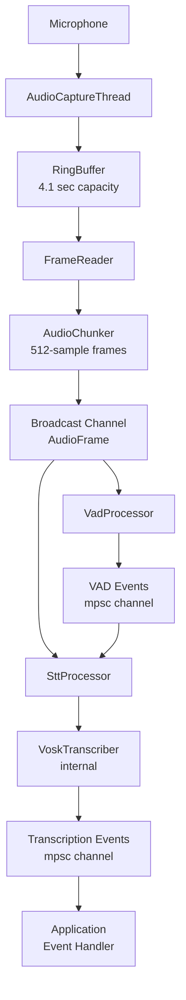

# STT Pipeline Inspection Plan

## Executive Summary
This document provides a functional inspection plan for the ColdVox STT (Speech-to-Text) pipeline, focusing on correctness, reliability, and proper operation rather than performance optimization.

## Pipeline Architecture Overview

### Data Flow Sequence



### Key Components
1. **AudioCaptureThread**: Hardware interface, format conversion to 16kHz mono
2. **AudioRingBuffer**: 4+ second lock-free buffer (generous capacity)
3. **AudioChunker**: Creates 512-sample frames for processing
4. **VadProcessor**: Silero-based voice activity detection
5. **SttProcessor**: STT orchestration gated by VAD events
6. **VoskTranscriber**: Vosk engine wrapper

## Functional Inspection Points

### 1. Audio Capture Correctness
**Location**: `crates/app/src/audio/capture.rs`

**Functional Checks**:
- Device initialization and format negotiation
- Sample rate conversion accuracy (input → 16kHz)
- Stereo to mono conversion (channel averaging)
- Audio data integrity (no corruption or artifacts)
- Device disconnection detection and recovery

**Verification Methods**:
- Record test audio and verify format conversion
- Check for audio artifacts or dropouts
- Test device hot-plug scenarios
- Validate sample rate with known test tones

### 2. Ring Buffer Data Integrity
**Location**: Ring buffer operations in `main.rs:41-42`

**Functional Checks**:
- Data ordering preservation (FIFO behavior)
- No sample corruption during transfer
- Overflow handling (should be rare with 4+ sec capacity)
- Producer/consumer synchronization correctness

**Verification Methods**:
- Inject known test patterns and verify output
- Monitor for any data corruption
- Test overflow scenarios (artificial delays)
- Validate sample count accuracy

### 3. Audio Chunking Accuracy
**Location**: `crates/app/src/audio/chunker.rs`

**Functional Checks**:
- Consistent 512-sample frame output
- Correct timestamp generation
- No sample loss between variable input and fixed output
- Broadcast delivery to all subscribers

**Verification Methods**:
- Verify frame size consistency
- Check timestamp monotonicity and accuracy
- Count input vs output samples (should match)
- Confirm both VAD and STT receive frames

### 4. VAD Functionality
**Location**: `crates/app/src/audio/vad_processor.rs`

**Functional Checks**:
- Speech vs silence detection accuracy
- Proper SpeechStart/SpeechEnd event generation
- Silero model loading and initialization
- State transitions (Idle ↔ Active)

**Verification Methods**:
- Test with known speech/silence audio samples
- Verify event timing corresponds to actual speech
- Check for missed speech or false triggers
- Validate VAD state machine behavior

### 5. STT Coordination
**Location**: `crates/app/src/stt/processor.rs`

**Functional Checks**:
- Proper response to VAD events
- Audio processing only during speech segments
- Transcriber state management (reset between utterances)
- Event correlation between VAD triggers and audio processing

**Verification Methods**:
- Verify STT only processes during SpeechActive state
- Check transcriber reset between utterances
- Test with rapid speech start/stop scenarios
- Validate audio frame processing matches VAD events

### 6. Vosk Integration
**Location**: `crates/app/src/stt/vosk.rs`

**Functional Checks**:
- Model loading and validation
- PCM audio format compatibility (i16, 16kHz)
- Partial and final result generation
- Error handling for invalid audio or model issues

**Verification Methods**:
- Test model loading with valid/invalid paths
- Verify transcription accuracy with known audio
- Check partial result progression to final results
- Test error handling with corrupted audio

### 7. Event Delivery
**Location**: `crates/app/src/main.rs:121-134`

**Functional Checks**:
- Complete transcription event delivery
- Proper event ordering (partials before finals)
- Error event generation and handling
- Application event processing

**Verification Methods**:
- Log all transcription events with timing
- Verify event sequence correctness
- Test error propagation from transcriber
- Confirm application receives all events

## Diagnostic Procedures

### Pre-Flight Validation
1. **Model Availability**: Confirm Vosk model exists at specified path
2. **Audio Device**: Verify microphone is accessible and functional
3. **Permissions**: Check log directory write access
4. **Configuration**: Validate all config parameters are reasonable

### Functional Testing
1. **Silent Audio Test**: Confirm no false VAD triggers on silence
2. **Speech Detection Test**: Verify VAD triggers on actual speech
3. **Transcription Accuracy**: Test with known phrases
4. **Rapid Speech Test**: Multiple quick utterances
5. **Long Speech Test**: Extended speech segments
6. **Background Noise**: Speech with ambient noise

### Error Scenarios
1. **Device Disconnection**: Hot-unplug microphone during operation
2. **Model Missing**: Start without Vosk model
3. **Invalid Audio**: Feed corrupted audio data
4. **Resource Exhaustion**: Test under memory/CPU pressure

## Troubleshooting Guide

### No Transcription Output
1. Check VAD is detecting speech (log VAD events)
2. Verify STT processor responds to VAD events
3. Confirm Vosk model loads successfully
4. Validate audio format (16kHz, mono, i16)

### Incorrect Transcriptions
1. Test VAD sensitivity (may be triggering on noise)
2. Check audio quality and format conversion
3. Verify Vosk model is appropriate for audio content
4. Test with different speech samples

### Missed Speech
1. Check VAD sensitivity settings
2. Verify no audio dropouts in capture chain
3. Test VAD with isolated speech samples
4. Check for timing issues between VAD and STT

### System Errors
1. Check log files for error messages
2. Verify all components initialize successfully
3. Test individual components with probe utilities
4. Monitor system resources during operation

## Key Metrics (Functional)

### Basic Counters
- `audio_frames_captured`: From hardware
- `vad_events_generated`: Speech start/end events
- `stt_frames_processed`: Frames sent to transcriber
- `transcription_events`: Partial + final results
- `error_events`: Any processing errors

### Quality Indicators  
- `speech_detection_accuracy`: VAD correctness
- `transcription_latency`: Time from speech to result
- `system_uptime`: Continuous operation time
- `device_disconnections`: Hardware stability

### Health Checks
- All components responding
- No error accumulation
- Audio device connectivity
- Model loading success

## Testing Tools

### Examples for Manual Testing
```bash
# Test microphone capture
cargo run --example mic_probe -- --duration 30

# Test VAD functionality  
cargo run --example vad_demo

# Monitor real-time operation
cargo run --bin tui_dashboard

# Full pipeline test
RUST_LOG=info cargo run --features vosk
```

### Test Audio Files
- Create reference recordings for consistent testing
- Include silence, speech, noise, and mixed scenarios
- Test with different speakers and accents
- Validate with known transcription ground truth

## Success Criteria

The pipeline inspection is successful when:
1. **Audio flows correctly** from capture to transcription
2. **VAD accurately detects** speech vs silence
3. **STT produces correct transcriptions** for test audio
4. **Error handling works** for common failure scenarios
5. **System operates continuously** without crashes or hangs

## Configuration Validation

### Key Parameters
- Ring buffer: 65,536 samples (4.1 sec @ 16kHz) - generous capacity
- Chunk size: 512 samples (32ms) - optimal for VAD
- Broadcast capacity: 200 frames (6.4 sec) - more than adequate
- VAD sample rate: 16kHz - matches Silero requirements
- Event channels: 100 capacity - sufficient for typical usage

All buffer sizes are generously sized for reliable operation under normal conditions.