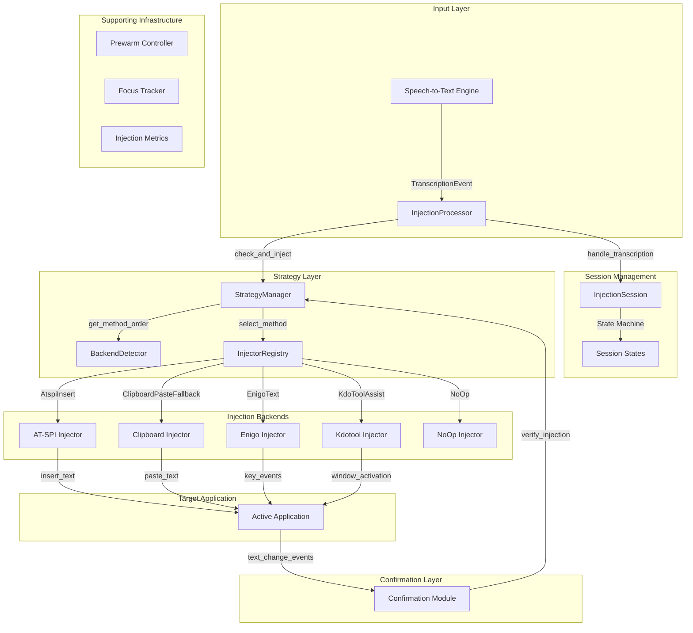
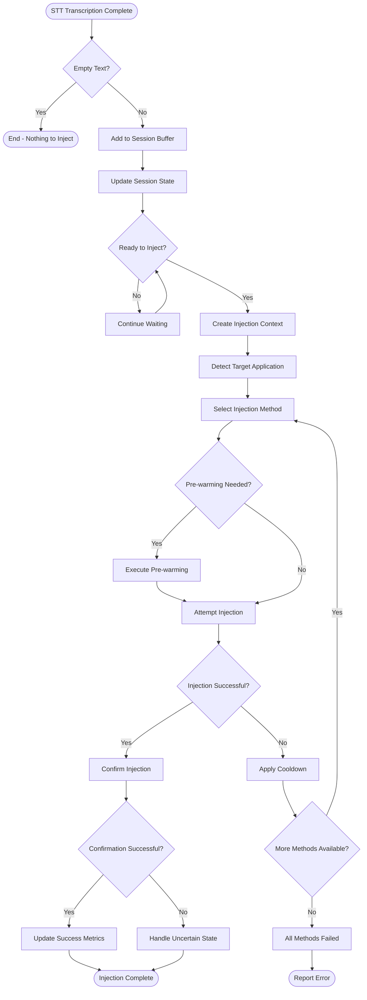
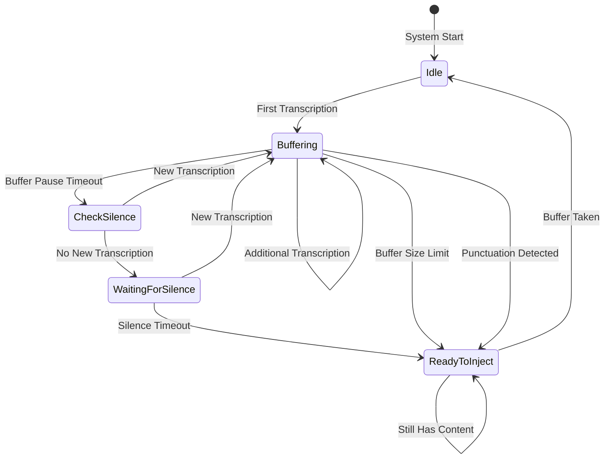
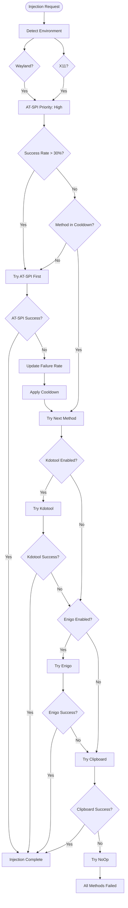

# ColdVox Text Injection System - Comprehensive Documentation

## Table of Contents

1. [System Overview](#system-overview)
2. [Architecture](#architecture)
3. [Core Components](#core-components)
4. [Pipeline Flow](#pipeline-flow)
5. [Injection Strategies](#injection-strategies)
6. [Configuration](#configuration)
7. [Performance Considerations](#performance-considerations)
8. [Error Handling](#error-handling)
9. [Integration Guide](#integration-guide)
10. [Troubleshooting](#troubleshooting)
11. [File Reference](#file-reference)

## System Overview

The ColdVox text injection system is a sophisticated, multi-layered component designed to reliably inject speech-to-text transcriptions into active Linux desktop applications. It employs multiple injection strategies with intelligent fallback mechanisms to ensure compatibility across diverse desktop environments (Wayland/X11) and applications.

### Key Features

- **Multi-Backend Support**: AT-SPI, clipboard-based, and input simulation methods
- **Adaptive Strategy Selection**: Chooses optimal method based on environment and success history
- **Robust Fallback Chain**: Multiple fallback mechanisms ensure reliability
- **State-Based Buffering**: Intelligent buffering with silence detection
- **Performance Optimization**: Pre-warming and caching for reduced latency
- **Comprehensive Metrics**: Detailed performance and reliability tracking

## Architecture

### High-Level Architecture



### Design Principles

1. **Adaptive Strategy Selection**: Dynamically selects injection method based on environment and history
2. **Robust Fallback Chain**: Multiple methods tried in sequence until one succeeds
3. **State-Based Session Management**: Intelligent buffering with silence detection
4. **Performance Optimization**: Pre-warming and caching for reduced latency
5. **Comprehensive Error Handling**: Graceful degradation and detailed error reporting

## Core Components

### InjectionProcessor

The main entry point that handles transcription events and coordinates the injection process.

**Key Functions**:
- `handle_transcription()` - Process incoming STT events
- `check_and_inject()` - Periodic injection trigger
- `perform_injection()` - Execute actual injection
- `force_inject()` - Manual injection trigger

### InjectionSession

Manages the state machine for buffering transcriptions and determining injection timing.

**States**:
- `Idle` - No active session, waiting for first transcription
- `Buffering` - Actively receiving transcriptions
- `WaitingForSilence` - No new transcriptions, waiting for timeout
- `ReadyToInject` - Silence timeout reached, ready to inject

### StrategyManager

The "brain" of the system that selects and executes injection methods with fallbacks.

**Key Functions**:
- `inject()` - Main injection method with fallbacks
- `get_method_order_cached()` - Get prioritized method list
- `update_success_record()` - Track method success/failure
- `apply_cooldown()` - Apply exponential backoff

### TextInjector Implementations

Multiple injector implementations provide different injection strategies:

1. **AtspiInjector** - AT-SPI accessibility API (preferred)
2. **ClipboardInjector** - Clipboard seed/restore (fallback)
3. **YdotoolInjector** - uinput automation (fallback)
4. **EnigoInjector** - Input simulation (optional)
5. **KdotoolInjector** - Window activation (optional)
6. **NoOpInjector** - No-op fallback (last resort)

## Pipeline Flow

### Complete Injection Flow



### Session State Management



## Injection Strategies

### Strategy Selection Flow



### Method Prioritization

1. **AT-SPI Direct Insertion** (Preferred)
   - Uses accessibility API for direct text insertion
   - Available on both Wayland and X11
   - Most reliable method when available

2. **Kdotool Assistance** (Optional)
   - Window activation/focus assistance for KDE/X11
   - Helps ensure proper focus before injection

3. **Enigo Text** (Optional)
   - Cross-platform input simulation
   - Uses libei on Wayland, X11 on X11

4. **Clipboard Paste** (Fallback)
   - Seed/restore clipboard with paste action
   - Avoided when possible to prevent clipboard disruption

5. **NoOp** (Last Resort)
   - Always succeeds but does nothing
   - Prevents system failure when all methods fail

## Configuration

### InjectionConfig

The system is highly configurable through `InjectionConfig`:

```rust
pub struct InjectionConfig {
    // Method preferences
    pub allow_kdotool: bool,
    pub allow_enigo: bool,
    
    // Timing configuration
    pub max_total_latency_ms: u64,
    pub per_method_timeout_ms: u64,
    pub paste_action_timeout_ms: u64,
    
    // Session configuration
    pub silence_timeout_ms: u64,
    pub buffer_pause_timeout_ms: u64,
    pub max_buffer_size: usize,
    
    // Performance optimization
    pub focus_cache_duration_ms: u64,
    pub clipboard_restore_delay_ms: Option<u64>,
    
    // Strategy selection
    pub min_success_rate: f64,
    pub min_sample_size: u32,
    pub cooldown_initial_ms: u64,
    pub cooldown_backoff_factor: f32,
    pub cooldown_max_ms: u64,
    
    // Privacy and security
    pub redact_logs: bool,
    pub allowlist: Vec<String>,
    pub blocklist: Vec<String>,
    
    // Debugging
    pub fail_fast: bool,
}
```

### Default Configuration

```rust
impl Default for InjectionConfig {
    fn default() -> Self {
        Self {
            // Method preferences
            allow_kdotool: false,
            allow_enigo: false,
            
            // Timing configuration
            max_total_latency_ms: 800,
            per_method_timeout_ms: 250,
            paste_action_timeout_ms: 200,
            
            // Session configuration
            silence_timeout_ms: 0,  // Immediate injection
            buffer_pause_timeout_ms: 0,  // No pause needed
            max_buffer_size: 5000,
            
            // Performance optimization
            focus_cache_duration_ms: 200,
            clipboard_restore_delay_ms: Some(500),
            
            // Strategy selection
            min_success_rate: 0.3,
            min_sample_size: 5,
            cooldown_initial_ms: 10000,
            cooldown_backoff_factor: 2.0,
            cooldown_max_ms: 300000,
            
            // Privacy and security
            redact_logs: true,
            allowlist: vec![],
            blocklist: vec![],
            
            // Debugging
            fail_fast: false,
        }
    }
}
```

## Performance Considerations

### Latency Optimization

1. **Pre-warming**: Resources are prepared in advance to minimize first-shot latency
2. **TTL Caching**: Pre-warmed data is cached with 3-second TTL
3. **Parallel Execution**: Independent pre-warming steps run in parallel
4. **Connection Reuse**: AT-SPI connections are reused when possible

### Resource Management

1. **Cooldown Management**: Failed methods enter exponential backoff
2. **Budget Enforcement**: Overall latency budget prevents excessive retries
3. **Memory Efficiency**: Buffering with size limits prevents memory issues
4. **CPU Optimization**: Polling intervals balanced for responsiveness

### Metrics Collection

The system collects comprehensive metrics for performance monitoring:

```rust
pub struct InjectionMetrics {
    // Overall metrics
    pub attempts: u64,
    pub successes: u64,
    pub failures: u64,
    pub total_duration_ms: u64,
    pub avg_duration_ms: f64,
    
    // Method-specific metrics
    pub method_metrics: HashMap<InjectionMethod, MethodMetrics>,
    
    // Operation metrics
    pub chars_buffered: u64,
    pub chars_injected: u64,
    pub flushes: u64,
    pub paste_uses: u64,
    pub keystroke_uses: u64,
    
    // Error metrics
    pub backend_denied: u64,
    pub focus_missing: u64,
    pub rate_limited: u64,
    
    // Timing metrics
    pub latency_from_final_ms: Vec<u64>,
    pub flush_size_chars: Vec<u64>,
    pub last_injection: Option<Instant>,
    pub stuck_buffer_age_ms: u64,
}
```

## Error Handling

### Error Types

```rust
pub enum InjectionError {
    NoEditableFocus,
    MethodNotAvailable(String),
    Timeout(u64),
    AllMethodsFailed(String),
    MethodUnavailable(String),
    MethodFailed(String),
    BudgetExhausted,
    Clipboard(String),
    Process(String),
    PermissionDenied(String),
    Io(std::io::Error),
    Other(String),
}
```

### Error Recovery Strategies

1. **Method Fallback**: Try alternative injection methods
2. **Cooldown Application**: Temporarily avoid failed methods
3. **Graceful Degradation**: Continue with available methods
4. **Error Reporting**: Detailed error logging and metrics
5. **Fail-Fast Option**: Immediate termination on all failures (debugging)

## Integration Guide

### Basic Usage

```rust
use coldvox_text_injection::{InjectionProcessor, InjectionConfig};

#[tokio::main]
async fn main() -> Result<(), Box<dyn std::error::Error>> {
    // Create configuration
    let config = InjectionConfig::default();
    
    // Create processor
    let mut processor = InjectionProcessor::new(config, None, metrics).await;
    
    // Handle transcription event
    processor.handle_transcription(TranscriptionEvent::Final {
        utterance_id: 1,
        text: "Hello world".to_string(),
        words: None,
    });
    
    // Check and inject if ready
    processor.check_and_inject().await?;
    
    Ok(())
}
```

### Advanced Configuration

```rust
let config = InjectionConfig {
    // Enable optional methods
    allow_kdotool: true,
    allow_enigo: true,
    
    // Adjust timing
    max_total_latency_ms: 1000,
    per_method_timeout_ms: 300,
    
    // Configure session
    silence_timeout_ms: 1500,
    max_buffer_size: 10000,
    
    // Set privacy preferences
    redact_logs: false,
    
    ..Default::default()
};
```

### Custom Integration

```rust
use coldvox_text_injection::{StrategyManager, InjectionConfig};

// Create strategy manager directly
let mut manager = StrategyManager::new(config, metrics).await;

// Inject text directly
manager.inject("Hello world").await?;
```

## Troubleshooting

### Common Issues

1. **AT-SPI Connection Failed**
   - Ensure AT-SPI service is running: `systemctl --user status at-spi-dbus-bus.service`
   - Check accessibility permissions: `gsettings get org.gnome.desktop.a11y applications`
   - Verify AT-SPI is enabled in system accessibility settings

2. **Clipboard Operations Fail**
   - Check clipboard manager is running
   - Verify clipboard permissions
   - Try alternative clipboard tools (wl-copy/wl-paste, xclip)

3. **Ydotool Operations Fail**
   - Ensure ydotool daemon is running: `ydotool daemon`
   - Check /dev/uinput permissions: `ls -l /dev/uinput`
   - Verify user is in input group: `groups $USER`

4. **High Latency**
   - Increase timeout values in configuration
   - Check system performance
   - Reduce pre-warming overhead

5. **Injection Fails in Specific Application**
   - Check application compatibility
   - Try alternative injection methods
   - Verify application focus state

### Debugging

1. **Enable Verbose Logging**
   ```rust
   let config = InjectionConfig {
       redact_logs: false,  // Show full text in logs
       ..Default::default()
   };
   ```

2. **Enable Fail-Fast Mode**
   ```rust
   let config = InjectionConfig {
       fail_fast: true,  // Exit immediately on failure
       ..Default::default()
   };
   ```

3. **Check Metrics**
   ```rust
   let metrics = processor.metrics();
   println!("Success rate: {:.1}%", 
            metrics.successes as f64 / metrics.attempts as f64 * 100.0);
   ```

## File Reference

### Core Files

| File | Purpose | Key Components |
|------|---------|---------------|
| `lib.rs` | Main library interface | `TextInjector` trait, re-exports |
| `types.rs` | Core types and configuration | `InjectionConfig`, `InjectionContext`, enums |
| `processor.rs` | Main processor logic | `InjectionProcessor`, `AsyncInjectionProcessor` |
| `session.rs` | Session state management | `InjectionSession`, `SessionState` |
| `manager.rs` | Strategy selection logic | `StrategyManager`, `InjectorRegistry` |
| `orchestrator.rs` | Environment detection | `StrategyOrchestrator`, `DesktopEnvironment` |

### Injection Files

| File | Purpose | Key Components |
|------|---------|---------------|
| `injectors/atspi.rs` | AT-SPI injector | `AtspiInjector` |
| `injectors/clipboard.rs` | Clipboard injector | `ClipboardInjector`, `ClipboardBackup` |
| `clipboard_paste_injector.rs` | Simplified clipboard | `ClipboardPasteInjector` |
| `ydotool_injector.rs` | Ydotool injector | `YdotoolInjector` |
| `enigo_injector.rs` | Enigo injector | `EnigoInjector` |
| `kdotool_injector.rs` | Kdotool injector | `KdotoolInjector` |
| `noop_injector.rs` | No-op injector | `NoOpInjector` |

### Infrastructure Files

| File | Purpose | Key Components |
|------|---------|---------------|
| `backend.rs` | Backend detection | `BackendDetector`, `Backend` |
| `focus.rs` | Focus detection | `FocusTracker`, `FocusStatus` |
| `confirm.rs` | Injection confirmation | `TextChangeListener`, `ConfirmationResult` |
| `prewarm.rs` | Resource pre-warming | `PrewarmController`, `CachedData` |
| `window_manager.rs` | Window management | `WindowManager` |

### Utility Files

| File | Purpose | Key Components |
|------|---------|---------------|
| `context.rs` | Context management | `InjectionContextBuilder` |
| `compat.rs` | Compatibility utilities | Platform-specific helpers |
| `log_throttle.rs` | Log throttling | `LogThrottle` |
| `logging.rs` | Logging utilities | Structured logging helpers |

## Conclusion

The ColdVox text injection system represents a comprehensive solution for reliable text injection across the diverse landscape of Linux desktop environments. Its adaptive strategy selection, robust fallback mechanisms, and careful attention to performance make it well-suited for real-time speech-to-text applications.

The system's modular design allows for easy extension and customization, while its comprehensive error handling and metrics collection provide the reliability and observability needed for production deployments.

For more detailed information about specific components, refer to the individual documentation files created during this analysis.