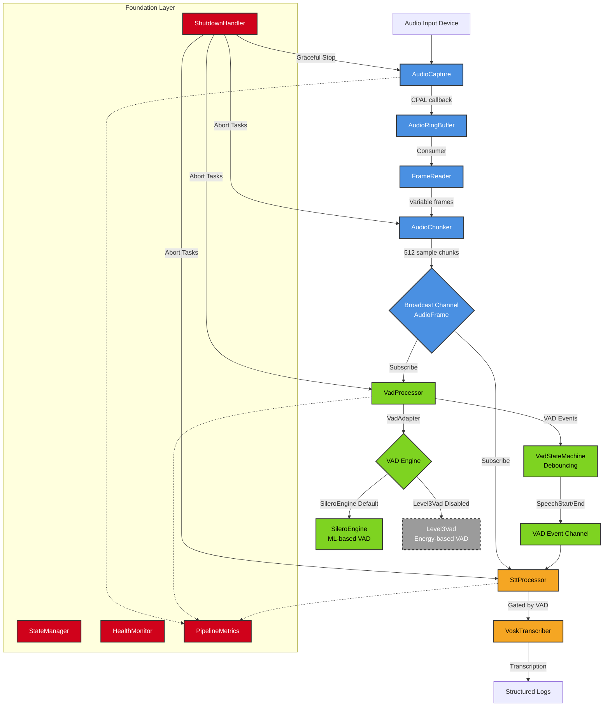

# ColdVox Architecture Diagram - Updated 2025-08-26

## Key Architecture Changes Since Original Diagram

### 1. **Broadcast-Based Audio Distribution**
- Replaced linear pipeline with fan-out broadcast system
- Single `AudioChunker` feeds multiple subscribers via `broadcast::channel`
- Enables parallel processing of VAD and STT without blocking

### 2. **STT Integration (New)**
- `SttProcessor` subscribes to both audio frames and VAD events
- Vosk transcriber only processes audio when VAD indicates speech
- Produces structured logging output with partial and final transcriptions

### 3. **Simplified VAD Architecture**
- `VadAdapter` provides unified interface to different VAD engines
- Silero ML-based VAD is now the default (Level3 energy VAD disabled)
- `VadStateMachine` handles debouncing and state transitions

### 4. **Enhanced Foundation Layer**
- `StateManager` tracks application lifecycle
- `HealthMonitor` provides system health checks
- `ShutdownHandler` ensures graceful cleanup of all components
- `PipelineMetrics` for cross-thread monitoring

### 5. **Async Task Management**
- All processing components run as independent Tokio tasks
- Proper task lifecycle management with spawn/abort pattern
- Channel-based communication between components

## Data Flow Summary

1. **Audio Capture**: Device → CPAL → AudioRingBuffer → FrameReader
2. **Chunking**: Variable frames → Fixed 512-sample chunks
3. **Distribution**: Broadcast channel distributes to VAD + STT processors
4. **VAD**: Audio frames → Silero engine → State machine → Events
5. **STT**: Audio frames + VAD events → Vosk transcriber → Logs
6. **Shutdown**: Graceful stop sequence with proper task cleanup

## Thread Architecture

- **Main Thread**: Orchestration, lifecycle management, shutdown handling
- **Audio Capture Thread**: Dedicated CPAL callback handling
- **Chunker Task**: Frame reading and chunking (async)
- **VAD Processor Task**: Voice activity detection (async)
- **STT Processor Task**: Speech-to-text transcription (async)