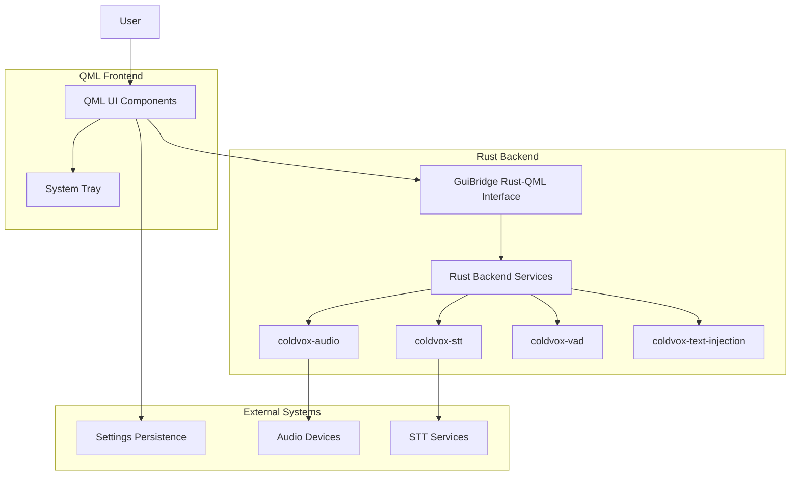

# ColdVox GUI Architecture

## Overview

The ColdVox GUI subsystem provides a desktop overlay interface for speech-to-text functionality using Qt 6 and QML with a Rust backend. This document outlines the architecture, requirements, constraints, interfaces, and non-goals for the GUI component.

## System Context

The GUI subsystem is one of several crates in the ColdVox project:

```
coldvox/
├── crates/
│   ├── app/                    # Main application
│   ├── coldvox-foundation/     # Core types and utilities
│   ├── coldvox-audio/          # Audio capture and processing
│   ├── coldvox-vad/            # Voice Activity Detection
│   ├── coldvox-stt/            # Speech-to-text framework
│   ├── coldvox-text-injection/ # Text injection backends
│   ├── coldvox-telemetry/      # Metrics and monitoring
│   └── coldvox-gui/            # GUI components (this subsystem)
```

## Requirements

### Functional Requirements

1. **Overlay Interface**
   - Always-on-top window that can be positioned anywhere on screen
   - Collapsed state (240×48px) with minimal footprint when idle
   - Expanded state (configurable size, up to 60% screen width × 40% screen height) when active
   - Semi-transparent with adjustable opacity

2. **Visual Feedback**
   - Real-time audio level visualization with animated bars
   - Status indicator showing current state (Idle, Recording, Processing, Complete)
   - Live transcript display with fade-in animation for new text
   - Color-coded states for immediate visual recognition

3. **User Controls**
   - Start/Stop recording functionality
   - Pause/Resume capability
   - Clear transcript option
   - Settings access
   - System tray integration for background operation

4. **Configuration Management**
   - Settings window for user preferences
   - Persistence of window position and transparency
   - Audio device selection (UI present, backend integration pending)
   - Language selection (UI present, backend integration pending)
   - Hotkey configuration (UI present, backend integration pending)

5. **System Integration**
   - System tray icon with context menu
   - Global hotkey support (currently local only, backend integration pending)
   - Multi-monitor awareness (position persistence per monitor)

### Non-Functional Requirements

1. **Performance**
   - Responsive UI with 60fps animations
   - Low latency audio visualization
   - Minimal CPU usage when idle

2. **Usability**
   - Intuitive collapse/expand interaction
   - Clear visual hierarchy
   - Accessible controls with keyboard navigation
   - Screen reader compatibility (future enhancement)

3. **Reliability**
   - Graceful error handling
   - Recovery from backend failures
   - Stable window positioning across sessions

4. **Maintainability**
   - Clear separation between UI and business logic
   - Well-defined bridge API between Rust and QML
   - Modular QML components

## Constraints

### Technical Constraints

1. **Platform Support**
   - Current implementation targets Linux only (specifically KDE Plasma/Wayland)
   - Requires Qt 6 development packages
   - System tray functionality works natively on Plasma, requires extensions on GNOME

2. **Integration Dependencies**
   - Depends on CXX-Qt for Rust-QML interoperability
   - Backend services (audio, STT, VAD) are currently stubbed
   - Global hotkey support requires platform-specific backend integration

3. **Build System**
   - Requires Qt 6 development headers and libraries
   - Uses CXX-Qt build system for code generation
   - Feature-gated Qt dependencies in Cargo.toml

### Design Constraints

1. **Visual Design**
   - Must maintain always-on-top behavior
   - Semi-transparent overlay that doesn't obscure underlying content
   - Consistent color scheme and styling across components

2. **Interaction Model**
   - Single-click to expand from collapsed state
   - Draggable from any non-interactive area
   - System tray must provide all essential controls

3. **State Management**
   - UI state must be synchronized between Rust backend and QML frontend
   - Configuration must persist across sessions
   - Error states must be clearly communicated

## Interfaces

### External Interfaces

1. **Rust-QML Bridge (GuiBridge)**
   - Properties: expanded, level, state, transcript
   - Invokables: toggle_expand, cmd_start, cmd_toggle_pause, cmd_stop, cmd_clear, cmd_open_settings
   - Signals: stateChanged, transcriptDelta, levelsChanged, error
   - Currently implements stub logic with console logging

2. **System Tray Interface**
   - Platform-specific system tray integration
   - Menu items for Show/Hide, Start/Stop, Pause/Resume, Clear, Settings, Quit
   - Tooltip updates based on application state

3. **Settings Persistence**
   - Qt.labs.settings for configuration storage
   - Stores window position, transparency, and other user preferences

### Internal Interfaces

1. **QML Component Interfaces**
   - AppRoot.qml: Top-level window management and system integration
   - CollapsedBar.qml: Minimal idle state interface
   - ActivePanel.qml: Expanded transcription interface
   - ActivityIndicator.qml: Audio level visualization
   - ControlsBar.qml: User control buttons
   - SettingsWindow.qml: Configuration interface

2. **Event Flow**
   - User input → QML event handlers → GuiBridge invokables → Rust backend (future)
   - Rust backend (future) → GuiBridge signals → QML property updates → UI refresh

## Non-Goals

### Out of Scope for Current Implementation

1. **Cross-Platform Support**
   - Windows and macOS support are planned but not implemented
   - Platform-specific UI adaptations are deferred

2. **Full Backend Integration**
   - Audio device selection UI is present but not connected to backend
   - STT model selection is not implemented
   - Global hotkey registration requires additional platform-specific code

3. **Advanced Features**
   - Rich text formatting in transcripts
   - Confidence visualization
   - Word-level timing indicators
   - Multiple language support
   - Plugin system for STT providers

4. **Accessibility**
   - Screen reader support is planned but not implemented
   - High-contrast mode is not available
   - Keyboard-only navigation is partial

5. **Advanced Configuration**
   - User profiles
   - Import/export settings
   - Advanced audio processing settings

## Architecture Diagram



## Future Considerations

1. **Backend Integration**
   - Connect GuiBridge invokables to actual backend services
   - Implement signal propagation from backend to UI
   - Add error handling and recovery mechanisms

2. **Platform Expansion**
   - Add Windows support with native system tray integration
   - Add macOS support with proper window management
   - Implement platform-specific global hotkey registration

3. **Feature Enhancement**
   - Implement advanced transcription features
   - Add accessibility support
   - Create plugin system for extensibility

4. **Performance Optimization**
   - Profile and optimize rendering performance
   - Reduce memory footprint
   - Implement efficient update mechanisms for large transcripts
