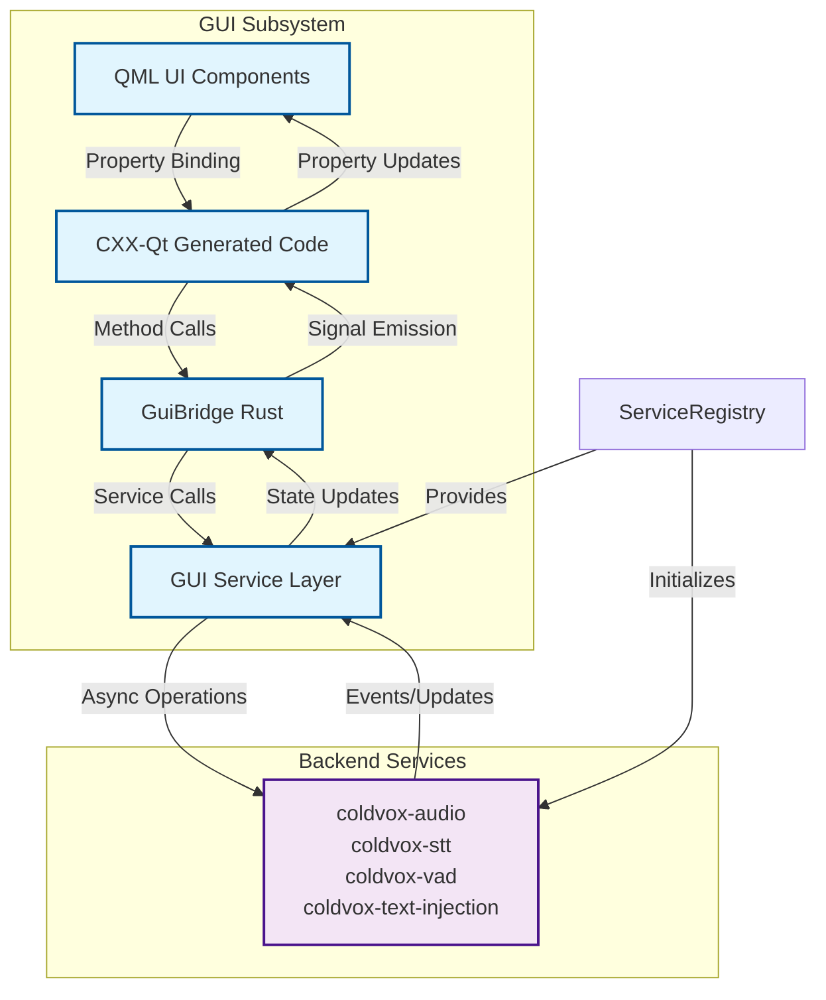
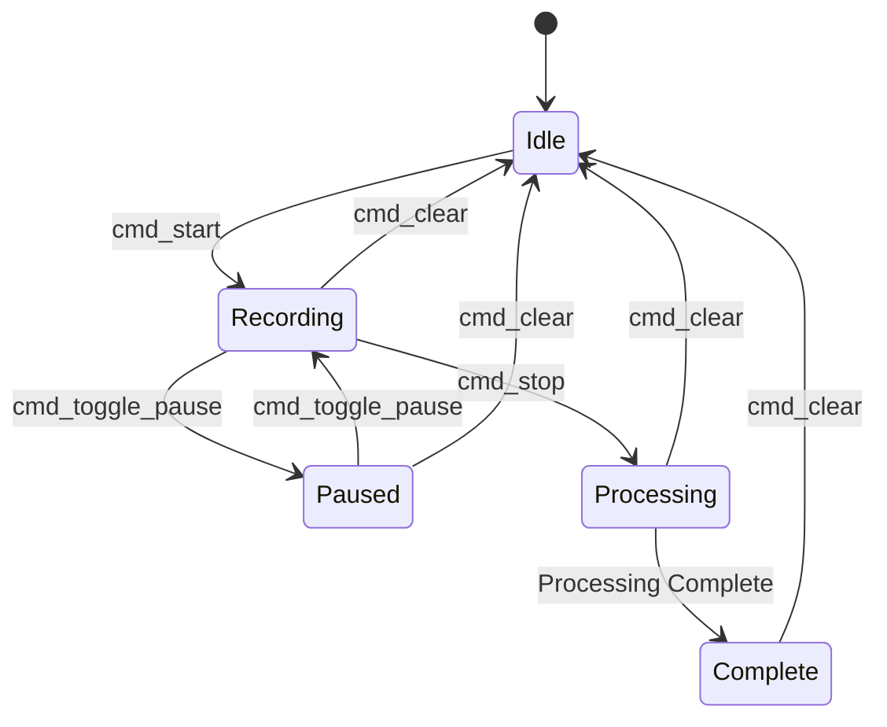
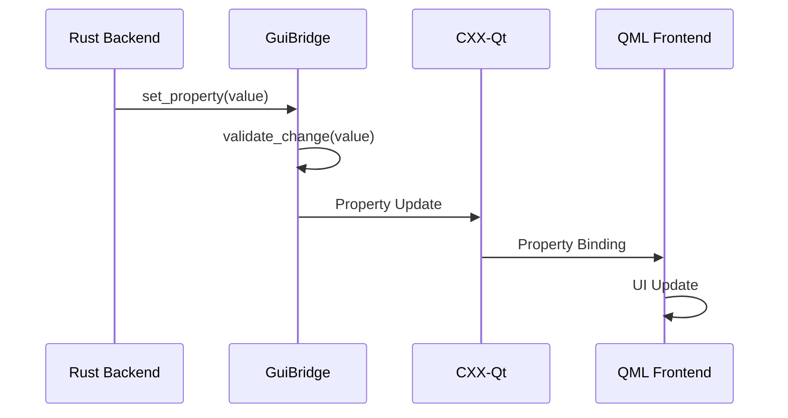
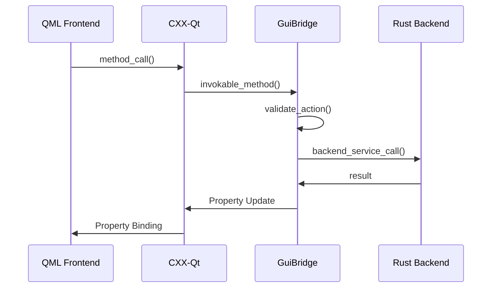
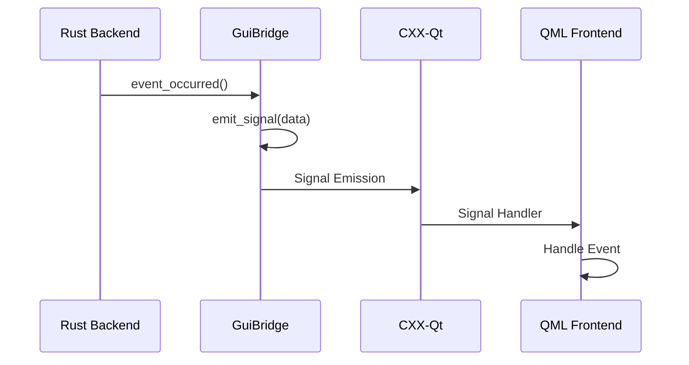

# ColdVox Rust-QML Bridge Architecture

This document provides a detailed overview of the Rust-QML bridge implementation using CXX-Qt. It covers the architecture, API design, data flow, and integration patterns for connecting the Rust backend with the QML frontend.

## Bridge Architecture Overview

### High-Level Architecture



### Key Components

1. **GuiBridge Rust Struct**: Core bridge implementation with properties and methods
2. **CXX-Qt Generated Code**: Type-safe bindings between Rust and Qt
3. **QML Property Bindings**: Reactive UI updates based on Rust state
4. **QML Signal Handlers**: Event propagation from UI to Rust logic

## CXX-Qt Integration

### Build System Integration

The bridge is integrated into the build system through:

1. **build.rs**: Configures CXX-Qt build process
2. **Cargo.toml**: Declares CXX-Qt dependencies and features
3. **QML Module Registration**: Registers Rust types with QML engine

### Dependencies

```toml
# Core CXX-Qt dependencies
cxx = "1"
cxx-qt = "0.7"
cxx-qt-lib = { version = "0.7", features = ["qt_qml", "qt_gui"] }

# Qt modules required for bridge
qt_qml = []
qt_gui = []
```

### Build Configuration

The `build.rs` file configures:

1. **Qt Module Linking**: Core, Gui, Qml, Quick modules
2. **CXX-Qt Code Generation**: Bridge code generation
3. **QML Module Registration**: Type registration with QML engine

## GuiBridge API

### Properties

#### Core State Properties

```rust
// Window expansion state
#[qproperty]
expanded: bool,

// Application state (0=Idle, 1=Recording, 2=Processing, 3=Complete)
#[qproperty]
state: i32,

// Audio level (0-100)
#[qproperty]
level: i32,

// Current transcript text
#[qproperty]
transcript: QString,
```

#### Property Behavior

| Property | Type | Default | QML Binding | Description |
|----------|------|---------|-------------|-------------|
| `expanded` | bool | false | Direct | Controls UI expansion state |
| `state` | i32 | 0 (Idle) | Direct | Application state machine |
| `level` | i32 | 0 | Direct | Audio visualization level |
| `transcript` | QString | "" | Direct | Current transcript content |

### Invokable Methods

#### UI Control Methods

```rust
#[qinvokable]
pub fn toggle_expand(self: Pin<&mut Self>) {
    // Toggle expanded state
    let new_expanded = !self.expanded();
    self.set_expanded(new_expanded);
    println!("GUI: Expanded: {}", new_expanded);
}

#[qinvokable]
pub fn cmd_start(self: Pin<&mut Self>) {
    // Start recording command
    if self.state() == 0 {
        self.set_state(1);
        println!("GUI: Start recording");
    }
}

#[qinvokable]
pub fn cmd_toggle_pause(self: Pin<&mut Self>) {
    // Toggle pause state
    match self.state() {
        1 => {
            self.set_state(4); // Paused
            println!("GUI: Pause recording");
        }
        4 => {
            self.set_state(1); // Resume
            println!("GUI: Resume recording");
        }
        _ => {}
    }
}

#[qinvokable]
pub fn cmd_stop(self: Pin<&mut Self>) {
    // Stop recording command
    if self.state() == 1 || self.state() == 4 {
        self.set_state(2);
        println!("GUI: Stop recording");
    }
}

#[qinvokable]
pub fn cmd_clear(self: Pin<&mut Self>) {
    // Clear transcript command
    self.set_transcript(QString::from(""));
    self.set_state(0);
    self.set_level(0);
    println!("GUI: Clear transcript");
}

#[qinvokable]
pub fn cmd_open_settings(self: Pin<&mut Self>) {
    // Open settings window command
    println!("GUI: Open settings");
}
```

#### Method Behavior

| Method | Parameters | Returns | State Changes | Description |
|--------|------------|---------|---------------|-------------|
| `toggle_expand` | None | void | `expanded` | Toggle UI expansion state |
| `cmd_start` | None | void | `state` → Recording | Start audio recording |
| `cmd_toggle_pause` | None | void | `state` ↔ Paused | Toggle pause state |
| `cmd_stop` | None | void | `state` → Processing | Stop audio recording |
| `cmd_clear` | None | void | `state` → Idle, `transcript` → "" | Clear transcript and reset |
| `cmd_open_settings` | None | void | None | Open settings dialog |

### Signals

#### State Change Signals

```rust
#[qsignal]
pub fn state_changed(self: Pin<&mut Self>, new_state: i32);

#[qsignal]
pub fn transcript_delta(self: Pin<&mut Self>, delta: QString);

#[qsignal]
pub fn levels_changed(self: Pin<&mut Self>, level: i32);

#[qsignal]
pub fn error(self: Pin<&mut Self>, message: QString);
```

#### Signal Behavior

| Signal | Parameters | Emitted When | QML Handler | Description |
|--------|------------|---------------|--------------|-------------|
| `state_changed` | `new_state: i32` | State property changes | `onStateChanged` | Application state transition |
| `transcript_delta` | `delta: QString` | Transcript updates | `onTranscriptDelta` | New transcript content |
| `levels_changed` | `level: i32` | Audio level changes | `onLevelsChanged` | Audio visualization update |
| `error` | `message: QString` | Error conditions | `onError` | Error notification |

## QML Integration

### Property Binding

#### Direct Property Binding

```qml
// In AppRoot.qml
property bool expanded: bridge.expanded
property int stateCode: bridge.state
property int level: bridge.level
property string transcript: bridge.transcript

// Connect to bridge signals
Connections {
    target: bridge
    function onStateChanged(new_state) {
        stateCode = new_state
    }
    function onTranscriptDelta(delta) {
        transcript += delta
    }
    function onLevelsChanged(new_level) {
        level = new_level
    }
    function onError(message) {
        // Handle error
    }
}
```

#### Property Change Handlers

```qml
// React to property changes
onStateChanged: {
    // Update UI based on new state
    switch (stateCode) {
    case 0: // Idle
        // Update visual state
        break
    case 1: // Recording
        // Start audio visualization
        break
    // ... other states
    }
}
```

### Method Invocation

#### Direct Method Calls

```qml
// In UI components
Button {
    text: "Start"
    onClicked: bridge.cmd_start()
}

Button {
    text: "Pause/Resume"
    onClicked: bridge.cmd_toggle_pause()
}

// Toggle expansion
MouseArea {
    anchors.fill: parent
    onClicked: bridge.toggle_expand()
}
```

#### Conditional Method Calls

```qml
// State-dependent method calls
Button {
    text: stateCode === 1 ? "Stop" : "Start"
    onClicked: {
        if (stateCode === 1) {
            bridge.cmd_stop()
        } else {
            bridge.cmd_start()
        }
    }
}
```

## State Machine Implementation

### State Definitions

```rust
pub enum AppState {
    Idle = 0,
    Recording = 1,
    Processing = 2,
    Complete = 3,
    Paused = 4,
}
```

### State Transitions



### State Validation

```rust
impl GuiBridge {
    fn validate_state_transition(&self, new_state: i32) -> bool {
        let current = self.state();
        match (current, new_state) {
            // Valid transitions
            (0, 1) => true, // Idle → Recording
            (1, 4) => true, // Recording → Paused
            (4, 1) => true, // Paused → Recording
            (1, 2) => true, // Recording → Processing
            (2, 3) => true, // Processing → Complete
            (3, 0) => true, // Complete → Idle
            (1, 0) => true, // Recording → Idle
            (2, 0) => true, // Processing → Idle
            (4, 0) => true, // Paused → Idle

            // Invalid transitions
            _ => false,
        }
    }
}
```

## Data Flow Patterns

### Property Update Flow



### Method Invocation Flow



### Signal Emission Flow



## Error Handling Patterns

### Property Validation

```rust
impl GuiBridge {
    fn set_level(self: Pin<&mut Self>, value: i32) {
        // Clamp value to valid range
        let clamped = value.clamp(0, 100);
        if clamped != value {
            println!("GUI: Level clamped from {} to {}", value, clamped);
        }

        // Update property
        if self.level() != clamped {
            self.set_level(clamped);
            self.levels_changed(clamped);
        }
    }
}
```

### Method Error Handling

```rust
#[qinvokable]
pub fn cmd_start(self: Pin<&mut Self>) {
    // Validate current state
    if self.state() != 0 {
        let error_msg = QString::from("Cannot start: not in idle state");
        self.error(error_msg.clone());
        return;
    }

    // Attempt state transition
    if self.validate_state_transition(1) {
        self.set_state(1);
        self.state_changed(1);
        println!("GUI: Start recording");
    } else {
        let error_msg = QString::from("Invalid state transition");
        self.error(error_msg);
    }
}
```

## Performance Considerations

### Property Update Optimization

1. **Change Detection**: Only emit signals when values actually change
2. **Batch Updates**: Group related property changes
3. **Throttling**: Limit high-frequency updates (audio levels)

### Memory Management

1. **QString Conversion**: Efficient string handling between Rust and Qt
2. **Pin-based Mutation**: Safe mutable access to bridge state
3. **Signal Arguments**: Minimize data copying in signal emissions

### Thread Safety

1. **Main Thread Affinity**: All bridge operations on Qt main thread
2. **Pin-based Access**: Ensure safe concurrent access patterns
3. **Future Integration**: Design for async backend operations

## Future Backend Integration

### Integration Points

```rust
// Future integration with actual backend services
impl GuiBridge {
    #[qinvokable]
    pub fn cmd_start(self: Pin<&mut Self>) {
        // Current stub implementation
        if self.state() == 0 {
            self.set_state(1);
            println!("GUI: Start recording");

            // Future: Connect to actual audio service
            // self.audio_service.start_recording();
        }
    }

    // Future: Receive updates from backend
    pub fn on_audio_level(&mut self, level: i32) {
        self.set_level(level);
        self.levels_changed(level);
    }

    pub fn on_transcript_chunk(&mut self, chunk: &str) {
        let mut transcript = self.transcript().to_string();
        transcript.push_str(chunk);
        self.set_transcript(QString::from(transcript.as_str()));
        self.transcript_delta(QString::from(chunk));
    }
}
```

### Async Integration Pattern

```rust
// Future async integration
impl GuiBridge {
    async fn start_recording(&mut self) -> Result<(), String> {
        // Validate state
        if self.state() != 0 {
            return Err("Not in idle state".to_string());
        }

        // Start recording via backend service
        // let result = self.audio_service.start().await?;

        // Update state
        self.set_state(1);
        self.state_changed(1);

        Ok(())
    }
}
```

## Testing Strategy

### Unit Testing

```rust
#[cfg(test)]
mod tests {
    use super::*;

    #[test]
    fn test_state_validation() {
        let bridge = GuiBridge::new();

        // Test valid transitions
        assert!(bridge.validate_state_transition(1)); // Idle → Recording
        assert!(bridge.validate_state_transition(4)); // Recording → Paused

        // Test invalid transitions
        assert!(!bridge.validate_state_transition(3)); // Idle → Complete
    }

    #[test]
    fn test_level_clamping() {
        let mut bridge = GuiBridge::new();
        let bridge = Pin::new(&mut bridge);

        // Test out-of-range values
        bridge.set_level(-10);
        assert_eq!(bridge.level(), 0);

        bridge.set_level(150);
        assert_eq!(bridge.level(), 100);
    }
}
```

### Integration Testing

1. **QML Property Binding**: Verify UI updates with property changes
2. **Method Invocation**: Test UI-to-Rust communication
3. **Signal Emission**: Validate Rust-to-QML event propagation
4. **State Transitions**: Ensure correct state machine behavior

### Mock Backend

```rust
#[cfg(test)]
struct MockAudioService {
    // Mock implementation for testing
}

#[cfg(test)]
impl MockAudioService {
    fn start(&self) -> Result<(), String> {
        // Mock start behavior
        Ok(())
    }

    fn stop(&self) -> Result<(), String> {
        // Mock stop behavior
        Ok(())
    }
}
```

## Debugging and Logging

### Bridge Logging

```rust
impl GuiBridge {
    fn log_state_change(&self, old_state: i32, new_state: i32) {
        let state_names = ["Idle", "Recording", "Processing", "Complete", "Paused"];
        let old_name = state_names.get(old_state as usize).unwrap_or(&"Unknown");
        let new_name = state_names.get(new_state as usize).unwrap_or(&"Unknown");

        println!("GUI: State change: {} → {}", old_name, new_name);
    }
}
```

### QML Debugging

```qml
// Debug property changes
onStateChanged: {
    console.log("State changed to:", stateCode)
}

// Debug method calls
function debugMethodCall(method) {
    console.log("Method called:", method)
    bridge[method]()
}
```

## Documentation Standards

### Rust Documentation

```rust
/// Toggle the expanded state of the GUI window.
///
/// This method switches between the collapsed (minimal) and expanded
/// (full-featured) states of the GUI window. The expanded state is
/// persisted across application sessions.
///
/// # Examples
///
/// ```rust
/// let mut bridge = GuiBridge::new();
/// let bridge = Pin::new(&mut bridge);
/// bridge.toggle_expand();
/// assert_eq!(bridge.expanded(), true);
/// ```
#[qinvokable]
pub fn toggle_expand(self: Pin<&mut Self>) {
    // Implementation
}
```

### QML Documentation

```qml
/*!
    \qmltype GuiBridge
    \instantiates GuiBridge
    \inqmlmodule ColdVox
    \brief Bridge between Rust backend and QML frontend

    The GuiBridge type provides properties and methods for communication
    between the Rust backend services and the QML frontend UI. It handles
    state management, property synchronization, and event propagation.

    \sa AppRoot, ActivePanel
*/
```
