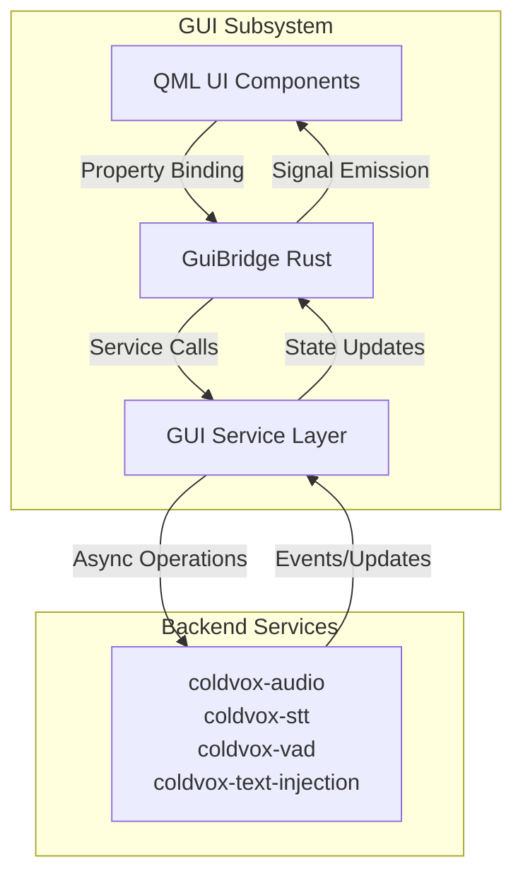
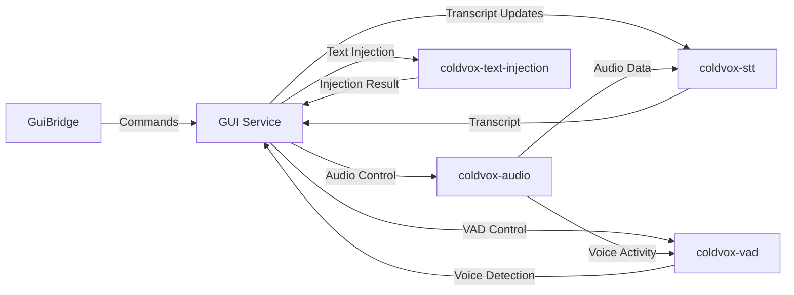

# ColdVox GUI Backend Integration Implementation Plan

> ⚠️ **RESEARCH DOCUMENT - WORK IN PROGRESS**
> Contains incomplete sections and future work markers.
> Last updated: 2025-10-07

This document outlines the detailed implementation plan for connecting the Qt Quick/QML GUI with the existing ColdVox backend services. It provides a step-by-step approach to replace the current stub implementations with actual backend integration using the existing service architecture.

## Current State Analysis

### Existing GUI Implementation
- ✅ Complete Qt Quick/QML overlay interface
- ✅ Rust-QML bridge with CXX-Qt
- ✅ Property-based state management
- ✅ Signal-based event propagation
- ✅ Visual components and animations

### Current Backend Integration Status
- ❌ All bridge methods are stubbed with console logging
- ❌ No actual audio capture or processing
- ❌ No real-time transcript updates
- ❌ No error handling from backend services
- ❌ No device enumeration or selection

### Available Backend Services
Based on the workspace structure, the following backend services are available:
- **coldvox-audio**: Audio capture, device management, and audio processing
- **coldvox-stt**: Speech-to-text transcription with event-based interface
- **coldvox-vad**: Voice activity detection with configurable thresholds
- **coldvox-text-injection**: Text injection into focused applications
- **coldvox-foundation**: Core utilities and configuration
- **coldvox-telemetry**: Metrics and monitoring

## Integration Architecture

### High-Level Integration Architecture



### Service Layer Design



## Implementation Phases

### Phase 1: Service Layer Foundation

#### 1.1 Create GUI Service Interface
- **Objective**: Define the interface between GuiBridge and existing backend services
- **Deliverables**:
  - `GuiService` trait definition
  - Service registration mechanism
  - Error handling framework

```rust
// crates/coldvox-gui/src/service.rs
use coldvox_audio::{AudioCaptureThread, DeviceConfig, DeviceManager, DeviceInfo};
use coldvox_stt::{EventBasedTranscriber, TranscriptionConfig, TranscriptionEvent};
use coldvox_vad::{VadEngine, VadConfig, VadEvent, VadState};
use coldvox_text_injection::{TextInjector, InjectionConfig, InjectionResult};

pub trait GuiService: Send + Sync {
    // Audio control
    async fn start_recording(&mut self) -> Result<(), ServiceError>;
    async fn stop_recording(&mut self) -> Result<(), ServiceError>;
    async fn pause_recording(&mut self) -> Result<(), ServiceError>;
    async fn resume_recording(&mut self) -> Result<(), ServiceError>;

    // Device management
    async fn get_audio_devices(&self) -> Result<Vec<DeviceInfo>, ServiceError>;
    async fn set_audio_device(&mut self, device_id: String) -> Result<(), ServiceError>;

    // Configuration
    async fn get_config(&self) -> Result<GuiConfig, ServiceError>;
    async fn update_config(&mut self, config: GuiConfig) -> Result<(), ServiceError>;

    // Event subscription
    fn subscribe_audio_levels(&mut self) -> BroadcastReceiver<AudioLevel>;
    fn subscribe_transcript_updates(&mut self) -> BroadcastReceiver<TranscriptionEvent>;
    fn subscribe_state_changes(&mut self) -> BroadcastReceiver<ServiceState>;
}

#[derive(Debug, Clone)]
pub enum ServiceError {
    Audio(String),
    Stt(String),
    Vad(String),
    TextInjection(String),
    Config(String),
    Internal(String),
}
```

#### 1.2 Implement Service Registry
- **Objective**: Create a centralized registry for existing backend services
- **Deliverables**:
  - `ServiceRegistry` struct
  - Service initialization logic
  - Dependency injection mechanism

```rust
// crates/coldvox-gui/src/service_registry.rs
use coldvox_audio::{AudioCaptureThread, DeviceManager};
use coldvox_stt::plugins::create_transcriber;
use coldvox_vad::VadEngine;
use coldvox_text_injection::{StrategyManager, create_injector};

pub struct ServiceRegistry {
    audio_capture: Option<AudioCaptureThread>,
    device_manager: DeviceManager,
    transcriber: Box<dyn EventBasedTranscriber>,
    vad_engine: VadEngine,
    text_injector: Box<dyn TextInjector>,
}

impl ServiceRegistry {
    pub async fn new() -> Result<Self, ServiceError> {
        // Initialize existing backend services
        let device_manager = DeviceManager::new()
            .map_err(|e| ServiceError::Audio(format!("Failed to create device manager: {}", e)))?;

        let transcriber = create_transcriber(&TranscriptionConfig::default())
            .map_err(|e| ServiceError::Stt(format!("Failed to create transcriber: {}", e)))?;

        let vad_engine = VadEngine::new(&VadConfig::default())
            .map_err(|e| ServiceError::Vad(format!("Failed to create VAD engine: {}", e)))?;

        let text_injector = create_injector(&InjectionConfig::default())
            .map_err(|e| ServiceError::TextInjection(format!("Failed to create text injector: {}", e)))?;

        Ok(Self {
            audio_capture: None,
            device_manager,
            transcriber,
            vad_engine,
            text_injector,
        })
    }

    pub fn create_gui_service(&self) -> GuiServiceImpl {
        GuiServiceImpl::new(
            self.audio_capture.clone(),
            self.device_manager.clone(),
            self.transcriber.clone(),
            self.vad_engine.clone(),
            self.text_injector.clone(),
        )
    }
}
```

#### 1.3 Implement GUI Service
- **Objective**: Create the concrete implementation of GuiService using existing backend services
- **Deliverables**:
  - `GuiServiceImpl` struct
  - Async method implementations
  - Event broadcasting system

```rust
// crates/coldvox-gui/src/gui_service_impl.rs
use coldvox_audio::{AudioCaptureThread, DeviceConfig, DeviceManager, DeviceInfo};
use coldvox_stt::{EventBasedTranscriber, TranscriptionConfig, TranscriptionEvent};
use coldvox_vad::{VadEngine, VadConfig, VadEvent, VadState};
use coldvox_text_injection::{TextInjector, InjectionConfig, InjectionResult};

pub struct GuiServiceImpl {
    audio_capture: Option<AudioCaptureThread>,
    device_manager: DeviceManager,
    transcriber: Box<dyn EventBasedTranscriber>,
    vad_engine: VadEngine,
    text_injector: Box<dyn TextInjector>,

    // Event broadcasters
    audio_level_sender: BroadcastSender<AudioLevel>,
    transcript_sender: BroadcastSender<TranscriptionEvent>,
    state_sender: BroadcastSender<ServiceState>,

    // Service state
    current_state: ServiceState,
    current_device: Option<String>,
}

impl GuiService for GuiServiceImpl {
    async fn start_recording(&mut self) -> Result<(), ServiceError> {
        // Validate state
        if self.current_state != ServiceState::Idle {
            return Err(ServiceError::Audio("Cannot start: not idle".to_string()));
        }

        // Get device config
        let device_config = self.get_current_device_config().await?;

        // Start audio capture using existing coldvox-audio service
        let mut capture = AudioCaptureThread::new(device_config)
            .map_err(|e| ServiceError::Audio(format!("Failed to create audio capture: {}", e)))?;

        capture.start()
            .map_err(|e| ServiceError::Audio(format!("Failed to start audio capture: {}", e)))?;

        self.audio_capture = Some(capture);

        // Reset transcriber for new session
        self.transcriber.reset()
            .map_err(|e| ServiceError::Stt(format!("Failed to reset transcriber: {}", e)))?;

        // Update state
        self.current_state = ServiceState::Recording;
        self.broadcast_state(ServiceState::Recording).await;

        Ok(())
    }

    async fn get_audio_devices(&self) -> Result<Vec<DeviceInfo>, ServiceError> {
        self.device_manager.get_devices()
            .map_err(|e| ServiceError::Audio(format!("Failed to get devices: {}", e)))
    }

    // ... other method implementations using existing backend services
}
```

### Phase 2: Bridge Integration

#### 2.1 Update GuiBridge for Service Integration
- **Objective**: Modify GuiBridge to use the new service layer with existing backend services
- **Deliverables**:
  - Updated `bridge.rs` with service integration
  - Async method handling
  - Error propagation to QML

```rust
// crates/coldvox-gui/src/bridge.rs
use crate::service::{GuiService, ServiceRegistry, ServiceError};

pub struct GuiBridge {
    // Existing properties
    expanded: bool,
    state: i32,
    level: i32,
    transcript: QString,

    // Service integration
    gui_service: Arc<Mutex<GuiServiceImpl>>,

    // Event receivers
    audio_level_receiver: Option<BroadcastReceiver<AudioLevel>>,
    transcript_receiver: Option<BroadcastReceiver<TranscriptionEvent>>,
    state_receiver: Option<BroadcastReceiver<ServiceState>>,

    // Qt context for signal emission
    qt_context: QmlContext,
}

impl GuiBridge {
    pub fn new(qt_context: QmlContext) -> Self {
        // Initialize service registry and GUI service with existing backend services
        let registry = tokio::runtime::Runtime::new()
            .unwrap()
            .block_on(ServiceRegistry::new())
            .expect("Failed to initialize services");

        let gui_service = Arc::new(Mutex::new(registry.create_gui_service()));

        Self {
            expanded: false,
            state: 0, // Idle
            level: 0,
            transcript: QString::default(),
            gui_service,
            audio_level_receiver: None,
            transcript_receiver: None,
            state_receiver: None,
            qt_context,
        }
    }

    // Start event processing
    pub fn start_event_processing(&mut self) {
        let service = self.gui_service.clone();
        let mut audio_receiver = service.lock().unwrap().subscribe_audio_levels();
        let mut transcript_receiver = service.lock().unwrap().subscribe_transcript_updates();
        let mut state_receiver = service.lock().unwrap().subscribe_state_changes();

        // Store receivers for later use
        self.audio_level_receiver = Some(audio_receiver);
        self.transcript_receiver = Some(transcript_receiver);
        self.state_receiver = Some(state_receiver);

        // Start event processing in background
        self.process_events();
    }

    fn process_events(&mut self) {
        // This would typically be implemented with Qt's timer
        // or integrated with Qt's event loop

        // For now, we'll use a placeholder implementation
        // that would be called periodically from Qt's timer

        if let Some(ref mut receiver) = self.audio_level_receiver {
            if let Ok(level) = receiver.try_recv() {
                self.update_audio_level(level);
            }
        }

        if let Some(ref mut receiver) = self.transcript_receiver {
            if let Ok(event) = receiver.try_recv() {
                self.update_transcript(event);
            }
        }

        if let Some(ref mut receiver) = self.state_receiver {
            if let Ok(state) = receiver.try_recv() {
                self.update_state(state);
            }
        }
    }

    fn update_audio_level(self: Pin<&mut Self>, level: AudioLevel) {
        let normalized = (level.value * 100.0) as i32;
        self.set_level(normalized);
        self.levels_changed(normalized);
    }

    fn update_transcript(self: Pin<&mut Self>, event: TranscriptionEvent) {
        use coldvox_stt::TranscriptionEvent;

        match event {
            TranscriptionEvent::PartialText { text, .. } => {
                let mut current = self.transcript().to_string();
                current.push_str(&text);
                self.set_transcript(QString::from(&current));
                self.transcript_delta(QString::from(&text));
            }
            TranscriptionEvent::FinalText { text, .. } => {
                let mut current = self.transcript().to_string();
                current.push_str(&text);
                self.set_transcript(QString::from(&current));
                self.transcript_delta(QString::from(&text));
            }
            // Handle other event types as needed
            _ => {}
        }
    }

    fn update_state(self: Pin<&mut Self>, state: ServiceState) {
        let state_code = match state {
            ServiceState::Idle => 0,
            ServiceState::Recording => 1,
            ServiceState::Processing => 2,
            ServiceState::Complete => 3,
            ServiceState::Paused => 4,
        };

        self.set_state(state_code);
        self.state_changed(state_code);
    }
}
```

#### 2.2 Implement Async Method Handling
- **Objective**: Handle async service calls from QML invokables using existing backend services
- **Deliverables**:
  - Async bridge method implementations
  - State update mechanisms
  - Error handling and propagation

```rust
// crates/coldvox-gui/src/bridge.rs
impl GuiBridge {
    #[qinvokable]
    pub fn cmd_start(self: Pin<&mut Self>) {
        let service = self.gui_service.clone();

        // Spawn async task
        tokio::spawn(async move {
            let mut service = service.lock().await;
            match service.start_recording().await {
                Ok(_) => {
                    // Success - state will be updated via event
                }
                Err(e) => {
                    // Handle error - emit error signal
                    let error_msg = QString::from(format!("Failed to start recording: {}", e));
                    // self.error(error_msg); - This needs to be done on Qt thread
                }
            }
        });
    }

    #[qinvokable]
    pub fn cmd_stop(self: Pin<&mut Self>) {
        let service = self.gui_service.clone();

        tokio::spawn(async move {
            let mut service = service.lock().await;
            match service.stop_recording().await {
                Ok(_) => {
                    // Success - state will be updated via event
                }
                Err(e) => {
                    // Handle error
                    let error_msg = QString::from(format!("Failed to stop recording: {}", e));
                    // self.error(error_msg);
                }
            }
        });
    }

    // ... other command implementations
}
```

#### 2.3 Implement Event Processing
- **Objective**: Process events from existing backend services and update QML
- **Deliverables**:
  - Event processing loop
  - Thread-safe property updates
  - Signal emission on Qt thread

```rust
// crates/coldvox-gui/src/bridge.rs
impl GuiBridge {
    fn process_events(&mut self) {
        // This would typically be implemented with Qt's timer
        // or integrated with Qt's event loop

        // For now, we'll use a placeholder implementation
        // that would be called periodically from Qt's timer

        if let Some(ref mut receiver) = self.audio_level_receiver {
            if let Ok(level) = receiver.try_recv() {
                self.update_audio_level(level);
            }
        }

        if let Some(ref mut receiver) = self.transcript_receiver {
            if let Ok(event) = receiver.try_recv() {
                self.update_transcript(event);
            }
        }

        if let Some(ref mut receiver) = self.state_receiver {
            if let Ok(state) = receiver.try_recv() {
                self.update_state(state);
            }
        }
    }

    fn update_audio_level(self: Pin<&mut Self>, level: AudioLevel) {
        let normalized = (level.value * 100.0) as i32;
        self.set_level(normalized);
        self.levels_changed(normalized);
    }

    fn update_transcript(self: Pin<&mut Self>, event: TranscriptionEvent) {
        use coldvox_stt::TranscriptionEvent;

        match event {
            TranscriptionEvent::PartialText { text, .. } => {
                let mut current = self.transcript().to_string();
                current.push_str(&text);
                self.set_transcript(QString::from(&current));
                self.transcript_delta(QString::from(&text));
            }
            TranscriptionEvent::FinalText { text, .. } => {
                let mut current = self.transcript().to_string();
                current.push_str(&text);
                self.set_transcript(QString::from(&current));
                self.transcript_delta(QString::from(&text));
            }
            // Handle other event types as needed
            _ => {}
        }
    }

    fn update_state(self: Pin<&mut Self>, state: ServiceState) {
        let state_code = match state {
            ServiceState::Idle => 0,
            ServiceState::Recording => 1,
            ServiceState::Processing => 2,
            ServiceState::Complete => 3,
            ServiceState::Paused => 4,
        };

        self.set_state(state_code);
        self.state_changed(state_code);
    }
}
```

### Phase 3: Backend Service Integration

#### 3.1 Audio Service Integration
- **Objective**: Connect GUI to existing coldvox-audio service
- **Deliverables**:
  - Audio service interface implementation
  - Device enumeration and selection
  - Audio level monitoring

```rust
// crates/coldvox-gui/src/audio_integration.rs
use coldvox_audio::{AudioCaptureThread, DeviceConfig, DeviceManager, DeviceInfo, AudioFrame};

pub struct AudioServiceAdapter {
    audio_capture: Option<AudioCaptureThread>,
    device_manager: DeviceManager,
    vad_engine: VadEngine,
}

impl AudioServiceAdapter {
    pub async fn start_capture(&mut self) -> Result<(), ServiceError> {
        // Get current device configuration
        let device_config = self.get_current_device_config().await?;

        // Create and start audio capture using existing coldvox-audio service
        let mut capture = AudioCaptureThread::new(device_config)
            .map_err(|e| ServiceError::Audio(format!("Failed to create audio capture: {}", e)))?;

        capture.start()
            .map_err(|e| ServiceError::Audio(format!("Failed to start audio capture: {}", e)))?;

        self.audio_capture = Some(capture);

        Ok(())
    }

    pub async fn stop_capture(&mut self) -> Result<(), ServiceError> {
        if let Some(mut capture) = self.audio_capture.take() {
            capture.stop()
                .map_err(|e| ServiceError::Audio(format!("Failed to stop audio capture: {}", e)))?;
        }

        Ok(())
    }

    pub async fn get_devices(&self) -> Result<Vec<DeviceInfo>, ServiceError> {
        self.device_manager.get_devices()
            .map_err(|e| ServiceError::Audio(format!("Failed to get devices: {}", e)))
    }

    pub async fn set_device(&self, device_id: String) -> Result<(), ServiceError> {
        let devices = self.get_devices().await?;
        let device = devices.into_iter()
            .find(|d| d.id == device_id)
            .ok_or_else(|| ServiceError::Audio(format!("Device not found: {}", device_id)))?;

        // Store device preference for future use
        // This would typically be saved to configuration

        Ok(())
    }

    pub fn subscribe_audio_levels(&self) -> BroadcastReceiver<AudioLevel> {
        // This would connect to the audio capture thread's level monitoring
        // For now, return a placeholder
        let (sender, receiver) = broadcast_channel(10);
        // TODO: Connect to actual audio level updates
        receiver
    }

    async fn get_current_device_config(&self) -> Result<DeviceConfig, ServiceError> {
        // Get current device configuration
        // This would typically load from saved preferences or use default
        let devices = self.get_devices().await?;
        let default_device = devices.first()
            .ok_or_else(|| ServiceError::Audio("No audio devices available".to_string()))?;

        Ok(DeviceConfig {
            device_id: default_device.id.clone(),
            sample_rate: 16000,
            channels: 1,
            buffer_size: 1024,
        })
    }
}
```

#### 3.2 STT Service Integration
- **Objective**: Connect GUI to existing coldvox-stt service
- **Deliverables**:
  - STT service interface implementation
  - Model selection and configuration
  - Transcript streaming

```rust
// crates/coldvox-gui/src/stt_integration.rs
use coldvox_stt::{EventBasedTranscriber, TranscriptionConfig, TranscriptionEvent, plugins::create_transcriber};

pub struct SttServiceAdapter {
    transcriber: Box<dyn EventBasedTranscriber>,
}

impl SttServiceAdapter {
    pub async fn start_transcription(&mut self) -> Result<(), ServiceError> {
        // Reset transcriber for new session
        self.transcriber.reset()
            .map_err(|e| ServiceError::Stt(format!("Failed to reset transcriber: {}", e)))?;

        Ok(())
    }

    pub async fn stop_transcription(&mut self) -> Result<(), ServiceError> {
        // Finalize current utterance
        let _result = self.transcriber.finalize_utterance()
            .map_err(|e| ServiceError::Stt(format!("Failed to finalize utterance: {}", e)))?;

        Ok(())
    }

    pub fn process_audio_frame(&mut self, audio_data: &[i16]) -> Result<Option<TranscriptionEvent>, ServiceError> {
        self.transcriber.accept_frame(audio_data)
            .map_err(|e| ServiceError::Stt(format!("Failed to process audio frame: {}", e)))
    }

    pub fn subscribe_transcript_updates(&self) -> BroadcastReceiver<TranscriptionEvent> {
        // This would connect to the transcriber's event stream
        // For now, return a placeholder
        let (sender, receiver) = broadcast_channel(10);
        // TODO: Connect to actual transcript events
        receiver
    }

    pub async fn get_available_models(&self) -> Result<Vec<String>, ServiceError> {
        // Query available models from the transcriber
        // This would depend on the specific transcriber implementation
        Ok(vec!["default".to_string()])
    }

    pub async fn set_model(&mut self, model_id: String) -> Result<(), ServiceError> {
        // Create new transcriber with selected model
        let mut config = self.transcriber.config().clone();
        // Update config with selected model
        // This would depend on the specific transcriber implementation

        let new_transcriber = create_transcriber(&config)
            .map_err(|e| ServiceError::Stt(format!("Failed to create transcriber with model {}: {}", model_id, e)))?;

        self.transcriber = new_transcriber;

        Ok(())
    }
}
```

#### 3.3 VAD Service Integration
- **Objective**: Connect GUI to existing coldvox-vad service
- **Deliverables**:
  - VAD service interface implementation
  - Voice activity detection
  - Configuration management

```rust
// crates/coldvox-gui/src/vad_integration.rs
use coldvox_vad::{VadEngine, VadConfig, VadEvent, VadState};

pub struct VadServiceAdapter {
    vad_engine: VadEngine,
}

impl VadServiceAdapter {
    pub async fn start_processing(&mut self) -> Result<(), ServiceError> {
        // Reset VAD engine for new session
        self.vad_engine.reset();
        Ok(())
    }

    pub async fn stop_processing(&mut self) -> Result<(), ServiceError> {
        // VAD processing stops automatically when audio stops
        Ok(())
    }

    pub fn process_audio_frame(&mut self, audio_data: &[i16]) -> Result<Option<VadEvent>, ServiceError> {
        self.vad_engine.process(audio_data)
            .map_err(|e| ServiceError::Vad(format!("Failed to process audio frame: {}", e)))
    }

    pub fn get_current_state(&self) -> VadState {
        self.vad_engine.current_state()
    }

    pub async fn update_config(&mut self, config: VadConfig) -> Result<(), ServiceError> {
        // Create new VAD engine with updated configuration
        self.vad_engine = VadEngine::new(&config)
            .map_err(|e| ServiceError::Vad(format!("Failed to create VAD engine with new config: {}", e)))?;

        Ok(())
    }
}
```

#### 3.4 Text Injection Service Integration
- **Objective**: Connect GUI to existing coldvox-text-injection service
- **Deliverables**:
  - Text injection interface implementation
  - Backend selection and configuration
  - Injection result handling

```rust
// crates/coldvox-gui/src/text_injection_integration.rs
use coldvox_text_injection::{TextInjector, InjectionConfig, InjectionResult, StrategyManager, create_injector};

pub struct TextInjectionServiceAdapter {
    injector: Box<dyn TextInjector>,
    strategy_manager: StrategyManager,
}

impl TextInjectionServiceAdapter {
    pub async fn inject_text(&self, text: &str) -> Result<(), ServiceError> {
        self.injector.inject_text(text)
            .await
            .map_err(|e| ServiceError::TextInjection(format!("Failed to inject text: {}", e)))?;

        Ok(())
    }

    pub async fn get_available_backends(&self) -> Result<Vec<String>, ServiceError> {
        // Get available backends from strategy manager
        let backends = self.strategy_manager.get_available_backends()
            .map_err(|e| ServiceError::TextInjection(format!("Failed to get available backends: {}", e)))?;

        Ok(backends)
    }

    pub async fn set_backend(&mut self, backend_name: String) -> Result<(), ServiceError> {
        // Create new injector with selected backend
        let mut config = InjectionConfig::default();
        config.preferred_method = backend_name.parse()
            .map_err(|_| ServiceError::TextInjection(format!("Invalid backend name: {}", backend_name)))?;

        let new_injector = create_injector(&config)
            .map_err(|e| ServiceError::TextInjection(format!("Failed to create injector with backend {}: {}", backend_name, e)))?;

        self.injector = new_injector;

        Ok(())
    }

    pub async fn check_backend_availability(&self) -> Result<bool, ServiceError> {
        self.injector.is_available().await
            .map_err(|e| ServiceError::TextInjection(format!("Failed to check backend availability: {}", e)))
    }
}
```

### Phase 4: Error Handling and Recovery

#### 4.1 Implement Comprehensive Error Handling
- **Objective**: Handle all possible error scenarios gracefully using existing backend service error types
- **Deliverables**:
  - Error type mapping between services and GUI
  - User-friendly error messages
  - Recovery mechanisms

```rust
// crates/coldvox-gui/src/error_handling.rs
use coldvox_audio::AudioError;
use coldvox_stt::SttError;
use coldvox_vad::VadError;
use coldvox_text_injection::InjectionError;

impl GuiBridge {
    fn handle_service_error(self: Pin<&mut Self>, error: ServiceError) {
        let user_message = match error {
            ServiceError::Audio(msg) => format!("Audio error: {}", msg),
            ServiceError::Stt(msg) => format!("Speech recognition error: {}", msg),
            ServiceError::Vad(msg) => format!("Voice detection error: {}", msg),
            ServiceError::TextInjection(msg) => format!("Text injection error: {}", msg),
            ServiceError::Config(msg) => format!("Configuration error: {}", msg),
            ServiceError::Internal(msg) => format!("Internal error: {}", msg),
        };

        let error_msg = QString::from(user_message);
        self.error(error_msg);

        // Attempt recovery based on error type
        self.attempt_error_recovery(error);
    }

    fn attempt_error_recovery(self: Pin<&mut Self>, error: ServiceError) {
        match error {
            ServiceError::Audio(_) => {
                // Reset to idle state on audio errors
                self.set_state(0);
                self.state_changed(0);
            }
            ServiceError::Stt(_) => {
                // Continue recording but note transcription issues
                if self.state() == 2 { // Processing
                    self.set_state(1); // Back to recording
                    self.state_changed(1);
                }
            }
            // ... other error recovery strategies
        }
    }
}
```

#### 4.2 Implement State Recovery
- **Objective**: Recover from inconsistent states
- **Deliverables**:
  - State validation and correction
  - Service reset mechanisms
  - User notification of recovery actions

```rust
// crates/coldvox-gui/src/state_recovery.rs
impl GuiBridge {
    pub fn validate_and_recover_state(&mut self) {
        let current_state = self.state();
        let service_state = self.get_actual_service_state();

        if current_state != service_state {
            println!("State mismatch detected: GUI={}, Service={}", current_state, service_state);

            // Correct GUI state to match service state
            self.set_state(service_state);
            self.state_changed(service_state);

            // Notify user of correction
            let msg = QString::from(format!("State corrected to {}", self.state_name(service_state)));
            self.error(msg);
        }
    }

    fn get_actual_service_state(&self) -> i32 {
        // Query actual service state
        // This would involve checking with the service layer
        // For now, return current state as placeholder
        self.state()
    }

    fn state_name(&self, state: i32) -> &'static str {
        match state {
            0 => "Idle",
            1 => "Recording",
            2 => "Processing",
            3 => "Complete",
            4 => "Paused",
            _ => "Unknown",
        }
    }
}
```

### Phase 5: Testing and Validation

#### 5.1 Unit Testing
- **Objective**: Test all components in isolation with existing backend services
- **Deliverables**:
  - Service layer unit tests
  - Bridge method tests
  - Error handling tests

```rust
// crates/coldvox-gui/tests/service_tests.rs
#[tokio::test]
async fn test_start_recording_success() {
    // Create service registry with existing backend services
    let registry = ServiceRegistry::new().await.unwrap();

    // Create GUI service
    let mut gui_service = registry.create_gui_service();

    // Test start recording
    let result = gui_service.start_recording().await;

    assert!(result.is_ok());
    assert_eq!(gui_service.get_state(), ServiceState::Recording);
}

#[tokio::test]
async fn test_start_recording_failure() {
    // Create service registry with mock that fails
    // This would require mocking the existing backend services

    // For now, skip this test as it requires more complex mocking
    // TODO: Implement proper mocking for existing backend services
}
```

#### 5.2 Integration Testing
- **Objective**: Test integration between GUI and existing backend services
- **Deliverables**:
  - End-to-end workflow tests
  - Event propagation tests
  - Error scenario tests

```rust
// crates/coldvox-gui/tests/integration_tests.rs
#[tokio::test]
async fn test_full_recording_workflow() {
    // Create service registry with existing backend services
    let registry = ServiceRegistry::new().await.unwrap();

    // Create GUI service
    let mut gui_service = registry.create_gui_service();

    // Test full workflow
    // 1. Start recording
    assert!(gui_service.start_recording().await.is_ok());
    assert_eq!(gui_service.get_state(), ServiceState::Recording);

    // 2. Simulate audio levels
    let mut level_receiver = gui_service.subscribe_audio_levels();

    // 3. Simulate transcript updates
    let mut transcript_receiver = gui_service.subscribe_transcript_updates();

    // 4. Stop recording
    assert!(gui_service.stop_recording().await.is_ok());

    // 5. Verify final state
    assert_eq!(gui_service.get_state(), ServiceState::Processing);
}
```

#### 5.3 UI Testing
- **Objective**: Test UI behavior with real backend integration
- **Deliverables**:
  - QML component tests with existing backend services
  - User interaction tests
  - Visual feedback validation

```qml
// Test QML component with existing backend services
TestCase {
    name: "BackendIntegrationTests"

    function test_start_recording() {
        // Create GUI with existing backend services
        let gui = createTestGui()

        // Verify initial state
        compare(gui.state, 0) // Idle

        // Start recording
        gui.bridge.cmd_start()

        // Verify state change
        tryCompare(gui, "state", 1) // Recording

        // Verify visual feedback
        verifyRecordingState(gui)
    }

    function test_audio_level_updates() {
        // Create GUI with existing backend services
        let gui = createTestGui()

        // Start recording
        gui.bridge.cmd_start()

        // Simulate audio level updates from coldvox-audio
        mockBackend.sendAudioLevel(50)

        // Verify UI update
        tryCompare(gui, "level", 50)
        verifyAudioLevelDisplay(gui, 50)
    }
}
```

## Implementation Timeline

### Phase 1: Service Layer Foundation (2 weeks)
- Week 1: Design and implement service interfaces for existing backend services
- Week 2: Implement service registry and GUI service with existing backend integration

### Phase 2: Bridge Integration (2 weeks)
- Week 3: Update GuiBridge for integration with existing backend services
- Week 4: Implement async method handling and event processing

### Phase 3: Backend Service Integration (3 weeks)
- Week 5-6: Implement integration with coldvox-audio, coldvox-stt, coldvox-vad, and coldvox-text-injection
- Week 7: Test and refine service integrations

### Phase 4: Error Handling and Recovery (1 week)
- Week 8: Implement comprehensive error handling and state recovery

### Phase 5: Testing and Validation (2 weeks)
- Week 9: Implement unit and integration tests with existing backend services
- Week 10: Implement UI tests and validation

## Risk Mitigation

### Technical Risks
1. **Async Integration Complexity**
   - Risk: Difficulties integrating async Rust with Qt's event loop
   - Mitigation: Use established patterns and libraries for Qt-async integration
   - Contingency: Simplify to synchronous model if needed

2. **Existing Service Compatibility**
   - Risk: Existing backend services may not be compatible with GUI requirements
   - Mitigation: Early prototyping and interface validation
   - Contingency: Implement adapter patterns to bridge interface gaps

3. **Performance Issues**
   - Risk: High-frequency updates may impact UI performance
   - Mitigation: Implement throttling and batching for updates
   - Contingency: Optimize update frequency based on performance metrics

### Integration Risks
1. **Service Initialization Failures**
   - Risk: Existing backend services may fail to initialize
   - Mitigation: Implement graceful degradation and clear error messages
   - Contingency: Provide fallback stub implementations

2. **State Synchronization**
   - Risk: Inconsistent state between GUI and backend services
   - Mitigation: Implement state validation and correction mechanisms
   - Contingency: Design for explicit state synchronization

### Timeline Risks
1. **Backend Service Complexity**
   - Risk: Existing backend services may be more complex than anticipated
   - Mitigation: Incremental integration with clear test boundaries
   - Contingency: Focus on critical paths first

2. **Testing Complexity**
   - Risk: End-to-end testing may be more complex with existing services
   - Mitigation: Leverage existing service tests where possible
   - Contingency: Focus integration testing on GUI-specific functionality

## Success Criteria

### Functional Criteria
- ✅ All GUI controls connect to existing backend services
- ✅ Real-time audio visualization reflects actual input from coldvox-audio
- ✅ Transcript updates display in real-time as processed by coldvox-stt
- ✅ Device selection populates with actual available devices from coldvox-audio
- ✅ Text injection works with existing coldvox-text-injection backends

### Performance Criteria
- ✅ UI remains responsive during audio processing
- ✅ Audio visualization updates smoothly (60fps)
- ✅ Transcript updates appear with minimal latency
- ✅ Memory usage remains within acceptable limits
- ✅ CPU usage during idle state is minimal

### Reliability Criteria
- ✅ Application handles existing backend service failures gracefully
- ✅ State remains consistent across all operations
- ✅ Error messages provide clear guidance to users
- ✅ Application recovers from temporary service issues
- ✅ No crashes or hangs during normal operation

## Conclusion

This implementation plan provides a comprehensive approach to integrating the Qt Quick/QML GUI with the existing ColdVox backend services. The phased approach ensures manageable development with clear milestones and deliverables. The plan leverages the existing service architecture rather than inventing new services, providing a more efficient and maintainable solution.

The resulting integration will provide users with a fully functional speech-to-text interface that leverages the power of both the Qt Quick frontend and the existing Rust backend services.
