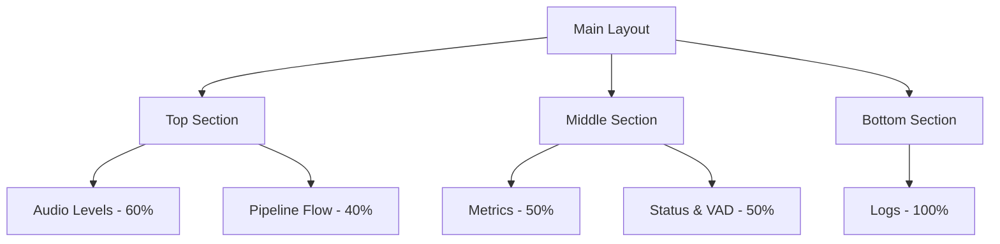
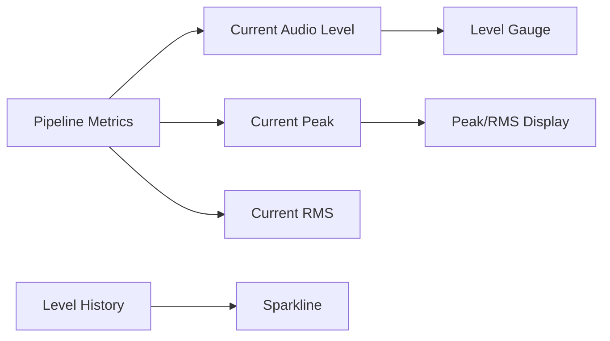
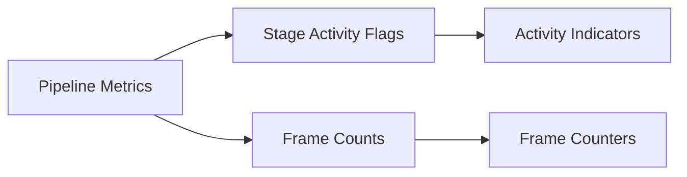
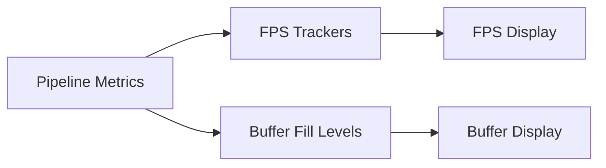
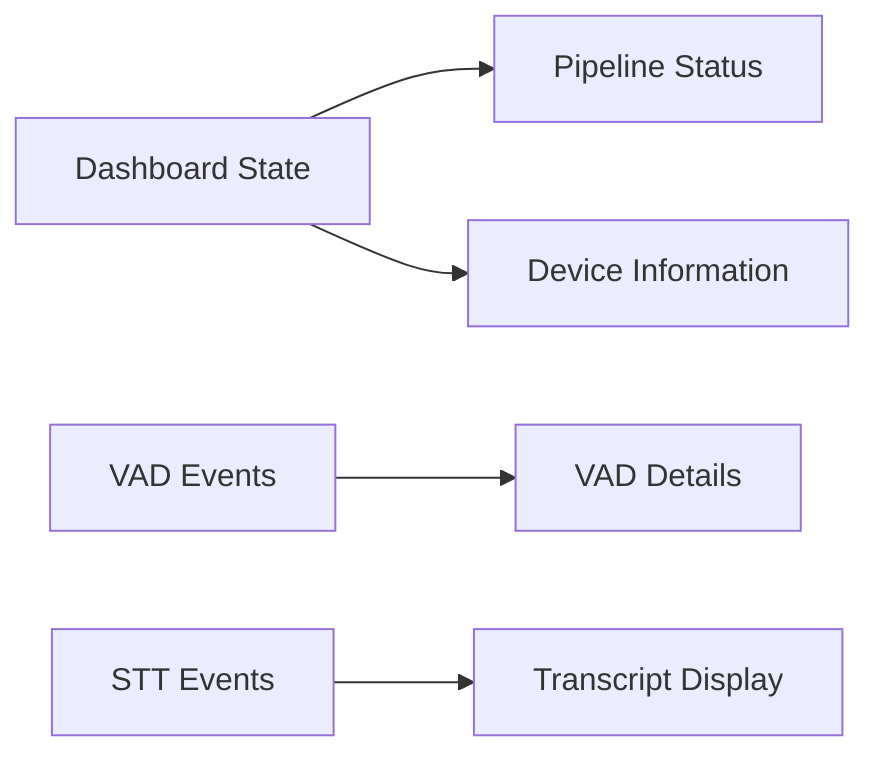
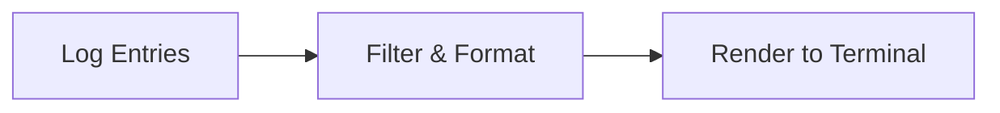
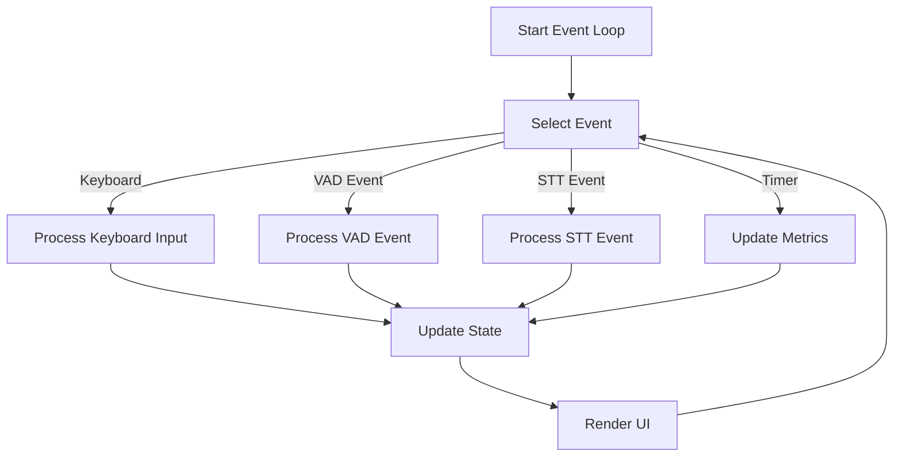

# TUI Dashboard Design

## Overview

This document describes how the TUI Dashboard requirements will be realized, including implementation details, tradeoffs, risks, and validation approaches. The dashboard provides real-time monitoring of the ColdVox audio pipeline through a terminal-based interface.

## Implementation Approach

### Architecture Pattern

The dashboard follows the Model-View-Controller (MVC) pattern adapted for a terminal UI:

1. **Model**: `DashboardState` struct that holds all application state
2. **View**: Separate rendering functions for each UI component
3. **Controller**: Event handling loop in `run_app` function

### UI Layout

The dashboard is divided into four main sections using a vertical layout:



### Component Design

#### 1. Audio Levels Component

**Implementation**:
- Gauge widget for current audio level with color coding
- Sparkline widget for level history
- Text display for peak and RMS values in dB

**Data Flow**:


**Tradeoffs**:
- Limited to 60 history samples due to terminal width constraints
- Simple color coding (green/yellow/red) instead of gradient for better visibility

#### 2. Pipeline Flow Component

**Implementation**:
- Four text lines showing pipeline stages
- Activity indicators (●/○) showing active/inactive state
- Frame counters for each stage

**Data Flow**:


**Tradeoffs**:
- Text-based indicators instead of graphical elements for terminal compatibility
- Limited to four stages for simplicity and space constraints

#### 3. Metrics Component

**Implementation**:
- Text display of runtime and FPS metrics
- Buffer fill percentages for each pipeline stage
- Updated every 50ms

**Data Flow**:


**Tradeoffs**:
- No historical charts due to terminal limitations
- Simple text display instead of graphs for better compatibility

#### 4. Status & VAD Component

**Implementation**:
- Text display of pipeline status and device information
- VAD event details and speech segment count
- STT transcript when available
- Control instructions

**Data Flow**:


**Tradeoffs**:
- Limited transcript display to 80 characters for space constraints
- Simple text-based status indicators instead of icons

#### 5. Logs Component

**Implementation**:
- Scrollable text area with timestamped log entries
- Color coding by log level
- Automatic scrolling to show latest entries

**Data Flow**:


**Tradeoffs**:
- Limited to terminal height in visible entries
- No search or filtering capabilities due to complexity

## State Management

### Dashboard State Structure

```rust
struct DashboardState {
    // Application state
    is_running: bool,
    is_speaking: bool,
    start_time: Instant,

    // Audio device
    selected_device: String,
    activation_mode: ActivationMode,

    // Metrics
    metrics: PipelineMetricsSnapshot,
    has_metrics_snapshot: bool,
    level_history: Vec<u16>,

    // VAD information
    vad_frames: u64,
    speech_segments: u64,
    last_vad_event: Option<String>,

    // STT information
    last_transcript: Option<String>,

    // Logs
    logs: VecDeque<LogEntry>,
}
```

### State Updates

1. **Metrics Updates**: Collected every 50ms from `PipelineMetrics`
2. **Event Processing**: VAD and STT events processed as they arrive
3. **User Input**: Keyboard events modify state directly
4. **UI Rendering**: State is read-only during rendering

## Event Handling

### Event Sources

1. **Keyboard Events**: Processed via crossterm
2. **VAD Events**: Received via broadcast channel
3. **STT Events**: Received via mpsc channel when available
4. **Timer Events**: Used for periodic metrics updates

### Event Loop



## Performance Considerations

### Rendering Optimization

1. **Partial Updates**: Only changed components are re-rendered
2. **Double Buffering**: Ratatui handles this automatically
3. **Minimal Redraws**: UI updates limited to 20 FPS (50ms intervals)

### Memory Management

1. **Bounded History**: Audio level history limited to 60 samples
2. **Circular Buffer**: Logs use VecDeque with fixed capacity
3. **Shared References**: Metrics accessed via atomic references

### CPU Usage

1. **Async Processing**: Event handling uses tokio async runtime
2. **Non-blocking UI**: Rendering never blocks audio processing
3. **Efficient Layouts**: Simple grid layouts minimize calculation overhead

## Error Handling

### Audio Device Errors

1. **Device Disconnection**: Detected via metrics, displayed in status
2. **Capture Failures**: Logged and displayed in status area
3. **Recovery**: Automatic retry with exponential backoff

### UI Errors

1. **Terminal Resize**: Handled gracefully by Ratatui
2. **Input Errors**: Invalid keyboard events ignored
3. **Rendering Errors**: Logged but don't crash the application

## Validation Approach

### Unit Testing

1. **State Management**: Test state transitions and updates
2. **Event Processing**: Test VAD and STT event handling
3. **Component Rendering**: Test UI component generation

### Integration Testing

1. **Pipeline Integration**: Test with mock audio pipeline
2. **Device Handling**: Test with various audio device scenarios
3. **User Interaction**: Test keyboard event handling

### Performance Testing

1. **CPU Usage**: Measure under various load conditions
2. **Memory Usage**: Verify no leaks over extended operation
3. **Responsiveness**: Ensure UI remains responsive under load

## Risks and Mitigations

### Technical Risks

1. **Terminal Compatibility**
   - Risk: Some terminals may not support all features
   - Mitigation: Fallback to basic features, test on common terminals

2. **Performance Impact**
   - Risk: UI rendering may impact audio processing
   - Mitigation: Async design, minimal CPU usage, separate threads

3. **Complexity**
   - Risk: Code complexity may lead to bugs
   - Mitigation: Modular design, clear separation of concerns

### User Experience Risks

1. **Information Overload**
   - Risk: Too much information may overwhelm users
   - Mitigation: Clean layout, logical grouping, color coding

2. **Responsiveness**
   - Risk: UI may feel sluggish under heavy load
   - Mitigation: Efficient rendering, prioritize critical updates

## Future Enhancements

### Planned Improvements

1. **Spectrogram Visualization**
   - Implementation challenge: Terminal graphics limitations
   - Approach: Use braille characters or block elements

2. **Configuration UI**
   - Implementation challenge: Complex form handling in terminal
   - Approach: Simple dialog-based interface

3. **Historical Data**
   - Implementation challenge: Memory usage vs. usefulness
   - Approach: Configurable history size with disk storage option

### Stretch Goals

1. **Network Streaming**
   - Implementation challenge: Protocol design and security
   - Approach: Simple WebSocket-based protocol

2. **Multi-channel Support**
   - Implementation challenge: UI space limitations
   - Approach: Tabbed interface or selectable channels

## Conclusion

The TUI Dashboard design balances functionality with terminal limitations, providing a comprehensive monitoring interface for the ColdVox audio pipeline. The modular architecture allows for future enhancements while maintaining performance and reliability.
