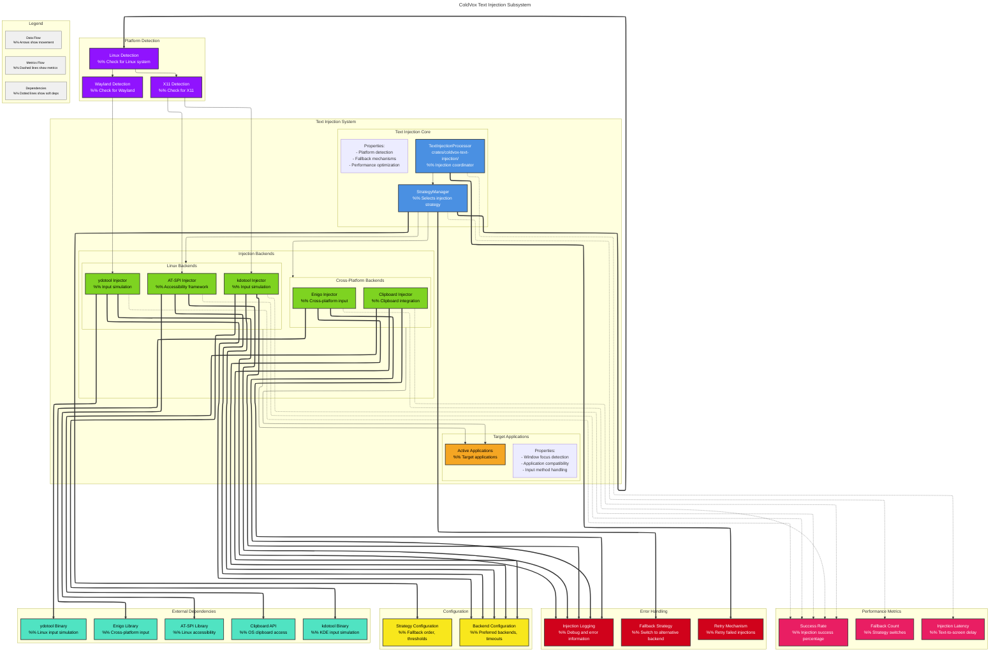

```mermaid
---
title: ColdVox Text Injection Subsystem
version: 1.0
date: 2025-09-05
config:
  layout: elk
---
flowchart TD
  %% Text Injection Subsystem
  subgraph TextInjectionSystem["Text Injection System"]
    direction TB

    %% Text Injection Core
    subgraph TextInjectionCore["Text Injection Core"]
      direction TB
      TEXTINJ["TextInjectionProcessor<br>crates/coldvox-text-injection/<br>%% Injection coordinator"]
      STRATEGY["StrategyManager<br>%% Selects injection strategy"]
      STRATEGY_PROPS["Properties:<br>- Platform detection<br>- Fallback mechanisms<br>- Performance optimization"]
    end

    %% Injection Backends
    subgraph InjectionBackends["Injection Backends"]
      direction TB

      %% Linux-specific backends
      subgraph LinuxBackends["Linux Backends"]
        direction TB
        ATSPI["AT-SPI Injector<br>%% Accessibility framework"]
        YDOT["ydotool Injector<br>%% Input simulation"]
        KDOT["kdotool Injector<br>%% Input simulation"]
      end

      %% Cross-platform backends
      subgraph CrossPlatformBackends["Cross-Platform Backends"]
        direction TB
        CLIP["Clipboard Injector<br>%% Clipboard integration"]
        ENIGO["Enigo Injector<br>%% Cross-platform input"]
      end
    end

    %% Target Applications
    subgraph TargetApplications["Target Applications"]
      direction TB
      APPS["Active Applications<br>%% Target applications"]
      APP_PROPS["Properties:<br>- Window focus detection<br>- Application compatibility<br>- Input method handling"]
    end
  end

  %% Text Injection Flow
  TEXTINJ --> STRATEGY
  STRATEGY --> LinuxBackends & CrossPlatformBackends
  LinuxBackends --> APPS
  CrossPlatformBackends --> APPS

  %% Platform Detection
  subgraph PlatformDetection["Platform Detection"]
    direction TB
    LINUX["Linux Detection<br>%% Check for Linux system"]
    WAYLAND["Wayland Detection<br>%% Check for Wayland"]
    X11["X11 Detection<br>%% Check for X11"]
  end

  STRATEGY ==> LINUX
  LINUX --> WAYLAND & X11
  WAYLAND --> YDOT
  X11 --> ATSPI & KDOT

  %% Performance Metrics
  subgraph PerformanceMetrics["Performance Metrics"]
    direction TB
    INJECTION_LATENCY["Injection Latency<br>%% Text-to-screen delay"]
    SUCCESS_RATE["Success Rate<br>%% Injection success percentage"]
    FALLBACK_COUNT["Fallback Count<br>%% Strategy switches"]
  end

  TEXTINJ -.-> INJECTION_LATENCY
  STRATEGY -.-> FALLBACK_COUNT
  ATSPI -.-> SUCCESS_RATE
  YDOT -.-> SUCCESS_RATE
  KDOT -.-> SUCCESS_RATE
  CLIP -.-> SUCCESS_RATE
  ENIGO -.-> SUCCESS_RATE

  %% Error Handling
  subgraph ErrorHandling["Error Handling"]
    direction TB
    FALLBACK["Fallback Strategy<br>%% Switch to alternative backend"]
    RETRY["Retry Mechanism<br>%% Retry failed injections"]
    LOGGING["Injection Logging<br>%% Debug and error information"]
  end

  STRATEGY ==> FALLBACK
  TEXTINJ ==> RETRY
  ATSPI ==> LOGGING
  YDOT ==> LOGGING
  KDOT ==> LOGGING
  CLIP ==> LOGGING
  ENIGO ==> LOGGING

  %% Configuration
  subgraph Configuration["Configuration"]
    direction TB
    BACKEND_CONFIG["Backend Configuration<br>%% Preferred backends, timeouts"]
    STRATEGY_CONFIG["Strategy Configuration<br>%% Fallback order, thresholds"]
  end

  STRATEGY ==> STRATEGY_CONFIG
  ATSPI ==> BACKEND_CONFIG
  YDOT ==> BACKEND_CONFIG
  KDOT ==> BACKEND_CONFIG
  CLIP ==> BACKEND_CONFIG
  ENIGO ==> BACKEND_CONFIG

  %% External Dependencies
  subgraph ExternalDeps["External Dependencies"]
    direction TB
    ATSPI_LIB["AT-SPI Library<br>%% Linux accessibility"]
    YDOT_LIB["ydotool Binary<br>%% Linux input simulation"]
    KDOT_LIB["kdotool Binary<br>%% KDE input simulation"]
    ENIGO_LIB["Enigo Library<br>%% Cross-platform input"]
    CLIP_LIB["Clipboard API<br>%% OS clipboard access"]
  end

  ATSPI ==> ATSPI_LIB
  YDOT ==> YDOT_LIB
  KDOT ==> KDOT_LIB
  ENIGO ==> ENIGO_LIB
  CLIP ==> CLIP_LIB

  %% Component Styling
  TEXTINJ:::core
  STRATEGY:::core
  ATSPI:::backend
  YDOT:::backend
  KDOT:::backend
  CLIP:::backend
  ENIGO:::backend
  APPS:::target
  LINUX:::detection
  WAYLAND:::detection
  X11:::detection
  INJECTION_LATENCY:::metrics
  SUCCESS_RATE:::metrics
  FALLBACK_COUNT:::metrics
  FALLBACK:::error
  RETRY:::error
  LOGGING:::error
  BACKEND_CONFIG:::config
  STRATEGY_CONFIG:::config
  ATSPI_LIB:::external
  YDOT_LIB:::external
  KDOT_LIB:::external
  ENIGO_LIB:::external
  CLIP_LIB:::external

  %% Style Definitions
  classDef core fill:#4a90e2,stroke:#333,stroke-width:2px,color:#fff
  classDef backend fill:#7ed321,stroke:#333,stroke-width:2px,color:#000
  classDef target fill:#f5a623,stroke:#333,stroke-width:2px,color:#000
  classDef detection fill:#9013fe,stroke:#333,stroke-width:2px,color:#fff
  classDef metrics fill:#e91e63,stroke:#333,stroke-width:2px,color:#fff
  classDef error fill:#d0021b,stroke:#333,stroke-width:2px,color:#fff
  classDef config fill:#f8e71c,stroke:#333,stroke-width:2px,color:#000
  classDef external fill:#50e3c2,stroke:#333,stroke-width:2px,color:#000

  %% Legend
  subgraph Legend["Legend"]
    direction TB
    FLOW["Data Flow<br>%% Arrows show movement"]
    DEPENDENCY["Dependencies<br>%% Dotted lines show soft deps"]
    METRICFLOW["Metrics Flow<br>%% Dashed lines show metrics"]
  end

  FLOW:::annotation
  DEPENDENCY:::annotation
  METRICFLOW:::annotation

  classDef annotation fill:#f0f0f0,stroke:#666,stroke-width:1px,color:#000,font-size:12px
```
