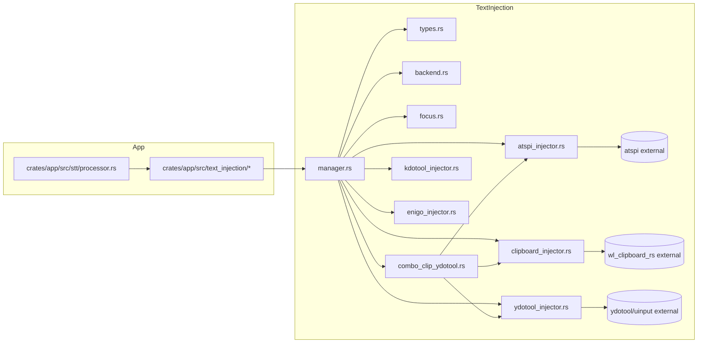

# Text Injection Failover Strategy

Updated: 2025-09-05

This document explains how ColdVox injects text across Linux desktops (Wayland/X11), the failover order, timing, and how to tune behavior.

## Overview

ColdVox supports multiple injection methods and picks the most reliable path at runtime:

- AT-SPI Insert (primary): Directly inserts text into the focused editable widget via the AT-SPI EditableText interface.
- Clipboard + Paste combo: Sets the clipboard, then triggers paste using:
  1) AT-SPI Action "paste" (preferred)
  2) ydotool Ctrl+V (fallback)
  Optionally restores the original clipboard after a short delay.
- Clipboard only: Sets clipboard when paste triggering isn’t available.
- Optional/opt-in helpers: ydotool, kdotool, enigo.

Key modules:
- `crates/coldvox-text-injection/src/atspi_injector.rs` — AT-SPI direct insert
- `crates/coldvox-text-injection/src/combo_clip_ydotool.rs` — clipboard + paste combo (AT-SPI paste → ydotool fallback), clipboard restore
- `crates/coldvox-text-injection/src/clipboard_injector.rs` — clipboard set + utilities
- `crates/coldvox-text-injection/src/manager.rs` — method ordering, success/fail tracking, cooldown/fallback
- `crates/coldvox-text-injection/src/ydotool_injector.rs` — uinput-based paste/type fallback

## Method Priority and Runtime Order

The runtime order depends on available backends and configuration:

1. **Primary path (ComboClipboardYdotool)**: When `wl_clipboard` and `ydotool` features are available, the combined clipboard+paste method is preferred. If `atspi` is also enabled, it first attempts AT-SPI Action "paste" before falling back to ydotool.

2. **Fallback cascade** (typical order):
   - AT-SPI Insert (direct EditableText interface)
   - Clipboard + Paste combo (AT-SPI paste → ydotool fallback)
   - Clipboard only (when paste triggering unavailable)
   - Optional helpers (kdotool/enigo/ydotool direct), if enabled via config

The `StrategyManager` in `manager.rs` dynamically adjusts method priority based on:
- Backend availability (detected at runtime via `backend.rs`)
- Success/failure rates per application
- Configuration flags (`allow_ydotool`, `allow_kdotool`, `allow_enigo`)

## Clipboard + Paste Combo Details

Flow for a single injection request:
1) Optionally save current clipboard (if `restore_clipboard = true`).
2) Set clipboard to the text.
3) Wait a short stabilization delay (default 20 ms).
4) Try AT-SPI Action "paste" with a timeout.
5) If AT-SPI paste fails or times out, fallback to `ydotool key ctrl+v` with a timeout.
6) If clipboard restore is enabled, restore the saved clipboard after a delay (default 500 ms) without blocking the caller.

### Timings and Timeouts
- Clipboard stabilization: 20 ms (kept small to reduce latency).
- AT-SPI paste timeout: `paste_action_timeout_ms` (default 200 ms).
- ydotool paste timeout: also uses `paste_action_timeout_ms` by default.
- Worst-case failover to ydotool: ≈ 20 ms + `paste_action_timeout_ms` (e.g., ~220 ms with default values).

### Why AT-SPI paste first?
- It’s application-aware (via accessibility interface) and avoids blind keystrokes.
- Works reliably across many Qt/GTK apps on Wayland.
- Falls back cleanly to ydotool if unsupported or slow.

### Clipboard Restore
- Controlled by `restore_clipboard` (bool) and `clipboard_restore_delay_ms` (default Some(500)).
- The restore runs asynchronously after paste to avoid racing with the target application’s paste handling.

## Configuration (selected)
From `crates/coldvox-text-injection/src/types.rs`:
- `restore_clipboard: bool` — Save/restore clipboard around paste.
- `clipboard_restore_delay_ms: Option<u64>` — Delay before restore (default Some(500) ms).
- `paste_action_timeout_ms: u64` — Timeout for paste actions (default 200 ms).
- `per_method_timeout_ms: u64` — Generic method timeout (default 250 ms).
- `allow_ydotool: bool` — Enables ydotool-based fallbacks.
- `allow_kdotool`, `allow_enigo`: Opt-in helpers.
- `min_success_rate: f64` — Minimum success rate before trying fallback methods (affects dynamic method selection).

### Feature Flags
The following Cargo features control which injection backends are compiled:
- `atspi` — AT-SPI2 support for direct text insertion and paste actions
- `wl_clipboard` — Wayland clipboard support via wl-clipboard-rs
- `ydotool` — ydotool integration for synthetic key events
- `kdotool` — kdotool support (X11 environments)
- `enigo` — Cross-platform enigo library support

Features are typically auto-detected at build time via `crates/app/build.rs` based on the desktop environment.

## Platform Notes
- KDE Plasma (Wayland):
  - Global hotkeys use KGlobalAccel (listener only; not used to send Ctrl+V).
  - AT-SPI is well-supported; ydotool requires daemon and uinput permissions.
- Wayland vs X11:
  - Clipboard and AT-SPI paths are compositor/DE-agnostic.
  - On X11, additional options (e.g., xdotool) may appear, but are not required.

## Tuning Guidance
- Reduce `paste_action_timeout_ms` to fail over to ydotool faster if your apps don’t expose AT-SPI paste.
- Keep clipboard stabilization minimal (20 ms) unless your target apps need more.
- If you see double-paste in rare cases, consider increasing `clipboard_restore_delay_ms` slightly (e.g., 600–700 ms).

## Reliability & Success Tracking

The `StrategyManager` in `manager.rs` maintains per-application success metrics for each injection method:

- **Success tracking**: Each app-method combination has a `SuccessRecord` tracking success/failure counts and timestamps
- **Dynamic fallback**: Methods with success rates below `min_success_rate` are deprioritized for that application
- **Cooldown mechanism**: Failed methods enter cooldown periods (starting at `cooldown_initial_ms`, default 10s) with exponential backoff up to `cooldown_max_ms` (default 5 minutes)
- **Automatic recovery**: Methods gradually become available again after cooldown expires, allowing retry if conditions improve

This adaptive approach ensures the system learns which methods work best for specific applications while maintaining the ability to recover from transient failures.

## Caveats
- ydotool requires a running daemon and access to `/dev/uinput` (often via membership in the `input` group).
- Some apps/widgets don’t expose AT-SPI Action "paste"; the fallback handles this.

---
For implementation details, start with:
- `combo_clip_ydotool.rs`: AT-SPI-first paste with ydotool fallback, clipboard save/restore.
- `atspi_injector.rs`: Direct editable text insert path.

## Appendix: Prompt to generate diagrams (repo-derived, no hardcoding)

Use the following prompt with a diagramming/code-reading agent. It must read values from this repo and not hardcode timeouts/delays.

```
Prompt: Generate two diagrams for ColdVox text injection

Goal
- Produce two diagrams based on the current code in the repository (do not hardcode values; derive from code):
  1) Flowchart of the text injection failover cascade with:
     - Brief description per method
     - Tags showing the current default timing values (delays/timeouts) derived from code
     - Tags/notes explaining how failure is detected for each step
  2) One-hop dependency/connection graph of the text injection system files (show immediate edges only, including app-level entry points), to visualize where injected text originates from the STT path without going deep.

Repository scope
- Read only the files in this repository to derive values and logic.
- If a value is dynamic or feature-gated, indicate that in the node label and include the feature condition.

Files to inspect (derive from these, don’t guess)
- Injection flow and ordering:
  - crates/coldvox-text-injection/src/manager.rs
  - crates/coldvox-text-injection/src/backend.rs
  - crates/coldvox-text-injection/src/types.rs (InjectionConfig, default_* functions, timeouts, flags)
- Injection methods:
  - crates/coldvox-text-injection/src/atspi_injector.rs (AT-SPI direct insert)
  - crates/coldvox-text-injection/src/combo_clip_ydotool.rs (clipboard+paste: AT-SPI Action paste first → ydotool fallback; clipboard save/restore; stabilization delay)
  - crates/coldvox-text-injection/src/clipboard_injector.rs (Wayland clipboard APIs; any save/restore helpers)
  - crates/coldvox-text-injection/src/ydotool_injector.rs (Ctrl+V paste fallback; timeouts; error handling)
  - Optional helpers: kdotool_injector.rs, enigo_injector.rs
  - Supporting: focus.rs, window_manager.rs, session.rs, processor.rs, lib.rs
- Feature flags and availability:
  - crates/coldvox-text-injection/Cargo.toml (features atspi, wl_clipboard, etc.)
- App-level one-hop connections (don’t go deep):
  - crates/app/src/text_injection/* (integration layer)
  - crates/app/src/stt/processor.rs (origin of text passing into injection)

How to derive timings and failure conditions
- Timings:
  - Find clipboard stabilization delay in combo_clip_ydotool.rs (look for tokio::time::sleep(...)).
  - Find paste_action_timeout_ms default in types.rs (default_* function) and confirm actual use in combo_clip_ydotool.rs and ydotool_injector.rs (timeout(...) calls).
  - Find per_method_timeout_ms defaults and where they are applied, if relevant.
  - Use the exact values from code; if constants/functions compute defaults, resolve them and include the actual default number from the code.
- Failure detection rules:
  - AT-SPI Insert: identify conditions that return errors (e.g., no focused editable element via CollectionProxy.get_matches, EditableText.insert_text failure). Show the error variants used (e.g., NoEditableFocus, Timeout, MethodUnavailable, Other, etc.) and the approximate decision point in code.
  - AT-SPI Paste: identify how you detect a paste-capable action (ActionProxy.get_actions presence of “paste”), and what constitutes failure (no action, do_action error, timeout).
  - ydotool Paste: identify failure (process non-zero status, timeout, missing daemon/uinput permission checks).
  - Clipboard set: identify failure outcomes where relevant (clipboard errors, timeouts).
- If anything is feature-gated, show the feature guard (e.g., [feature: atspi]) next to the node.

Diagram 1: Failover flowchart (Mermaid)
- Build a flowchart showing the runtime order taken by the system:
  - AT-SPI Insert (EditableText.insert_text) → if fail → Clipboard set (with stabilization delay) → AT-SPI Action “paste” (with timeout) → if fail/timeout → ydotool Ctrl+V (with timeout) → done.
- Each node must include:
  - Short description of the method (e.g., “AT-SPI Insert: EditableText”).
  - A tag with the timing derived from code (e.g., “stabilize=<value>ms”, “timeout=<value>ms”), with the source file and line reference in a comment or side note if practical.
  - A short “fail-if” note showing how failure is detected (e.g., “no EditableText match; insert error”, “no ‘paste’ action; do_action error; timeout”, “non-zero exit; timeout”).
- Use clear labels for success vs fail edges. Use left-to-right layout if possible.

Diagram 2: One-hop dependency graph (Mermaid)
- Nodes: each text injection file listed above as nodes (manager.rs, types.rs, backend.rs, atspi_injector.rs, clipboard_injector.rs, combo_clip_ydotool.rs, ydotool_injector.rs, kdotool_injector.rs, enigo_injector.rs, focus.rs, window_manager.rs, session.rs, processor.rs, lib.rs).
- Edges (only one hop):
  - manager.rs → each injector it creates/uses (derive from build/registry code).
  - manager.rs → backend.rs, types.rs, focus.rs as used.
  - combo_clip_ydotool.rs → clipboard_injector.rs, and references to AT-SPI Action and ydotool paths.
  - atspi_injector.rs → (external) atspi proxies node.
  - clipboard_injector.rs → (external) wl_clipboard_rs node.
  - ydotool_injector.rs → (external) ydotool/uinput node.
  - App-level: app/stt/processor.rs → app/text_injection/* → manager.rs (one hop only).
- Include a legend for “external” nodes.

Output format
- Provide BOTH diagrams as Mermaid code blocks, with a brief caption before each.
- For timings and fail-if notes in the flowchart, include derived values and a trailing comment with the source file (and line if available), e.g., “timeout=<derived>ms // from types.rs default_paste_action_timeout_ms()”.
- Do not hardcode values; read them from the files. If a value cannot be resolved, annotate as “(derived: unknown)” and briefly state why (e.g., not found or feature off).

Example skeleton (you fill the computed values and references)

Caption: Failover cascade (derived timings + failure detection)
```mermaid
flowchart LR
  A[AT-SPI Insert\nEditableText.insert_text\nfail-if: no focused editable; insert error] -->|success| Z[Done]
  A -->|fail| B[Clipboard set\nstabilize=<derived>ms // combo_clip_ydotool.rs]
  B --> C[AT-SPI Paste (Action)\ntimeout=<derived>ms // types.rs + combo_clip_ydotool.rs\nfail-if: no 'paste' action; do_action error; timeout]
  C -->|success| Z
  C -->|fail| D[ydotool Paste (ctrl+v)\ntimeout=<derived>ms // types.rs + ydotool_injector.rs\nfail-if: non-zero exit; timeout; uinput issues]
  D -->|success| Z
  D -->|fail| E[Report failure]
```

Caption: One-hop dependency map (text injection)

```
