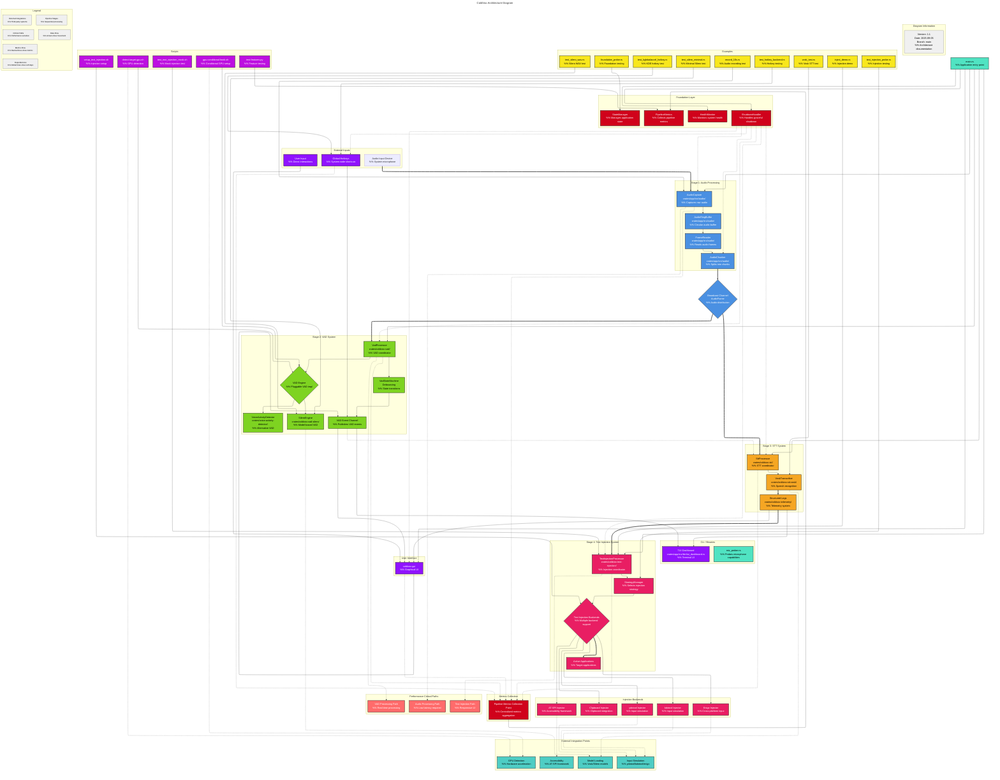

```mermaid
---
title: ColdVox Architecture Diagram
version: 1.1
date: 2025-09-05
branch: main
config:
  layout: elk
---
flowchart TD
  %% Version Information
  subgraph Version["Diagram Information"]
    direction TB
    VINFO["Version: 1.1<br>Date: 2025-09-05<br>Branch: main<br>%% Architecture documentation"]
  end

  subgraph subGraph0["Foundation Layer"]
    direction TB
        SM["StateManager<br>%% Manages application state"]
        HM["HealthMonitor<br>%% Monitors system health"]
        SH["ShutdownHandler<br>%% Handles graceful shutdown"]
        METRICS["PipelineMetrics<br>%% Collects pipeline metrics"]
  end

  subgraph subGraph1["CLI / Binaries"]
    direction TB
        MIC_PROBE["mic_prober.rs<br>%% Probes microphone capabilities"]
        TUI_DASH["TUI Dashboard<br>crates/app/src/bin/tui_dashboard.rs<br>%% Terminal UI"]
  end

  subgraph subGraph2["External Inputs"]
    direction TB
        MIC["Audio Input Device<br>%% System microphone"]
        HK["Global Hotkeys<br>%% System-wide shortcuts"]
        USER["User Input<br>%% Direct interactions"]
  end

  subgraph subGraph3["Stage 1: Audio Processing"]
    direction TB
        ARB["AudioRingBuffer<br>crates/app/src/audio/<br>%% Circular audio buffer"]
        AC["AudioCapture<br>crates/app/src/audio/<br>%% Captures raw audio"]
        FR["FrameReader<br>crates/app/src/audio/<br>%% Reads audio frames"]
        CHUNKER["AudioChunker<br>crates/app/src/audio/<br>%% Splits into chunks"]
  end

  subgraph subGraph4["Stage 2: VAD System"]
    direction TB
        VADFSM["VadStateMachine<br>Debouncing<br>%% State transitions"]
        VAD["VadProcessor<br>crates/coldvox-vad/<br>%% VAD coordinator"]
        EVENTS["VAD Event Channel<br>%% Publishes VAD events"]
        VADENG{"VAD Engine<br>%% Pluggable VAD impl"}
        SILERO["SileroEngine<br>crates/coldvox-vad-silero/<br>%% Model-based VAD"]
        VADALT["VoiceActivityDetector<br>crates/voice-activity-detector/<br>%% Alternative VAD"]
  end

  subgraph subGraph5["Stage 3: STT System"]
    direction TB
        VOSK["VoskTranscriber<br>crates/coldvox-stt-vosk/<br>%% Speech recognition"]
        STT["SttProcessor<br>crates/coldvox-stt/<br>%% STT coordinator"]
        LOGS["Structured Logs<br>crates/coldvox-telemetry/<br>%% Telemetry system"]
  end

  subgraph subGraph6["Injection Backends"]
    direction TB
        ATSPI["AT-SPI Injector<br>%% Accessibility framework"]
        CLIP["Clipboard Injector<br>%% Clipboard integration"]
        YDOT["ydotool Injector<br>%% Input simulation"]
        KDOT["kdotool Injector<br>%% Input simulation"]
        ENIGO["Enigo Injector<br>%% Cross-platform input"]
  end

  subgraph subGraph7["Stage 4: Text Injection System"]
    direction TB
        STRATEGY["StrategyManager<br>%% Selects injection strategy"]
        TEXTINJ["TextInjectionProcessor<br>crates/coldvox-text-injection/<br>%% Injection coordinator"]
        BACKENDS{"Text Injection Backends<br>%% Multiple backend support"}
        APPS["Active Applications<br>%% Target applications"]
  end

  subgraph subGraph8["User Interface"]
    direction TB
        GUI["coldvox-gui<br>%% Graphical UI"]
  end

  subgraph Examples["Examples"]
    direction TB
        FOUNDATION_PROBE["foundation_probe.rs<br>%% Foundation testing"]
        INJECT_DEMO["inject_demo.rs<br>%% Injection demo"]
        RECORD_10S["record_10s.rs<br>%% Audio recording test"]
        HOTKEY_BACKEND["test_hotkey_backend.rs<br>%% Hotkey testing"]
        KGLOBALACCEL["test_kglobalaccel_hotkey.rs<br>%% KDE hotkey test"]
        SILERO_MINIMAL["test_silero_minimal.rs<br>%% Minimal Silero test"]
        SILERO_WAV["test_silero_wav.rs<br>%% Silero WAV test"]
        TEXT_INJECTION_PROBE["text_injection_probe.rs<br>%% Injection testing"]
        VOSK_TEST["vosk_test.rs<br>%% Vosk STT test"]
  end

  subgraph Scripts["Scripts"]
    direction TB
        DETECT_GPU["detect-target-gpu.sh<br>%% GPU detection"]
        GPU_HOOK["gpu-conditional-hook.sh<br>%% Conditional GPU setup"]
        SETUP_TEXT_INJECTION["setup_text_injection.sh<br>%% Injection setup"]
        TEST_FEATURES_PY["test-features.py<br>%% Feature testing"]
        TEST_TEXT_INJECTION_MOCK["test_text_injection_mock.sh<br>%% Mock injection test"]
  end

  %% Main Application Entry Point
  MAIN["main.rs<br>%% Application entry point"]

  %% Audio Processing Pipeline
  AC --> ARB
  ARB --> FR
  FR --> CHUNKER

  %% VAD System Internal Connections
  VAD --> VADFSM & VADENG
  VADFSM --> EVENTS
  VADENG --> SILERO & VADALT

  %% STT System Internal Connections
  STT --> VOSK
  VOSK ==> LOGS

  %% Text Injection System Internal Connections
  TEXTINJ --> STRATEGY
  STRATEGY --> BACKENDS
  BACKENDS --> ATSPI & CLIP & YDOT & KDOT & ENIGO
  BACKENDS ==> APPS

  %% External Input Connections
  MIC ==> AC
  CHUNKER ==> BROADCAST{"Broadcast Channel<br>AudioFrame<br>%% Audio distribution"}
  BROADCAST ==> VAD & STT

  %% Inter-System Data Flow
  LOGS ==> TEXTINJ
  EVENTS -.-> STT

  %% Shutdown Handler Connections
  SH -.-> AC & VAD & STT & TEXTINJ & CHUNKER & HK & GUI

  %% Metrics Collection (Grouped for clarity)
  subgraph MetricsCollection["Metrics Collection"]
    direction TB
    METRICS_GROUP["Pipeline Metrics Collection Point<br>%% Centralized metrics aggregation"]
  end

  AC -.-> METRICS_GROUP
  VAD -.-> METRICS_GROUP
  STT -.-> METRICS_GROUP
  TEXTINJ -.-> METRICS_GROUP
  HK -.-> METRICS_GROUP
  GUI -.-> METRICS_GROUP
  METRICS_GROUP --> METRICS

  %% Main Application Connections
  MAIN --> AC & VAD & STT & TEXTINJ & HM & SH & GUI

  %% Hotkey and Event System
  HK --> EVENTS
  USER --> GUI
  GUI --> EVENTS
  EVENTS --> GUI & TUI_DASH
  LOGS --> GUI & TUI_DASH

  %% Example and Script Connections
  FOUNDATION_PROBE --> SM
  INJECT_DEMO --> TEXTINJ
  RECORD_10S --> AC
  HOTKEY_BACKEND --> HK
  KGLOBALACCEL --> HK
  SILERO_MINIMAL --> SILERO
  SILERO_WAV --> SILERO
  TEXT_INJECTION_PROBE --> STRATEGY
  VOSK_TEST --> VOSK
  DETECT_GPU --> VADENG
  GPU_HOOK --> VADENG
  SETUP_TEXT_INJECTION --> BACKENDS
  TEST_FEATURES_PY --> METRICS
  TEST_TEXT_INJECTION_MOCK --> TEXTINJ

  %% Performance Critical Paths (Highlighted)
  subgraph CriticalPaths["Performance Critical Paths"]
    direction TB
    AUDIO_PATH["Audio Processing Path<br>%% Low latency required"]
    VAD_PATH["VAD Processing Path<br>%% Real-time processing"]
    INJECTION_PATH["Text Injection Path<br>%% Responsive UI"]
  end

  AC -.-> AUDIO_PATH
  VAD -.-> VAD_PATH
  TEXTINJ -.-> INJECTION_PATH

  %% External Integration Points (Highlighted)
  subgraph ExternalIntegrations["External Integration Points"]
    direction TB
    MODEL_LOADING["Model Loading<br>%% Vosk/Silero models"]
    GPU_DETECTION["GPU Detection<br>%% Hardware acceleration"]
    INPUT_SIM["Input Simulation<br>%% ydotool/kdotool/enigo"]
    ACCESSIBILITY["Accessibility<br>%% AT-SPI framework"]
  end

  VOSK -.-> MODEL_LOADING
  SILERO -.-> MODEL_LOADING
  DETECT_GPU -.-> GPU_DETECTION
  GPU_HOOK -.-> GPU_DETECTION
  YDOT -.-> INPUT_SIM
  KDOT -.-> INPUT_SIM
  ENIGO -.-> INPUT_SIM
  ATSPI -.-> ACCESSIBILITY

  %% Component Styling
   MAIN:::cli
   SM:::foundation
   HM:::foundation
   SH:::foundation
   METRICS:::foundation
   MIC_PROBE:::cli
   TUI_DASH:::ui
   HK:::ui
   USER:::ui
   AC:::processing
   ARB:::processing
   FR:::processing
   CHUNKER:::processing
   VAD:::vad
   VADFSM:::vad
   EVENTS:::vad
   VADENG:::vad
   SILERO:::vad
   VADALT:::vad
   STT:::stt
   VOSK:::stt
   LOGS:::stt
   TEXTINJ:::textinj
   STRATEGY:::textinj
   BACKENDS:::textinj
   ATSPI:::textinj
   CLIP:::textinj
   YDOT:::textinj
   KDOT:::textinj
   ENIGO:::textinj
   APPS:::textinj
   GUI:::ui
   FOUNDATION_PROBE:::examples
   INJECT_DEMO:::examples
   RECORD_10S:::examples
   HOTKEY_BACKEND:::examples
   KGLOBALACCEL:::examples
   SILERO_MINIMAL:::examples
   SILERO_WAV:::examples
   TEXT_INJECTION_PROBE:::examples
   VOSK_TEST:::examples
   DETECT_GPU:::scripts
   GPU_HOOK:::scripts
   SETUP_TEXT_INJECTION:::scripts
   TEST_FEATURES_PY:::scripts
   TEST_TEXT_INJECTION_MOCK:::scripts
   BROADCAST:::processing
   METRICS_GROUP:::foundation
   AUDIO_PATH:::critical
   VAD_PATH:::critical
   INJECTION_PATH:::critical
   MODEL_LOADING:::external
   GPU_DETECTION:::external
   INPUT_SIM:::external
   ACCESSIBILITY:::external
   VINFO:::info

  %% Style Definitions
  classDef processing fill:#4a90e2,stroke:#333,stroke-width:2px,color:#fff
  classDef vad fill:#7ed321,stroke:#333,stroke-width:2px,color:#000
  classDef stt fill:#f5a623,stroke:#333,stroke-width:2px,color:#000
  classDef textinj fill:#e91e63,stroke:#333,stroke-width:2px,color:#fff
  classDef ui fill:#9013fe,stroke:#333,stroke-width:2px,color:#fff
  classDef foundation fill:#d0021b,stroke:#333,stroke-width:2px,color:#fff
  classDef cli fill:#50e3c2,stroke:#333,stroke-width:2px,color:#000
  classDef examples fill:#f8e71c,stroke:#333,stroke-width:2px,color:#000
  classDef scripts fill:#bd10e0,stroke:#333,stroke-width:2px,color:#fff
  classDef critical fill:#ff6b6b,stroke:#333,stroke-width:2px,color:#fff
  classDef external fill:#4ecdc4,stroke:#333,stroke-width:2px,color:#000
  classDef info fill:#f0f0f0,stroke:#666,stroke-width:1px,color:#000

  %% Key Annotations
  %% Legend
  subgraph Legend["Legend"]
      direction TB
      PIPELINE["Pipeline Stages<br>%% Sequential processing"]
      DATAFLOW["Data Flow<br>%% Arrows show movement"]
      DEPENDENCY["Dependencies<br>%% Dotted lines show soft deps"]
      METRICFLOW["Metrics Flow<br>%% Dashed lines show metrics"]
      CRITICAL_PATH["Critical Paths<br>%% Performance sensitive"]
      EXTERNAL["External Integrations<br>%% Third-party systems"]
  end

  %% Pipeline Stage Annotations
  PIPELINE:::annotation
  DATAFLOW:::annotation
  DEPENDENCY:::annotation
  METRICFLOW:::annotation
  CRITICAL_PATH:::annotation
  EXTERNAL:::annotation

  classDef annotation fill:#f0f0f0,stroke:#666,stroke-width:1px,color:#000,font-size:12px
```
