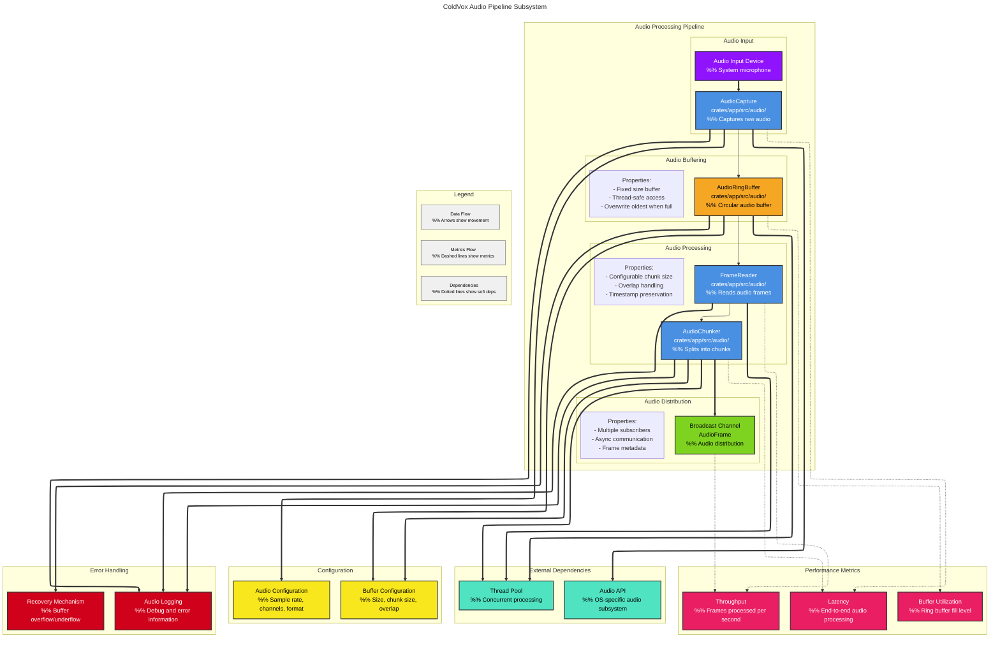

```mermaid
---
title: ColdVox Audio Pipeline Subsystem
version: 1.0
date: 2025-09-05
config:
  layout: elk
---
flowchart TD
  %% Audio Pipeline Subsystem
  subgraph AudioPipeline["Audio Processing Pipeline"]
    direction TB

    %% Audio Input
    subgraph AudioInput["Audio Input"]
      direction TB
      MIC["Audio Input Device<br>%% System microphone"]
      AC["AudioCapture<br>crates/app/src/audio/<br>%% Captures raw audio"]
    end

    %% Audio Buffering
    subgraph AudioBuffering["Audio Buffering"]
      direction TB
      ARB["AudioRingBuffer<br>crates/app/src/audio/<br>%% Circular audio buffer"]
      ARB_PROPS["Properties:<br>- Fixed size buffer<br>- Thread-safe access<br>- Overwrite oldest when full"]
    end

    %% Audio Processing
    subgraph AudioProcessing["Audio Processing"]
      direction TB
      FR["FrameReader<br>crates/app/src/audio/<br>%% Reads audio frames"]
      CHUNKER["AudioChunker<br>crates/app/src/audio/<br>%% Splits into chunks"]
      CHUNKER_PROPS["Properties:<br>- Configurable chunk size<br>- Overlap handling<br>- Timestamp preservation"]
    end

    %% Audio Distribution
    subgraph AudioDistribution["Audio Distribution"]
      direction TB
      BROADCAST["Broadcast Channel<br>AudioFrame<br>%% Audio distribution"]
      BROADCAST_PROPS["Properties:<br>- Multiple subscribers<br>- Async communication<br>- Frame metadata"]
    end
  end

  %% Audio Pipeline Flow
  MIC ==> AC
  AC --> ARB
  ARB --> FR
  FR --> CHUNKER
  CHUNKER ==> BROADCAST

  %% Performance Metrics
  subgraph PerformanceMetrics["Performance Metrics"]
    direction TB
    LATENCY["Latency<br>%% End-to-end audio processing"]
    THROUGHPUT["Throughput<br>%% Frames processed per second"]
    BUFFER_UTIL["Buffer Utilization<br>%% Ring buffer fill level"]
  end

  AC -.-> LATENCY
  ARB -.-> BUFFER_UTIL
  FR -.-> THROUGHPUT
  CHUNKER -.-> LATENCY
  BROADCAST -.-> THROUGHPUT

  %% External Dependencies
  subgraph ExternalDeps["External Dependencies"]
    direction TB
    AUDIO_API["Audio API<br>%% OS-specific audio subsystem"]
    THREAD_POOL["Thread Pool<br>%% Concurrent processing"]
  end

  AC ==> AUDIO_API
  ARB ==> THREAD_POOL
  FR ==> THREAD_POOL
  CHUNKER ==> THREAD_POOL

  %% Configuration
  subgraph Configuration["Configuration"]
    direction TB
    AUDIO_CONFIG["Audio Configuration<br>%% Sample rate, channels, format"]
    BUFFER_CONFIG["Buffer Configuration<br>%% Size, chunk size, overlap"]
  end

  AC ==> AUDIO_CONFIG
  ARB ==> BUFFER_CONFIG
  CHUNKER ==> BUFFER_CONFIG

  %% Error Handling
  subgraph ErrorHandling["Error Handling"]
    direction TB
    RECOVERY["Recovery Mechanism<br>%% Buffer overflow/underflow"]
    LOGGING["Audio Logging<br>%% Debug and error information"]
  end

  ARB ==> RECOVERY
  AC ==> LOGGING
  FR ==> LOGGING
  CHUNKER ==> LOGGING

  %% Component Styling
  MIC:::input
  AC:::processing
  ARB:::buffer
  FR:::processing
  CHUNKER:::processing
  BROADCAST:::distribution
  LATENCY:::metrics
  THROUGHPUT:::metrics
  BUFFER_UTIL:::metrics
  AUDIO_API:::external
  THREAD_POOL:::external
  AUDIO_CONFIG:::config
  BUFFER_CONFIG:::config
  RECOVERY:::error
  LOGGING:::error

  %% Style Definitions
  classDef input fill:#9013fe,stroke:#333,stroke-width:2px,color:#fff
  classDef processing fill:#4a90e2,stroke:#333,stroke-width:2px,color:#fff
  classDef buffer fill:#f5a623,stroke:#333,stroke-width:2px,color:#000
  classDef distribution fill:#7ed321,stroke:#333,stroke-width:2px,color:#000
  classDef metrics fill:#e91e63,stroke:#333,stroke-width:2px,color:#fff
  classDef external fill:#50e3c2,stroke:#333,stroke-width:2px,color:#000
  classDef config fill:#f8e71c,stroke:#333,stroke-width:2px,color:#000
  classDef error fill:#d0021b,stroke:#333,stroke-width:2px,color:#fff

  %% Legend
  subgraph Legend["Legend"]
    direction TB
    FLOW["Data Flow<br>%% Arrows show movement"]
    DEPENDENCY["Dependencies<br>%% Dotted lines show soft deps"]
    METRICFLOW["Metrics Flow<br>%% Dashed lines show metrics"]
  end

  FLOW:::annotation
  DEPENDENCY:::annotation
  METRICFLOW:::annotation

  classDef annotation fill:#f0f0f0,stroke:#666,stroke-width:1px,color:#000,font-size:12px
```
