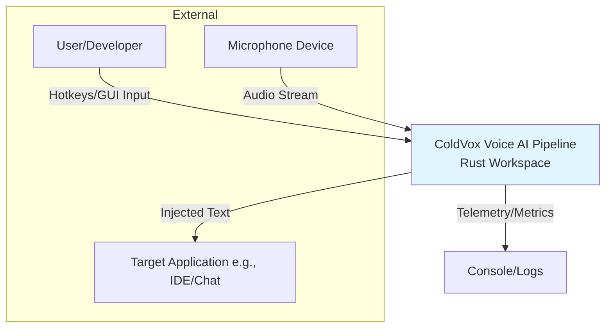
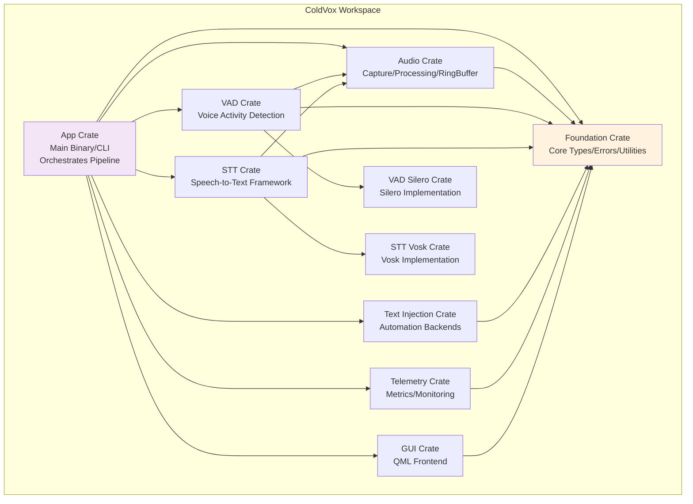
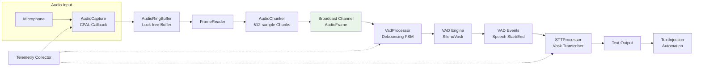

// ... existing code ...
# ColdVox Codebase Diagrams

## Overview
This document proposes three diagrams covering various aspects of the ColdVox Rust workspace codebase, based on best practices from the C4 model (Context, Containers, Components). The C4 model emphasizes simple, notation-independent diagrams that align with code evolution, use standard elements (e.g., boxes for systems/containers, arrows for interactions), and focus on key relationships without unnecessary details. Diagrams are sketched using Mermaid for text-based representation, enabling easy updates via version control and integration with tools like Structurizr or PlantUML.

These diagrams cover:
1. **System Context (C4 Level 1)**: High-level external interactions.
2. **Containers (C4 Level 2)**: Crate-level decomposition and dependencies.
3. **Components (C4 Level 3)**: Detailed audio pipeline flow.

## 1. System Context Diagram
This diagram shows ColdVox as a single system interacting with external users and hardware. It highlights the primary users (e.g., developers/end-users) and external systems (e.g., microphone, target applications for text injection).

**Key Aspects Covered**: Overall boundaries, external dependencies, and high-level data flows. Best practice: Keep at Level 1 to avoid implementation details, focusing on "what" interacts with "whom".

## 2. Container Diagram
This decomposes ColdVox into its main crates (containers) and their interactions. Based on Cargo.toml members and README structure, it shows dependencies like foundation shared across crates.

**Key Aspects Covered**: Modular crate structure, shared dependencies (e.g., foundation), and runtime interactions (e.g., audio feeding VAD/STT). Best practice: Use directed arrows for dependencies/data flows, group related containers, and ensure diagrams reflect Cargo workspace members for maintainability.

## 3. Component Diagram - Audio Processing Pipeline
This focuses on the core audio-to-text flow within the App and supporting crates, showing internal components like AudioCapture, VADProcessor, and STT integration. Drawn from docs/improved_architecture_diagram.md and crate READMEs.

**Key Aspects Covered**: Data flow through the pipeline, event-driven aspects (e.g., VAD events triggering STT), and cross-cutting concerns like telemetry. Best practice: Limit to one runtime scenario (audio processing), use dashed lines for indirect relations (e.g., monitoring), and align with code modules (e.g., src/audio/, src/stt/).

## Recommendations
- **Tools**: Use diagrams-as-code (e.g., Mermaid in Markdown) for version control integration, as per best practices from sources like C4 model and Structurizr.
- **Maintenance**: Update diagrams alongside code changes (e.g., via CI checks). Validate against actual implementations in crates like coldvox-audio and coldvox-vad.
- **Extensions**: Add deployment diagrams for future Docker/containerization or dynamic diagrams for sequence flows.
// ... existing code ...
