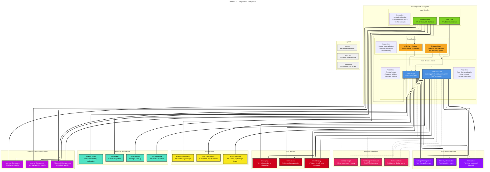

```mermaid
---
title: ColdVox UI Components Subsystem
version: 1.0
date: 2025-09-05
config:
  layout: elk
---
flowchart TD
  %% UI Components Subsystem
  subgraph UIComponents["UI Components Subsystem"]
    direction TB

    %% Main UI Components
    subgraph MainUI["Main UI Components"]
      direction TB
      GUI["coldvox-gui<br>%% Graphical UI"]
      TUI_DASH["TUI Dashboard<br>crates/app/src/bin/tui_dashboard.rs<br>%% Terminal UI"]
      GUI_PROPS["Properties:<br>- Real-time visualization<br>- User controls<br>- Status monitoring"]
      TUI_PROPS["Properties:<br>- Terminal-based<br>- Resource efficient<br>- Remote accessible"]
    end

    %% Input Handling
    subgraph InputHandling["Input Handling"]
      direction TB
      HK["Global Hotkeys<br>%% System-wide shortcuts"]
      USER["User Input<br>%% Direct interactions"]
      HK_PROPS["Properties:<br>- Global registration<br>- Configurable bindings<br>- Conflict resolution"]
    end

    %% Event System
    subgraph EventSystem["Event System"]
      direction TB
      EVENTS["VAD Event Channel<br>%% Publishes VAD events"]
      LOGS["Structured Logs<br>crates/coldvox-telemetry/<br>%% Telemetry system"]
      EVENTS_PROPS["Properties:<br>- Async communication<br>- Multiple subscribers<br>- Event filtering"]
    end
  end

  %% UI Flow
  HK --> EVENTS
  USER --> GUI
  GUI --> EVENTS
  EVENTS --> GUI & TUI_DASH
  LOGS --> GUI & TUI_DASH

  %% UI State Management
  subgraph UIState["UI State Management"]
    direction TB
    STATE_SYNC["State Synchronization<br>%% Keep UIs in sync"]
    NOTIFICATIONS["Notifications<br>%% User alerts and feedback"]
    SETTINGS["Settings Management<br>%% User preferences"]
  end

  GUI ==> STATE_SYNC
  TUI_DASH ==> STATE_SYNC
  GUI ==> NOTIFICATIONS
  TUI_DASH ==> NOTIFICATIONS
  GUI ==> SETTINGS
  TUI_DASH ==> SETTINGS

  %% Performance Metrics
  subgraph PerformanceMetrics["Performance Metrics"]
    direction TB
    RENDER_PERF["Rendering Performance<br>%% FPS, frame time"]
    RESPONSE_TIME["Response Time<br>%% Input-to-display latency"]
    MEMORY_USAGE["Memory Usage<br>%% UI component memory"]
  end

  GUI -.-> RENDER_PERF
  TUI_DASH -.-> RENDER_PERF
  GUI -.-> RESPONSE_TIME
  TUI_DASH -.-> RESPONSE_TIME
  GUI -.-> MEMORY_USAGE
  TUI_DASH -.-> MEMORY_USAGE

  %% Error Handling
  subgraph ErrorHandling["Error Handling"]
    direction TB
    RECOVERY["UI Recovery<br>%% Graceful degradation"]
    ERROR_DISPLAY["Error Display<br>%% User-friendly error messages"]
    LOGGING["UI Logging<br>%% Debug and error information"]
  end

  GUI ==> RECOVERY
  TUI_DASH ==> RECOVERY
  GUI ==> ERROR_DISPLAY
  TUI_DASH ==> ERROR_DISPLAY
  GUI ==> LOGGING
  TUI_DASH ==> LOGGING

  %% Configuration
  subgraph Configuration["Configuration"]
    direction TB
    GUI_CONFIG["GUI Configuration<br>%% Theme, layout, controls"]
    TUI_CONFIG["TUI Configuration<br>%% Colors, keybindings, layout"]
    HOTKEY_CONFIG["Hotkey Configuration<br>%% Global key bindings"]
  end

  GUI ==> GUI_CONFIG
  TUI_DASH ==> TUI_CONFIG
  HK ==> HOTKEY_CONFIG

  %% External Dependencies
  subgraph ExternalDeps["External Dependencies"]
    direction TB
    GUI_FRAMEWORK["GUI Framework<br>%% egui, GTK, Qt"]
    TUI_FRAMEWORK["TUI Framework<br>%% ratatui, crossterm"]
    HOTKEY_LIB["Hotkey Library<br>%% Global hotkey registration"]
    SYSTEM_API["System API<br>%% OS integration"]
  end

  GUI ==> GUI_FRAMEWORK
  TUI_DASH ==> TUI_FRAMEWORK
  HK ==> HOTKEY_LIB
  HK ==> SYSTEM_API

  %% Platform-Specific Components
  subgraph PlatformSpecific["Platform-Specific Components"]
    direction TB
    LINUX_UI["Linux UI Components<br>%% Wayland/X11 specific"]
    WINDOWS_UI["Windows UI Components<br>%% Win32 specific"]
    MACOS_UI["macOS UI Components<br>%% Cocoa specific"]
  end

  GUI ==> LINUX_UI & WINDOWS_UI & MACOS_UI
  HK ==> LINUX_UI & WINDOWS_UI & MACOS_UI

  %% Component Styling
  GUI:::ui_main
  TUI_DASH:::ui_main
  HK:::input
  USER:::input
  EVENTS:::event
  LOGS:::event
  STATE_SYNC:::state
  NOTIFICATIONS:::state
  SETTINGS:::state
  RENDER_PERF:::metrics
  RESPONSE_TIME:::metrics
  MEMORY_USAGE:::metrics
  RECOVERY:::error
  ERROR_DISPLAY:::error
  LOGGING:::error
  GUI_CONFIG:::config
  TUI_CONFIG:::config
  HOTKEY_CONFIG:::config
  GUI_FRAMEWORK:::external
  TUI_FRAMEWORK:::external
  HOTKEY_LIB:::external
  SYSTEM_API:::external
  LINUX_UI:::platform
  WINDOWS_UI:::platform
  MACOS_UI:::platform

  %% Style Definitions
  classDef ui_main fill:#4a90e2,stroke:#333,stroke-width:2px,color:#fff
  classDef input fill:#7ed321,stroke:#333,stroke-width:2px,color:#000
  classDef event fill:#f5a623,stroke:#333,stroke-width:2px,color:#000
  classDef state fill:#9013fe,stroke:#333,stroke-width:2px,color:#fff
  classDef metrics fill:#e91e63,stroke:#333,stroke-width:2px,color:#fff
  classDef error fill:#d0021b,stroke:#333,stroke-width:2px,color:#fff
  classDef config fill:#f8e71c,stroke:#333,stroke-width:2px,color:#000
  classDef external fill:#50e3c2,stroke:#333,stroke-width:2px,color:#000
  classDef platform fill:#bd10e0,stroke:#333,stroke-width:2px,color:#fff

  %% Legend
  subgraph Legend["Legend"]
    direction TB
    FLOW["Data Flow<br>%% Arrows show movement"]
    DEPENDENCY["Dependencies<br>%% Dotted lines show soft deps"]
    METRICFLOW["Metrics Flow<br>%% Dashed lines show metrics"]
  end

  FLOW:::annotation
  DEPENDENCY:::annotation
  METRICFLOW:::annotation

  classDef annotation fill:#f0f0f0,stroke:#666,stroke-width:1px,color:#000,font-size:12px
```
