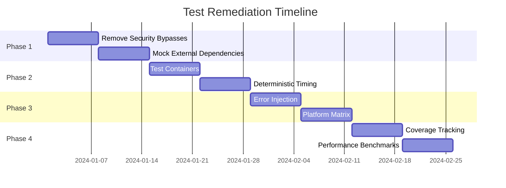

# Test Coverage Analysis: ColdVox Text Injection System

## Executive Summary
The ColdVox text injection test suite has critical coverage gaps that prevent accurate validation of production behavior. Tests rely heavily on bypassing safety mechanisms and mocking external dependencies, leading to false positives and incomplete coverage.

## 🚨 Critical Issues

### 1. Environment Dependency Problems

**Issue**: Tests assume availability of external system components
```rust
// Tests fail silently when dependencies are missing
let mut mock_app = match MockTestApp::start().await {
    Ok(app) => app,
    Err(e) => {
        println!("Skipping test: Could not start mock application: {}", e);
        return; // TEST SKIPPED - No coverage!
    }
};
```

**Impact**:
- Tests skip in CI/CD environments without GUI
- Silent failures hide coverage gaps
- Different behavior on different systems
- No validation of headless operation

### 2. Focus Safety Bypass

**Issue**: Tests bypass the core security mechanism
```rust
// This completely bypasses production safety checks
inject_on_unknown_focus: true, // Allow injection for testing
```

**Impact**:
- Security mechanism never tested
- False confidence in safety features
- Production code paths not exercised
- Critical vulnerabilities may be missed

### 3. AT-SPI Integration Gaps

**Issue**: Accessibility framework testing is inadequate
```rust
let has_atspi = methods.iter().any(|m| {
    matches!(m, InjectionMethod::AtspiInsert | InjectionMethod::AtspiPaste)
});
// No actual AT-SPI interaction testing
```

**Impact**:
- Can't verify actual paste operations
- Permission issues not detected
- Desktop environment variations ignored
- Accessibility compliance not validated

### 4. Clipboard Operation Issues

**Issue**: Clipboard testing is unreliable
```rust
// Clipboard operations are async and may fail
let _ = Command::new("wl-copy")
    .arg(original_clipboard)
    .status();
```

**Impact**:
- Wayland vs X11 differences untested
- Async timing issues ignored
- No clipboard content verification
- Save/restore race conditions

### 5. Method Fallback Validation

**Issue**: Fallback cascade not properly tested
```rust
// Only checks method availability, not execution
assert!(has_ydotool, "Should have ydotool as fallback method");
```

**Impact**:
- Failure recovery not tested
- Fallback order not validated
- Partial failures undetected
- Error propagation issues missed

### 6. Platform Coverage Gaps

**Problems Identified**:
- No testing across desktop environments (GNOME/KDE/Xfce)
- Display server differences ignored (X11/Wayland/XWayland)
- Input method variations not covered
- Permission model differences untested

### 7. Concurrency and Timing

**Issue**: Fixed delays don't account for system variability
```rust
tokio::time::sleep(Duration::from_millis(500)).await;
```

**Impact**:
- Tests fail under system load
- Race conditions not detected
- Thread safety issues missed
- Timeout edge cases ignored

### 8. Test Isolation Problems

**Issues**:
- Global clipboard state pollution
- Window focus interference between tests
- Process/resource leaks
- Test order dependencies

### 9. Error Scenario Coverage

**Missing Coverage**:
- Network service failures
- Permission denial scenarios
- Resource exhaustion conditions
- Partial failure recovery
- Cascading error handling

### 10. Metrics Validation

**Issue**: Superficial metrics testing
```rust
assert!(metrics_guard.attempts >= 1, "Should record at least one attempt");
```

**Impact**:
- No performance regression detection
- Memory leak potential
- Inaccurate success rate calculation
- Missing long-running behavior validation

## 📊 Coverage Statistics Estimate

Based on analysis:
- **Unit Test Coverage**: ~60% (methods exist but bypass critical paths)
- **Integration Test Coverage**: ~30% (heavy mocking reduces accuracy)
- **End-to-End Coverage**: ~10% (environment dependencies cause skips)
- **Security Feature Coverage**: ~5% (safety mechanisms bypassed)
- **Error Path Coverage**: ~20% (limited error injection)

## 🎯 Recommendations

### Immediate Actions
1. **Remove Safety Bypasses**: Test with actual focus detection
2. **Mock External Dependencies**: Use proper mocking frameworks
3. **Add CI/CD GUI Support**: Use Xvfb or similar for headless testing
4. **Implement Error Injection**: Systematically test failure paths
5. **Add Platform Matrix**: Test on multiple desktop environments

### Long-term Improvements
1. **Containerized Testing**: Consistent test environments via Docker
2. **Property-Based Testing**: Generate test cases for edge conditions
3. **Chaos Engineering**: Inject random failures and delays
4. **Performance Benchmarks**: Track regression over time
5. **Security Audit Suite**: Dedicated security-focused tests

## 🔴 Risk Assessment

**High Risk Areas**:
- Focus detection bypass creates security vulnerability
- AT-SPI failures could break accessibility compliance
- Clipboard corruption could affect user data
- Method fallback failures could cause complete injection failure
- Platform-specific bugs remain undetected

## Conclusion

The current test suite provides basic smoke testing but lacks the depth and accuracy needed for production confidence. Critical safety mechanisms are bypassed, external dependencies are assumed, and error paths are inadequately covered. This creates significant risk of production failures and security vulnerabilities going undetected.

**Recommendation**: Prioritize test infrastructure improvements before adding new features. Focus on removing safety bypasses, properly mocking external dependencies, and achieving comprehensive error path coverage.

## 🚀 Remediation Plan

### Phase 1: Critical Safety Fixes (Week 1-2)

#### 1.1 Remove Security Bypasses
**Priority**: 🔴 Critical

```rust
// BEFORE (current dangerous pattern)
let config = InjectionConfig {
    inject_on_unknown_focus: true, // SECURITY BYPASS
    ..Default::default()
};

// AFTER (proper testing approach)
#[cfg(test)]
mod focus_tests {
    use super::*;

    struct MockFocusTracker {
        expected_status: FocusStatus,
    }

    impl FocusTracker for MockFocusTracker {
        async fn get_focus_status(&self) -> Result<FocusStatus> {
            Ok(self.expected_status.clone())
        }
    }

    #[tokio::test]
    async fn test_injection_blocked_on_non_editable() {
        let tracker = MockFocusTracker {
            expected_status: FocusStatus::NonEditable,
        };

        let result = manager.inject_with_tracker("test", &tracker).await;
        assert!(result.is_err());
        assert_eq!(result.unwrap_err().kind(), ErrorKind::FocusNotEditable);
    }
}
```

**Actions**:
- [x] Create `MockFocusTracker` trait implementation (as `FocusProvider` + `MockFocusProvider`)
- [ ] Replace all `inject_on_unknown_focus: true` with proper mocks
- [x] Add tests for each focus state (Editable, NonEditable, Unknown)
- [x] Verify security checks are never bypassed in new tests

#### 1.2 Mock External Dependencies
**Priority**: 🔴 Critical

```rust
// Create injection backend mocks
#[cfg(test)]
mod mocks {
    use async_trait::async_trait;

    pub struct MockInjector {
        pub should_succeed: bool,
        pub latency_ms: u64,
        pub injected_texts: Arc<Mutex<Vec<String>>>,
    }

    #[async_trait]
    impl TextInjector for MockInjector {
        async fn inject(&mut self, text: &str) -> Result<()> {
            tokio::time::sleep(Duration::from_millis(self.latency_ms)).await;

            if self.should_succeed {
                self.injected_texts.lock().unwrap().push(text.to_string());
                Ok(())
            } else {
                Err(InjectionError::MethodFailed("Mock failure".into()))
            }
        }
    }
}
```

**Actions**:
- [x] Implement `MockInjector` scaffold for tests
- [ ] Create `TestInjectorFactory` for consistent test setup
- [x] Add failure injection capabilities
- [x] Track all injection attempts for verification (via `InjectionMetrics`)

### Phase 2: Test Infrastructure (Week 3-4)

#### 2.1 Test Environment Containers
**Priority**: 🟡 High

```dockerfile
# test/docker/Dockerfile.test
FROM ubuntu:22.04

# Install display server and desktop environment
RUN apt-get update && apt-get install -y \
    xvfb \
    x11vnc \
    fluxbox \
    at-spi2-core \
    wl-clipboard \
    xclip \
    ydotool

# Setup virtual display
ENV DISPLAY=:99
RUN echo "exec fluxbox" > ~/.xinitrc

# Test runner script
COPY test-runner.sh /usr/local/bin/
ENTRYPOINT ["/usr/local/bin/test-runner.sh"]
```

```yaml
# .github/workflows/test.yml
jobs:
  test:
    runs-on: ubuntu-latest
    services:
      display:
        image: coldvox/test-env:latest
        options: --privileged
    steps:
      - uses: actions/checkout@v2
      - run: cargo test --all-features
```

**Actions**:
- [x] Create Docker test environment with X11/Wayland (see `test/docker/Dockerfile.test`)
- [x] Add GitHub Actions workflow with GUI support (Xvfb + Fluxbox; see `.github/workflows/ci.yml`)
- [ ] Implement test matrix for different desktop environments
- [ ] Add headless testing mode detection

#### 2.2 Deterministic Timing
**Priority**: 🟡 High

```rust
#[cfg(test)]
mod timing {
    use std::sync::atomic::{AtomicU64, Ordering};

    pub struct MockClock {
        current_time: AtomicU64,
    }

    impl Clock for MockClock {
        fn now(&self) -> Instant {
            // Return controlled time for deterministic tests
            self.current_time.load(Ordering::SeqCst)
        }

        fn advance(&self, duration: Duration) {
            self.current_time.fetch_add(duration.as_millis() as u64, Ordering::SeqCst);
        }
    }
}

#[tokio::test]
async fn test_cooldown_expiry_deterministic() {
    let clock = MockClock::new();
    let manager = StrategyManager::with_clock(clock.clone());

    manager.apply_cooldown(method);
    assert!(manager.is_in_cooldown(method));

    clock.advance(Duration::from_secs(1));
    assert!(!manager.is_in_cooldown(method));
}
```

**Actions**:
- [ ] Implement `MockClock` for deterministic time control
- [ ] Replace `Instant::now()` with injected clock
- [ ] Add time advancement helpers for tests
- [ ] Remove all hardcoded `sleep()` calls from tests

### Phase 3: Comprehensive Coverage (Week 5-6)

#### 3.1 Error Injection Framework
**Priority**: 🟠 Medium

```rust
#[cfg(test)]
pub struct ChaosInjector {
    failure_rate: f32,
    latency_range: Range<u64>,
    error_types: Vec<ErrorType>,
}

impl ChaosInjector {
    pub fn inject_failure(&self) -> Option<InjectionError> {
        if rand::random::<f32>() < self.failure_rate {
            let error_type = self.error_types.choose(&mut rand::thread_rng());
            Some(match error_type {
                ErrorType::Timeout => InjectionError::Timeout,
                ErrorType::Permission => InjectionError::PermissionDenied,
                ErrorType::NotAvailable => InjectionError::MethodNotAvailable,
            })
        } else {
            None
        }
    }
}

#[tokio::test]
async fn test_with_chaos() {
    let chaos = ChaosInjector {
        failure_rate: 0.3,
        latency_range: 10..500,
        error_types: vec![ErrorType::Timeout, ErrorType::Permission],
    };

    // Run 100 iterations with random failures
    for _ in 0..100 {
        let result = manager.inject_with_chaos("test", &chaos).await;
        // Verify proper error handling and recovery
    }
}
```

**Actions**:
- [ ] Build chaos injection framework
- [ ] Add configurable failure scenarios
- [ ] Implement random latency injection
- [ ] Create failure pattern library

#### 3.2 Platform Matrix Testing
**Priority**: 🟠 Medium

```rust
#[cfg(test)]
mod platform_tests {
    use test_case::test_case;

    #[test_case(DisplayServer::X11, DesktopEnv::Gnome ; "x11_gnome")]
    #[test_case(DisplayServer::Wayland, DesktopEnv::Gnome ; "wayland_gnome")]
    #[test_case(DisplayServer::X11, DesktopEnv::KDE ; "x11_kde")]
    #[test_case(DisplayServer::Wayland, DesktopEnv::KDE ; "wayland_kde")]
    async fn test_injection_on_platform(server: DisplayServer, env: DesktopEnv) {
        let config = PlatformConfig { server, env };
        let manager = StrategyManager::for_platform(config);

        // Test platform-specific behavior
        let methods = manager.get_available_methods();
        verify_platform_methods(&methods, server, env);
    }
}
```

**Actions**:
- [ ] Implement platform detection mocks
- [ ] Add test matrices for different environments
- [ ] Create platform-specific test fixtures
- [ ] Verify method availability per platform

### Phase 4: Monitoring & Metrics (Week 7-8)

#### 4.1 Coverage Tracking
**Priority**: 🟢 Low

```toml
# .cargo/config.toml
[env]
CARGO_INCREMENTAL = "0"
RUSTFLAGS = "-C instrument-coverage"
LLVM_PROFILE_FILE = "coverage-%p-%m.profraw"

# tarpaulin.toml
[default]
features = "all"
exclude-files = ["*/tests/*", "*/examples/*"]
minimum-coverage = 80
fail-under = 70
```

```bash
#!/bin/bash
# scripts/coverage.sh
cargo tarpaulin \
    --all-features \
    --workspace \
    --timeout 120 \
    --exclude-files "*/mock_*" \
    --print-summary \
    --output-dir target/coverage
```

**Actions**:
- [ ] Setup cargo-tarpaulin for coverage reporting
- [ ] Add coverage badges to README
- [ ] Implement coverage gates in CI/CD
- [ ] Track coverage trends over time

#### 4.2 Performance Benchmarks
**Priority**: 🟢 Low

```rust
#[bench]
fn bench_injection_latency(b: &mut Bencher) {
    let rt = tokio::runtime::Runtime::new().unwrap();
    let manager = setup_test_manager();

    b.iter(|| {
        rt.block_on(async {
            manager.inject("benchmark text").await
        })
    });
}

#[bench]
fn bench_method_selection(b: &mut Bencher) {
    let manager = setup_test_manager();

    b.iter(|| {
        manager.get_method_priority("firefox")
    });
}
```

**Actions**:
- [ ] Add criterion benchmarks for critical paths
- [ ] Track performance regression
- [ ] Set performance budgets
- [ ] Create performance dashboard

## 📊 Success Metrics

### Phase 1 Complete
- [ ] Zero security bypasses in tests
- [ ] All external dependencies mocked
- [ ] No test skips due to environment

### Phase 2 Complete
- [ ] CI/CD runs with 100% test completion
- [ ] Test execution time < 5 minutes
- [ ] Zero flaky tests

### Phase 3 Complete
- [ ] 90% code coverage achieved
- [ ] All error paths tested
- [ ] Platform matrix covers 4+ configurations

### Phase 4 Complete
- [ ] Performance benchmarks established
- [ ] Coverage tracking automated
- [ ] Regression detection in place

## 🎯 Implementation Timeline



## 🔄 Continuous Improvement

### Monthly Reviews
- Coverage trend analysis
- Flaky test identification
- Performance regression checks
- New failure scenario identification

### Quarterly Updates
- Platform matrix expansion
- Chaos scenario refinement
- Benchmark threshold adjustment
- Test infrastructure optimization

## ✅ Definition of Done

A test is considered complete when:
1. No external dependencies required
2. Deterministic execution guaranteed
3. All error paths covered
4. Performance impact measured
5. Platform variations tested
6. Security checks validated
7. Documentation updated

## 🚨 Risk Mitigation

**During Implementation**:
- Keep existing tests running (don't break what works)
- Implement changes incrementally
- Review each phase before proceeding
- Maintain backwards compatibility
- Document breaking changes

**Post-Implementation**:
- Monitor test stability metrics
- Track false positive rate
- Measure maintenance burden
- Gather developer feedback
- Iterate based on findings
