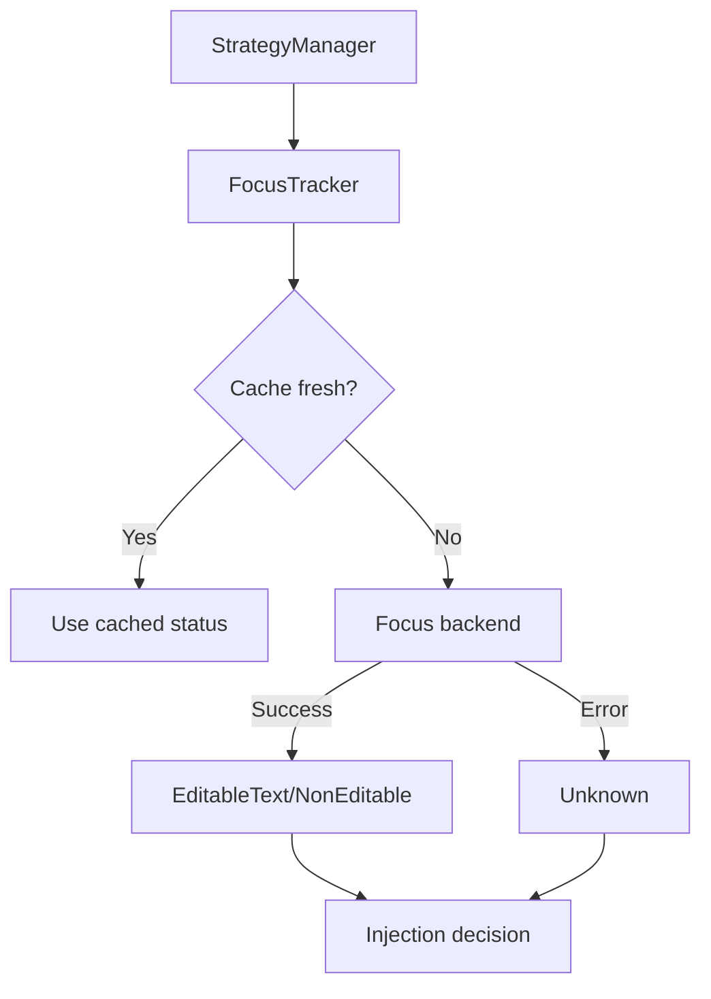

# Focus Detection Pipeline

ColdVox relies on a dedicated focus tracker to gate injection attempts. The tracker now ships with a pluggable backend that
mirrors production behaviour while remaining testable in headless CI runs.

## System flow



* **Caching** – the tracker stores the last decision for the configured window (default `200 ms`) to avoid hammering
  the accessibility bus. When the cache expires, the backend is queried again.
* **Backends** – the default backend gracefully falls back to `Unknown` when the bus is unavailable or times out. Tests can inject custom backends for deterministic scenarios.
* **Async-safe** – all operations are wrapped in timeout guards to prevent hangs.

## Focus Status Values

- `EditableText`: Focus is in a text input field that supports editing
- `NonEditable`: Focus is in a non-editable element (buttons, labels, etc.)
- `Unknown`: Focus status cannot be determined (fallback behavior)

## Configuration

Focus detection behavior is controlled by these config options:

```toml
[injection]
inject_on_unknown_focus = true   # Allow injection when focus is unknown
require_focus = false           # Require editable focus for injection
focus_cache_duration_ms = 200   # Cache duration for focus status (ms)
```

## Backend Architecture

The `FocusBackend` trait allows different implementations:

```rust
#[async_trait]
pub trait FocusBackend: Send + Sync {
    async fn query_focus(&self) -> Result<FocusStatus, InjectionError>;
}
```

This enables:
- Alternative focus detection methods
- Mock backends for testing
- Platform-specific implementations</content>
<parameter name="filePath">/home/coldaine/Desktop/ColdVoxRefactorTwo/ColdVox/docs/architecture/injection-focus.md