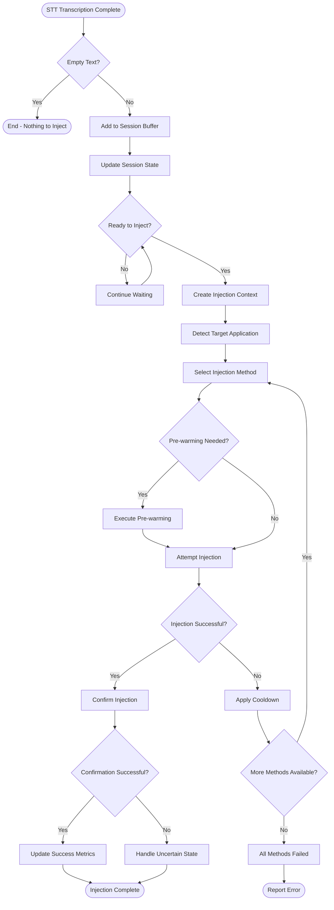
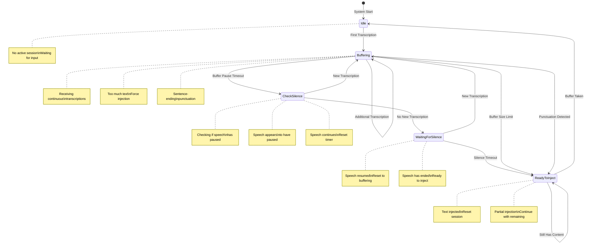
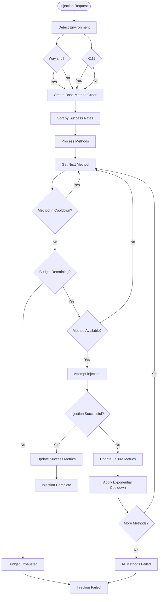
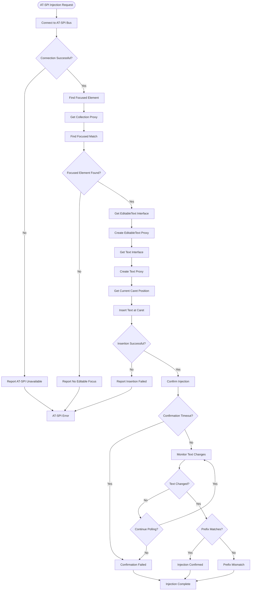
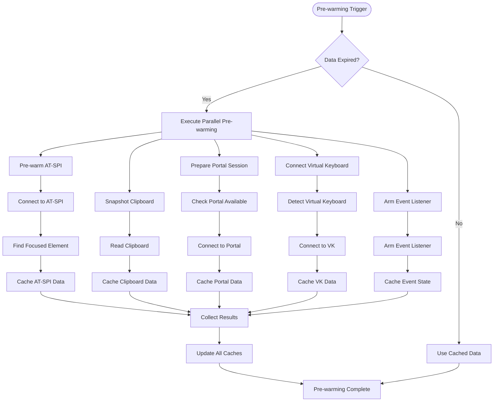
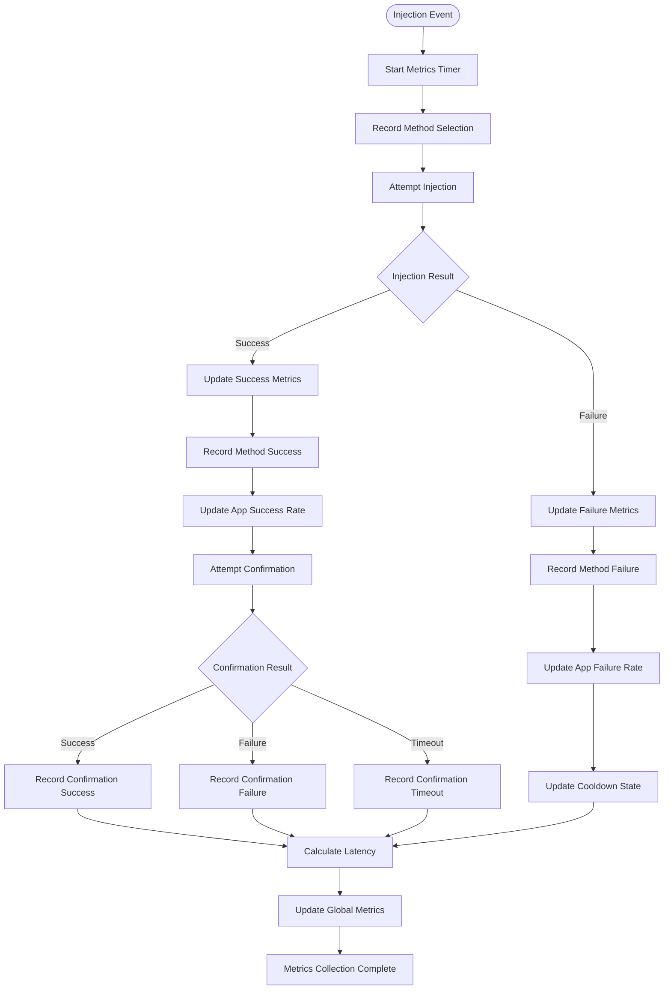

# Detailed Flow Diagrams of ColdVox Text Injection System

## 1. Complete Text Injection Flow

## 2. Session State Management Flow

## 3. Strategy Selection and Fallback Flow

## 4. AT-SPI Injection Detailed Flow

## 5. Clipboard Injection Detailed Flow

```mermaid
flowchart TD
    START([Clipboard Injection Request]) --> BACKUP_CLIPBOARD[Read Current Clipboard]
    BACKUP_CLIPBOARD --> BACKUP_SUCCESS{Backup Successful?}
    
    BACKUP_SUCCESS -->|No| CLIPBOARD_ERROR[Clipboard Error]
    BACKUP_SUCCESS -->|Yes| SET_CLIPBOARD[Set New Clipboard Content]
    
    SET_CLIPBOARD --> SET_SUCCESS{Set Successful?}
    
    SET_SUCCESS -->|No| CLIPBOARD_ERROR
    SET_SUCCESS -->|Yes| STABILIZE[Wait for Stabilization]
    
    STABILIZE --> DETECT_METHOD{Detect Paste Method}
    
    DETECT_METHOD --> ATSPI_AVAILABLE{AT-SPI Available?}
    DETECT_METHOD --> ENIGO_AVAILABLE{Enigo Available?}
    DETECT_METHOD --> YDOTOOL_AVAILABLE{Ydotool Available?}
    
    ATSPI_AVAILABLE -->|Yes| ATSPI_PASTE[Try AT-SPI Paste]
    ATSPI_AVAILABLE -->|No| ENIGO_AVAILABLE
    
    ATSPI_PASTE --> ATSPI_PASTE_SUCCESS{AT-SPI Paste Success?}
    ATSPI_PASTE_SUCCESS -->|Yes| PASTE_COMPLETE[Paste Complete]
    ATSPI_PASTE_SUCCESS -->|No| ENIGO_AVAILABLE
    
    ENIGO_AVAILABLE -->|Yes| ENIGO_PASTE[Try Enigo Paste]
    ENIGO_AVAILABLE -->|No| YDOTOOL_AVAILABLE
    
    ENIGO_PASTE --> ENIGO_PASTE_SUCCESS{Enigo Paste Success?}
    ENIGO_PASTE_SUCCESS -->|Yes| PASTE_COMPLETE
    ENIGO_PASTE_SUCCESS -->|No| YDOTOOL_AVAILABLE
    
    YDOTOOL_AVAILABLE -->|Yes| YDOTOOL_PASTE[Try Ydotool Paste]
    YDOTOOL_AVAILABLE -->|No| PASTE_FAILED[Paste Failed]
    
    YDOTOOL_PASTE --> YDOTOOL_PASTE_SUCCESS{Ydotool Paste Success?}
    YDOTOOL_PASTE_SUCCESS -->|Yes| PASTE_COMPLETE
    YDOTOOL_PASTE_SUCCESS -->|No| PASTE_FAILED
    
    PASTE_COMPLETE --> WAIT_RESTORE[Wait for Restore Delay]
    WAIT_RESTORE --> RESTORE_CLIPBOARD[Restore Original Clipboard]
    
    RESTORE_CLIPBOARD --> RESTORE_SUCCESS{Restore Successful?}
    
    RESTORE_SUCCESS -->|Yes| CLIPBOARD_COMPLETE[Injection Complete]
    RESTORE_SUCCESS -->|No| RESTORE_WARN[Restore Warning]
    
    RESTORE_WARN --> CLIPBOARD_COMPLETE
    CLIPBOARD_ERROR --> CLIPBOARD_FAILED[Clipboard Failed]
    PASTE_FAILED --> CLIPBOARD_FAILED
```

## 6. Pre-warming Execution Flow

## 7. Metrics Collection Flow

These detailed flow diagrams illustrate the complete operation of the ColdVox text injection system, showing how different components interact to provide reliable text injection across various Linux desktop environments.