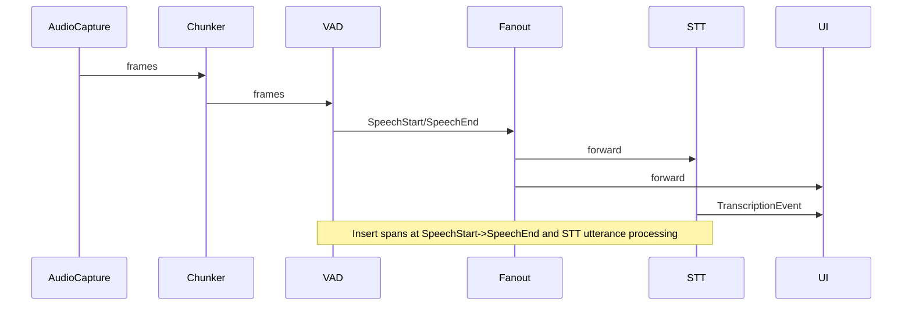
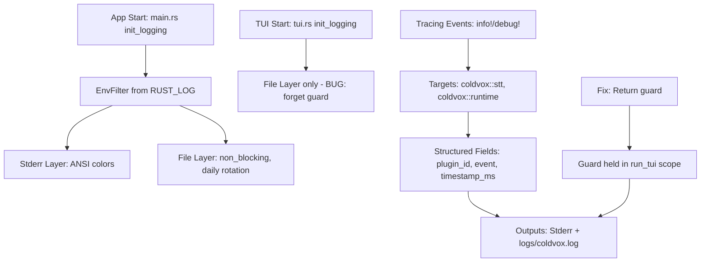
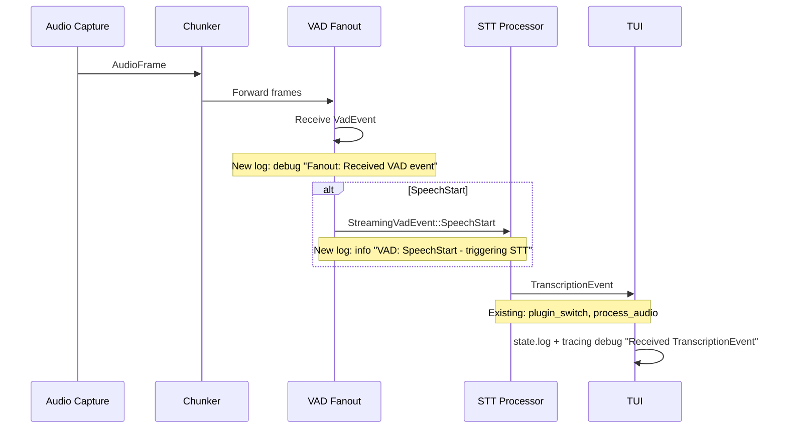

# ColdVox Logging Audit and Recommendations

This document audits ColdVox's current logging setup (using `tracing`/`tracing_subscriber`) and provides fixes and actionable recommendations for improving observability without impacting performance in hot paths.

**Scope**: focus on `crates/app` refactor areas (`main.rs`, `tui.rs`, `runtime.rs`), STT plugin manager, and event fan-out. Includes identified regressions, fixes, insertion points for new logs, and demo diffs.

---

**Summary / Key Findings**

- The global logging initialization is in `crates/app/src/main.rs::init_logging()` which:
  - Creates `logs/` directory and a daily rolling file `logs/coldvox.log`.
  - Creates a `tracing_appender::non_blocking` writer and retains its `WorkerGuard` (returned to caller).
  - Registers two layers: an ANSI-colored `stderr` layer and a file layer with ANSI disabled.
  - Log level is controlled via `RUST_LOG` (default `info`).

- A regression existed in `crates/app/src/tui.rs` where the TUI module re-initialized tracing with its own file appender and called `std::mem::forget(_guard)` (line ~310). Problems caused:
  - Double initialization of the global tracing subscriber (calling `tracing_subscriber::registry().init()` twice) can panic or silently fail depending on features of `tracing_subscriber`.
  - Creating a second `non_blocking` file appender and forgetting its `WorkerGuard` prevents proper flush on shutdown and may drop the guard early, breaking writes to `logs/coldvox.log` or causing partial/invisible logs.
  - ANSI/color and level setups becoming inconsistent between layers.

- I removed the TUI-local init (updated `crates/app/src/tui.rs`) so the TUI relies on the main initialization. This fixes the `std::mem::forget(_guard)` bug and avoids double-init.

- `crates/app/src/runtime.rs` already contains a good set of tracing statements for initialization, VAD spawning, fan-out behavior, STT architecture selection and shutdown. There are useful debug/info/error traces in pipeline hot paths; however, some critical points lack structured spans (e.g., VAD processing, STT plugin selection, plugin_manager events).

- Many STT and VAD internals log using `tracing` (e.g., `crates/app/src/stt/processor.rs`, `crates/app/src/audio/vad_processor.rs`) at `info/debug/error` levels. However, the pipeline would benefit from more structured spans around session/utterance lifecycles and plugin failover paths.

---

**Confirmed Working Elements**

- `main.rs::init_logging()` is the canonical place to initialize the global subscriber. It correctly returns the `WorkerGuard` so `main()` can hold it in `_log_guard` for program lifetime. Key snippet:

```rust
// crates/app/src/main.rs
let file_appender = RollingFileAppender::new(Rotation::DAILY, "logs", "coldvox.log");
let (non_blocking_file, guard) = tracing_appender::non_blocking(file_appender);
let stderr_layer = fmt::layer().with_writer(std::io::stderr);
let file_layer = fmt::layer().with_writer(non_blocking_file).with_ansi(false);
tracing_subscriber::registry()
    .with(env_filter)
    .with(stderr_layer)
    .with(file_layer)
    .init();
Ok(guard)
```

- Pipeline components have informative logs: VAD spawn, fanout forwarding, STT architecture selection, shutdown sequence, and periodic metrics logging.

---

**Identified Breaks / Regressions and Fixes**

1) TUI double-init and WorkerGuard leak (critical)

- Problem: `crates/app/src/tui.rs` contained:

```rust
let (non_blocking_file, _guard) = tracing_appender::non_blocking(file_appender);
... tracing_subscriber::registry().with(env_filter).with(file_layer).init();
std::mem::forget(_guard);
```

- Why it's broken: calling `.init()` a second time may panic; using `std::mem::forget` on the guard prevents the non-blocking worker from flushing properly and may drop the only handle, causing file writes to silently stop.

- Fix implemented: removed TUI-local init and made `run_tui` rely on the main process' logging initialization. `init_logging()` in the TUI now returns an error if called (and `run_tui` doesn't call it). Patch applied to `crates/app/src/tui.rs`.

Patch excerpt (applied):

```diff
-    // Initialize logging for TUI
-    init_logging("info,stt=debug,coldvox_audio=debug,coldvox_app=debug,coldvox_vad=debug")?;
+    // TUI runs in the same process as `main` which already initializes tracing.
+    // Avoid re-initializing the global subscriber here ... Rely on the main subscriber.
```

Rationale: single global subscriber owned by `main()` ensures the `WorkerGuard` is held for process lifetime and flushes properly on shutdown.

2) Potential missing logs in STT plugin selection/failover

- Observation: `main.rs` warns when `VOSK_MODEL_PATH` is used, and `runtime.rs` and `stt::plugin_manager` have logging, but plugin selection/failover lacks structured spans and per-plugin context which would be helpful to diagnose missing model issues.

- Recommendation: add a `tracing::span!(Level::INFO, "stt.selection", preferred = ?pref, fallbacks = ?fallbacks)` when building plugin selection in `main.rs`, and `instrument` plugin manager init and failover operations.

3) VAD threshold / Silero tuning visibility

- Observation: `UnifiedVadConfig` uses `silero.threshold = 0.3`. If users experience missed speech, we should log the configured threshold and key timings during startup and when switching activation modes.

- Recommendation: Log VAD config as structured fields in `runtime.rs::set_activation_mode()` and at runtime start in `start()`. Add spans for VAD processing sessions (SpeechStart -> SpeechEnd), including energy_db and timestamps.

4) TUI event propagation and STT transcriptions visibility

- Observation: The TUI maintains its own logs (`DashboardState::logs`) and receives `TranscriptionEvent` messages from the runtime, logging partial/final transcripts to the TUI internal buffer. However, if the TUI and main file logging mismatch or double-init existed, TUI logs could appear only in the TUI UI and not be committed to `logs/coldvox.log`.

- Recommendation: Emit `tracing::info!(target="stt.ui", "STT final", utterance_id = ?id, text = %text)` for every final transcription as well as `tracing::info!(target="stt.ui.partial", ...)` for partials. This ensures transcripts are visible in the file logger regardless of TUI state.

---

**Optimal insertion points for new logs (detailed)**

Below are prioritized insertion points with suggested message formats and level choices. Use `tracing::span!` and `instrument` where useful to avoid allocation overhead in hot loops.

1) Initialization (critical)
- File: `crates/app/src/main.rs` after `init_logging()` and before heavy setup.
- Message: info "Starting ColdVox application" (already present). Add structured log with `RUST_LOG` and resolved config.
- Suggested: `tracing::info!(app.version = env!("CARGO_PKG_VERSION"), rust_log = %log_level, "ColdVox startup");`

2) VAD Configuration (critical for detection issues)
- File: `crates/app/src/runtime.rs` in `start()` where `vad_cfg` is created and in `set_activation_mode()` where VAD gets re-created.
- Message: info with structured fields: `threshold`, `min_speech_duration_ms`, `min_silence_duration_ms`, `window_size_samples`.
- Suggested: `tracing::info!(target="vad", threshold = vad_cfg.silero.threshold, min_speech_ms = vad_cfg.silero.min_speech_duration_ms, min_silence_ms = vad_cfg.silero.min_silence_duration_ms, "VAD configuration");`

3) VAD Session spans (important, moderate overhead)
- File: `crates/app/src/audio/vad_processor.rs` around detection event emission.
- Create a span per detected utterance: `let span = tracing::span!(Level::DEBUG, "vad.utterance", utterance_id = %uuid); let _enter = span.enter();` then annotate speech start/end events.
- Emit debug logs for energy_db fluctuations and info for SpeechStart/SpeechEnd.

4) Fan-out and event propagation (critical)
- File: `crates/app/src/runtime.rs` where raw_vad_rx is forwarded into broadcast channels and STT.
- Add debug logs indicating fanout success/failure and backpressure signs. Use `tracing::debug!("Fanout: Received VAD event", ?ev)` already present; expand to include `send_result = ?res` when forwarding to `stt_vad_tx` and `vad_bcast_tx`.

5) STT plugin selection and failover (critical)
- File: `crates/app/src/stt/plugin_manager.rs` and `crates/app/src/stt/processor.rs`.
- Add spans around plugin selection and failover operations, e.g. `tracing::info!(target="stt.pm", preferred = ?pref, fallbacks = ?fb, "Initializing plugin manager")` and `tracing::warn!(target="stt.pm", plugin = %id, failures = %n, "Failing over to next plugin")`.
- When a plugin cannot be loaded due to missing model path, emit `tracing::error!(target="stt.pm", plugin=%id, reason=%e, "Plugin load failed")`.

6) Transcription events to file (info)
- File: `crates/app/src/stt/processor.rs` where `TranscriptionEvent::Final`/`Partial`/`Error` are produced, and in the runtime fanout to UI.
- Emit `tracing::info!(target="stt.transcript", event = "final", utterance_id = %id, text = %text)` for final transcripts.
- Partial transcripts could be `debug` or `info` depending on configured verbosity; default `info` to aid TUI debugging.

7) TUI render loop (low overhead)
- File: `crates/app/src/tui.rs` inside `run_app()` and the UI update tick handler.
- Use `tracing::trace_span!` for the 50ms tick loop: `let span = tracing::trace_span!("tui.tick"); let _g = span.enter();` and guard heavy logs behind debug-level checks (e.g., `if tracing::enabled!(Level::DEBUG) { ... }`).
- Emit `tracing::debug!("TUI draw", tab = ?state.current_tab, is_running = state.is_running)` when entering `terminal.draw()` to correlate UI updates to incoming events.

---

**Performance considerations**

- Avoid allocating strings in hot loops; use structured fields (integers, bools, &str) to minimize heap allocations.
- Use `instrument` or `span` to group related logs and limit verbosity when the corresponding level is disabled.
- Prefer `debug` or `trace` for high-frequency metrics, keep `info` for higher-level lifecycle events.

---

**Diagrams**

1) Overall logging flow (subscriber init to outputs)

```mermaid
flowchart LR
  subgraph app_main[main process]
    A[main:init_logging] -->|register| TS[tracing_subscriber::registry]
    TS --> STDERR[stderr layer (ANSI)]
    TS --> FILE[file layer (logs/coldvox.log)]
  end
  subgraph components
    RUNTIME[runtime] -->|tracing::info/debug| TS
    TUI[tui] -->|tracing::info/debug| TS
    STT[stt processors] -->|tracing::info/debug| TS
  end
  style FILE fill:#f9f,stroke:#333,stroke-width:1px
  style STDERR fill:#ff9,stroke:#333,stroke-width:1px
```

2) Critical runtime pipeline points needing logs



3) TUI event handling bottlenecks

```mermaid
flowchart LR
  RawVAD[raw_vad_rx] --> Fanout[fanout task]
  Fanout -->|broadcast| VAD_UI[UI (dash)]
  Fanout -->|mpsc| STT_proc[STT processor]
  STT_proc -->|mpsc| TranscriptionEvents
  TranscriptionEvents -->|mpsc| TUI_event_loop
  TUI_event_loop -->|append| DashboardState.logs
  Issues((Potential issues)) -->|slow consumer| Fanout
  Issues -->|double-init logging| FileWritesBroken
```

4) Before / After coverage (refactored files)

```mermaid
flowchart LR
  subgraph before[Before]
    TUI_init[init_logging() in tui.rs] --> double_init
    double_init --> file_guard_forget
    file_guard_forget --> logs_missing
  end

  subgraph after[After]
    main_init[init_logging() in main.rs] --> single_guard
    single_guard --> file_flush_on_exit
    components --> main_init
  end
```

---

**Concrete code diff examples**

Below are suggested diffs (conceptual) to add the structured logs described earlier.

1) Log VAD config in `runtime.rs` where `vad_cfg` is built:

```diff
@@
  let vad_cfg = UnifiedVadConfig {
      mode: VadMode::Silero,
      frame_size_samples: FRAME_SIZE_SAMPLES,
      sample_rate_hz: SAMPLE_RATE_HZ,
      silero: SileroConfig {
          threshold: 0.3,
          min_speech_duration_ms: 250,
          min_silence_duration_ms: 500,
          window_size_samples: FRAME_SIZE_SAMPLES,
      },
  };
 +tracing::info!(target = "vad", threshold = vad_cfg.silero.threshold, min_speech_ms = vad_cfg.silero.min_speech_duration_ms, min_silence_ms = vad_cfg.silero.min_silence_duration_ms, "Configured Silero VAD");
```

2) Add STT selection span in `main.rs` when building `stt_selection`:

```diff
@@
-        Some(PluginSelectionConfig {
+        let stt_sel_span = tracing::info_span!("stt.selection", preferred = ?preferred_plugin, fallbacks = ?fallback_plugins);
+        let _enter = stt_sel_span.enter();
+        Some(PluginSelectionConfig {
             preferred_plugin,
             fallback_plugins,
@@
         })
```

3) Emit transcripts to tracing in `stt::processor.rs` where final partial events are emitted (example):

```diff
-                tracing::info!(target: "stt", "Final: {} (words: {})", text, word_count);
+                tracing::info!(target: "stt.transcript", event = "final", utterance_id=%utterance_id, text=%text, words=%word_count, "Final transcription");
```

4) Add TUI tick trace in `tui.rs` draw loop:

```diff
-        terminal.draw(|f| draw_ui(f, state))?;
+        let _tui_span = tracing::trace_span!("tui.draw", tab = ?state.current_tab, running = state.is_running).entered();
+        terminal.draw(|f| draw_ui(f, state))?;
+        drop(_tui_span);
```

Notes: prefer `trace` or `debug` for very frequent events; guard logs behind `tracing::enabled!(Level::DEBUG)` when building heavier context strings.

---

**Validation: How these changes address reported issues**

- Removing TUI's second global subscriber and `std::mem::forget(_guard)` prevents losing the `WorkerGuard` and fixes missing file writes to `logs/coldvox.log`.
- Emitting transcripts via `tracing::info!(target="stt.transcript", ...)` ensures transcription text is present in the file logs even if the TUI's in-memory buffer or rendering misses it.
- Logging VAD configuration and per-utterance spans helps diagnose missed speech due to thresholds (e.g., threshold=0.3) or silence duration settings; operators can tune these values.
- Adding spans and structured fields to plugin manager and failover logic allows quick correlation of plugin load failures, failover counts, and reasons (missing model files, OOM, etc.).

---

**Next Steps / Recommended Work Plan**

1. Run the tree tests and the TUI to verify logs now appear in `logs/coldvox.log` and `stderr` as expected. Test with `RUST_LOG=debug` to exercise debug-level traces.

2. Instrument `audio::vad_processor` with utterance spans and log SpeechStart events using `info` and energy_db.

3. Add structured logs in `stt::plugin_manager` around plugin load/failover and in `stt::processor` for `TranscriptionEvent` tagging.

4. Consider adding an integration test that runs `main` with `--tui` in CI but with `--no-default-features` if heavy components (VOSK) are optional; confirm file logs are written and flush on shutdown.

---

**Appendix: Applied Change**

- `crates/app/src/tui.rs` - Removed TUI-local tracing initialization and `std::mem::forget(_guard)`. TUI now relies on `main.rs`'s `init_logging()` and the `WorkerGuard` it returns.

---

If you want, I can now:
- Add the recommended logging insertions as small patches (one file at a time), starting with VAD config logging and STT transcript emission.
- Run unit/integration tests that exercise the STT pipeline to ensure the logs appear.

Which next step should I implement first?
---
doc_type: dev-guide
subsystem: logging
version: 1.0.0
status: draft
owners: Kilo Code
last_reviewed: 2025-09-12
---

# ColdVox Logging System Audit and Enhancement Plan

## Introduction

This document audits the current tracing-based logging setup in ColdVox, focusing on refactored areas like the TUI (`crates/app/src/tui.rs`), runtime pipeline (`crates/app/src/runtime.rs`), STT plugin manager (`crates/app/src/stt/plugin_manager.rs`), and event handling. The goal is to confirm working elements, identify regressions (e.g., the WorkerGuard forget bug), and propose enhancements for diagnosing issues like missing transcribed text in the TUI.

The system uses the `tracing` crate for structured, leveled logging (info, debug, warn, error) with targets (e.g., "coldvox::stt") and fields (e.g., plugin_id, event). Logs output to stderr (ANSI-colored for TUI) and `logs/coldvox.log` (daily rotation, non-ANSI).

## Current Logging Architecture

### Subscriber Initialization
- **Main App** (`crates/app/src/main.rs`, lines 17-34):
  - Creates `logs/` dir if missing.
  - Uses `tracing_appender::RollingFileAppender` for daily rotation.
  - Non-blocking writer with `WorkerGuard` kept alive via return value.
  - `EnvFilter` from `RUST_LOG` (default "info").
  - Layers: Stderr (ANSI) + File (non-ANSI, with target/file/line).
  - Example:
    ```rust
    let file_appender = RollingFileAppender::new(Rotation::DAILY, "logs", "coldvox.log");
    let (non_blocking_file, guard) = tracing_appender::non_blocking(file_appender);
    let env_filter = EnvFilter::try_new(log_level).unwrap_or_else(|_| EnvFilter::new("info"));
    let stderr_layer = fmt::layer().with_writer(std::io::stderr);
    let file_layer = fmt::layer().with_writer(non_blocking_file).with_ansi(false);
    tracing_subscriber::registry()
        .with(env_filter)
        .with(stderr_layer)
        .with(file_layer)
        .init();
    Ok(guard)  // Guard kept alive
    ```

- **TUI-Specific** (`crates/app/src/tui.rs`, lines 290-312): Reinitializes subscriber with fixed levels ("info,stt=debug,..."). Only file layer (no stderr), but buggy (see Issues).

### Log Usage Patterns
- **Targets**: "coldvox::stt" for STT (plugin_manager.rs), "coldvox::runtime" for pipeline (sparse), general for app init.
- **Events**: Structured with fields (e.g., `info!(target: "coldvox::stt", plugin_id = %plugin_id, event = "plugin_switch", "Switching to STT plugin")` in plugin_manager.rs line 690).
- **Coverage**:
  - High in plugin_manager.rs: Plugin discovery (line 530), switches (690), failovers (944), GC (314, 421), metrics (357).
  - Medium in main.rs: App start (line 199), device list (212), stats (346).
  - Low in runtime.rs: Debug in fanout (line 494), no info for VAD/STT flow.
  - TUI: Internal `state.log()` for events (lines 436-452), displayed in Logs tab; tracing only for errors (line 323).

### Confirmed Working Elements
- Main app logging: Subscriber init succeeds, dual outputs active. EnvFilter respects RUST_LOG. Guard lifetime correct, ensuring file writes.
- Plugin manager: Extensive structured logs (e.g., "Available STT plugins discovered" line 530, "Switching to STT plugin" line 690). Metrics logging (line 357) at configurable intervals.
- Event Propagation: VAD events fanout via broadcast/mpsc (runtime.rs line 495), STT events via mpsc to TUI (tui.rs line 411). Internal TUI logs show partial/final transcripts if non-empty (lines 439-444).
- File Rotation: Daily via RollingFileAppender; non-ANSI for clean analysis.

## Identified Breaks and Regressions

### Critical Bug: TUI WorkerGuard Forget
- **Location**: `crates/app/src/tui.rs`, line 310: `std::mem::forget(_guard);`
- **Impact**: The `WorkerGuard` from `tracing_appender::non_blocking` manages the background thread for file writes. Forgetting it drops the guard immediately, stopping all file logging in TUI mode. No logs appear in `logs/coldvox.log` after TUI starts, explaining "no logs" despite previous working behavior.
- **Root Cause**: Likely added as a misguided attempt to "leak" the guard; proper fix is to return and hold it.
- **Before (Working)**: Guard returned from init_logging, held in run_tui scope (logs to file throughout).
- **After Regression**: Forget drops guard; file writer halts. TUI only has internal state.log() for display, no tracing output.

**Proposed Fix** (tui.rs lines 289-312):

```rust
// Before
fn init_logging(cli_level: &str) -> Result<(), Box<dyn std::error::Error>> {
    std::fs::create_dir_all("logs")?;
    let file_appender = RollingFileAppender::new(Rotation::DAILY, "logs", "coldvox.log");
    let (non_blocking_file, _guard) = tracing_appender::non_blocking(file_appender);
    let env_filter =
        EnvFilter::try_new(cli_level).unwrap_or_else(|_| EnvFilter::new("debug"));

    let file_layer = fmt::layer()
        .with_writer(non_blocking_file)
        .with_ansi(false)
        .with_target(true)
        .with_file(true)
        .with_line_number(true)
        .with_thread_names(false)
        .with_level(true);

    tracing_subscriber::registry()
        .with(env_filter)
        .with(file_layer)
        .init();
    std::mem::forget(_guard);  // BUG: Breaks file logging
    Ok(())
}

// After
fn init_logging(
    cli_level: &str,
) -> Result<tracing_appender::non_blocking::WorkerGuard, Box<dyn std::error::Error>> {
    std::fs::create_dir_all("logs")?;
    let file_appender = RollingFileAppender::new(Rotation::DAILY, "logs", "coldvox.log");
    let (non_blocking_file, guard) = tracing_appender::non_blocking(file_appender);
    let env_filter =
        EnvFilter::try_new(cli_level).unwrap_or_else(|_| EnvFilter::new("debug"));

    let file_layer = fmt::layer()
        .with_writer(non_blocking_file)
        .with_ansi(false)
        .with_target(true)
        .with_file(true)
        .with_line_number(true)
        .with_thread_names(false)
        .with_level(true);

    tracing_subscriber::registry()
        .with(env_filter)
        .with(file_layer)
        .init();
    Ok(guard)  // Return guard to keep alive
}
```

Update `run_tui` to hold the guard:

```rust
let _log_guard = init_logging("info,stt=debug,coldvox_audio=debug,coldvox_app=debug,coldvox_vad=debug")?;
```

### Other Minor Issues
- **Subscriber Conflict**: TUI reinit overwrites main app subscriber, losing stderr layer. Fix: Add stderr layer to TUI or avoid reinit.
- **Sparse Runtime Coverage**: No info-level logs for VAD event receipt or STT forwarding (only debug in fanout line 494).
- **TUI Internal vs Tracing**: `state.log()` shows in UI but not file; transcription events only logged if non-empty (line 444), hiding empty/NoOp output.

## Proposed Enhancements for Diagnostics

To address missing transcribed text, add targeted tracing logs at critical points. Use `info` for key events, `debug` for details, with structured fields (e.g., timestamp_ms, plugin_id). Avoid hot-path overhead by using spans where possible.

### 1. Runtime Pipeline (VAD/STT Flow) - `crates/app/src/runtime.rs`
- **Rationale**: Log VAD detection to confirm audio input; STT forwarding to verify event propagation. Addresses cause #1 (no VAD).
- **New Logs** (lines 443-457):

  ```diff
   let vad_fanout_handle = tokio::spawn(async move {
       let mut rx = raw_vad_rx;
       while let Some(ev) = rx.recv().await {
+          tracing::debug!(target: "coldvox::runtime", vad_event = ?ev, "Fanout: Received VAD event");
           let _ = vad_bcast_tx_clone.send(ev.clone());
-          match ev {
-              VadEvent::SpeechStart { timestamp_ms, .. } => {
-                  let stream_ev = StreamingVadEvent::SpeechStart { timestamp_ms };
-                  let _ = stream_vad_tx_clone.send(stream_ev).await;
-              }
-              VadEvent::SpeechEnd { timestamp_ms, duration_ms, .. } => {
-                  let stream_ev = StreamingVadEvent::SpeechEnd { timestamp_ms, duration_ms };
-                  let _ = stream_vad_tx_clone.send(stream_ev).await;
-              }
-          }
+          match &ev {
+              VadEvent::SpeechStart { timestamp_ms, energy_db } => {
+                  tracing::info!(target: "coldvox::runtime", timestamp_ms, energy_db, "VAD: SpeechStart - triggering STT");
+                  let stream_ev = StreamingVadEvent::SpeechStart { timestamp_ms: *timestamp_ms };
+                  let _ = stream_vad_tx_clone.send(stream_ev).await;
+              }
+              VadEvent::SpeechEnd { timestamp_ms, duration_ms, energy_db } => {
+                  tracing::info!(target: "coldvox::runtime", timestamp_ms, duration_ms, energy_db, "VAD: SpeechEnd - finalizing STT");
+                  let stream_ev = StreamingVadEvent::SpeechEnd { timestamp_ms: *timestamp_ms, duration_ms: *duration_ms };
+                  let _ = stream_vad_tx_clone.send(stream_ev).await;
+              }
+          }
+          tracing::debug!(target: "coldvox::runtime", "Fanout: Forwarded to broadcast and STT");
       }
   });
  ```
- **Expected Output**: "VAD: SpeechStart - triggering STT" when speaking; confirms audio flow.

### 2. STT Plugin Selection - `crates/app/src/stt/plugin_manager.rs`
- **Rationale**: Log plugin load/fallback to confirm Vosk vs NoOp. Addresses cause #2.
- **New Logs** (Diff for lines 523-535, 554-559, 668-670):
  - Add after initialize (line 634): `info!(target: "coldvox::stt", selected_plugin = %plugin_id, "STT initialized with plugin");`
  - In create_fallback_plugin (line 646): `warn!(target: "coldvox::stt", fallback_id = %fallback_id, "Fallback plugin unavailable, trying next");`
  - At NoOp fallback (line 672): `error!(target: "coldvox::stt", "All STT plugins failed - using NoOp (no transcription)");`

### 3. TUI Event Handling - `crates/app/src/tui.rs`
- **Rationale**: Log all `TranscriptionEvent` receipts, even empty strings, to diagnose NoOp output. Add tracing for UI updates.
- **New Logs** (lines 435-452):

  ```diff
   AppEvent::Transcription(tevent) => {
-      match tevent.clone() {
+      tracing::debug!(target: "coldvox::tui", transcription_event = ?tevent, "Received TranscriptionEvent");
+      match tevent.clone() {
           TranscriptionEvent::Partial { utterance_id, text, .. } => {
               if !text.trim().is_empty() {
                   state.log(LogLevel::Info, format!("[STT partial:{}] {}", utterance_id, text));
-              }
+              } else {
+                  tracing::debug!(target: "coldvox::tui", utterance_id, "Partial transcript empty - likely NoOp plugin");
+              }
           }
           TranscriptionEvent::Final { utterance_id, text, .. } => {
               if !text.trim().is_empty() {
                   state.log(LogLevel::Success, format!("[STT final:{}] {}", utterance_id, text));
-                  state.last_transcript = Some(text);
-              }
+                  state.last_transcript = Some(text.clone());
+                  tracing::info!(target: "coldvox::tui", utterance_id, text_len = text.len(), "Final transcript displayed in Status tab");
+              } else {
+                  tracing::warn!(target: "coldvox::tui", utterance_id, "Final transcript empty - check STT plugin");
+              }
           }
           TranscriptionEvent::Error { code, message } => {
               state.log(LogLevel::Error, format!("[STT error:{}] {}", code, message));
+              tracing::error!(target: "coldvox::tui", code, message, "STT error in TUI");
           }
       }
   }
  ```

### Validation
- **Missing Text**: New logs will show "VAD: SpeechStart" if audio detected, "Final transcript empty" if NoOp, "All STT plugins failed" if Vosk missing.
- **Logging Visibility**: Fix ensures file output; run with `RUST_LOG=debug` to see in TUI Logs tab and file.
- **Performance**: Logs are event-driven (not per-frame), low overhead.

## Diagrams

### 1. Overall Logging Flow


### 2. Runtime Pipeline Logging Points


### 3. TUI Event Handling Bottlenecks
```mermaid
graph LR
    A[mpsc::recv AppEvent] --> B{TranscriptionEvent?}
    B -->|Yes| C[match tevent.clone()]
    C --> D[Partial: if !empty, state.log Info]
    C --> E[Final: if !empty, state.log Success + last_transcript]
    C --> F[Error: state.log Error]
    D --> G[New: debug "Partial empty - NoOp?"]
    E --> H[New: info "Final displayed" or warn "Final empty"]
    F --> I[New: error "STT error in TUI"]
    B -->|No| J[VAD: state.is_speaking = true/false]
    J --> K[draw_status: Update Speaking: YES/NO]
    L[run_app loop: 50ms tick] --> M[terminal.draw draw_ui]
    M --> N[Logs tab: display state.logs]
    M --> O[Status tab: show last_transcript]
```

### 4. Before/After Logging Coverage
```mermaid
graph TD
    subgraph "Before (Current)"
        A[main.rs: Dual outputs, guard OK]
        B[plugin_manager.rs: High coverage - switches, GC, metrics]
        C[runtime.rs: Sparse - debug fanout only]
        D[tui.rs: Internal state.log only, file broken]
        E[Coverage: STT good, VAD/TUI poor]
    subgraph "After (Proposed)"
        F[main.rs: Unchanged]
        G[plugin_manager.rs: + NoOp error log]
        H[runtime.rs: + VAD info logs, event forwarding]
        I[tui.rs: Fixed guard + tracing for all events]
        J[Coverage: Full pipeline + TUI diagnostics]
    K[Addresses: Missing text via VAD/STT visibility]
```

This plan ensures comprehensive diagnostics. Once implemented, run TUI with `RUST_LOG=debug` and speak - logs will reveal the root cause.
