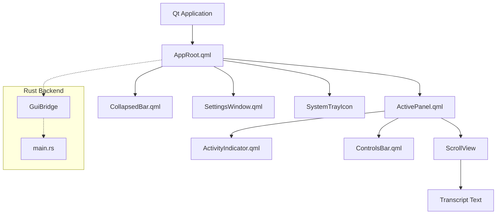
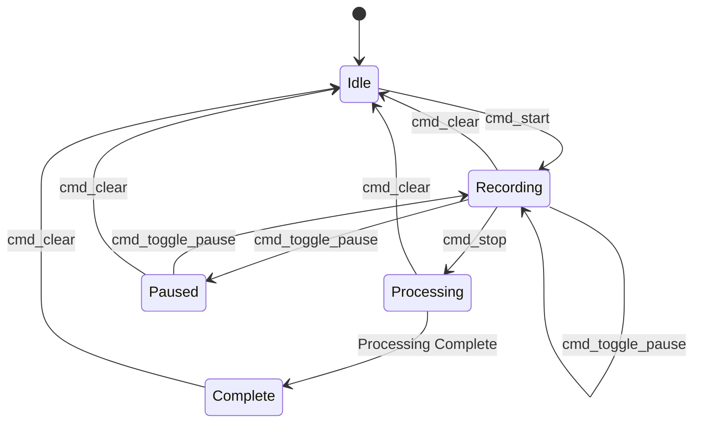
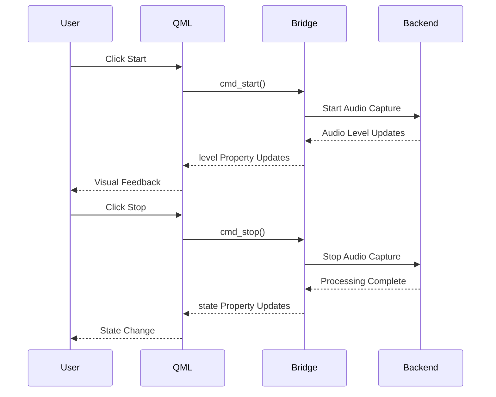
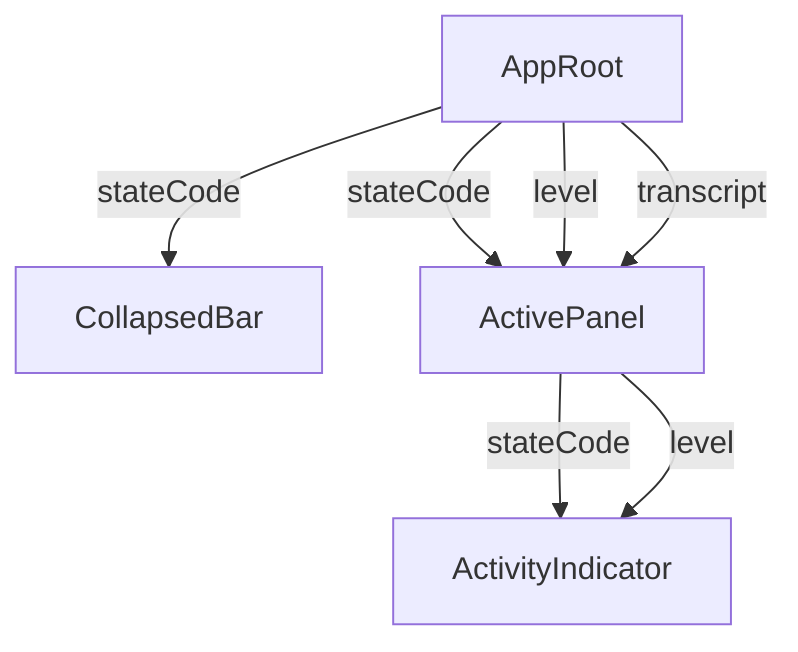
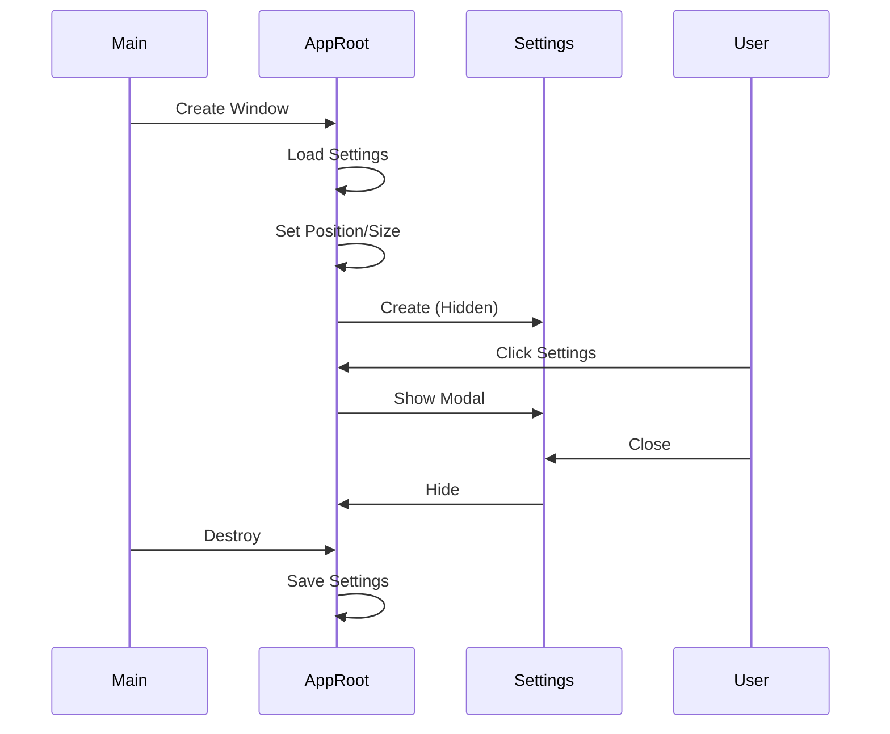
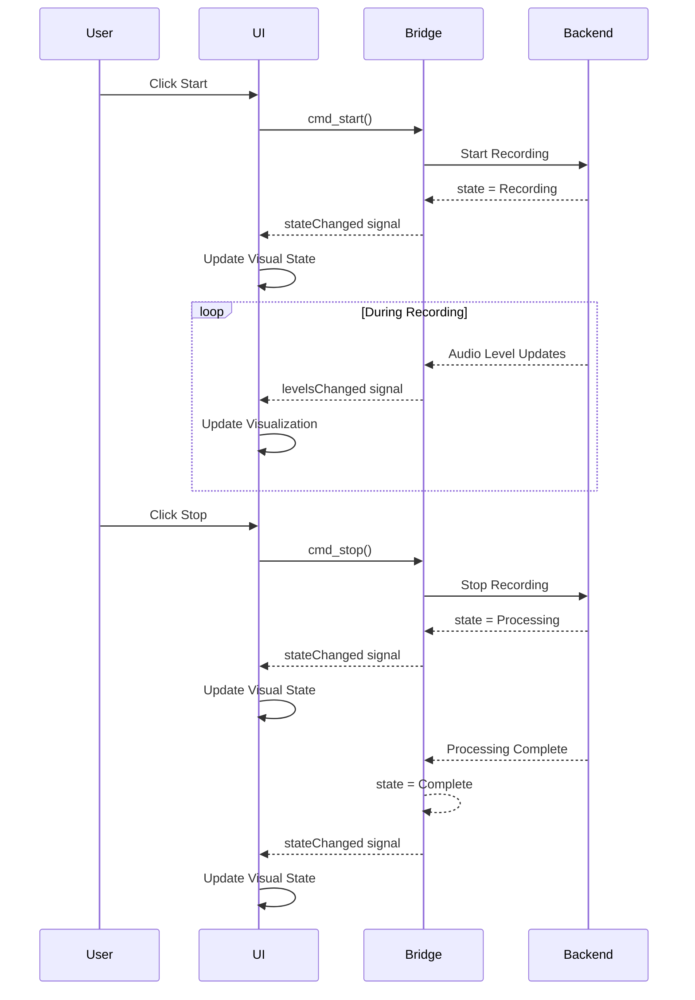

# ColdVox GUI Components Architecture

## Component Hierarchy

### Top-Level Architecture



### Detailed Component Breakdown

#### AppRoot.qml (Main Window)
Purpose: Top-level window management and system integration

Key Features:
- Always-on-top frameless window
- Position persistence
- Size management (collapsed/expanded states)
- System tray integration
- Settings persistence

Properties:
- `expanded`: Boolean for UI state
- `stateCode`: Integer for application state (0=Idle, 1=Recording, 2=Processing, 3=Complete)
- `level`: Integer for audio level (0-100)
- `transcript`: String for current transcript

Methods:
- `startDrag(mouse)`: Initiates window dragging
- `doDrag(mouse)`: Handles window dragging

Child Components:
- `CollapsedBar`: Visible when not expanded
- `ActivePanel`: Visible when expanded
- `SettingsWindow`: Modal settings dialog
- `SystemTrayIcon`: Background operation interface

#### CollapsedBar.qml (Minimal Interface)
Purpose: Minimal footprint interface for idle state

Key Features:
- Status LED with state-specific colors
- Microphone icon
- Settings gear icon with hover effects
- Click-to-expand functionality

Properties:
- `stateCode`: Integer for application state

Signals:
- `openSettings()`: Emitted when settings icon is clicked

Child Components:
- Status LED (Rectangle)
- Microphone icon (Text)
- Settings gear icon (Text with MouseArea)

#### ActivePanel.qml (Full Interface)
Purpose: Full-featured interface for active transcription

Key Features:
- Three-section layout (activity, transcript, controls)
- State-based content display
- Drag handling from activity area
- Signal propagation to bridge

Properties:
- `stateCode`: Integer for application state
- `level`: Integer for audio level
- `transcript`: String for current transcript

Signals:
- `stop()`: Stop recording
- `pauseResume()`: Toggle pause state
- `clear()`: Clear transcript
- `openSettings()`: Open settings dialog

Child Components:
- `ActivityIndicator`: Audio visualization
- `ScrollView`: Transcript display
- `ControlsBar`: User controls

#### ActivityIndicator.qml (Audio Visualization)
Purpose: Real-time audio level visualization with state indication

Key Features:
- 24-bar animated waveform
- Color-coded by state
- Sinusoidal animation for lively appearance
- Gradient background hinting state

Properties:
- `stateCode`: Integer for application state
- `level`: Integer for audio level (0-100)
- `phase`: Real for animation phase

Child Components:
- Background gradient (Rectangle)
- Bar row (Row with Repeater)
- Animation timer (Timer)

#### ControlsBar.qml (User Controls)
Purpose: User control buttons with hover effects

Key Features:
- Stop, Pause/Resume, Clear buttons
- Settings button
- Hover opacity transitions
- Proper spacing and alignment

Signals:
- `stop()`: Stop recording
- `pauseResume()`: Toggle pause state
- `clear()`: Clear transcript
- `openSettings()`: Open settings dialog

Child Components:
- Background (Rectangle)
- Button row (Row)
- Individual buttons (Button with MouseArea)

#### SettingsWindow.qml (Configuration)
Purpose: Modal dialog for user preferences and configuration

Key Features:
- Grouped settings categories
- Live transparency preview
- Placeholder inputs for future backend integration
- Modal behavior with stay-on-top

Properties:
- `opacityValue`: Real for window transparency

Child Components:
- Background (Rectangle)
- ScrollView with settings groups
- Individual setting controls (GroupBox, ComboBox, Slider, etc.)

## Data Flow Architecture

### Property Binding Flow

```mermaid
graph LR
	A[GuiBridge Rust] -->|Properties| B[AppRoot.qml]
	B -->|Property Binding| C[Child Components]
	C -->|Local Properties| D[Visual Elements]

	E[User Input] -->|Mouse Events| F[QML Components]
	F -->|Signal Emission| G[GuiBridge Invokables]
	G -->|Method Calls| H[Rust Backend Logic]
	H -->|Property Updates| A
```



### State Management Flow



### Event Flow



## Component Interaction Patterns

### Parent-Child Communication

#### Property Inheritance


#### Signal Propagation
```mermaid
graph TD
	A[ControlsBar] -->|stop()| B[ActivePanel]
	B -->|stop()| C[AppRoot]
	C -->|cmd_stop()| D[GuiBridge]
```

### Rust-QML Bridge Communication

#### Property Synchronization
```mermaid
graph LR
	A[Rust Backend] -->|#[qproperty]| B[GuiBridge]
	B -->|CXX-Qt Generated| C[QML Properties]
	C -->|Binding| D[Visual Elements]

	D -->|User Input| E[QML Events]
	E -->|Signal| F[QML Handlers]
	F -->|#[qinvokable]| G[GuiBridge Methods]
	G -->|Rust Logic| A
```

#### Signal Emission
```mermaid
graph LR
	A[Rust Backend] -->|State Change| B[GuiBridge]
	B -->|#[qsignal]| C[QML Signal]
	C -->|Connections| D[QML Handlers]
	D -->|Property Updates| E[Visual Elements]
```

## Component Lifecycle

### Window Management


### State Transitions


## Component Reusability and Extensibility

### Reusable Patterns
1. Property Binding: Components expose properties for external control
2. Signal Emission: Components emit signals for important events
3. State-Based Styling: Visual appearance changes based on state
4. Animation Integration: Smooth transitions for all state changes

### Extension Points
1. New Settings Categories: Add GroupBox to SettingsWindow.qml
2. New Visual Components: Add to ActivePanel.qml layout
3. New Backend Methods: Add to GuiBridge with #[qinvokable]
4. New Properties: Add to GuiBridge with #[qproperty]

### Customization Options
1. Styling: All components use centralized color scheme
2. Animation Timing: Configurable durations in Behavior properties
3. Layout: Responsive sizing with minimum/maximum constraints
4. Behavior: State machines can be extended with new states

## Performance Considerations

### Rendering Optimization
- Layer.enabled: Used for components with complex rendering
- Opacity Animations: Efficient GPU-accelerated transitions
- Property Binding: Minimized to essential connections
- Timer Frequency: Balanced between smoothness and performance

### Memory Management
- Component Reuse: Single instances of each component type
- Text Caching: Transcript text efficiently managed
- Animation Cleanup: Proper timer management
- Settings Persistence: Minimal data stored

### CPU Usage
- Animation Throttling: 30ms timer for audio visualization
- Event Debouncing: Rapid input events properly handled
- Property Update Batching: Multiple changes grouped where possible
- Idle Optimization: Reduced activity when not expanded
