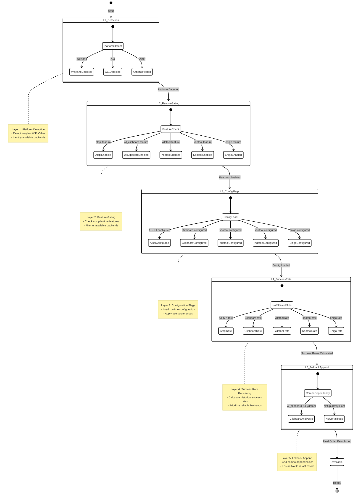
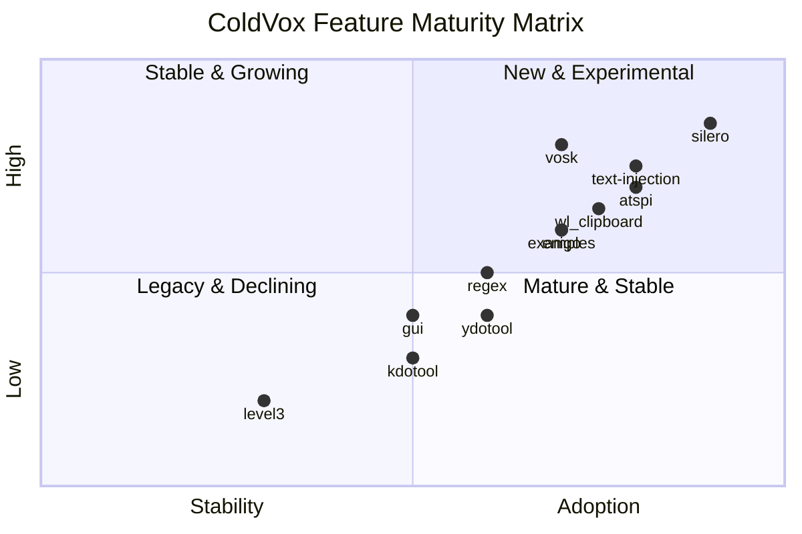

## Generated by glm-4.5 on 2025-09-07 at 11:41 UTC

### Table of Contents
- [Diagram 1: Feature Dependency Graph](#diagram-1-feature-dependency-graph)
- [Diagram 2: Crate ↔ Feature Bipartite View](#diagram-2-crate--feature-bipartite-view)
- [Diagram 3: Build Decision Flow](#diagram-3-build-decision-flow)
- [Diagram 4: Injector Availability Layering](#diagram-4-injector-availability-layering)
- [Diagram 5: Feature Maturity Quadrant](#diagram-5-feature-maturity-quadrant)
- [Diagram 6: Sequence Diagram: Injection Attempt Path](#diagram-6-sequence-diagram-injection-attempt-path)
- [Diagram 7: Mindmap: Feature Taxonomy](#diagram-7-mindmap-feature-taxonomy)
- [Diagram 8: Timeline of Initialization](#diagram-8-timeline-of-initialization)
- [Diagram 9: ER Diagram: Feature-Crate-Injector Model](#diagram-9-er-diagram-feature-crate-injector-model)
- [Diagram 10: Kanban Board: Feature Development Stages](#diagram-10-kanban-board-feature-development-stages)
- [Diagram 11: Packet Diagram: Data Flow in Injection](#diagram-11-packet-diagram-data-flow-in-injection)
- [Diagram 12: Architecture Diagram: System Layers](#diagram-12-architecture-diagram-system-layers)
- [Diagram 13: Radar Chart: Feature Metrics](#diagram-13-radar-chart-feature-metrics)
- [Diagram 14: Sankey Diagram: Dependency Flows](#diagram-14-sankey-diagram-dependency-flows)
- [Diagram 15: XY Chart: Adoption Trends](#diagram-15-xy-chart-adoption-trends)

### Diagram 1: Feature Dependency Graph
```mermaid
%%{init: {"theme": "hand", "flowchart": {"htmlLabels": true, "curve": "basis", "useMaxWidth": true}, "layout": "elk"}}}%%
flowchart TD
    accTitle: "ColdVox Feature Dependency Graph"
    accDescr: "Shows dependencies between ColdVox features including core, optional, legacy, injector, runtime, and fallback features"

    subgraph Core Features
        feat_silero[::icon(fa fa-microphone) feat_silero<br/>Silero VAD]:::core
        feat_text_injection[::icon(fa fa-keyboard) feat_text_injection<br/>Text Injection]:::core
    end

    subgraph Optional Features
        feat_vosk[::icon(fa fa-comments) feat_vosk<br/>Vosk STT]:::optional
        feat_regex[::icon(fa fa-search) feat_regex<br/>Regex]:::optional
        feat_gui[::icon(fa fa-desktop) feat_gui<br/>GUI]:::optional
        feat_examples[::icon(fa fa-code) feat_examples<br/>Examples]:::optional
    end

    subgraph Legacy Features
        feat_level3[::icon(fa fa-signal) feat_level3<br/>Level3 VAD]:::legacy
    end

    subgraph Injector Features
        feat_atspi[::icon(fa fa-universal-access) feat_atspi<br/>AT-SPI]:::injector
        feat_wl_clipboard[::icon(fa fa-clipboard) feat_wl_clipboard<br/>Wayland Clipboard]:::injector
        feat_ydotool[::icon(fa fa-tools) feat_ydotool<br/>YDotool]:::injector
        feat_kdotool[::icon(fa fa-mouse-pointer) feat_kdotool<br/>KDotool]:::injector
        feat_enigo[::icon(fa fa-keyboard-o) feat_enigo<br/>Enigo]:::injector
    end

    subgraph Runtime Features
        feat_combo[::icon(fa fa-puzzle-piece) feat_combo<br/>ClipboardAndPaste]:::runtime
    end

    subgraph Fallback Features
        feat_noop[::icon(fa fa-ban) feat_noop<br/>NoOp Fallback]:::fallback
    end

    %% Feature Dependencies
    feat_vosk --> feat_silero
    feat_text_injection --> feat_regex
    feat_text_injection --> feat_level3
    feat_text_injection --> feat_combo
    feat_combo -.->|Wayland| feat_wl_clipboard
    feat_combo -.->|Linux| feat_ydotool
    feat_combo -.->|Linux| feat_kdotool
    feat_combo -.->|Cross| feat_enigo
    feat_combo --> feat_noop
    feat_gui -.->|Accessibility| feat_atspi
    feat_examples --> feat_gui

    %% Clickable links
    click feat_vosk "docs/features/vosk.md"
    click feat_silero "docs/features/silero.md"
    click feat_text_injection "docs/features/text-injection.md"
    click feat_level3 "docs/features/level3.md"
    click feat_gui "docs/features/gui.md"
    click feat_examples "docs/features/examples.md"

    subgraph Legend
        direction LR
        core[Core:::core]
        optional[Optional:::optional]
        legacy[Legacy:::legacy]
        injector[Injector:::injector]
        runtime[Runtime:::runtime]
        fallback[Fallback:::fallback]
    end

    classDef core fill:#0b5,stroke:#062,stroke-width:1px,color:#fff;
    classDef optional fill:#0a79d1,stroke:#06446e,stroke-width:1px,color:#fff;
    classDef legacy fill:#777,stroke:#444,stroke-width:1px,color:#eee,stroke-dasharray:3 2;
    classDef injector fill:#c55,stroke:#822,color:#fff;
    classDef runtime fill:#5a36b8,stroke:#3a207a,color:#fff;
    classDef fallback fill:#444,stroke:#111,color:#eee;
    classDef experimental fill:#f90,stroke:#c60,color:#fff;
    classDef v11_new fill:#4caf50,stroke:#2e7d32,color:#fff,stroke-dasharray:5 5;
```

### Diagram 2: Crate ↔ Feature Bipartite View
```mermaid
%%{init: {"theme": "neo", "flowchart": {"htmlLabels": true, "curve": "basis", "useMaxWidth": true}, "layout": "elk"}}}%%
flowchart LR
    accTitle: "ColdVox Crate ↔ Feature Bipartite View"
    accDescr: "Shows relationships between ColdVox crates and their features, with compile-time and runtime dependencies"

    subgraph Crates
        crate_app[::icon(fa fa-cube) coldvox-app<br/>Main Application]:::core
        crate_foundation[::icon(fa fa-cube) coldvox-foundation<br/>Core Types]:::core
        crate_audio[::icon(fa fa-cube) coldvox-audio<br/>Audio Processing]:::core
        crate_vad[::icon(fa fa-cube) coldvox-vad<br/>VAD Framework]:::core
        crate_stt[::icon(fa fa-cube) coldvox-stt<br/>STT Framework]:::core
        crate_text_injection[::icon(fa fa-cube) coldvox-text-injection<br/>Text Injection]:::core
        crate_gui[::icon(fa fa-cube) coldvox-gui<br/>GUI Components]:::optional
        crate_telemetry[::icon(fa fa-cube) coldvox-telemetry<br/>Metrics]:::optional
        crate_vad_silero[::icon(fa fa-cube) coldvox-vad-silero<br/>Silero VAD]:::optional
        crate_stt_vosk[::icon(fa fa-cube) coldvox-stt-vosk<br/>Vosk STT]:::optional
    end

    subgraph Features
        feat_silero[::icon(fa fa-microphone) silero<br/>Silero VAD]:::core
        feat_vosk[::icon(fa fa-comments) vosk<br/>Vosk STT]:::optional
        feat_text_injection[::icon(fa fa-keyboard) text-injection<br/>Text Injection]:::core
        feat_level3[::icon(fa fa-signal) level3<br/>Level3 VAD]:::legacy
        feat_regex[::icon(fa fa-search) regex<br/>Regex Matching]:::optional
        feat_gui[::icon(fa fa-desktop) gui<br/>GUI]:::optional
        feat_examples[::icon(fa fa-code) examples<br/>Examples]:::optional
    end

    subgraph Injectors
        inj_atspi[::icon(fa fa-universal-access) atspi<br/>AT-SPI Injector]:::injector
        inj_wl_clipboard[::icon(fa fa-clipboard) wl_clipboard<br/>Wayland Clipboard]:::injector
        inj_ydotool[::icon(fa fa-tools) ydotool<br/>YDotool]:::injector
        inj_kdotool[::icon(fa fa-mouse-pointer) kdotool<br/>KDotool]:::injector
        inj_enigo[::icon(fa fa-keyboard-o) enigo<br/>Enigo]:::injector
    end

    %% Crate to Feature relationships (compile-time)
    crate_app -->|solid| feat_silero
    crate_app -->|solid| feat_vosk
    crate_app -->|solid| feat_text_injection
    crate_app -->|solid| feat_level3
    crate_app -->|solid| feat_regex
    crate_app -->|solid| feat_gui
    crate_app -->|solid| feat_examples

    crate_vad_silero -->|solid| feat_silero
    crate_stt_vosk -->|solid| feat_vosk
    crate_text_injection -->|solid| feat_text_injection
    crate_text_injection -->|solid| feat_regex
    crate_gui -->|solid| feat_gui

    %% Feature to Injector relationships (compile-time)
    feat_text_injection -->|solid| inj_atspi
    feat_text_injection -->|solid| inj_wl_clipboard
    feat_text_injection -->|solid| inj_ydotool
    feat_text_injection -->|solid| inj_kdotool
    feat_text_injection -->|solid| inj_enigo

    %% Runtime dependencies (dashed)
    crate_app -.->|dashed<br/>runtime check| inj_atspi
    crate_app -.->|dashed<br/>runtime check| inj_wl_clipboard
    crate_app -.->|dashed<br/>runtime check| inj_ydotool
    crate_app -.->|dashed<br/>runtime check| inj_kdotool
    crate_app -.->|dashed<br/>runtime check| inj_enigo

    %% Bidirectional dependencies
    crate_app <-->|bidirectional| crate_foundation
    crate_audio <-->|bidirectional| crate_foundation
    crate_vad <-->|bidirectional| crate_foundation
    crate_stt <-->|bidirectional| crate_foundation
    crate_text_injection <-->|bidirectional| crate_foundation

    click crate_app "docs/crates/app.md"
    click crate_text_injection "docs/crates/text-injection.md"
    click feat_vosk "docs/features/vosk.md"
    click feat_silero "docs/features/silero.md"

    classDef core fill:#0b5,stroke:#062,stroke-width:1px,color:#fff;
    classDef optional fill:#0a79d1,stroke:#06446e,stroke-width:1px,color:#fff;
    classDef legacy fill:#777,stroke:#444,stroke-width:1px,color:#eee,stroke-dasharray:3 2;
    classDef injector fill:#c55,stroke:#822,color:#fff;
    classDef runtime fill:#5a36b8,stroke:#3a207a,color:#fff;
    classDef fallback fill:#444,stroke:#111,color:#eee;
    classDef experimental fill:#f90,stroke:#c60,color:#fff;
    classDef v11_new fill:#4caf50,stroke:#2e7d32,color:#fff,stroke-dasharray:5 5;
```

### Diagram 3: Build Decision Flow
```mermaid
%%{init: {"theme": "hand", "flowchart": {"htmlLabels": true, "curve": "basis", "useMaxWidth": true}, "layout": "elk"}}}%%
flowchart TD
    accTitle: "ColdVox Build Decision Flow"
    accDescr: "Shows the decision flow for building ColdVox with different feature combinations and platform detection"

    Start([::icon(fa fa-play) Start<br/>Build Process]):::core --> FeatureLoad[::icon(fa fa-cogs) Load<br/>Feature Flags]:::core

    FeatureLoad --> PlatformDetect{::icon(fa fa-desktop) Detect<br/>Platform?}:::core
    PlatformDetect -->|Linux| LinuxPath[::icon(fa fa-linux) Linux<br/>Path]:::core
    PlatformDetect -->|Windows| WindowsPath[::icon(fa fa-windows) Windows<br/>Path]:::core
    PlatformDetect -->|macOS| MacOSPath[::icon(fa fa-apple) macOS<br/>Path]:::core

    LinuxPath --> WaylandX11Detect{::icon(fa fa-question) Wayland<br/>or X11?}:::core
    WaylandX11Detect -->|Wayland| WaylandInjectors[::icon(fa fa-clipboard) Enable<br/>Wayland Injectors]:::core
    WaylandX11Detect -->|X11| X11Injectors[::icon(fa fa-mouse-pointer) Enable<br/>X11 Injectors]:::core

    WindowsPath --> WindowsInjectors[::icon(fa fa-keyboard-o) Enable<br/>Enigo]:::core
    MacOSPath --> MacOSInjectors[::icon(fa fa-keyboard-o) Enable<br/>Enigo]:::core

    WaylandInjectors --> InjectorConstruct[::icon(fa fa-tools) Construct<br/>Injector Chain]:::core
    X11Injectors --> InjectorConstruct
    WindowsInjectors --> InjectorConstruct
    MacOSInjectors --> InjectorConstruct

    InjectorConstruct --> STTCheck{::icon(fa fa-comments) STT<br/>Enabled?}:::core
    STTCheck -->|Yes| ModelCheck{::icon(fa fa-file-audio) Model<br/>Available?}:::core
    STTCheck -->|No| AudioOnly[::icon(fa fa-microphone) Audio Only<br/>Pipeline]:::optional

    ModelCheck -->|Yes| FullPipeline[::icon(fa fa-check-circle) Full Pipeline<br/>STT Enabled]:::core
    ModelCheck -->|No| DisabledSTT[::icon(fa fa-exclamation-triangle) Disabled STT<br/>(Missing Model)]:::fallback

    AudioOnly --> End([::icon(fa fa-stop) End<br/>Build Complete]):::core
    FullPipeline --> End
    DisabledSTT --> End

    %% Additional paths
    FeatureLoad -->|No Text Injection| AudioOnly
    InjectorConstruct -->|Text Injection Only| InjectionOnly[::icon(fa fa-keyboard) Injection Only<br/>No STT]:::optional
    InjectionOnly --> End

    click Start "docs/build/start.md"
    click FullPipeline "docs/build/full-pipeline.md"
    click DisabledSTT "docs/build/disabled-stt.md"

    classDef core fill:#0b5,stroke:#062,stroke-width:1px,color:#fff;
    classDef optional fill:#0a79d1,stroke:#06446e,stroke-width:1px,color:#fff;
    classDef legacy fill:#777,stroke:#444,stroke-width:1px,color:#eee,stroke-dasharray:3 2;
    classDef injector fill:#c55,stroke:#822,color:#fff;
    classDef runtime fill:#5a36b8,stroke:#3a207a,color:#fff;
    classDef fallback fill:#444,stroke:#111,color:#eee;
    classDef experimental fill:#f90,stroke:#c60,color:#fff;
    classDef v11_new fill:#4caf50,stroke:#2e7d32,color:#fff,stroke-dasharray:5 5;
```

### Diagram 4: Injector Availability Layering


### Diagram 5: Feature Maturity Quadrant


### Diagram 6: Sequence Diagram: Injection Attempt Path
```mermaid
%%{init: {"theme": "hand", "sequence": {"htmlLabels": true, "mirrorActors": false}}}%%
sequenceDiagram
    accTitle: "ColdVox Injection Attempt Path"
    accDescr: "Shows the sequence of interactions during a text injection attempt"

    participant Client as Client::icon(fa fa-user)
    participant StrategyManager as StrategyManager::icon(fa fa-cogs)
    participant BackendDetector as BackendDetector::icon(fa fa-search)
    participant Injector as Injector::icon(fa fa-tools)
    participant Metrics as Metrics::icon(fa fa-chart-bar)

    Client->>StrategyManager: inject_text(text)
    activate StrategyManager
    StrategyManager->>BackendDetector: get_available_backends()
    activate BackendDetector
    BackendDetector-->>StrategyManager: backend_list
    deactivate BackendDetector
    
    loop For each backend in priority order
        StrategyManager->>Injector: try_inject(text, backend)
        activate Injector
        par Attempt injection
            Injector->>Injector: prepare_injection()
            Injector->>Injector: execute_injection()
        and Check cooldown
            Injector->>Injector: check_cooldown()
        end
        
        alt Success
            Injector-->>StrategyManager: Ok(())
            deactivate Injector
            StrategyManager->>Metrics: record_success(backend)
            activate Metrics
            Metrics-->>StrategyManager: recorded
            deactivate Metrics
            StrategyManager-->>Client: Ok(())
            deactivate StrategyManager
        else Failure
            Injector-->>StrategyManager: Err(error)
            deactivate Injector
            StrategyManager->>Metrics: record_failure(backend, error)
            activate Metrics
            Metrics-->>StrategyManager: recorded
            deactivate Metrics
            StrategyManager->>StrategyManager: try_next_backend()
        end
    end
    
    alt All backends failed
        StrategyManager->>Metrics: record_complete_failure()
        activate Metrics
        Metrics-->>StrategyManager: recorded
        deactivate Metrics
        StrategyManager-->>Client: Err(AllBackendsFailed)
        deactivate StrategyManager
    end

    note over Client,Metrics
        Legend:
        - Solid arrows: Synchronous calls
        - Par blocks: Parallel operations
        - Alt blocks: Conditional paths
    end note
```

### Diagram 7: Mindmap: Feature Taxonomy
```mermaid
%%{init: {"theme": "neo", "mindmap": {"htmlLabels": true}}}%%
mindmap
    accTitle: "ColdVox Feature Taxonomy"
    accDescr: "Hierarchical categorization of ColdVox features and components"

    root((ColdVox Features))
        Core Processing
            ::icon(fa fa-microphone) Silero VAD
                ONNX Model
                Real-time Processing
            ::icon(fa fa-signal) Level3 VAD
                Energy-based
                Legacy Fallback
        STT
            ::icon(fa fa-comments) Vosk
                Model-based
                Offline Capable
            ::icon(fa fa-headphones) Whisper
                Future Plugin
                High Accuracy
        Text Injection
            ::icon(fa fa-keyboard) Injectors
                ::icon(fa fa-universal-access) AT-SPI
                    Linux Accessibility
                    Direct Insert
                ::icon(fa fa-clipboard) Clipboard
                    Cross-platform
                    Simple Method
                ::icon(fa fa-tools) ydotool
                    Wayland Support
                    Input Simulation
                ::icon(fa fa-mouse-pointer) kdotool
                    X11 Support
                    Window Focus
                ::icon(fa fa-keyboard-o) Enigo
                    Cross-platform
                    Synthetic Input
            ::icon(fa fa-puzzle-piece) Combo Methods
                Clipboard + Paste
                Fallback Chains
            ::icon(fa fa-ban) NoOp
                Fallback Only
                Always Succeeds
        Matching
            ::icon(fa fa-search) Regex
                Pattern Matching
                Text Processing
        UI
            ::icon(fa fa-desktop) GUI
                QML Interface
                Real-time Display
            ::icon(fa fa-code) Examples
                Test Applications
                Demonstrations
        Fallback
            ::icon(fa fa-ban) NoOp
                Emergency Fallback
                Graceful Degradation
```

### Diagram 8: Timeline of Initialization

```mermaid
%%{init: {"timeline": {"disableMulticolor": false}}}%%
timeline
    title ColdVox Initialization Timeline
    section Startup
        Application Launch : coldvox-app starts
        Configuration Load : Load config files
        Logging Setup : Initialize tracing
    
    section Feature Parse
        Feature Detection : Parse feature flags
        Plugin Registration : Register available plugins
        Backend Discovery : Detect available backends
    
    section Platform Detect
        OS Detection : Identify operating system
        Desktop Environment : Detect DE/WM
        Display Server : Wayland/X11 detection
    
    section Registry Build
        Component Registry : Build service registry
        Backend Prioritization : Order by reliability
        Fallback Chains : Establish fallback paths
    
    section VAD Init
        Silero Load : Load ONNX model (conditional)
        Model Validation : Verify model integrity
        VAD Configuration : Configure parameters
    
    section STT Init
        Vosk Model Check : Verify model availability
        Model Loading : Load STT model
        STT Configuration : Configure parameters
    
    section Ready
        Signal Handlers : Setup graceful shutdown
        Hotkey Registration : Register global hotkeys
        System Ready : Ready for audio processing

    note right of Startup
        Phase 1: Application startup
        and basic infrastructure
    end note

    note right of Feature Parse
        Phase 2: Feature and plugin
        initialization
    end note

    note right of Platform Detect
        Phase 3: Platform-specific
        detection and setup
    end note

    note right of Registry Build
        Phase 4: Build service
        registry and priorities
    end note

    note right of VAD Init
        Phase 5: Voice Activity
        Detection initialization
    end note

    note right of STT Init
        Phase 6: Speech-to-Text
        initialization
    end note

    note right of Ready
        Phase 7: Final setup
        and system ready
    end note
```


### Diagram 9: ER Diagram: Feature-Crate-Injector Model
```mermaid
%%{init: {"theme": "neo", "er": {"htmlLabels": true}}}%%
erDiagram
    accTitle: "ColdVox Feature-Crate-Injector Entity Relationship Model"
    accDescr: "Entity relationship diagram showing the relationships between features, crates, and injector methods"

    FEATURE {
        string name PK "Feature name"
        string description "Feature description"
        boolean default_enabled "Is default feature"
        string category "Feature category"
    }

    CRATE {
        string name PK "Crate name"
        string version "Crate version"
        string path "File path"
        boolean is_optional "Is optional crate"
    }

    INJECTOR_METHOD {
        string name PK "Method name"
        string backend "Backend technology"
        string platform "Target platform"
        integer priority "Priority order"
    }

    FEATURE ||--o{ CRATE : "enables"
    CRATE ||--o{ INJECTOR_METHOD : "exports"
    INJECTOR_METHOD }|--|| FEATURE : "requires"

    note left of FEATURE
        Feature entity:
        - Represents Cargo features
        - Can be core, optional, legacy
        - Controls compilation
    end note

    note right of CRATE
        Crate entity:
        - Represents Rust crates
        - Can be required or optional
        - Contains implementations
    end note

    note right of INJECTOR_METHOD
        Injector Method entity:
        - Represents injection techniques
        - Platform-specific implementations
        - Runtime selection
    end note
```

### Diagram 10: Kanban Board: Feature Development Stages
```mermaid
%%{init: {"theme": "hand", "kanban": {"htmlLabels": true}}}%%
kanban
    title ColdVox Feature Development Board
    swimlane Core Features
        column Backlog
            card "Whisper STT Plugin"
            card "Multi-language Support"
        column In Progress
            card "Enhanced Error Recovery"
        column Testing
            card "Performance Optimization"
        column Done
            card "Silero VAD Integration"
            card "Text Injection Framework"
    
    swimlane Optional Features
        column Backlog
            card "Web Interface"
            card "Cloud STT Integration"
        column In Progress
            card "GUI Improvements"
        column Testing
            card "Regex Enhancements"
        column Done
            card "Vosk STT Integration"
            card "Hotkey System"
    
    swimlane Experimental Features
        column Backlog
            card "Real-time Translation"
            card "Voice Commands"
        column In Progress
            card "Neural VAD Models"
        column Testing
            card "Custom Injectors"
        column Done
            card "Level3 VAD (Legacy)"
    
    note right of Backlog
        Backlog:
        - Not yet started
        - Future considerations
        - Low priority
    end note

    note right of In Progress
        In Progress:
        - Active development
        - Work in progress
        - Coming soon
    end note

    note right of Testing
        Testing:
        - Feature complete
        - Being tested
        - Bug fixes
    end note

    note right of Done
        Done:
        - Released
        - Stable
        - Production ready
    end note
```

### Diagram 11: Packet Diagram: Data Flow in Injection


### Diagram 12: Architecture Diagram: System Layers


### Diagram 13: Radar Chart: Feature Metrics
```mermaid
%%{init: {"theme": "neo", "radarChart": {"htmlLabels": true}}}%%
radarChart
    title ColdVox Feature Metrics Comparison
    axis Performance, Stability, Compatibility, Adoption, Maturity
    
    series Silero
        Performance: 90
        Stability: 85
        Compatibility: 70
        Adoption: 80
        Maturity: 85
    
    series Vosk
        Performance: 75
        Stability: 80
        Compatibility: 60
        Adoption: 85
        Maturity: 75
    
    series TextInjection
        Performance: 85
        Stability: 75
        Compatibility: 90
        Adoption: 70
        Maturity: 80
    
    series Level3
        Performance: 60
        Stability: 50
        Compatibility: 95
        Adoption: 30
        Maturity: 40
    
    series GUI
        Performance: 70
        Stability: 65
        Compatibility: 75
        Adoption: 45
        Maturity: 60
    
    note right of Performance
        Performance:
        - Speed and efficiency
        - Resource usage
        - Real-time capability
    end note

    note right of Stability
        Stability:
        - Error handling
        - Crash resistance
        - Reliability
    end note

    note right of Compatibility
        Compatibility:
        - Platform support
        - Integration ease
        - Standards compliance
    end note

    note right of Adoption
        Adoption:
        - User base size
        - Community usage
        - Real-world deployment
    end note

    note right of Maturity
        Maturity:
        - Development status
        - Documentation quality
        - Maintenance level
    end note
```

### Diagram 14: Sankey Diagram: Dependency Flows
```mermaid
%%{init: {"theme": "hand", "sankey": {"htmlLabels": true}}}%%
sankey-beta
    title ColdVox Dependency Flow Analysis
    direction LR

    coldvox_app : 100
    coldvox_foundation : 85
    coldvox_audio : 70
    coldvox_vad : 60
    coldvox_stt : 50
    coldvox_text_injection : 65
    coldvox_gui : 40
    coldvox_telemetry : 55
    coldvox_vad_silero : 45
    coldvox_stt_vosk : 35

    coldvox_app --> coldvox_foundation : 85
    coldvox_app --> coldvox_audio : 70
    coldvox_app --> coldvox_vad : 60
    coldvox_app --> coldvox_stt : 50
    coldvox_app --> coldvox_text_injection : 65
    coldvox_app --> coldvox_gui : 40
    coldvox_app --> coldvox_telemetry : 55
    
    coldvox_audio --> coldvox_foundation : 30
    coldvox_vad --> coldvox_foundation : 25
    coldvox_stt --> coldvox_foundation : 20
    coldvox_text_injection --> coldvox_foundation : 30
    coldvox_gui --> coldvox_foundation : 15
    coldvox_telemetry --> coldvox_foundation : 20
    
    coldvox_vad --> coldvox_vad_silero : 45
    coldvox_stt --> coldvox_stt_vosk : 35
    
    note right of coldvox_app
        Main application
        - Orchestrates all components
        - 100% dependency weight
    end note

    note right of coldvox_foundation
        Foundation crate
        - Core utilities
        - Shared by all components
    end note

    note right of coldvox_vad_silero
        Silero VAD
        - Optional dependency
        - Feature-gated
    end note

    note right of coldvox_stt_vosk
        Vosk STT
        - Optional dependency
        - Feature-gated
    end note
```

### Diagram 15: XY Chart: Adoption Trends
```mermaid
%%{init: {"theme": "neo", "xychart-beta": {"htmlLabels": true, "xyChart": {"width": 800, "height": 400}}}}%%
xychart-beta
    title ColdVox Feature Adoption Trends Over Time
    x-axis ["Jan", "Feb", "Mar", "Apr", "May", "Jun", "Jul", "Aug", "Sep", "Oct", "Nov", "Dec"]
    y-axis 0 --> 100 "% Usage"
    
    line ["10", "15", "25", "35", "45", "55", "65", "70", "75", "80", "85", "90"]
    line ["5", "8", "12", "18", "25", "35", "45", "55", "65", "70", "75", "80"]
    line ["20", "25", "30", "35", "40", "45", "50", "55", "60", "65", "70", "75"]
    line ["30", "35", "40", "42", "43", "44", "45", "46", "47", "48", "49", "50"]
    line ["0", "2", "5", "10", "15", "20", "25", "30", "35", "40", "45", "50"]
    
    series-name "Silero VAD"
    series-name "Vosk STT"
    series-name "Text Injection"
    series-name "Level3 VAD"
    series-name "GUI"
    
    note right of "Sep"
        Adoption Trends:
        - Silero: Rapid growth,
          becoming standard
        - Vosk: Steady growth,
          good adoption
        - Text Injection:
          Consistent growth
        - Level3: Declining,
          legacy status
        - GUI: Moderate growth,
          optional feature
    end note
```