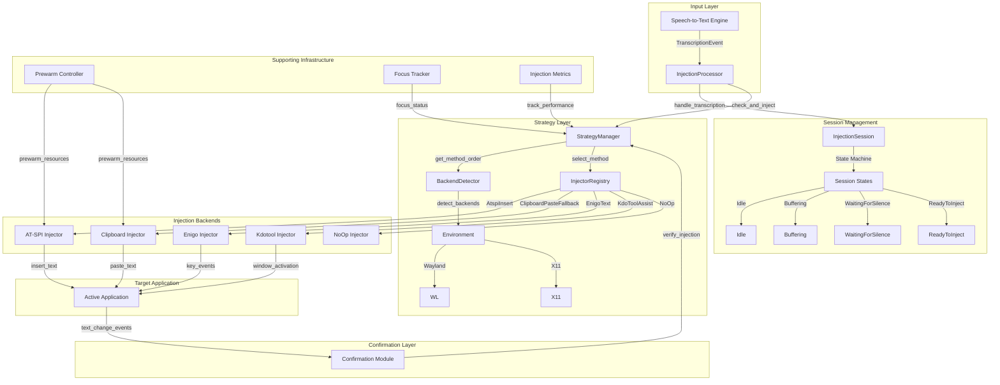
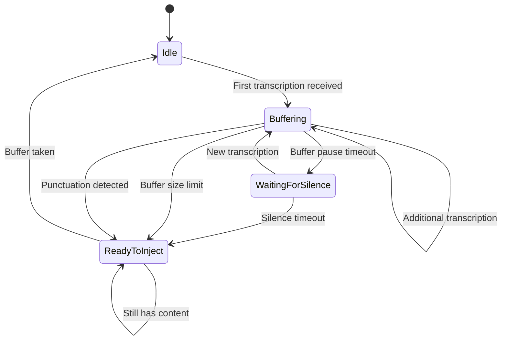
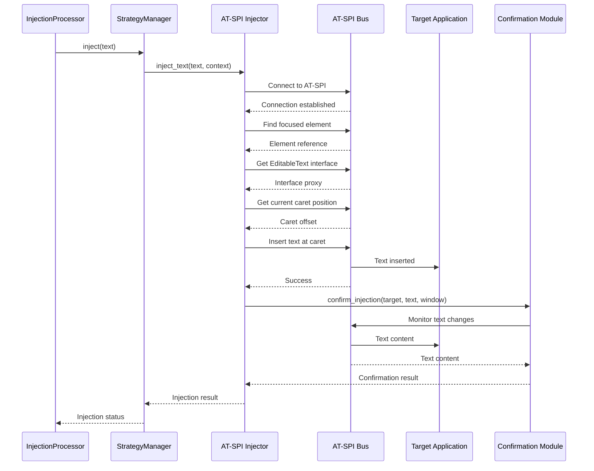
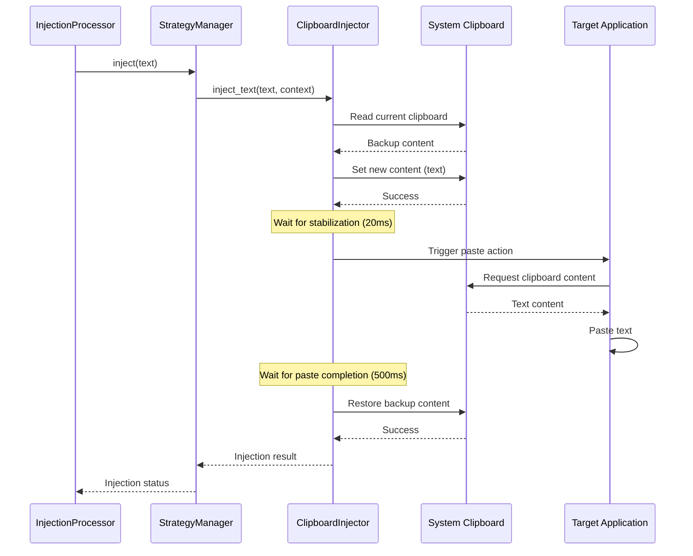
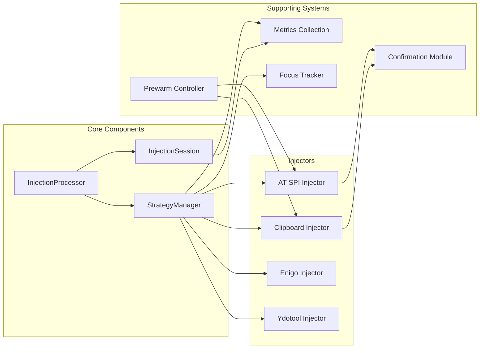
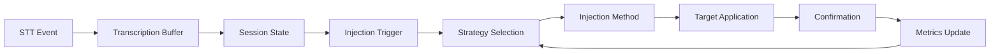

# Conceptual Diagram of ColdVox Text Injection System

## High-Level Architecture

## Session State Machine

## Injection Strategy Selection Flow

```mermaid
flowchart TD
    START[Injection Request] --> DETECT[Detect Environment]
    DETECT --> WAYLAND{Wayland?}
    DETECT --> X11{X11?}
    
    WAYLAND -->|Yes| ATSPI_PRI[AT-SPI Priority: High]
    X11 -->|Yes| ATSPI_PRI
    
    ATSPI_PRI --> SUCCESS{Success Rate > 30%?}
    SUCCESS -->|Yes| TRY_ATSPI[Try AT-SPI First]
    SUCCESS -->|No| CHECK_COOLDOWN{Method in Cooldown?}
    
    CHECK_COOLDOWN -->|No| TRY_ATSPI
    CHECK_COOLDOWN -->|Yes| NEXT_METHOD[Try Next Method]
    
    TRY_ATSPI --> ATSPI_SUCCESS{AT-SPI Success?}
    ATSPI_SUCCESS -->|Yes| INJECT_DONE[Injection Complete]
    ATSPI_SUCCESS -->|No| UPDATE_FAILURE[Update Failure Rate]
    UPDATE_FAILURE --> APPLY_COOLDOWN[Apply Cooldown]
    APPLY_COOLDOWN --> NEXT_METHOD
    
    NEXT_METHOD --> KD_CHECK{Kdotool Enabled?}
    KD_CHECK -->|Yes| TRY_KD[Try Kdotool]
    KD_CHECK -->|No| EN_CHECK{Enigo Enabled?}
    
    EN_CHECK -->|Yes| TRY_EN[Try Enigo]
    EN_CHECK -->|No| TRY_CLIPBOARD[Try Clipboard]
    
    TRY_KD --> KD_SUCCESS{Kdotool Success?}
    KD_SUCCESS -->|Yes| INJECT_DONE
    KD_SUCCESS -->|No| EN_CHECK
    
    TRY_EN --> EN_SUCCESS{Enigo Success?}
    EN_SUCCESS -->|Yes| INJECT_DONE
    EN_SUCCESS -->|No| TRY_CLIPBOARD
    
    TRY_CLIPBOARD --> CB_SUCCESS{Clipboard Success?}
    CB_SUCCESS -->|Yes| INJECT_DONE
    CB_SUCCESS -->|No| TRY_NOOP[Try NoOp]
    
    TRY_NOOP --> ALL_FAILED[All Methods Failed]
```

## AT-SPI Injection Flow

## Clipboard Injection Flow

## Key Components Interactions

## Data Flow

This conceptual diagram illustrates the high-level architecture of the ColdVox text injection system, showing how different components interact to reliably inject transcribed text into active applications across various Linux desktop environments.