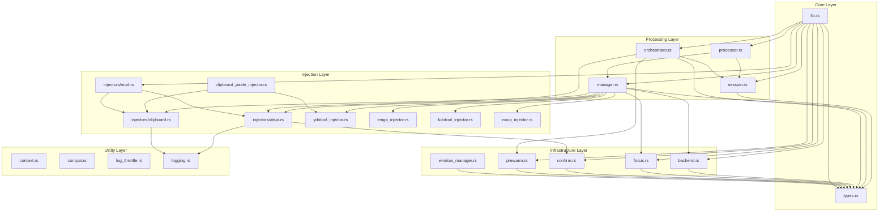

# File-by-File Diagram of ColdVox Text Injection System

## Core Library Files

### lib.rs
**Purpose**: Main library interface and public API
**Key Components**:
- `TextInjector` trait - Core interface for all injectors
- Re-exports of key types and components
- Feature-gated module declarations

**Dependencies**: All other modules (re-exports)
**Role in System**: Entry point for consumers of the text injection library

### types.rs
**Purpose**: Core types, enums, and configurations for the injection system
**Key Components**:
- `InjectionConfig` - Comprehensive configuration options
- `InjectionContext` - Context data for injection operations
- `InjectionMethod` enum - All available injection methods
- `InjectionMode` enum - Paste vs keystroke mode selection
- `InjectionError` enum - All possible error types
- `InjectionMetrics` - Performance and reliability metrics

**Dependencies**: None (base types)
**Role in System**: Provides the type foundation for the entire system

### processor.rs
**Purpose**: Main processor that handles transcription events and coordinates injection
**Key Components**:
- `InjectionProcessor` - Main processor struct
- `AsyncInjectionProcessor` - Async wrapper with dedicated task
- `ProcessorMetrics` - Processor-specific metrics

**Key Functions**:
- `handle_transcription()` - Process incoming STT events
- `check_and_inject()` - Periodic injection trigger
- `perform_injection()` - Execute actual injection
- `force_inject()` - Manual injection trigger

**Dependencies**: session.rs, manager.rs, types.rs
**Role in System**: Central coordinator between STT input and injection output

### session.rs
**Purpose**: State machine for managing transcription buffering and injection timing
**Key Components**:
- `InjectionSession` - Session management struct
- `SessionState` enum - State machine states
- `SessionConfig` - Session-specific configuration

**Key Functions**:
- `add_transcription()` - Add transcription to buffer
- `should_inject()` - Determine if injection should occur
- `take_buffer()` - Extract buffered text for injection
- `check_for_silence_transition()` - Check for speech pause

**Dependencies**: types.rs
**Role in System**: Manages the timing and buffering of transcriptions

### manager.rs
**Purpose**: Strategy manager that selects and executes injection methods with fallbacks
**Key Components**:
- `StrategyManager` - Main strategy selection logic
- `InjectorRegistry` - Registry of available injectors
- `SuccessRecord` - Historical success tracking
- `CooldownState` - Method cooldown management

**Key Functions**:
- `inject()` - Main injection method with fallbacks
- `get_method_order_cached()` - Get prioritized method list
- `update_success_record()` - Track method success/failure
- `apply_cooldown()` - Apply exponential backoff

**Dependencies**: backend.rs, focus.rs, all injector modules, types.rs
**Role in System**: "Brain" of the system that orchestrates injection strategies

### orchestrator.rs
**Purpose**: Environment detection and high-level strategy coordination
**Key Components**:
- `StrategyOrchestrator` - Environment-aware orchestration
- `AtspiContext` - AT-SPI pre-warmed context data
- `DesktopEnvironment` enum - Detected environment types

**Key Functions**:
- `detect_environment()` - Detect current desktop environment
- `get_strategy_order()` - Get environment-specific strategy order
- `fast_fail_inject()` - Fast-fail injection with strict budgets

**Dependencies**: types.rs, prewarm.rs, session.rs, atspi_injector.rs
**Role in System**: High-level coordination based on environment detection

## Injection Backend Files

### injectors/mod.rs
**Purpose**: Module organization for injectors
**Key Components**:
- Module declarations for atspi and clipboard injectors
- Re-exports of common types

**Dependencies**: atspi.rs, clipboard.rs
**Role in System**: Organized access to injector implementations

### injectors/atspi.rs
**Purpose**: AT-SPI accessibility API-based injector
**Key Components**:
- `AtspiInjector` - Main AT-SPI injector implementation

**Key Functions**:
- `insert_text()` - Direct text insertion via AT-SPI
- `paste_text()` - AT-SPI-based paste operations
- `inject()` - Main injection method with mode selection
- `set_clipboard_content()` - Set clipboard for paste operations

**Dependencies**: types.rs, confirm.rs, logging.rs
**Role in System**: Primary injection method using accessibility APIs

### injectors/clipboard.rs
**Purpose**: Clipboard-based injector with seed/restore functionality
**Key Components**:
- `ClipboardInjector` - Clipboard-based injector
- `ClipboardBackup` - Clipboard backup data structure
- `ClipboardBackend` enum - Detected clipboard backend

**Key Functions**:
- `read_clipboard()` - Read current clipboard for backup
- `write_clipboard()` - Write content to clipboard
- `restore_clipboard()` - Restore original clipboard
- `perform_paste()` - Execute paste action

**Dependencies**: types.rs, logging.rs
**Role in System**: Fallback injection method using clipboard operations

### clipboard_paste_injector.rs
**Purpose**: Simplified clipboard injector that always performs paste
**Key Components**:
- `ClipboardPasteInjector` - Simplified clipboard injector

**Key Functions**:
- `inject_text()` - Set clipboard and require paste success
- `try_paste_action()` - Try AT-SPI then ydotool paste

**Dependencies**: injectors/clipboard.rs, types.rs, ydotool_injector.rs
**Role in System**: Simplified clipboard injection with paste verification

### ydotool_injector.rs
**Purpose**: Ydotool uinput automation injector
**Key Components**:
- `YdotoolInjector` - Ydotool-based injector

**Key Functions**:
- `trigger_paste()` - Trigger paste via Ctrl+V
- `check_binary_permissions()` - Verify ydotool access
- `check_uinput_access()` - Verify /dev/uinput access

**Dependencies**: types.rs
**Role in System**: Input automation fallback for paste actions

### enigo_injector.rs
**Purpose**: Cross-platform input simulation injector (optional)
**Key Components**:
- `EnigoInjector` - Enigo-based injector

**Key Functions**:
- `inject_text()` - Simulate keystrokes via Enigo

**Dependencies**: types.rs
**Role in System**: Optional cross-platform input simulation

### kdotool_injector.rs
**Purpose**: KDE/X11 window activation assistance (optional)
**Key Components**:
- `KdotoolInjector` - Kdotool-based injector

**Key Functions**:
- `activate_window()` - Activate target window
- `inject_text()` - Window activation + injection

**Dependencies**: types.rs
**Role in System**: Optional window activation assistance

### noop_injector.rs
**Purpose**: No-op fallback injector for testing
**Key Components**:
- `NoOpInjector` - No-op injector implementation

**Key Functions**:
- `inject_text()` - Always succeeds without injection

**Dependencies**: types.rs
**Role in System**: Last resort fallback that always succeeds

## Supporting Infrastructure Files

### backend.rs
**Purpose**: Backend capability detection for different environments
**Key Components**:
- `BackendDetector` - Backend detection logic
- `Backend` enum - Available backend types

**Key Functions**:
- `detect_available_backends()` - Detect system capabilities
- `get_preferred_backend()` - Get most preferred backend
- `has_ydotool()` - Check ydotool availability

**Dependencies**: types.rs
**Role in System**: Determines available injection methods based on environment

### focus.rs
**Purpose**: Focus detection and management for target applications
**Key Components**:
- `FocusTracker` - Main focus tracking logic
- `FocusProvider` trait - Interface for focus providers
- `FocusBackend` trait - Interface for focus backends
- `FocusStatus` enum - Current focus state

**Key Functions**:
- `get_focus_status()` - Get current focus status
- `query_focus()` - Query focus from backend

**Dependencies**: types.rs
**Role in System**: Determines target application and focus state

### confirm.rs
**Purpose**: AT-SPI event-based confirmation of successful injection
**Key Components**:
- `TextChangeListener` - AT-SPI event listener
- `ConfirmationContext` - Confirmation operation context
- `ConfirmationResult` enum - Confirmation outcome types

**Key Functions**:
- `text_changed()` - Confirm injection via text change events
- `extract_prefix()` - Extract prefix for matching
- `matches_prefix()` - Check if event matches expected text

**Dependencies**: types.rs
**Role in System**: Verifies successful injection via AT-SPI events

### prewarm.rs
**Purpose**: Resource pre-warming for reduced injection latency
**Key Components**:
- `PrewarmController` - Main pre-warming logic
- `CachedData` - TTL-cached pre-warmed data
- `AtspiData` - Pre-warmed AT-SPI connection data
- `ClipboardData` - Pre-warmed clipboard snapshot

**Key Functions**:
- `get_atspi_context()` - Get pre-warmed AT-SPI context
- `execute_all_prewarming()` - Execute all pre-warming steps
- `run_for_method()` - Targeted pre-warming for specific method

**Dependencies**: types.rs, orchestrator.rs
**Role in System**: Prepares resources in advance to minimize latency

### window_manager.rs
**Purpose**: Window detection and application identification
**Key Components**:
- `WindowManager` - Window management logic

**Key Functions**:
- `get_active_window()` - Get currently active window
- `get_window_class()` - Get window class/application

**Dependencies**: types.rs
**Role in System**: Identifies target application for injection

## Utility and Configuration Files

### context.rs
**Purpose**: Context management for injection operations
**Key Components**:
- `InjectionContextBuilder` - Builder for injection contexts

**Dependencies**: types.rs
**Role in System**: Builds context for injection operations

### compat.rs
**Purpose**: Compatibility utilities for different platforms
**Dependencies**: types.rs
**Role in System**: Provides platform-specific compatibility

### log_throttle.rs
**Purpose**: Log throttling to reduce noise
**Key Components**:
- `LogThrottle` - Log throttling logic

**Dependencies**: None
**Role in System**: Reduces log noise for frequent operations

### logging.rs
**Purpose**: Logging utilities and helpers
**Key Functions**:
- `log_injection_success()` - Log successful injection
- `log_injection_failure()` - Log failed injection

**Dependencies**: types.rs
**Role in System**: Provides structured logging for injection operations

## File Dependency Diagram

This file-by-file diagram provides a comprehensive overview of the ColdVox text injection system's architecture, showing how each file contributes to the overall functionality and how components interact to provide reliable text injection across different Linux desktop environments.