Linked task: See [Documentation migration epic](../todo.md#epic-documentation-migration).

# ColdVox GUI Tasks Backlog

This document tracks the implementation status and future work for the ColdVox GUI subsystem. Tasks are organized by priority and category.

## Task Status Legend

- ✅ **Completed**: Fully implemented and tested
- 🔄 **In Progress**: Currently being worked on
- ⏸️ **Blocked**: Waiting on dependencies or other tasks
- 📋 **Planned**: Scheduled for future implementation
- 🔍 **Investigation**: Requires research or prototyping

## Current Implementation Status

### Completed Features ✅

#### Core UI Framework
- [✅] Qt 6 + QML overlay window implementation
- [✅] Always-on-top behavior with proper window flags
- [✅] Collapsed state (240×48px) with minimal interface
- [✅] Expanded state with configurable size
- [✅] Smooth window resize animations (300ms)
- [✅] Semi-transparent background with adjustable opacity

#### Visual Components
- [✅] ActivityIndicator with 24-bar audio visualization
- [✅] Color-coded state indication (Idle, Recording, Processing, Complete)
- [✅] Animated waveform with sinusoidal movement
- [✅] Transcript display with fade-in animation
- [✅] Auto-scrolling transcript area
- [✅] CollapsedBar with status LED and icons

#### User Controls
- [✅] ControlsBar with Stop, Pause/Resume, Clear buttons
- [✅] Settings window with grouped configuration options
- [✅] System tray integration with context menu
- [✅] Window dragging from non-interactive areas
- [✅] Click-to-expand functionality

#### Configuration
- [✅] Window position persistence
- [✅] Transparency adjustment (10%-80%)
- [✅] Settings categories (Audio, Language, Hotkey, Appearance, Transcription, API)
- [✅] Live transparency preview in settings

#### Rust-QML Bridge
- [✅] CXX-Qt integration with proper build configuration
- [✅] GuiBridge with properties (expanded, level, state, transcript)
- [✅] Invokable methods for UI control
- [✅] Signal emission for state changes
- [✅] Type-safe Rust-QML interoperability

## Future Tasks

### High Priority 🔄

#### Backend Integration
- [🔄] Connect cmd_start to actual audio capture service
- [🔄] Connect cmd_stop to audio processing termination
- [🔄] Connect cmd_toggle_pause to audio stream control
- [🔄] Implement real-time transcript updates from STT engine
- [🔄] Connect audio level visualization to actual input
- [🔄] Implement error handling and display for backend failures

#### Global Hotkey Support
- [🔄] Implement platform-specific global hotkey registration
- [🔄] Connect hotkey settings to actual hotkey system
- [🔄] Add hotkey conflict detection and resolution
- [🔄] Implement hotkey persistence across sessions

### Medium Priority 📋

#### Cross-Platform Support
- [📋] Add Windows support with native window management
- [📋] Add macOS support with proper integration
- [📋] Implement platform-specific system tray code
- [📋] Add platform-specific window behavior adjustments
- [📋] Create platform-specific build and packaging

#### Audio Device Integration
- [📋] Connect device selection UI to actual audio device enumeration
- [📋] Implement device capability checking and validation
- [📋] Add device-specific settings and configuration
- [📋] Implement device hot-swap detection and handling

#### Language and STT Integration
- [📋] Connect language selection to STT engine configuration
- [📋] Implement STT model selection and management
- [📋] Add language-specific settings and optimizations
- [📋] Implement multi-language detection and switching

### Low Priority 🔍

#### Accessibility Features
- [🔍] Implement screen reader support for all UI elements
- [🔍] Add full keyboard navigation with proper focus management
- [🔍] Implement high-contrast mode and visual accessibility options
- [🔍] Add text-to-speech for status announcements

#### Advanced UI Features
- [🔍] Implement rich text formatting in transcripts
- [🔍] Add confidence visualization for transcription results
- [🔍] Implement word-level timing indicators
- [🔍] Add speaker identification and differentiation

#### Performance Optimization
- [🔍] Profile and optimize rendering performance
- [🔍] Reduce memory footprint for large transcripts
- [🔍] Implement efficient update mechanisms for high-frequency data
- [🔍] Add performance metrics and monitoring

## Technical Debt

### Code Quality
- [📋] Add comprehensive unit tests for QML components
- [📋] Add integration tests for Rust-QML bridge
- [📋] Implement error handling and recovery patterns
- [📋] Add logging and debugging utilities

### Documentation
- [📋] Create API documentation for Rust-QML bridge
- [📋] Add inline documentation for QML components
- [📋] Create developer guide for contributing to GUI
- [📋] Add user documentation for all features

### Build and Distribution
- [📋] Improve build system robustness across environments
- [📋] Create packaging scripts for different distributions
- [📋] Add CI/CD pipeline for GUI testing and validation
- [📋] Implement dependency management and version pinning

## Investigation Tasks 🔍

### Alternative Technologies
- [🔍] Evaluate alternative Rust-QT bindings (qmetaobject, rust-qt)
- [🔍] Research web-based alternatives (Tauri + Webview)
- [🔍] Investigate pure Rust alternatives (egui, iced, slint)
- [🔍] Explore accessibility frameworks and integration options

### User Experience Research
- [🔍] Conduct user testing for current interface design
- [🔍] Research best practices for overlay applications
- [🔍] Investigate accessibility requirements and solutions
- [🔍] Explore advanced visualization techniques for audio data

## Blocked Tasks ⏸️

### Backend Dependencies
- [⏸️] Real-time transcript updates (waiting on STT streaming implementation)
- [⏸️] Audio device enumeration (waiting on audio service refactoring)
- [⏸️] Global hotkey registration (waiting on platform service implementation)

### Platform Support
- [⏸️] Windows implementation (waiting on cross-platform audio framework)
- [⏸️] macOS implementation (waiting on cross-platform audio framework)
- [⏸️] Mobile platforms (waiting on strategic decision)

## Task Dependencies

```mermaid
graph TD
    A[Backend Integration] --> B[Real-time Audio Visualization]
    A --> C[Live Transcript Updates]
    A --> D[Error Handling]

    E[Global Hotkey Support] --> F[Platform Service Implementation]
    E --> G[Settings Integration]

    H[Cross-Platform Support] --> I[Windows Implementation]
    H --> J[macOS Implementation]
    H --> K[Platform Abstraction Layer]

    L[Audio Device Integration] --> M[Device Enumeration Service]
    L --> N[Device Configuration UI]

    O[Language and STT Integration] --> P[STT Model Management]
    O --> Q[Language Detection Service]

    R[Accessibility Features] --> S[Screen Reader Support]
    R --> T[Keyboard Navigation]

    U[Advanced UI Features] --> V[Rich Text Formatting]
    U --> W[Confidence Visualization]

    X[Performance Optimization] --> Y[Rendering Profiling]
    X --> Z[Memory Management]
```

## Milestone Planning

### Milestone 1: Backend Integration (High Priority)
- Connect all UI controls to actual backend services
- Implement real-time data updates for audio and transcript
- Add error handling and recovery mechanisms
- Implement basic global hotkey support

### Milestone 2: Platform Expansion (Medium Priority)
- Add Windows support with native integration
- Add macOS support with proper window management
- Implement platform-specific system tray code
- Create cross-platform build and packaging

### Milestone 3: Feature Enhancement (Medium Priority)
- Complete audio device integration
- Implement language and STT model selection
- Add advanced configuration options
- Improve performance and resource usage

### Milestone 4: Accessibility and Polish (Low Priority)
- Implement full accessibility support
- Add advanced UI features and visualizations
- Optimize performance and memory usage
- Improve documentation and developer experience

## Task Tracking

This document will be updated regularly to reflect:
- Completion of tasks
- Changes in priority or scope
- New requirements or feature requests
- Blocking issues or dependencies

For the most current status, refer to the project issue tracker and pull request queue.
