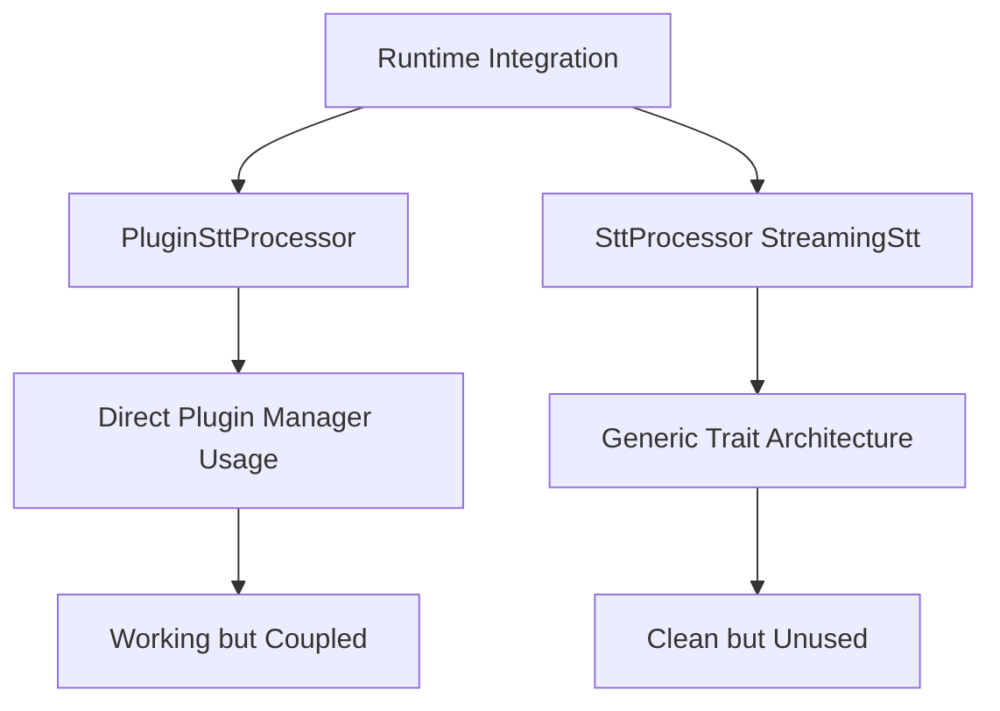
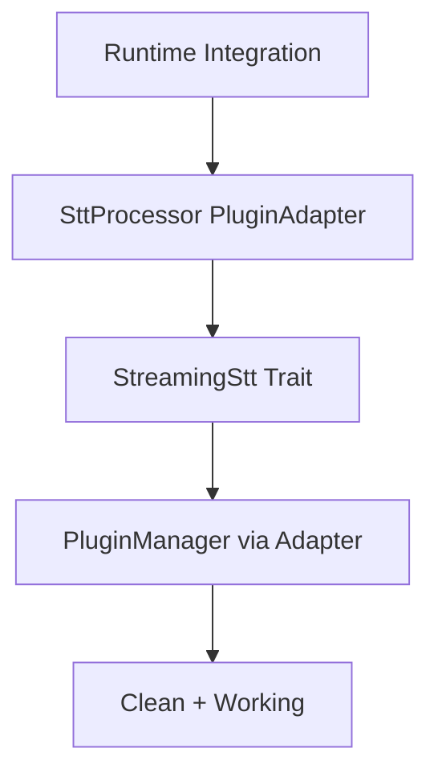

# STT Architecture Integration Plan

**Date**: 2025-09-12  
**Author**: Kilo Code  
**Status**: Draft  
**Priority**: High  

## Executive Summary

This document outlines the integration plan to consolidate the existing `StreamingStt` trait architecture with the current runtime implementation. The goal is to eliminate architectural duplication while preserving the working runtime integration.

## Problem Statement

The ColdVox codebase currently contains **two competing STT processor implementations**:

1. **Agent's Architecture** (`crates/coldvox-stt/src/processor.rs`): Clean trait-based design with `StreamingStt` trait, generic `SttProcessor<T: StreamingStt>`, and `PluginAdapter<P: SttPlugin>`
2. **Current Implementation** (`crates/app/src/stt/processor.rs`): Direct `PluginSttProcessor` using plugin manager with working runtime integration

This duplication creates technical debt, maintenance overhead, and architectural inconsistency.

## Decision Framework

### Architectural Comparison

| Aspect | Agent Architecture | Current Implementation | Recommendation |
|--------|-------------------|-------------------|----------------|
| **Abstraction** | `StreamingStt` trait | Direct plugin manager | Agent ✅ |
| **Extensibility** | Works with any backend | Plugin-specific | Agent ✅ |
| **Testability** | Generic, mockable | Concrete, harder to test | Agent ✅ |
| **Code Reuse** | Single processor | Duplicate logic | Agent ✅ |
| **Runtime Integration** | ❌ Missing | ✅ Working | Current ✅ |
| **Error Handling** | Comprehensive | Basic | Agent ✅ |
| **Metrics** | Enhanced telemetry | Basic metrics | Agent ✅ |

### Strategic Decision

**Adopt Agent's Architecture** with runtime integration. This approach provides:
- Long-term architectural sustainability
- Better testing capabilities
- Elimination of code duplication
- Future-proofing for additional STT backends

## Integration Architecture

### Current State

### Target State

## Implementation Plan

### Phase 1: Architecture Audit (1-2 days)
- [ ] **Audit existing StreamingStt architecture completeness**
  - Verify `StreamingStt` trait implementation
  - Check `PluginAdapter` functionality
  - Validate `SttProcessor<T: StreamingStt>` generic implementation
  - Identify any missing pieces in the trait architecture

### Phase 2: Runtime Integration (2-3 days)
- [ ] **Create PluginAdapter instance from plugin manager in runtime.rs**
  - Design adapter pattern to bridge plugin manager to `StreamingStt`
  - Implement dynamic plugin selection through adapter
  - Ensure backward compatibility with existing plugin interface

- [ ] **Replace PluginSttProcessor with SttProcessor<PluginAdapter> in runtime**
  - Update `runtime.rs` to use generic `SttProcessor`
  - Configure `PluginAdapter` with plugin manager
  - Maintain existing channel communication patterns

- [ ] **Update runtime integration to use generic SttProcessor**
  - Adapt audio frame type compatibility
  - Ensure VAD event handling works with new processor
  - Verify transcription event flow remains unchanged

### Phase 3: Testing & Validation (2-3 days)
- [ ] **Verify audio frame type compatibility between systems**
  - Test `coldvox_audio::AudioFrame` vs `coldvox_stt::processor::AudioFrame`
  - Ensure proper sample rate and format conversion
  - Validate timestamp handling consistency

- [ ] **Port your end-to-end test to work with new architecture**
  - Update existing test in `runtime.rs` to use new processor
  - Ensure mock plugin functionality works with adapter
  - Validate transcription event generation

- [ ] **Test complete pipeline with generic architecture**
  - Run integration tests with real audio
  - Verify VAD → STT → Transcription flow
  - Test error handling and edge cases

### Phase 4: Cleanup & Documentation (1-2 days)
- [ ] **Remove duplicate PluginSttProcessor implementation**
  - Delete `PluginSttProcessor` from `app/src/stt/processor.rs`
  - Clean up unused imports and dependencies
  - Verify no breaking changes to public API

- [ ] **Document migration from direct plugin usage to StreamingStt trait**
  - Create migration guide for developers
  - Update architecture documentation
  - Document new testing patterns and examples

## Risk Assessment

### High Risk
- **Runtime Stability**: Changes to working runtime integration could introduce regressions
  - *Mitigation*: Comprehensive testing, gradual rollout, feature flagging

### Medium Risk
- **Plugin Compatibility**: Existing plugins may need updates to work with new architecture
  - *Mitigation*: Ensure `PluginAdapter` maintains full backward compatibility
  - *Mitigation*: Test with all existing plugin types

### Low Risk
- **Performance**: Generic processor may have different performance characteristics
  - *Mitigation*: Benchmark before and after integration
  - *Mitigation*: Profile critical paths

## Success Criteria

### Technical Criteria
- [ ] All existing functionality preserved
- [ ] End-to-end tests pass with new architecture
- [ ] No performance degradation (>5% change)
- [ ] Plugin compatibility maintained
- [ ] Code duplication eliminated

### Architectural Criteria
- [ ] Single STT processor implementation
- [ ] Clean trait-based abstraction
- [ ] Enhanced testability
- [ ] Future-proof extensibility
- [ ] Consistent error handling

### Documentation Criteria
- [ ] Migration guide created
- [ ] Architecture documentation updated
- [ ] Testing examples provided
- [ ] API documentation current

## Timeline & Resources

### Estimated Duration: 8-10 days
- **Phase 1**: 1-2 days
- **Phase 2**: 2-3 days  
- **Phase 3**: 2-3 days
- **Phase 4**: 1-2 days

### Required Resources
- 1 senior developer (STT architecture expertise)
- Access to test environment with audio hardware
- Plugin development environment for testing
- CI/CD pipeline for automated testing

## Dependencies

### Blockers
- None identified

### Dependencies
- Plugin manager stability
- Audio pipeline compatibility
- VAD system interface consistency

## Sign-off

**Prepared by**: Kilo Code  
**Date**: 2025-09-12  
**Next Review**: 2025-09-15  

**Approvals**:
- [ ] Technical Lead
- [ ] Product Owner  
- [ ] Architecture Review Board

---

*This plan will be updated as new information emerges during implementation.*