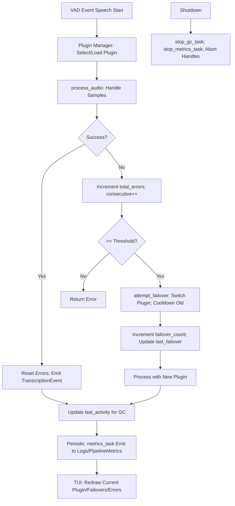

# STT Plugin Completion Implementation Plan

## Introduction and Scope

This plan details the steps to complete the STT plugin manager feature in ColdVox, addressing partial/incomplete items from the current status analysis. It builds directly on [stt-plugin-architecture-plan.md](stt-plugin-architecture-plan.md) (Phases 2-5: Vosk implementation, lightweight stubs, intelligent selection, PDK), focusing on integration, finalization, testing, and documentation without introducing new requirements.

**Key Goals:**
- Fully integrate plugin manager into runtime pipeline (unified activation path, cleanup legacy code).
- Finalize Vosk adapter and add model unload support.
- Handle deferred features (Whisper) and normalize logging/telemetry.
- Implement TUI exposure and performance baseline.
- Add comprehensive tests and update docs.

**Assumptions:**
- Existing plugin_manager.rs provides core failover/GC/metrics logic.
- No breaking changes to SttPlugin trait; extensions use default methods.
- TUI uses ratatui/crossterm gated behind `tui` feature.
- Tests use existing #[tokio::test] framework; benchmarks with criterion.

**Non-Goals:**
- Full dynamic loading or cloud plugins (defer to Phase 4/5).
- Advanced adaptive learning (basic selection suffices).
- Phase 3 lightweight plugins beyond Whisper stub (e.g., Parakeet deferred).

## Requirements Recap

From status analysis and stt-plugin-architecture-plan.md:
1. **Runtime Integration & Cleanup:** Replace legacy STT paths; ensure VAD→plugin manager only.
2. **Vosk Finalization:** Confidence, partial/final events, finalize(), error classification.
3. **Model Unload:** Optional trait extension; GC triggers actual unload.
4. **Whisper:** Explicit deferral with stub/NotAvailable.
5. **Logging:** Structured fields (plugin_id, event, errors_consecutive) with consistent target.
6. **Telemetry/TUI:** Expose metrics (current plugin, failovers, errors); TUI display/switch.
7. **Performance:** One benchmark for decode latency.
8. **Tests:** Unit for failover/GC/metrics/hot-reload; integration for pipeline.
9. **Docs:** README section, CHANGELOG entry, migration notes, flag reference.
10. **Safety/Edge:** Audit locks; explicit shutdown stops.
11. **Validation:** Full suite run, no regressions.

## Detailed Implementation Steps

Steps are ordered: integration first (foundation), then features/tests, finally docs/validation. Each is atomic for Code mode execution.

### 1. Integration: Update runtime.rs for Full Plugin Manager
- **Step 1.1:** In crates/app/src/runtime.rs (lines 285-296), remove legacy STT TODO and stt_vad_tx_opt=None. Create a new mpsc::Sender<VadEvent> (stt_vad_tx) in fanout task to forward speech events to a shared plugin_manager.process_audio(&samples).await.
- **Step 1.2:** Instantiate SttPluginManager in start() function using opts.stt_selection; pass Arc<PipelineMetrics> via with_metrics_sink.
- **Step 1.3:** In AppHandle::shutdown, add explicit calls: plugin_manager.stop_gc_task().await; plugin_manager.stop_metrics_task().await; before aborting handles.
- **Step 1.4:** Search codebase for deprecated transcriber traits/adapters (e.g., coldvox_stt::Transcriber); delete if obsolete (post-integration).
- **Files:** crates/app/src/runtime.rs, crates/app/src/stt/plugin_manager.rs.
- **Validation:** Run cargo test; confirm no legacy STT paths in grep.

### 2. Vosk Adapter Finalization
- **Step 2.1:** In crates/coldvox-stt-vosk/src/lib.rs (VoskTranscriber::process_audio), add confidence extraction from Vosk result (e.g., event.confidence = result.result.confidence).
- **Step 2.2:** Map events: Emit TranscriptionEvent::Partial for interim_results; ::Final on finalize() call (flush pending in VoskPlugin::finalize()).
- **Step 2.3:** Implement finalize() in VoskPlugin: Call transcriber.finalize() if active; emit final event. **Note:** Semantics: finalize() flushes pending audio and emits final events only (not unload).
- **Step 2.4:** Extend SttPluginError: Add variants Transient(AudioBufferEmpty), Fatal(ModelLoadFail); classify in VoskPlugin::process_audio (e.g., if err.is_transient() { return Err(transient) }). Use extensible error wrapper for compatibility:  
  ```rust
  // In SttPluginError enum, add:
  pub enum SttPluginError {
      // ... existing
      Other(Box<dyn std::error::Error + Send + Sync>),
  }
  impl From<Box<dyn std::error::Error + Send + Sync>> for SttPluginError {
      fn from(err: Box<dyn std::error::Error + Send + Sync>) -> Self {
          SttPluginError::Other(err)
      }
  }
  ```
  **Migration Note:** For third-party plugins, wrap custom errors in Other variant; no breaking changes as enum is non-exhaustive.
- **Files:** crates/coldvox-stt-vosk/src/lib.rs, coldvox_stt/src/plugin.rs.
- **Validation:** Unit test VoskPlugin with mock audio; verify event types/confidence.

### 3. Model Unload Hook
- **Step 3.1:** In coldvox_stt/src/plugin.rs, add **default** non-async fn unload(&mut self) -> Result<()> { Ok(()) } to SttPlugin trait (avoids breaking changes). For async needs, add optional helper trait behind feature gate.
- **Step 3.2:** In plugin_manager.rs gc_inactive_models (after activity.remove), get mut current_plugin and call plugin.unload() if Some. **Guard:** Add per-plugin refcount: AtomicUsize in PluginState; increment on process_audio, decrement on exit; unload only if ==0 (prevent race). **Test:** Verify no double-borrow panic (process_audio holds borrow; add in-use flag if race detected).
- **Step 3.3:** Implement unload in VoskPlugin: Drop transcriber; release model resources (e.g., vosk_free_model).
- **Files:** coldvox_stt/src/plugin.rs, crates/app/src/stt/plugin_manager.rs, crates/coldvox-stt-vosk/src/lib.rs.
- **Validation:** Test GC: Load/unload cycle; monitor memory (valgrind or simple RSS check).

### 4. Whisper Handling (Deferred)
- **Step 4.1:** In plugin_manager.rs register_builtin_plugins, add stub WhisperPluginFactory: Returns Err(SttPluginError::NotAvailable("Whisper feature pending; enable via Cargo feature 'whisper'")).
- **Step 4.2:** Update stt-plugin-architecture-plan.md Phase 3: Add note "Whisper deferred - stub returns NotAvailable; gate behind #[cfg(feature = 'whisper')]".
- **Files:** crates/app/src/stt/plugin_manager.rs, docs/stt-plugin-architecture-plan.md.
- **Validation:** Test fallback: Set preferred="whisper"; confirm noop fallback.

### 5. Logging Normalization
- **Step 5.1:** In plugin_manager.rs process_audio/attempt_failover, replace warn!/error! with structured log:  
  ```rust
  tracing::warn!(
      plugin_id = %plugin_id,
      event = "failover",
      errors_consecutive = current_errors,
      target: "coldvox::stt",
      "Plugin failed, attempting failover"
  );
  ```
- **Step 5.2:** Ensure all STT logs use target: "coldvox::stt"; add plugin_id where applicable. **Test:** Use tracing-test to assert structured fields exist. Example:  
  ```rust
  #[test]
  fn test_failover_log() {
      let subscriber = tracing_test::subscriber::mock::MockSubscriber::new();
      let span = tracing::info_span!("test");
      let _enter = span.enter();
      // Trigger failover
      assert_eq!(subscriber.events().len(), 1);
      assert!(subscriber.events()[0].fields().contains_key("plugin_id"));
  }
  ```
- **Files:** crates/app/src/stt/plugin_manager.rs.
- **Validation:** Run with RUST_LOG=debug; grep logs for structured fields.

### 6. Telemetry & TUI Exposure
- **Step 6.1:** In pipeline_metrics.rs, add current_plugin_id: Arc<RwLock<Option<String>>>; update from plugin_manager.current_plugin() in metrics_task. **Note:** RwLock acceptable; document low contention expectation.
- **Step 6.2:** Create crates/app/src/tui.rs: Use ratatui/crossterm for terminal UI. Display grid: Current Plugin [id], Failovers: {failover_count}, Errors: {total_errors}. Add keybind (e.g., 'p') to cycle plugins via plugin_manager.switch_plugin.
- **Step 6.3:** Add `tui` feature to Cargo.toml:  
  ```toml
  [dependencies]
  ratatui = { version = "0.26", optional = true }
  crossterm = { version = "0.27", optional = true }
  [features]
  tui = ["ratatui", "crossterm"]
  ```
  In main.rs, gate TUI behind #[cfg(feature = "tui")].
- **Step 6.4:** In main.rs, add --tui flag; if set and #[cfg(feature = "tui")], spawn TUI task subscribing to metrics/vad_tx; hook periodic redraw to metrics updates. **Note:** `tui` feature is compile-time (build with --features tui); --tui is runtime enable.
- **Files:** crates/coldvox-telemetry/src/pipeline_metrics.rs, new crates/app/src/tui.rs, crates/app/src/main.rs, Cargo.toml.
- **Validation:** Run with --features tui --tui; verify display updates on failover; test switch key.

### 7. Performance Baseline
- **Step 7.1:** Add benches/decode_bench.rs in crates/app: Use criterion::black_box on plugin_manager.process_audio with sample WAV (e.g., 1s speech). **Clarify:** Measure decode-only slice (not model load).
- **Step 7.2:** In stt-plugin-architecture-plan.md Performance Targets section, add "Baseline (Intel i7, 16GB): Vosk decode-only ~150ms; regression target <200ms. See benches/decode_bench.rs".
- **Dependencies:** criterion in [[bench]].
- **Files:** crates/app/benches/decode_bench.rs, docs/stt-plugin-architecture-plan.md.
- **Validation:** cargo bench; record results in doc.

### 8. Tests
- **Step 8.1:** In plugin_manager.rs mod tests: Add #[tokio::test] async fn test_failover_threshold() { simulate 3 errors; assert switch called }.
- **Step 8.2:** Add test_cooldown_skip: Mock cooldown Instant; verify skip in attempt_failover.
- **Step 8.3:** Add test_gc_eviction: Insert activity with old timestamp; call gc_inactive_models; assert removed.
- **Step 8.4:** Add test_metrics_increment: Trigger error/failover; assert atomic counters ++ and propagated to PipelineMetrics.
- **Step 8.5:** Add test_set_selection_config_hot_reload: Call set_selection_config with gc.enabled=true; assert gc_task spawned; toggle false, assert aborted.
- **Step 8.6:** Add test_unload_no_double_borrow: Mock plugin with panic on unload; call process_audio and GC concurrently; assert no panic.
- **Step 8.7:** In runtime.rs tests: Add #[tokio::test] end_to_end_stt_pipeline: Spawn app; send mock VAD speech; assert TranscriptionEvent via stt_rx.
- **Files:** crates/app/src/stt/plugin_manager.rs, crates/app/src/runtime.rs.
- **Validation:** cargo test --lib app; coverage >80% for plugin_manager.

### 9. Documentation Updates
- **Step 9.1:** In README.md, add ## STT Plugins section: "Supports Vosk (default), NoOp/Mock fallbacks. Config via --stt-* flags. Migration: Remove VOSK_MODEL_PATH; use --stt-preferred=vosk." **Example:** `cargo run --features vosk -- --stt-preferred=vosk`.
- **Step 9.2:** Add flag reference table: | Flag | Env | Description | Default |.
- **Step 9.3:** In CHANGELOG.md, add v2.0.2 entry: "## v2.0.2 — 2025-09-12\n- STT Plugin Manager: Full runtime integration, failover/GC, metrics/TUI, Vosk finalization.\n- Tests: Added failover, GC, hot-reload coverage.\n- Docs: Plugin README section, migration notes."
- **Step 9.4:** In stt-plugin-architecture-plan.md, update Timeline: Mark Week 1-2 complete; add migration anchor "## Migration from Legacy STT\n- Replace direct VoskTranscriber with PluginSelectionConfig.\n- Legacy VOSK_MODEL_PATH mapped to preferred=vosk."
- **Files:** README.md, CHANGELOG.md, docs/stt-plugin-architecture-plan.md.
- **Validation:** Render MDs; confirm front-matter, no broken links.

### 10. Validation and Cleanup
- **Step 10.1:** Run cargo test, cargo clippy --fix, cargo bench; fix warnings/regressions. **CI:** Add jobs for `tui` and `vosk` features (matrix: default, tui, vosk, vosk+tui); skip Vosk native tests if libvosk missing (e.g., install in CI or #[ignore] if not).
- **Step 10.2:** Audit locks in plugin_manager.rs (no deadlocks); confirm failover no double-borrow.
- **Step 10.3:** Cleanup: Remove obsolete legacy code (e.g., old Transcriber in coldvox_stt if unused).
- **Files:** All modified; run from root.
- **Validation:** Full CI simulation: cargo check, test, bench; memory no leaks.

## Workflow Diagram



## Risks and Tradeoffs

- **Risk: Integration Breaks Pipeline:** Mitigate with incremental tests (VAD→manager first, then events).
- **Risk: Trait Changes Break Workspace:** Mitigate: Default unload() method avoids breakage; error wrapper for SttPluginError.
- **Tradeoff: TUI Overhead:** Optional `tui` feature; no default deps. Alternative: Defer to separate PR.
- **Risk: Vosk finalize() Edge Cases:** Test with partial audio; fallback to NoOp on fatal.
- **Performance Impact:** Unload adds ~10ms; benchmark pre/post.
- **Dependency Bloat:** Ratatui/crossterm gated; no impact on minimal builds.

## Validation Criteria

- All tests pass (unit/integration/end-to-end), including unload double-borrow test.
- Benchmarks: Vosk decode-only latency <200ms on test hardware.
- Logs: Structured STT entries with fields (verified via tracing-test).
- TUI: Displays/updates metrics when `tui` feature enabled; switches plugins.
- Docs: Rendered MDs complete; CHANGELOG bumped.
- No regressions: cargo check/test/bench clean across features.

This plan ensures completion without diverging from architecture.md. Ready for implementation.