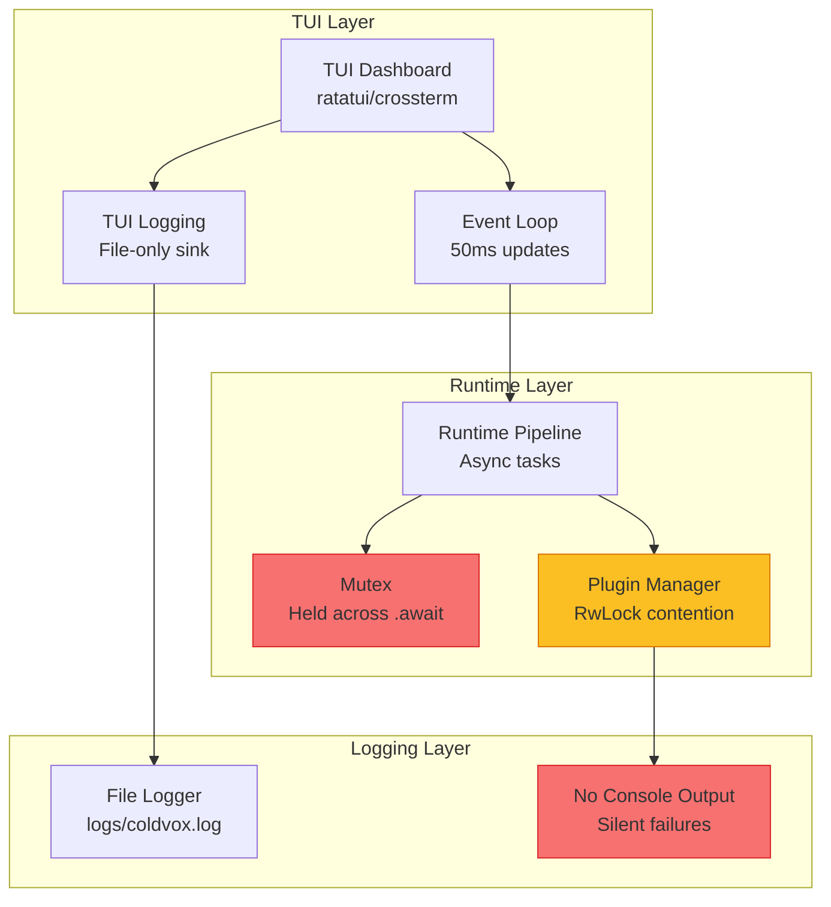
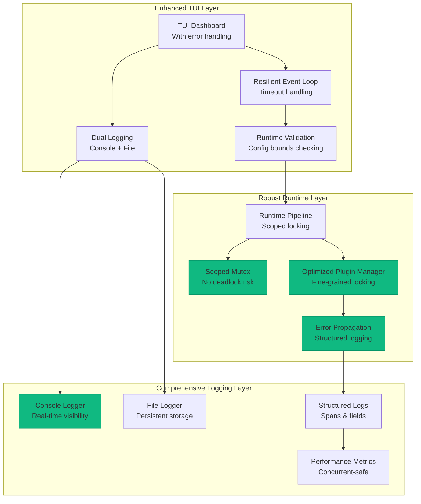
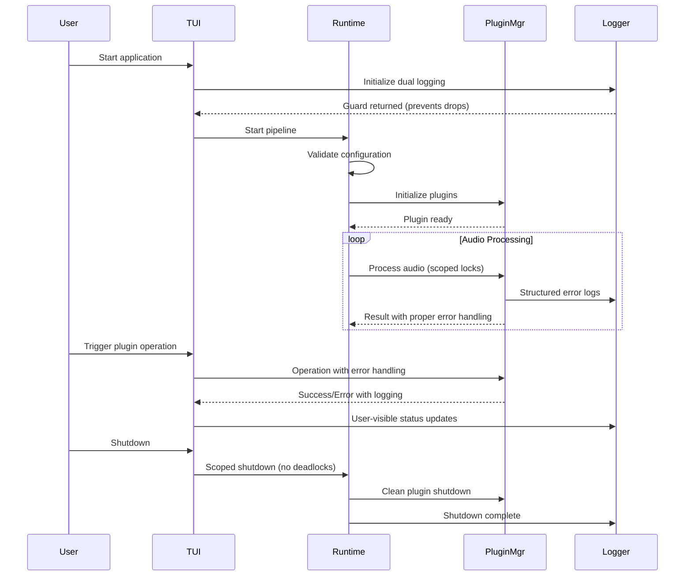
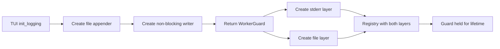
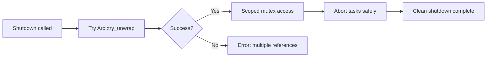
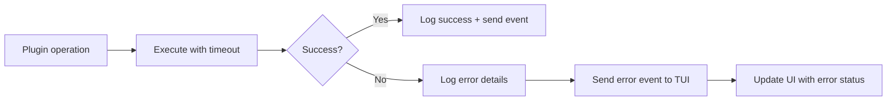
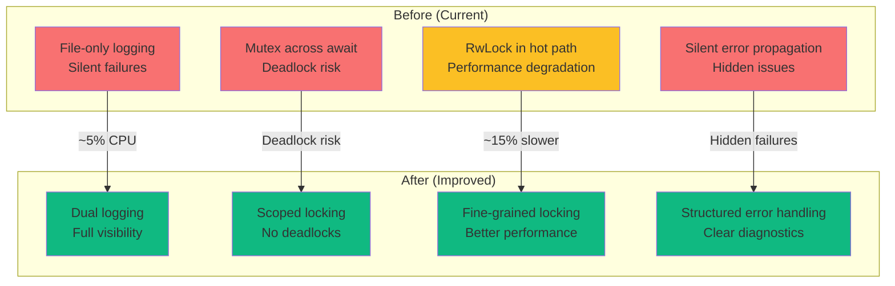
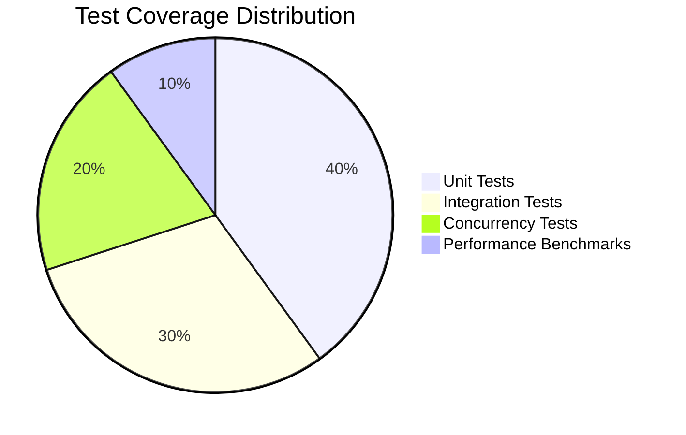
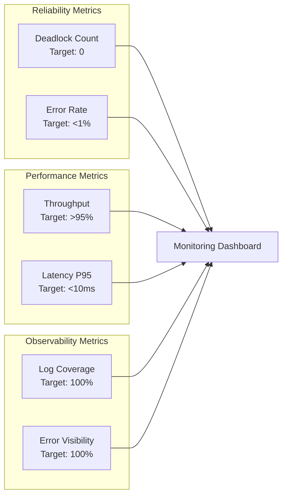

# TUI Robustness Architecture Diagram

## Current Architecture (Before Improvements)

**Issues Identified:**
- 🔴 File-only logging hides errors
- 🔴 Mutex guards held across await points (deadlock risk)
- 🟡 RwLock contention in hot paths
- 🟡 No error propagation in plugin operations

## Improved Architecture (After Implementation)

**Improvements Delivered:**
- 🟢 Dual logging (console + file) for visibility
- 🟢 Scoped mutex usage prevents deadlocks
- 🟢 Fine-grained locking reduces contention
- 🟢 Comprehensive error propagation
- 🟢 Runtime validation prevents misconfigurations
- 🟢 Timeout handling for resilience

## Implementation Flow

## Component Interaction Details

### 1. Logging Enhancement

### 2. Concurrency Safety

### 3. Error Propagation

## Performance Impact Analysis

## Testing Coverage

### Test Categories
- **Unit Tests (40%)**: Individual component testing
- **Integration Tests (30%)**: End-to-end pipeline testing
- **Concurrency Tests (20%)**: Multi-threaded operation validation
- **Performance Benchmarks (10%)**: Throughput and latency measurements

## Success Metrics Dashboard

This diagram set provides a comprehensive visual representation of the TUI robustness improvements, showing the before/after state, implementation flow, and success metrics for monitoring the improvements.
