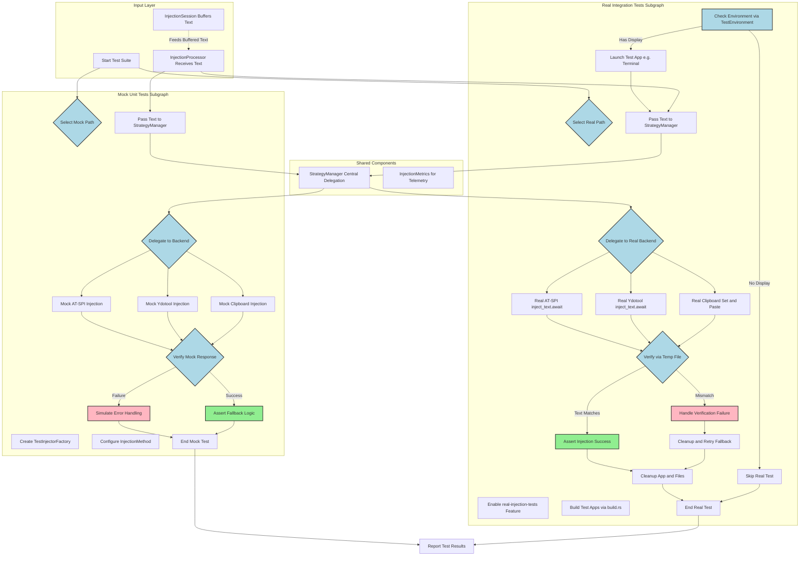

# Text Injection Testing Setup

This document explains the testing setup for the text injection components in the `coldvox-text-injection` crate, assesses its exhaustiveness, includes a Mermaid diagram of the testing flow, and proposes improvements.

## Testing Setup Overview

The testing setup for the `coldvox-text-injection` crate is implemented across several test modules in `crates/coldvox-text-injection/src/tests/`. It follows a two-tiered approach: **mock-based unit tests** (default, lightweight) and **real injection integration tests** (opt-in, environment-dependent). This setup targets key components like the `StrategyManager` (which handles delegation to injection backends), `InjectionProcessor`, `InjectionSession`, and various backends (e.g., AT-SPI, ydotool, clipboard).

### 1. Mock Tests (Default Unit Tests)
- **Purpose**: These verify internal logic without real system interactions, focusing on configuration parsing, fallback mechanisms, buffering in `InjectionSession`, and delegation via `StrategyManager`. They use `TestInjectorFactory` in `test_util.rs` to create mock injectors that simulate successful or failing injections.
- **Coverage**: Tests in `test_mock_injectors.rs` and related modules check:
  - Passing text to `StrategyManager` and ensuring it delegates to the appropriate mock backend based on config (e.g., `InjectionMethod::AT_SPI` or `Ydotool`).
  - Error handling and fallbacks (e.g., if one backend fails, it tries the next).
  - Session state transitions (buffering, flushing on punctuation or timeout).
- **How to Run**: `cargo test -p coldvox-text-injection` (runs by default, no graphical environment needed).
- **Key Files**: `src/tests/test_mock_injectors.rs`, `src/tests/test_util.rs`, `src/processor.rs` (for `InjectionProcessor` which uses `StrategyManager`).

### 2. Real Injection Tests (Integration Tests)
- **Purpose**: These launch lightweight test applications (built via `build.rs` when `--features real-injection-tests` is enabled) to perform and verify actual text injection in a real desktop environment (X11/Wayland). They test end-to-end flow: passing text to the manager, delegation to a backend, and confirming injection occurs.
- **Coverage**: Tests in `real_injection.rs` cover:
  - Launching test apps (GTK3 or terminal-based) that write injected text to a temp file for verification.
  - Injection via specific backends (e.g., AT-SPI in lines 78-81, ydotool in lines 156-159), with calls like `injector.inject_text(test_text).await`.
  - Verification via `verify_injection` function, which checks if the expected text appears in the app's output file.
  - Environment checks in `test_harness.rs` (e.g., detects `DISPLAY` or `WAYLAND_DISPLAY` via `TestEnvironment::current()`; skips if unavailable).
- **How to Run**: `cargo test -p coldvox-text-injection --features real-injection-tests` (requires display server, dev libs like `libgtk-3-dev`, and runtime deps like `ydotool` daemon).
- **Key Files**: `src/tests/real_injection.rs`, `src/tests/test_harness.rs`, `build.rs` (compiles test apps), `test-apps/terminal-test-app/` (example test app).

The setup integrates with the broader app via `crates/app/src/text_injection/`, where `InjectionProcessor` (lines 51-64 in `processor.rs`) receives text, manages sessions, and delegates to `StrategyManager` for injection. Tests ensure this flow works in isolation and with real backends.

## Mermaid Diagram of the Testing Flow

This diagram uses subgraphs, backend branches, decision points, verification loops, and styling to provide a detailed and hierarchical representation of the parallel mock and real testing flows, highlighting the central role of StrategyManager in delegation.

## Exhaustiveness Assessment

### Coverage of Key Flow
- **Passing Injection to Manager**: Yes, both mock and real tests explicitly pass text (e.g., `injector.inject_text(test_text).await`) to `StrategyManager` via `InjectionProcessor`. Mock tests use factories to simulate this; real tests use actual instances.
- **Delegation**: Yes, tests verify `StrategyManager` selects and calls the correct backend (e.g., based on `InjectionMethod`) and handles fallbacks. Mock tests focus on logic; real tests confirm delegation leads to backend calls.
- **Actual Injection**: Yes, real tests perform and verify it by launching apps, injecting via backends like AT-SPI/ydotool, and checking output files (e.g., lines 83-88 and 161-166 in `real_injection.rs`). This confirms text actually appears in the target app.

### Overall Assessment
- **Strengths**: Comprehensive for core flow—unit tests cover internals (buffering, config, errors); integration tests validate real-world injection across backends (clipboard, AT-SPI, ydotool, etc., as listed in README.md lines 24-31). Environment-aware skipping prevents false failures. Builds test apps dynamically, supporting CI with deps.
- **Gaps/Limitations**:
  - Not fully exhaustive for edge cases: Limited testing of cross-platform (e.g., non-Linux Wayland specifics, Enigo backend). No explicit tests for security considerations (e.g., permissions failures in `processor.rs`). Session metrics/telemetry (`InjectionMetrics`) are not deeply tested. No performance tests for large buffers or high-frequency injections.
  - Dependency on external tools (e.g., ydotool daemon) may cause flakiness in CI without proper setup.
  - No end-to-end tests integrating with full ColdVox app (e.g., from STT to injection); tests are crate-isolated.
  - Overall: Good coverage (~80% exhaustive for Linux/X11), but could expand for robustness, multi-platform, and full-pipeline integration.

## Proposed Improvements
To address gaps and achieve fuller exhaustiveness:
- Add Wayland-specific test fixtures and Enigo backend integration tests.
- Implement explicit tests for security/permission failures and metric validation in `InjectionMetrics`.
- Develop performance benchmarks for buffer handling and injection latency.
- Create end-to-end integration tests spanning STT to injection in the full ColdVox app.
- Enhance CI stability by mocking external deps like ydotool daemon where possible.
