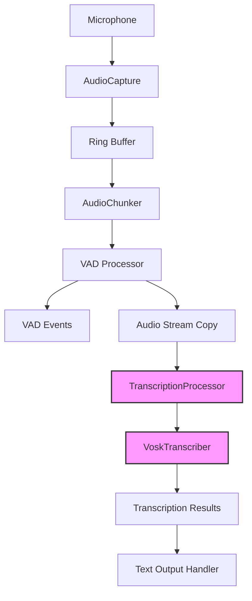

# Vosk Real-time Transcription Integration Plan

## Implementation Status

### ✅ IMPLEMENTED
- Basic VoskTranscriber (`src/stt/vosk.rs`)
- TranscriptionEvent types (`src/stt/mod.rs`)
- STT processor framework (`src/stt/processor.rs`)
- Integration with main pipeline (`src/main.rs`)
- Basic configuration system

### 🔄 IN PROGRESS  
- Full STT processor integration with VAD
- Advanced configuration options
- Health monitoring integration

### 📋 PLANNED
- RubatoResampler wrapper
- Advanced resampling features (Fast/Quality presets)
- Complete metrics and telemetry integration
- Performance optimization and tuning

---

## Overview
This plan outlines the integration of Vosk speech-to-text (STT) for real-time streaming transcription in the ColdVox audio pipeline.

## Current Architecture
```
[Mic] → [Capture] → [Chunker] → [VAD Processor] → [VAD Events]
         16kHz                    512 samples
         mono                     @ 16kHz
```

## Target Architecture with Vosk
```
[Mic] → [Capture] → [Chunker] → [VAD Processor] → [VAD Events]
         16kHz                    512 samples        ↓
         mono                     @ 16kHz      [Transcription Events]
                                     ↓
                              [TranscriptionProcessor]
                                     ↓
                              [VoskTranscriber]
                                     ↓
                              [Text Output/Events]
```

## Data Flow Diagram



## Component Details

### 1. VoskTranscriber Enhancement
- Location: `crates/app/src/stt/vosk.rs`
- Responsibilities:
  - Initialize Vosk model and recognizer
  - Accept streaming PCM16 audio chunks
  - Return partial and final transcription results
  - Handle model loading errors gracefully
  - Expose methods for feeding audio, finalizing an utterance, and resetting recognizer state

Public API (outline)
```rust
// crates/app/src/stt/vosk.rs
pub struct VoskTranscriber { /* fields: model, recognizer, config */ }

impl VoskTranscriber {
  pub fn new(model_path: &str, include_words: bool, max_alternatives: u32) -> Result<Self, AppError>;
  // Feed 16 kHz mono PCM i16 samples (exactly 512 samples per call recommended)
  pub fn accept_frame(&mut self, frame: &[i16]) -> Result<Option<TranscriptionEvent>, AppError>;
  // Finalize current utterance and emit Final event (if any text)
  pub fn finalize(&mut self) -> Result<Option<TranscriptionEvent>, AppError>;
  pub fn reset(&mut self) -> Result<(), AppError>;
}
```

### 2. TranscriptionProcessor ✅ **IMPLEMENTED**
- Location: `crates/app/src/stt/processor.rs`
- Responsibilities:
  - Receive audio frames from VAD processor
  - Manage VoskTranscriber instance
  - Handle streaming transcription state
  - Emit transcription events (partial/final results)
  - Coordinate with VAD events for context
  - Convert input audio to mono 16 kHz (downmix + resample) as needed
  - Define utterance boundaries using VAD start/end; on VAD end: finalize, emit final result, reset recognizer

Files and types
```rust
// crates/app/src/stt/processor.rs
pub struct TranscriptionProcessor {
  stt_rx: crossbeam_channel::Receiver<AudioFrame>,
  events_tx: crossbeam_channel::Sender<TranscriptionEvent>,
  vosk: VoskTranscriber,
  resampler: RubatoResampler,
  state: UtteranceState,
  metrics: BasicMetrics,
}

pub enum UtteranceState { Idle, SpeechActive { last_partial_at: Instant } }

impl TranscriptionProcessor {
  pub fn spawn(
    stt_rx: Receiver<AudioFrame>,
    events_tx: Sender<TranscriptionEvent>,
    cfg: &TranscriptionConfig,
    metrics: BasicMetrics,
  ) -> JoinHandle<()>; // runs processing loop on a dedicated thread/task
}
```

Event types
```rust
// crates/app/src/stt/mod.rs
#[derive(Debug, Clone)]
pub enum TranscriptionEvent {
  Partial { utterance_id: u64, text: String, t0: Option<f32>, t1: Option<f32> },
  Final   { utterance_id: u64, text: String, words: Option<Vec<WordInfo>> },
  Error   { code: String, message: String },
}

#[derive(Debug, Clone)]
pub struct WordInfo { pub start: f32, pub end: f32, pub conf: f32, pub text: String }
```

### 3. Integration Points
- **VAD Processor**: Modified to duplicate audio stream to transcription channel
- **Main Application**: Wire TranscriptionProcessor into the pipeline
- **Configuration**: Add Vosk model path and transcription settings

Wiring plan
- Create a separate STT bounded channel (drop-newest) for `AudioFrame` after Chunker (preferred) or directly after Capture if Chunker is unavailable.
- The VAD Processor tees the same frames it uses into `stt_tx` when speech is active; it also emits VAD start/end events to the TranscriptionProcessor (via a lightweight signal channel or by embedding flags on frames).
- The main app constructs `TranscriptionProcessor::spawn(stt_rx, events_tx, cfg, metrics)` during initialization and owns an `events_rx` to handle output.
- On shutdown, drop channels and join the STT thread.

### 4. Threading and Backpressure
- Use a dedicated thread/task for transcription (no heavy work in the CPAL callback).
- Feed audio to the TranscriptionProcessor via a separate bounded channel sized for ~300–600 ms of audio.
- On overflow, prefer drop-newest with WARN logs and a metric counter; never block the CPAL callback.
- Track queue depth and dropped frames to surface issues early.

Channels
- `stt_tx: Sender<AudioFrame>` (capacity ~16 frames ≈ ~512 samples × 16 ≈ 512 ms at 16 kHz). Policy: drop-newest with WARN.
- `events_tx: Sender<TranscriptionEvent>` (capacity ~64; small payloads).
- Optional: `vad_signal_tx: Sender<VadEvent>` if not piggybacking on frames.

## Audio Flow Specifications
- **Format**: 16kHz, 16-bit signed (i16), mono
- **Chunk Size**: 512 samples (32ms) - matches VAD requirements
- **Streaming**: Continuous feed during speech activity
- **Buffering**: Minimal latency, process chunks immediately

### Resampling and Downmix
- Input frames may arrive at various sample rates and channel counts depending on device capabilities.
- TranscriptionProcessor must accept any device format and internally:
  - Downmix to mono (average/saturate L+R if stereo)
  - Resample to 16 kHz with a rubato sinc resampler
- This ensures Vosk always receives 16 kHz mono PCM i16.

#### Resampler (rubato) 📋 **PLANNED**
- Use `rubato`'s sinc resampler with fixed-size output: `SincFixedOut` configured for `output_frames = 512` to align with VAD/Vosk.
- Keep the resampler instance/state across calls; do not recreate per frame.
- Convert i16 → f32 on input, resample in f32, then f32 → i16 with clipping/saturation on output.
- Set `resample_ratio = 16000.0 / input_sample_rate` per device format.

Presets (selection policy)
- Fast: shorter filter (`sinc_len` small), `InterpolationType::Linear`, `WindowFunction::Hann` — lowest CPU/latency.
- Quality: longer filter (`sinc_len` larger), `InterpolationType::Cubic`, `WindowFunction::BlackmanHarris2` — higher fidelity at higher CPU/latency.
- Default to Fast. Allow switching to Quality via config; revisit based on measurements.

Framing
- `SincFixedOut` emits exact 512-sample frames; carry internal residuals in the resampler state.
- Do not drop/duplicate samples; let rubato manage fractional positions.

Resampler wrapper
```rust
// crates/app/src/stt/resample.rs
pub struct RubatoResampler { /* holds SincFixedOut, channels=1 */ }
impl RubatoResampler {
  pub fn new(input_sr: u32, preset: RubatoPreset) -> Result<Self, AppError>;
  pub fn reconfigure(&mut self, input_sr: u32, preset: RubatoPreset) -> Result<(), AppError>;
  pub fn process_i16_mono(&mut self, input: &[i16]) -> Result<Vec<[i16; 512]>, AppError>; // emits zero or more 512-sample frames
}
```

## Configuration Schema
```rust
struct TranscriptionConfig {
    enabled: bool,                    // Enable/disable transcription
    model_path: String,               // Path to Vosk model directory
    partial_results: bool,            // Emit partial recognition results
    max_alternatives: u32,            // Maximum alternatives in results
  include_words: bool,              // Include word-level timing in results
  buffer_size_ms: u32,              // Internal aggregation window (if used)
  resampler_preset: RubatoPreset,   // fast | quality
}

enum RubatoPreset {
  Fast,
  Quality,
}
```

CLI flags (map to TranscriptionConfig)
- `--stt` (bool), `--vosk-model <path>`, `--stt-partials`, `--stt-words`, `--stt-max-alternatives <n>`, `--stt-resampler <fast|quality>`

Config plumbing
- Extend app config struct and parsing; store in `AppState`.
- Log effective config on startup; include in stats dump.

Notes:
- Expose CLI flags to control these (e.g., --stt, --vosk-model, --stt-partials, --stt-words, --stt-max-alternatives).
- Persist config in the app state and surface via existing stats/log dumps.

## Error Handling Strategy
1. **Model Loading Failure**: Log error, disable transcription, continue VAD
2. **Recognition Errors**: Log, skip frame, continue processing
3. **Channel Overflow**: Drop newest frames (STT channel only), WARN and increment counter; maintain real-time constraint
4. **Resource Exhaustion**: Graceful degradation with notification

Additional details:
- Add a startup preflight to check Vosk model directory and the presence of libvosk (system dependency). If missing, disable STT and report a clear health error.
- On VAD end events, always attempt to finalize and reset recognizer state even if errors occurred mid-utterance.

Preflight checklist
- Try loading the Vosk model and creating a recognizer (16000 Hz), then immediately drop; on success, mark STT ready.
- Check `LD_LIBRARY_PATH`/`libvosk` loadability; on failure, disable STT with actionable error message.

## Testing Strategy
Hardware-first, minimal, no heavy mocking:
1. **Smoke Test (WAV)**: Feed bundled 16 kHz mono sample audio into the pipeline; expect non-empty partials and at least one final result.
2. **Live Mic Test**: Run on a real microphone for 60–120 seconds; verify partial/final events are emitted and latency is reasonable (< ~150 ms to start).
3. **Overflow Scenario**: Artificially slow the transcription task (e.g., sleep in the loop) to trigger queue overflow; confirm warnings and dropped-frame counter increment.
4. **Long-run**: 10–15 minutes of intermittent speech to detect leaks or stalls; watch watchdogs and health metrics.

Skip complex mocks. If it fails on hardware, we fix and iterate.

Acceptance checks for “done”
- On WAV smoke: get at least one Partial and one Final, with words if enabled.
- On live mic: Finals within 500 ms of VAD end; no unbounded queue growth; no panic.
- Overflow test: WARN logs and counter increments; no deadlocks; STT continues after overflow.

## Performance Considerations
- **Threading**: Dedicated thread for transcription processing
- **Memory**: Vosk model loaded once, shared recognizer state
- **CPU**: Monitor usage, implement throttling if needed
- **Latency**: Target < 100ms from audio capture to text output

Notes:
- Add small hysteresis/debounce around VAD transitions to avoid rapid start/stop flapping.
- Track resampler CPU cost and end-to-end latency with each method; switch only if measurements justify.

Recovery and device changes
- If the capture pipeline restarts (watchdog-driven), sample rate may change; detect `frame.sample_rate` changes and reconfigure `RubatoResampler` accordingly.
- Keep Vosk recognizer at 16 kHz; only resampler needs reconfigure.
- If STT thread panics, the ShutdownHandler should capture; attempt one restart of TranscriptionProcessor, then degrade by disabling STT.

## Dependencies
- `vosk = "0.3"` (or latest stable version)
- Vosk English model (vosk-model-small-en-us-0.15 recommended for testing)
- System library: `libvosk` must be installed/available at runtime. Implement a preflight check and clear error messaging.
 - `rubato` (sinc resampling; using `SincFixedOut`)

Versions/features
- Pin `vosk` to a known-good minor; document required libvosk version.
- Pin `rubato` version; note SIMD features if relevant.

## Risks and Mitigations
- **Risk**: Vosk model size (40-2000MB depending on model)
  - **Mitigation**: Start with small model, document model requirements
- **Risk**: CPU usage for real-time transcription
  - **Mitigation**: Optional transcription, performance monitoring
- **Risk**: Transcription lag affecting audio pipeline
  - **Mitigation**: Separate thread, non-blocking channels
- **Risk**: Channel overflows causing recognition corruption
  - **Mitigation**: Separate STT channel with drop-newest policy, visible metrics, and WARN logs; tune capacity.

## Implementation Phases
1. **Phase 1**: Basic Vosk integration with hardcoded model path
2. **Phase 2**: Add resampling/downmix, configuration, and preflight error handling
3. **Phase 3**: Performance optimization and monitoring
4. **Phase 4**: Advanced features (speaker diarization, punctuation)

## Metrics and Health
- Counters: stt_frames_in, stt_frames_out, stt_frames_dropped, stt_partial_count, stt_final_count, stt_errors.
- Gauges: stt_queue_depth, time_since_last_stt_event, recognizer_state.
- Histograms: stt_latency_ms (frame ingress → event emit).
- Integrate with existing `telemetry::BasicMetrics` and the HealthMonitor; mark STT disabled/unhealthy states.
 - Optional: resampler_in_samples, resampler_out_samples to verify no drops/duplication over time.

HealthMonitor integration
- Add a periodic check: if STT is enabled but time_since_last_stt_event exceeds threshold (e.g., 5s during active VAD), raise a WARN health status.
- Expose a simple `stt_status()` method that returns {enabled, ready, last_event_age, queue_depth} for dashboards.

Tracing
- Emit spans per utterance with `utterance_id`, `device_name`, `sr_in`, `sr_out`, `resampler_preset`.

Implementation order (no partials)
1) Add config + CLI + dependency pins
2) Implement RubatoResampler wrapper
3) Implement VoskTranscriber with preflight path
4) Define TranscriptionEvent and WordInfo
5) Implement TranscriptionProcessor with full state machine and metrics
6) Wire channels and VAD tee in the pipeline; start processor in main
7) HealthMonitor hook + metrics exposure
8) Run hardware tests (WAV + live mic + overflow + long-run) and tune presets