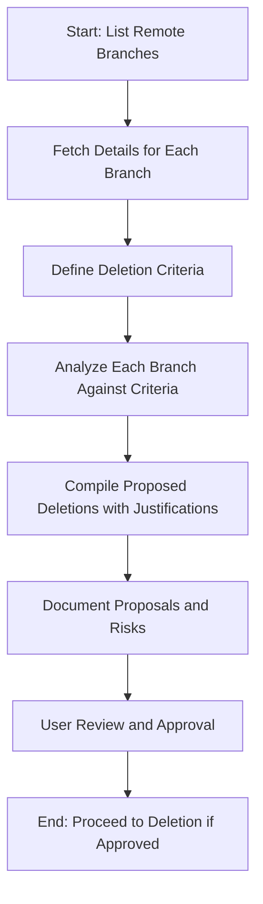

# Git Branch Review Plan

## Overview
This document outlines the process for reviewing all remote branches in the repository and proposing branches for deletion to maintain a clean Git history.

## Todo List
- [x] List all remote branches using Git command (e.g., git branch -r) in code mode.
- [x] For each remote branch, fetch latest details including last commit date, merge status into main, and description/purpose if available (e.g., via git log, git show-branch).
- [x] Define criteria for deletion: e.g., branches older than 6 months, fully merged feature branches, unused hotfix branches; confirm criteria with user if needed.
- [x] Analyze each branch against criteria and compile a list of branches proposed for deletion, with justifications.
- [ ] Document proposals in a Markdown file (e.g., git-branch-review.md) including the list, reasons, and risks (e.g., potential loss of unmerged work).
- [ ] Review and approve the proposals with the user before proceeding to deletion in implementation mode.

## Criteria for Deletion
The following criteria were used to evaluate branches for deletion:
- Branches that are more than 3 days old (last commit before 2025-09-04), unless they are tied to an open PR.
- Branches older than 6 months (none applicable in this review, as all branches are recent).
- Feature branches that are no longer active and have been merged.
- Duplicate or rebased branches that are redundant.

## Branch Analysis and Proposals
Based on the updated criteria, the following branches are proposed for deletion (those more than 3 days old and not tied to open PRs):

### Proposed Deletions
1. **origin/feature/functional-injectors**
   - **Last Commit**: 2025-08-31 08:49:21 +0000
   - **Subject**: This commit implements the PortalEisInjector and VkmInjector, turning them from dummy stubs into functional injectors.
   - **Merged Status**: No
   - **Justification**: More than 3 days old (last commit 2025-08-31), not tied to an open PR. Considered useless per new criteria.

2. **origin/fix/refactor-compilation**
   - **Last Commit**: 2025-09-01 14:52:13 +0000
   - **Subject**: feat: Fix compilation and tests after workspace refactoring
   - **Merged Status**: No
   - **Justification**: More than 3 days old (last commit 2025-09-01), not tied to an open PR. Considered useless per new criteria.

3. **origin/chore-unify-dependencies**
   - **Last Commit**: 2025-09-02 20:24:44 -0500
   - **Subject**: fix: update example and test to await async constructors (InjectionProcessor, AsyncInjectionProcessor, StrategyManager); cargo check passes
   - **Merged Status**: No
   - **Justification**: More than 3 days old (last commit 2025-09-02), not tied to an open PR. Considered useless per new criteria.

4. **origin/chore/unify-dependencies**
   - **Last Commit**: 2025-09-02 23:31:57 +0000
   - **Subject**: chore(workspace): centralize and pin shared dependencies
   - **Merged Status**: No
   - **Justification**: More than 3 days old (last commit 2025-09-02), not tied to an open PR. Considered useless per new criteria.

5. **origin/feat/multi-crate-ci**
   - **Last Commit**: 2025-09-02 03:11:38 -0500
   - **Subject**: bench: add manual trigger; use Criterion output directory for action-benchmark
   - **Merged Status**: No
   - **Justification**: More than 3 days old (last commit 2025-09-02), not tied to an open PR. Considered useless per new criteria.

### Branches Not Proposed for Deletion
- Branches with last commits on or after 2025-09-04 are not considered useless.
- Branches tied to open PRs (e.g., feature/streaming-stt-and-more, copilot/fix-47, codex/implement-gui-for-speech-to-text-app) are preserved regardless of age.
- Previously proposed merged branches (CIFixes0904, feat/shared-runtime-reconfig-gui, standard-ui-prototype) are not >3 days old, so not included under new criteria.

### Risks
- **Data Loss**: These branches are not merged, so deletion will remove unmerged commits.
- **Collaboration Impact**: Ensure no team members are working on these branches.
- **Backup**: Consider backing up locally if any work might be needed later.

## Full Branch Summary
Below is a summary of all 24 remote branches, including last commit date, merge status, and deletion proposal.

| Branch | Last Commit Date | Merged | Proposed for Deletion | Notes |
|--------|------------------|--------|-----------------------|-------|
| CIFixes0904 | 2025-09-04 11:34:43 -0500 | Yes | No | Merged, but not >3 days old |
| chore-unify-dependencies | 2025-09-02 20:24:44 -0500 | No | Yes | >3 days old, no PR |
| chore/unify-dependencies | 2025-09-02 23:31:57 +0000 | No | Yes | >3 days old, no PR |
| codex/implement-gui-for-speech-to-text-app | 2025-09-05 03:57:09 -0500 | No | No | Tied to PR #32 |
| copilot/fix-43 | 2025-09-07 01:23:50 -0500 | No | No | <3 days old |
| copilot/fix-44-rebased | 2025-09-07 01:22:13 -0500 | No | No | <3 days old |
| copilot/fix-47 | 2025-09-05 19:00:57 +0000 | No | No | Tied to PR #49 |
| dependabot/cargo/cpal-0.16.0 | 2025-09-04 16:21:46 +0000 | No | No | Not >3 days old |
| feat/multi-crate-ci | 2025-09-02 03:11:38 -0500 | No | Yes | >3 days old, no PR |
| feat/replace-dependency-graph-workflow-with-pre-commit-hook | 2025-09-07 03:20:36 -0500 | No | No | <3 days old |
| feat/shared-runtime-reconfig-gui | 2025-09-05 04:31:57 -0500 | Yes | No | Merged, but not >3 days old |
| feat/streaming-transcription-and-metrics | 2025-09-05 15:48:30 -0500 | No | No | <3 days old |
| feat/text-injection-testing | 2025-09-07 01:38:36 -0500 | No | No | <3 days old |
| feat/vad-config-improvements | 2025-09-04 21:37:20 +0000 | No | No | Not >3 days old |
| feature/functional-injectors | 2025-08-31 08:49:21 +0000 | No | Yes | >3 days old, no PR |
| feature/streaming-stt-and-more | 2025-09-06 21:44:46 -0500 | No | No | Tied to PR #55 |
| fix/compiler-warnings | 2025-09-07 02:09:59 -0500 | No | No | <3 days old |
| fix/refactor-compilation | 2025-09-01 14:52:13 +0000 | No | Yes | >3 days old, no PR |
| main | 2025-09-07 03:21:34 -0500 | Yes | No | Main branch |
| standard-ui-prototype | 2025-09-06 14:57:06 -0500 | Yes | No | Merged, but not >3 days old |
| sync-main-update | 2025-09-07 03:22:42 -0500 | No | No | <3 days old |
| text-injection-docs-tests | 2025-09-07 03:17:40 -0500 | No | No | <3 days old |
| vosk-plugin-integration | 2025-09-04 19:54:54 -0500 | No | No | Not >3 days old |

## Branch Review Process Diagram

This diagram visualizes the sequential steps for the branch review workflow.
