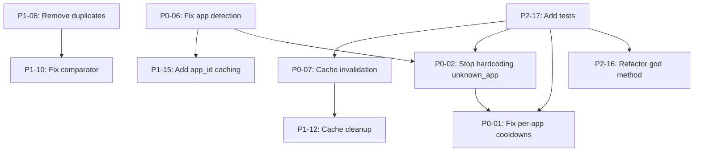

# Issue Template Index

Quick reference for all 20 issue templates.

## Priority 0 - Correctness & Reliability (Critical)

| ID | File | Title | Impact |
|----|------|-------|--------|
| 01 | [P0-01-cooldowns-not-per-app.md](P0-01-cooldowns-not-per-app.md) | Cooldowns not per-app | Apps blocked by failures in other apps |
| 02 | [P0-02-unknown-app-hardcoded.md](P0-02-unknown-app-hardcoded.md) | "unknown_app" hardcoded | Breaks per-app cooldown tracking |
| 03 | [P0-03-metrics-mutex-poisoning.md](P0-03-metrics-mutex-poisoning.md) | Metrics mutex poisoning | Silently loses metrics |
| 04 | [P0-04-no-timeouts-on-awaits.md](P0-04-no-timeouts-on-awaits.md) | No timeouts on awaited operations | Can hang indefinitely |
| 05 | [P0-05-blocking-runtime.md](P0-05-blocking-runtime.md) | Blocking runtime calls | Blocks tokio threads |
| 06 | [P0-06-silent-failures-app-detection.md](P0-06-silent-failures-app-detection.md) | Silent failures in app detection | Cannot diagnose detection issues |
| 07 | [P0-07-no-cache-invalidation.md](P0-07-no-cache-invalidation.md) | No cache invalidation | Stale method ordering |

## Priority 1 - Performance & Maintainability (Important)

| ID | File | Title | Impact |
|----|------|-------|--------|
| 08 | [P1-08-duplicate-functions.md](P1-08-duplicate-functions.md) | Duplicate functions | Maintenance burden |
| 09 | [P1-09-hash-not-zero-copy.md](P1-09-hash-not-zero-copy.md) | 32-bit hash, not zero-copy | Unnecessary allocations |
| 10 | [P1-10-inefficient-comparator.md](P1-10-inefficient-comparator.md) | Inefficient comparator | O(n²) sorting |
| 11 | [P1-11-unbatched-metrics.md](P1-11-unbatched-metrics.md) | Unbatched metrics | Lock contention |
| 12 | [P1-12-no-cache-cleanup.md](P1-12-no-cache-cleanup.md) | No cache cleanup | Memory leak |
| 13 | [P1-13-magic-numbers.md](P1-13-magic-numbers.md) | Magic numbers remain | Hard to tune behavior |
| 14 | [P1-14-dead-code.md](P1-14-dead-code.md) | Dead paste/keystroke code | Code clutter |
| 15 | [P1-15-no-app-id-caching.md](P1-15-no-app-id-caching.md) | No app_id caching | Repeated process spawns |

## Priority 2 - Structure, Testing & Documentation (Enhancement)

| ID | File | Title | Impact |
|----|------|-------|--------|
| 16 | [P2-16-god-method.md](P2-16-god-method.md) | God method intact | Hard to test and maintain |
| 17 | [P2-17-missing-tests.md](P2-17-missing-tests.md) | Missing targeted tests | Low test coverage |
| 18 | [P2-18-dead-code-preserved.md](P2-18-dead-code-preserved.md) | Dead code preserved | Maintenance burden |
| 19 | [P2-19-ci-knobs-in-production.md](P2-19-ci-knobs-in-production.md) | CI knobs in production | Behavior divergence |
| 20 | [P2-20-undocumented.md](P2-20-undocumented.md) | Undocumented | Poor developer experience |

## Issue Dependencies

## Recommended Work Order

### Sprint 1: Foundation (Week 1)
1. **P0-06** - Fix silent failures in app detection ⚠️ BLOCKS OTHERS
2. **P0-02** - Stop hardcoding "unknown_app" (depends on P0-06)
3. **P0-01** - Fix per-app cooldown checks (depends on P0-02)
4. **P0-03** - Handle metrics mutex poisoning
5. **P0-04** - Add timeouts to async operations

### Sprint 2: Stability & Quick Wins (Week 2)
6. **P0-05** - Fix blocking runtime calls
7. **P0-07** - Implement cache invalidation
8. **P1-08** - Remove duplicate functions
9. **P1-13** - Extract magic numbers
10. **P1-14** - Clean up dead code

### Sprint 3: Performance (Week 3)
11. **P1-09** - Optimize redact_text
12. **P1-10** - Fix inefficient comparator
13. **P1-12** - Add cache cleanup
14. **P1-15** - Add app_id caching
15. **P1-11** - Batch metrics updates

### Sprint 4: Quality (Week 4)
16. **P2-17** - Add comprehensive tests ⚠️ DO THIS FIRST
17. **P2-18** - Audit and remove dead code
18. **P2-19** - Remove CI conditionals
19. **P2-16** - Refactor god method (with tests)
20. **P2-20** - Add documentation

## Quick Stats

- **Total Issues**: 20
- **Critical (P0)**: 7 issues
- **Important (P1)**: 8 issues  
- **Enhancement (P2)**: 5 issues
- **Estimated Effort**: 8-12 developer days
- **Lines Affected**: ~1000-1500 lines
- **Primary File**: `crates/coldvox-text-injection/src/manager.rs`

## Labels to Apply

When creating GitHub issues, use these labels:

**Priority Labels:**
- `priority:P0` - Critical correctness issues
- `priority:P1` - Important performance/maintainability  
- `priority:P2` - Enhancement

**Type Labels:**
- `bug` - For P0 issues and some P1 issues
- `performance` - For optimization issues
- `refactor` - For code structure improvements
- `testing` - For test coverage
- `documentation` - For docs

**Component Label:**
- `component:text-injection` - All issues

**Additional Labels:**
- `good first issue` - P1-13, P1-14 might qualify
- `help wanted` - For complex issues needing expertise
- `dependencies` - For issues blocked by others

---

*Generated: 2025-10-08*
*Source: Monolithic text-injection refactoring issue*
