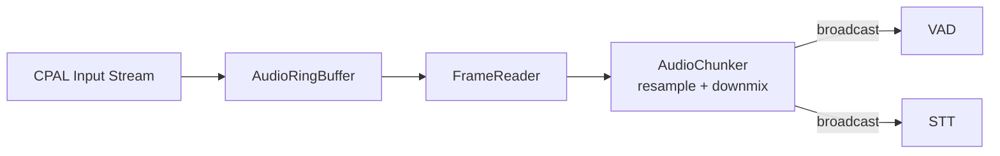

# ColdVox Repository Summary

## Project Purpose

ColdVox is a Rust-based real-time audio processing and voice-to-text application designed for reliable microphone capture, voice activity detection (VAD), speech-to-text (STT) transcription, and automated text injection. It targets Linux environments (specifically Nobara with KDE Plasma) as a prototype, with plans for cross-platform expansion. The project focuses on building a robust pipeline for voice AI applications, emphasizing stability, performance monitoring, and modularity through a Cargo workspace structure. Key use cases include streaming transcription, accessibility tools, and automation via text injection backends.

The default end-to-end pipeline integrates:
- Audio capture and processing.
- Silero VAD for voice detection.
- Vosk STT for transcription.
- Text injection for outputting results to applications.

## Repository Structure

The repository is organized as a Cargo workspace under the root directory `/home/coldaine/Projects/Worktrees/ColdVox2`. Key directories include:

- **crates/**: Contains all Rust crates (detailed below).
- **docs/**: Documentation, including architecture overviews, testing guides, and project status (e.g., [`docs/PROJECT_STATUS.md`](docs/PROJECT_STATUS.md), [`docs/configuration-architecture.md`](docs/configuration-architecture.md)).
- **examples/**: Example applications and demos.
- **diagrams/**: Mermaid diagrams for architecture and dependencies (e.g., [`diagrams/feature_tags_dependency.mmd`](diagrams/feature_tags_dependency.mmd)).
- **github_issues/**: Markdown files representing GitHub issues for tracking features and bugs.
- **scripts/**: CI and build scripts.
- **test/**: Testing utilities, including Docker setups.
- **vendor/**: Vendored dependencies like Vosk (not listed in file tree but referenced in README).

Root files include:
- [`Cargo.toml`](Cargo.toml): Workspace configuration.
- [`README.md`](README.md): Project introduction, quick start, and architecture diagram.
- Configuration files like `.clippy.toml`, `.pre-commit-config.yaml`, and `deny.toml` for linting and security.

## Crates Overview

ColdVox uses a multi-crate workspace for modularity. The root [`Cargo.toml`](Cargo.toml) defines 10 member crates, all requiring Rust 1.75+. All crates are at version 0.1.0 and use the 2021 edition. Below is a detailed breakdown based on each crate's [`Cargo.toml`](crates/*/Cargo.toml) and related docs.

### 1. app (crates/app/)
- **Description**: Main application binaries and CLI interface.
- **Binaries**: `coldvox` (default), `tui_dashboard` (TUI monitoring), `mic_probe` (audio testing).
- **Examples**: foundation_probe, record_10s, vosk_test, inject_demo, test_hotkey_backend, test_kglobalaccel_hotkey, test_silero_wav, device_hotplug_demo (gated by features).
- **Dependencies**: zbus, tokio (full), anyhow, thiserror, tracing, parking_lot, tracing-subscriber, async-trait, hound, rubato, crossbeam-channel, once_cell, serde (derive), serde_json, toml, clap (derive/env), env_logger, chrono (serde), ratatui, crossterm, futures, fastrand, csv, cpal. Internal: coldvox-foundation, coldvox-telemetry, coldvox-audio, coldvox-vad, coldvox-vad-silero, coldvox-stt, coldvox-stt-vosk (optional).
- **Platform-Specific**: Linux (atspi, wl_clipboard, ydotool), Windows/macOS (enigo) for text-injection.
- **Features**: default=["silero","vosk","text-injection"], live-hardware-tests, vosk, whisper, no-stt, examples, text-injection, silero, sleep-observer, text-injection-* variants.
- **Dev Dependencies**: tempfile, mockall, tokio-test, ctrlc, proptest, rand.

### 2. coldvox-foundation (crates/coldvox-foundation/)
- **Description**: Core types, errors, and foundation functionality.
- **Dependencies**: thiserror, tokio (sync/time/rt/signal), tracing, cpal, serde (derive), parking_lot, crossbeam-channel.
- **Features**: default=[].

### 3. coldvox-audio (crates/coldvox-audio/)
- **Description**: Audio capture, processing, and device management.
- **Dependencies**: coldvox-foundation, coldvox-telemetry, cpal, rtrb, dasp (all), rubato, parking_lot, tokio (sync/rt), tracing, anyhow, thiserror.
- **Features**: default=[].

### 4. coldvox-gui (crates/coldvox-gui/)
- **Description**: GUI frontend (placeholder for Qt/CXX-Qt development).
- **Binaries**: coldvox-gui.
- **Dependencies**: cxx, cxx-qt (optional), cxx-qt-lib (optional, qt_qml/qt_gui).
- **Build Dependencies**: cxx-qt-build.
- **Features**: default=[], qt-ui.

### 5. coldvox-stt (crates/coldvox-stt/)
- **Description**: Speech-to-text abstraction layer.
- **Dependencies**: tokio (sync/macros/time), tracing, parking_lot, async-trait, thiserror.
- **Features**: default=[], vosk, whisper.

### 6. coldvox-stt-vosk (crates/coldvox-stt-vosk/)
- **Description**: Vosk STT implementation.
- **Dependencies**: coldvox-stt, vosk (optional), tracing.
- **Features**: default=[], vosk.

### 7. coldvox-telemetry (crates/coldvox-telemetry/)
- **Description**: Telemetry and metrics infrastructure.
- **Dependencies**: parking_lot, coldvox-text-injection (optional).
- **Features**: default=[], text-injection.

### 8. coldvox-text-injection (crates/coldvox-text-injection/)
- **Description**: Text injection backends and session management.
- **Dependencies**: tokio (full), anyhow, thiserror, tracing, async-trait, parking_lot, serde (derive), serde_json, toml, chrono (serde), coldvox-stt. Optional: atspi, wl-clipboard-rs, enigo, regex.
- **Dev Dependencies**: tempfile, mockall, tokio-test, rand, arboard, tracing-subscriber, serial_test.
- **Build Dependencies**: cc, pkg-config.
- **Features**: default=[], atspi, wl_clipboard, enigo, kdotool, ydotool, regex, all-backends, linux-desktop, live-hardware-tests, real-injection-tests, xdg_kdotool.

### 9. coldvox-vad (crates/coldvox-vad/)
- **Description**: VAD trait and core functionality.
- **Dependencies**: serde (derive).
- **Dev Dependencies**: rand.
- **Features**: default=[].

### 10. coldvox-vad-silero (crates/coldvox-vad-silero/)
- **Description**: Silero ONNX-based VAD.
- **Dependencies**: coldvox-vad, serde (derive), voice_activity_detector (git, optional).
- **Features**: default=[], silero.

## Architecture and Pipeline

The core pipeline (from [`README.md`](README.md) Mermaid diagram):

- **Audio Flow**: Device-native capture → Ring buffer → Chunking (16kHz mono) → Broadcast to VAD/STT.
- **Modularity**: Plugin-based STT (Vosk default, Whisper stub), multiple text injection backends (AT-SPI, clipboard, ydotool, enigo).
- **Monitoring**: Telemetry for metrics, health checks, and logging.
- **Configuration**: CLI flags, env vars (e.g., VOSK_MODEL_PATH, RUST_LOG), TOML support planned.

## Current Status

From [`docs/PROJECT_STATUS.md`](docs/PROJECT_STATUS.md):
- **Phase**: STT Integration Enhancement (Vosk streaming, multi-backend prep).
- **Completed**: Bug fixes, ring buffer, audio refactoring, multi-crate split, text injection unification.
- **Upcoming**: GUI development, Whisper integration, platform testing.
- **Known Issues**: AT-SPI fallbacks, regex optimizations, broader backend testing.
- **CI/CD**: GitHub Actions for Linux, headless testing with Xvfb.
- **License**: MIT OR Apache-2.0; vendored Vosk (Apache-2.0).

## Dependencies and Build

- **External**: Relies on cpal for audio, vosk for STT, ONNX via vendored Silero fork.
- **Build**: Cargo workspace; features gate optional components. Requires Rust 1.75+.
- **Testing**: Unit/integration with mockall, proptest; hardware tests via features.
- **Platform**: Linux-focused; Windows/macOS via enigo.

This summary is based on the repository state as of 2025-09-08. For updates, refer to CHANGELOG.md or run cargo updates.