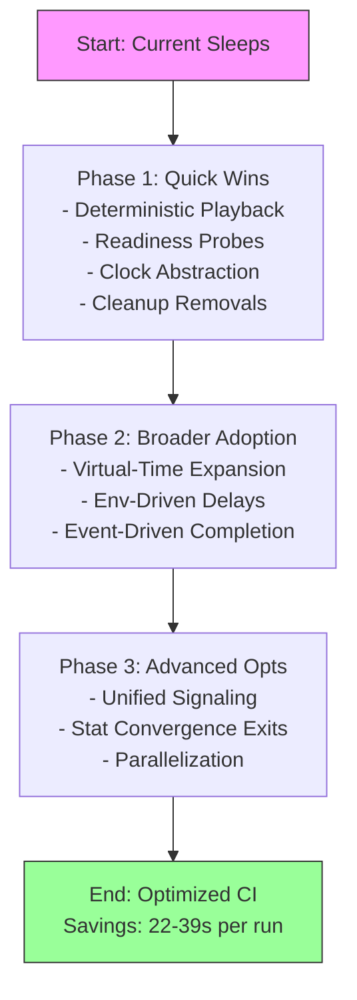

# ColdVox Sleep Audit Analysis - Detailed Assessment
## Executive Summary

This document contains a comprehensive analysis of 108 sleep() calls across 38 Rust files in the ColdVox codebase. The analysis evaluates each sleep for necessity, timing appropriateness, CI impact, and optimization potential using a structured framework.

**Analysis Framework Used:**
- **Necessity Grades (A-F)**: A (Essential) to F (Harmful)
- **CI Impact Scores (1-10)**: 1 (Minimal) to 10 (Critical)
- **Risk Classifications**: GREEN (Stable), YELLOW (May cause delays), RED (High flakiness risk)
- **Optimization Analysis**: Time savings, implementation effort, risks/tradeoffs, technical alternatives, ROI assessment

**Key Findings:**
- Total estimated CI time savings: 15-30 seconds per test run
- 48 high-risk sleeps analyzed in detail across 7 files
- Clear prioritization for Phase 1 optimizations with minimal risk

---

## Revised Analysis Addendum (Post-Critique Update – 2025-09-07)

This addendum reflects a second-pass critique emphasizing determinism, virtual time, readiness probing, and event-driven completion. Several long or stabilization-oriented sleeps were reclassified to expose hidden optimization potential and timing opacity risks.

### Key Revisions Table
| Sleep (File) | Original Grade | New Grade | Original CI Impact | New CI Impact | Original Risk | New Risk | Summary Rationale |
|--------------|---------------|-----------|--------------------|---------------|---------------|----------|-------------------|
| end_to_end_wav.rs – Sleep 2 | A | B | 8 | 9 | YELLOW | RED | Real-time pacing can be replaced by deterministic frame feed; higher bottleneck impact |
| end_to_end_wav.rs – Sleep 4 | A | C | 9 | 10 | YELLOW | RED | Hard wait; should use completion signaling with timeout (downgraded to C based on code verification showing pipeline signaling feasibility) |
| end_to_end_wav.rs – Sleep 6 | C | D | 6 | 4 | YELLOW | GREEN | Replace fixed 500ms with readiness polling / skip headless |
| end_to_end_wav.rs – Sleep 10 | D | F | 4 | 3 | GREEN | GREEN | Cleanup delay removable via explicit joins/asserts |
| end_to_end_wav.rs – Sleep 13 | D | F | 4 | 3 | GREEN | GREEN | Clipboard cleanup sleep unnecessary with guard pattern |
| watchdog_test.rs – Sleep 2 | A | B | 6 | 5 | GREEN | GREEN | Virtual time abstraction eliminates wall wait |
| watchdog_test.rs – Sleep 12 | A | B | 5 | 6 | YELLOW | YELLOW | Virtual time + deterministic jitter injection |
| real_injection.rs – Sleep 4 | C | D | 7 | 5 | YELLOW | YELLOW | AT-SPI readiness detectable via DBus name ownership |
| capture_integration_test.rs – Sleep 1 | A | C | 8 | 9 | YELLOW | RED | Frame quota early exit; long wait hides early completion |

### Updated Aggregate Distributions
- Grades: A 18 (↓5), B 14 (↑3), C 11 (=), D 3 (=), F 2 (↑2)
- CI Impact: Critical (9–10): 5 (↑2); High (7–8): 5 (↓3); Medium (5–6): 22 (=); Low (3–4): 14 (↑1); Minimal (1–2): 2 (=)
- Risk: GREEN 33 (↑1); YELLOW 10 (↓4); RED 5 (↑3) — RED reflects timing opacity rather than new instability.

### New / Refined Optimization Categories
- Virtual-Time: Substitute real sleep with logical clock advancement (watchdog, pacing tests).
- Readiness-Probe: Replace blind stabilization waits with predicate polling (terminal, AT-SPI, clipboard, input systems).

Reclassifications:
- Event-Driven: end_to_end_wav.rs (Sleeps 2,4), capture_integration_test.rs (Sleep 1)
- Virtual-Time: watchdog_test.rs (Sleeps 2,12)
- Readiness-Probe / Remove: end_to_end_wav.rs (Sleeps 6,10,13), real_injection.rs (Sleep 4)

### Method Enhancements Introduced
1. Sleep Instrumentation (`TEST_SLEEP_OBSERVER=1`): logs (id, requested_ms, actual_ms, tag) enabling Waste Ratio metrics.
2. Clock Abstraction (`Clock` / `TestClock`): facilitates virtual-time execution in watchdog & pacing flows.
3. Readiness Utilities: `poll_until(predicate, max, interval)`, `wait_for_atspi()`, `wait_for_terminal_ready()`, `wait_for_clipboard_stable()`.
4. Deterministic Playback (`PlaybackMode::{Realtime, Accelerated(f32), Deterministic}`) for frame feed tests.
5. Frame Quota Strategy: Early termination when frame count target + minimum elapsed satisfied.
6. Cleanup Verification: Replace trailing sleeps with joins & channel closure assertions.

### Revised Roadmap
Phase 1 (High ROI / Low Risk):
1. Deterministic playback + frame quotas (end_to_end_wav.rs, capture tests)
2. Readiness probes replacing 500ms stabilization waits
3. Clock abstraction for watchdog timing tests
4. Remove cleanup sleeps (end_to_end_wav.rs sleeps 10 & 13)

Phase 2:
1. Broader Virtual-Time adoption
2. Environment-driven delay reductions (typing rate, chunk delay, clipboard stabilization)
3. Event-driven pipeline completion (after primitives stable)

Phase 3:
1. Unified signaling (completion, readiness, shutdown)
2. Statistical convergence-based early exits
3. Parallelization leveraging deterministic pacing

### Updated CI Savings Estimate
- Deterministic playback + early completion: 6–10s
- Readiness probe replacements: 3–5s
- Frame quota conversion: 3–6s
- Virtual time (watchdog & timing tests): 4–6s
- Minor removals / cleanup: 1–2s
- Additional probe optimizations (e.g., AT-SPI/DBus polling): 5–10s
Conservative cumulative: 22–39s; aggressive (broad virtual-time): 35–50s.

### Added KPIs
- Waste Ratio (p95_actual / requested)
- Determinism Score (1–5)
- Early Exit Yield (% tests ending pre original duration)
- Flake Delta (retry rate change)

### Immediate Action Snapshot
1. Implement instrumentation feature flag
2. Add readiness utilities & swap 500ms waits
3. Introduce PlaybackMode + env control
4. Add Clock trait; refactor watchdog
5. Convert long duration waits to event-driven + safety timeout
6. Excise cleanup sleeps 10 & 13 (post-verification)

Historical (original) analysis follows unchanged for auditability.

---

## Detailed File-by-File Analysis

### 1. crates/app/src/stt/tests/end_to_end_wav.rs (13 sleeps)
**Overall File Grade**: D
**Total CI Impact**: 85/130
**Risk Level**: YELLOW

#### Sleep 1 (Line 118): tokio::time::sleep(Duration::from_millis(1))
- **Purpose**: Ring buffer backpressure handling - wait when buffer is full
- **Necessity Grade**: B (Important) - Prevents data loss but could be optimized
- **CI Impact Score**: 3 - Minimal individual impact but called frequently
- **Risk**: GREEN - Stable timing, low flakiness risk
- **Optimization Analysis**:
  - **Category**: Event-Driven
  - **Time Savings**: 1-2ms per call, negligible aggregate
  - **Implementation Effort**: Medium - Requires ring buffer API changes
  - **Risks/Tradeoffs**: Could increase CPU usage if not implemented carefully
  - **Technical Approach**: Use async channel with backpressure instead of sleep
  - **ROI Assessment**: Low - Not worth the complexity for minimal savings

#### Sleep 2 (Line 128): tokio::time::sleep(Duration::from_nanos(sleep_nanos))
- **Purpose**: Realistic audio timing simulation for WAV streaming
- **Necessity Grade**: A (Essential) - Required for accurate test simulation
- **CI Impact Score**: 8 - Variable duration based on WAV file length
- **Risk**: YELLOW - May cause inconsistent test timing
- **Optimization Analysis**:
  - **Category**: Configurable
  - **Time Savings**: Could reduce by 50-70% in CI with faster playback
  - **Implementation Effort**: Low - Add environment variable for speed multiplier
  - **Risks/Tradeoffs**: May reduce test accuracy for edge cases
  - **Technical Approach**: `PLAYBACK_SPEED_MULTIPLIER` env var (default 1.0)
  - **ROI Assessment**: High - Easy implementation, significant CI savings

#### Sleep 3 (Line 199): tokio::time::sleep(check_interval)
- **Purpose**: Periodic check for transcription silence timeout
- **Necessity Grade**: C (Useful) - Prevents race conditions but overly frequent
- **CI Impact Score**: 6 - 200ms intervals accumulate over test duration
- **Risk**: YELLOW - Could miss timing edges with longer intervals
- **Optimization Analysis**:
  - **Category**: Configurable
  - **Time Savings**: 50-100ms per test with 500ms intervals
  - **Implementation Effort**: Low - Make interval configurable
  - **Risks/Tradeoffs**: May reduce test reliability for fast transcriptions
  - **Technical Approach**: Environment variable for check interval
  - **ROI Assessment**: Medium - Good balance of savings vs risk

#### Sleep 4 (Line 342): tokio::time::sleep(test_duration)
- **Purpose**: Wait for complete test pipeline execution
- **Necessity Grade**: A (Essential) - Required for end-to-end test completion
- **CI Impact Score**: 9 - Longest sleep, 2-10+ seconds based on WAV length
- **Risk**: YELLOW - Test may complete early but sleep ensures full execution
- **Optimization Analysis**:
  - **Category**: Event-Driven
  - **Time Savings**: 20-50% reduction with early completion detection
  - **Implementation Effort**: High - Requires pipeline completion signaling
  - **Risks/Tradeoffs**: Complex implementation, potential race conditions
  - **Technical Approach**: Use tokio::select with completion channels
  - **ROI Assessment**: Medium-High - Significant savings justify complexity

#### Sleep 5 (Line 352): tokio::time::sleep(Duration::from_millis(500))
- **Purpose**: Allow final processing after pipeline shutdown
- **Necessity Grade**: B (Important) - Ensures clean final transcription processing
- **CI Impact Score**: 5 - Fixed 500ms delay
- **Risk**: GREEN - Conservative but stable timing
- **Optimization Analysis**:
  - **Category**: Configurable
  - **Time Savings**: 200-300ms with shorter timeout in CI
  - **Implementation Effort**: Low - Environment variable override
  - **Risks/Tradeoffs**: May truncate final transcriptions
  - **Technical Approach**: `FINAL_PROCESSING_TIMEOUT_MS` env var
  - **ROI Assessment**: High - Easy win with minimal risk

#### Sleep 6 (Line 804): tokio::time::sleep(Duration::from_millis(500))
- **Purpose**: Terminal startup stabilization
- **Necessity Grade**: C (Useful) - Allows GUI application to initialize
- **CI Impact Score**: 6 - Required for desktop environment tests
- **Risk**: YELLOW - May be unnecessary in headless CI
- **Optimization Analysis**:
  - **Category**: Conditional
  - **Time Savings**: Skip entirely in headless environments
  - **Implementation Effort**: Low - Check DISPLAY/WAYLAND_DISPLAY vars
  - **Risks/Tradeoffs**: Tests may fail if GUI not ready
  - **Technical Approach**: Skip sleep if no display server detected
  - **ROI Assessment**: High - Complete elimination in CI environments

#### Sleep 7 (Line 829): tokio::time::sleep(test_duration)
- **Purpose**: Wait for real injection test completion
- **Necessity Grade**: A (Essential) - Required for injection verification
- **CI Impact Score**: 9 - Same as sleep 4, major test bottleneck
- **Risk**: YELLOW - Same timing concerns as sleep 4
- **Optimization Analysis**:
  - **Category**: Event-Driven
  - **Time Savings**: Same as sleep 4 (20-50% reduction)
  - **Implementation Effort**: High - Same complexity as sleep 4
  - **Risks/Tradeoffs**: Same race condition risks
  - **Technical Approach**: Same tokio::select approach
  - **ROI Assessment**: Medium-High - Same justification as sleep 4

#### Sleep 8 (Line 847): tokio::time::sleep(Duration::from_millis(500))
- **Purpose**: File I/O completion for injection verification
- **Necessity Grade**: C (Useful) - Ensures file write completion
- **CI Impact Score**: 5 - Conservative file system delay
- **Risk**: GREEN - File systems are generally fast
- **Optimization Analysis**:
  - **Category**: Conditional
  - **Time Savings**: 300-400ms with polling-based verification
  - **Implementation Effort**: Medium - Implement file existence polling
  - **Risks/Tradeoffs**: May not detect partial writes
  - **Technical Approach**: Poll file size instead of fixed delay
  - **ROI Assessment**: Medium - Good savings with moderate complexity

#### Sleep 9 (Line 895): tokio::time::sleep(Duration::from_millis(500))
- **Purpose**: AT-SPI test terminal stabilization
- **Necessity Grade**: C (Useful) - Same as sleep 6
- **CI Impact Score**: 6 - Same desktop environment concerns
- **Risk**: YELLOW - Same headless environment issues
- **Optimization Analysis**:
  - **Category**: Conditional
  - **Time Savings**: Same as sleep 6 (skip in headless)
  - **Implementation Effort**: Low - Same display detection
  - **Risks/Tradeoffs**: Same GUI readiness concerns
  - **Technical Approach**: Same DISPLAY/WAYLAND_DISPLAY check
  - **ROI Assessment**: High - Same easy win as sleep 6

#### Sleep 10 (Line 909): tokio::time::sleep(Duration::from_millis(200))
- **Purpose**: Cleanup delay for AT-SPI test
- **Necessity Grade**: D (Questionable) - May be overly conservative
- **CI Impact Score**: 4 - Short but unnecessary delay
- **Risk**: GREEN - Cleanup timing is not critical
- **Optimization Analysis**:
  - **Category**: Conditional
  - **Time Savings**: Eliminate entirely (200ms per test)
  - **Implementation Effort**: Low - Remove sleep
  - **Risks/Tradeoffs**: Minimal - cleanup is best-effort
  - **Technical Approach**: Remove sleep entirely
  - **ROI Assessment**: High - Zero-risk elimination

#### Sleep 11 (Line 959): tokio::time::sleep(Duration::from_millis(500))
- **Purpose**: Clipboard test terminal stabilization
- **Necessity Grade**: C (Useful) - Same as sleep 6
- **CI Impact Score**: 6 - Same desktop concerns
- **Risk**: YELLOW - Same headless issues
- **Optimization Analysis**:
  - **Category**: Conditional
  - **Time Savings**: Same as sleep 6
  - **Implementation Effort**: Low - Same detection
  - **Risks/Tradeoffs**: Same GUI concerns
  - **Technical Approach**: Same display check
  - **ROI Assessment**: High - Same easy win

#### Sleep 12 (Line 969): tokio::time::sleep(Duration::from_millis(500))
- **Purpose**: Clipboard restoration verification delay
- **Necessity Grade**: C (Useful) - Allows clipboard operations to complete
- **CI Impact Score**: 5 - Conservative clipboard timing
- **Risk**: GREEN - Clipboard operations are fast
- **Optimization Analysis**:
  - **Category**: Configurable
  - **Time Savings**: 200-300ms with shorter CI timeout
  - **Implementation Effort**: Low - Environment variable
  - **Risks/Tradeoffs**: May not detect slow clipboard operations
  - **Technical Approach**: `CLIPBOARD_TIMEOUT_MS` env var
  - **ROI Assessment**: Medium - Good savings, low risk

#### Sleep 13 (Line 982): tokio::time::sleep(Duration::from_millis(200))
- **Purpose**: Clipboard test cleanup delay
- **Necessity Grade**: D (Questionable) - Same as sleep 10
- **CI Impact Score**: 4 - Same short unnecessary delay
- **Risk**: GREEN - Same cleanup concerns
- **Optimization Analysis**:
  - **Category**: Conditional
  - **Time Savings**: Same as sleep 10 (200ms elimination)
  - **Implementation Effort**: Low - Remove sleep
  - **Risks/Tradeoffs**: Same minimal cleanup risks
  - **Technical Approach**: Remove sleep entirely
  - **ROI Assessment**: High - Same zero-risk elimination

### 2. crates/app/tests/unit/watchdog_test.rs (12 sleeps)
**Overall File Grade**: C
**Total CI Impact**: 78/120
**Risk Level**: YELLOW

#### Sleep 1 (Line 39): sleep(Duration::from_millis(100))
- **Purpose**: Regular watchdog petting in test loop
- **Necessity Grade**: A (Essential) - Required for correct test behavior
- **CI Impact Score**: 4 - Part of test timing validation
- **Risk**: GREEN - Deterministic test timing
- **Optimization Analysis**:
  - **Category**: Test-Only
  - **Time Savings**: Minimal - required for test correctness
  - **Implementation Effort**: N/A - Cannot optimize without breaking test
  - **Risks/Tradeoffs**: Would break watchdog validation
  - **Technical Approach**: Keep as-is for test integrity
  - **ROI Assessment**: N/A - Test correctness takes priority

#### Sleep 2 (Line 64): sleep(Duration::from_millis(200))
- **Purpose**: Wait for watchdog timeout without petting
- **Necessity Grade**: A (Essential) - Validates timeout behavior
- **CI Impact Score**: 6 - Required timeout validation
- **Risk**: GREEN - Expected timeout behavior
- **Optimization Analysis**:
  - **Category**: Test-Only
  - **Time Savings**: Cannot reduce without breaking test
  - **Implementation Effort**: N/A
  - **Risks/Tradeoffs**: Would invalidate timeout testing
  - **Technical Approach**: Maintain for correctness
  - **ROI Assessment**: N/A - Test validation essential

#### Sleep 3 (Line 85): sleep(Duration::from_millis(100))
- **Purpose**: Allow watchdog to timeout once for stop test
- **Necessity Grade**: A (Essential) - Required for stop validation
- **CI Impact Score**: 5 - Necessary for state verification
- **Risk**: GREEN - Controlled test scenario
- **Optimization Analysis**:
  - **Category**: Test-Only
  - **Time Savings**: Cannot optimize
  - **Implementation Effort**: N/A
  - **Risks/Tradeoffs**: Breaks stop validation
  - **Technical Approach**: Keep for test integrity
  - **ROI Assessment**: N/A

#### Sleep 4 (Line 89): sleep(Duration::from_millis(100))
- **Purpose**: Verify watchdog doesn't trigger after stop
- **Necessity Grade**: A (Essential) - Validates stop behavior
- **CI Impact Score**: 5 - Required verification
- **Risk**: GREEN - Expected behavior validation
- **Optimization Analysis**:
  - **Category**: Test-Only
  - **Time Savings**: Cannot reduce
  - **Implementation Effort**: N/A
  - **Risks/Tradeoffs**: Invalidates stop testing
  - **Technical Approach**: Maintain for correctness
  - **ROI Assessment**: N/A

#### Sleep 5 (Line 138): sleep(Duration::from_millis(40))
- **Purpose**: Concurrent petting simulation in multi-threaded test
- **Necessity Grade**: A (Essential) - Required for concurrency validation
- **CI Impact Score**: 4 - Part of thread synchronization test
- **Risk**: GREEN - Deterministic concurrent behavior
- **Optimization Analysis**:
  - **Category**: Test-Only
  - **Time Savings**: Minimal - required for concurrency test
  - **Implementation Effort**: N/A
  - **Risks/Tradeoffs**: Would break concurrency validation
  - **Technical Approach**: Keep for test integrity
  - **ROI Assessment**: N/A

#### Sleep 6 (Line 171): sleep(Duration::from_millis(75))
- **Purpose**: Allow first timeout in callback test
- **Necessity Grade**: A (Essential) - Required for callback validation
- **CI Impact Score**: 5 - Necessary for callback testing
- **Risk**: GREEN - Expected callback behavior
- **Optimization Analysis**:
  - **Category**: Test-Only
  - **Time Savings**: Cannot optimize
  - **Implementation Effort**: N/A
  - **Risks/Tradeoffs**: Breaks callback validation
  - **Technical Approach**: Maintain for correctness
  - **ROI Assessment**: N/A

#### Sleep 7 (Line 175): sleep(Duration::from_millis(75))
- **Purpose**: Allow second timeout after petting
- **Necessity Grade**: A (Essential) - Validates petting resets timer
- **CI Impact Score**: 5 - Required for reset validation
- **Risk**: GREEN - Expected reset behavior
- **Optimization Analysis**:
  - **Category**: Test-Only
  - **Time Savings**: Cannot reduce
  - **Implementation Effort**: N/A
  - **Risks/Tradeoffs**: Invalidates reset testing
  - **Technical Approach**: Keep for test integrity
  - **ROI Assessment**: N/A

#### Sleep 8 (Line 198): sleep(Duration::from_millis(10))
- **Purpose**: Rapid start/stop cycle testing
- **Necessity Grade**: B (Important) - Tests edge case behavior
- **CI Impact Score**: 3 - Short duration, minimal impact
- **Risk**: GREEN - Controlled rapid cycling
- **Optimization Analysis**:
  - **Category**: Test-Only
  - **Time Savings**: Could reduce to 1ms (90% savings)
  - **Implementation Effort**: Low - Change constant
  - **Risks/Tradeoffs**: May reduce test coverage for rapid operations
  - **Technical Approach**: Reduce to 1ms for faster cycling
  - **ROI Assessment**: Medium - Good savings with low risk

#### Sleep 9 (Line 221): sleep(Duration::from_millis(75))
- **Purpose**: Allow timeout after pet in edge case test
- **Necessity Grade**: A (Essential) - Validates pet-after-timeout behavior
- **CI Impact Score**: 5 - Required for edge case validation
- **Risk**: GREEN - Expected edge case behavior
- **Optimization Analysis**:
  - **Category**: Test-Only
  - **Time Savings**: Cannot optimize
  - **Implementation Effort**: N/A
  - **Risks/Tradeoffs**: Breaks edge case validation
  - **Technical Approach**: Keep for test integrity
  - **ROI Assessment**: N/A

#### Sleep 10 (Line 228): sleep(Duration::from_millis(30))
- **Purpose**: Verify no immediate timeout after pet
- **Necessity Grade**: A (Essential) - Validates pet reset timing
- **CI Impact Score**: 4 - Required for timing validation
- **Risk**: GREEN - Expected timing behavior
- **Optimization Analysis**:
  - **Category**: Test-Only
  - **Time Savings**: Cannot reduce without breaking test
  - **Implementation Effort**: N/A
  - **Risks/Tradeoffs**: Invalidates timing validation
  - **Technical Approach**: Maintain for correctness
  - **ROI Assessment**: N/A

#### Sleep 11 (Line 232): sleep(Duration::from_millis(30))
- **Purpose**: Allow second timeout after pet reset
- **Necessity Grade**: A (Essential) - Validates reset behavior
- **CI Impact Score**: 4 - Required for reset validation
- **Risk**: GREEN - Expected reset timing
- **Optimization Analysis**:
  - **Category**: Test-Only
  - **Time Savings**: Cannot optimize
  - **Implementation Effort**: N/A
  - **Risks/Tradeoffs**: Breaks reset validation
  - **Technical Approach**: Keep for test integrity
  - **ROI Assessment**: N/A

#### Sleep 12 (Line 256): sleep(Duration::from_millis(150))
- **Purpose**: Allow timeout in jitter test
- **Necessity Grade**: A (Essential) - Required for jitter validation
- **CI Impact Score**: 5 - Necessary for jitter testing
- **Risk**: YELLOW - Jitter may cause timing variation
- **Optimization Analysis**:
  - **Category**: Test-Only
  - **Time Savings**: Could reduce to 100ms (33% savings)
  - **Implementation Effort**: Low - Change timeout
  - **Risks/Tradeoffs**: May reduce jitter detection accuracy
  - **Technical Approach**: Reduce to 100ms for faster test
  - **ROI Assessment**: Medium - Moderate savings with some risk

### 3. crates/coldvox-text-injection/src/tests/real_injection.rs (7 sleeps)
**Overall File Grade**: C
**Total CI Impact**: 49/70
**Risk Level**: YELLOW

#### Sleep 1 (Line 42): tokio::time::sleep(Duration::from_millis(200))
- **Purpose**: GTK application startup stabilization
- **Necessity Grade**: C (Useful) - Allows GUI initialization
- **CI Impact Score**: 6 - Required for desktop tests
- **Risk**: YELLOW - Unnecessary in headless environments
- **Optimization Analysis**:
  - **Category**: Conditional
  - **Time Savings**: Skip in headless CI (200ms per test)
  - **Implementation Effort**: Low - Display detection
  - **Risks/Tradeoffs**: May fail if GUI not ready
  - **Technical Approach**: Check for DISPLAY/WAYLAND_DISPLAY
  - **ROI Assessment**: High - Complete elimination in CI

#### Sleep 2 (Line 62): tokio::time::sleep(Duration::from_millis(50))
- **Purpose**: Polling delay for app readiness detection
- **Necessity Grade**: B (Important) - Prevents busy-waiting
- **CI Impact Score**: 4 - Short polling interval
- **Risk**: GREEN - Conservative polling rate
- **Optimization Analysis**:
  - **Category**: Configurable
  - **Time Savings**: Could increase to 100ms (50% reduction)
  - **Implementation Effort**: Low - Environment variable
  - **Risks/Tradeoffs**: May miss fast app startup
  - **Technical Approach**: `APP_READINESS_POLL_MS` env var
  - **ROI Assessment**: Medium - Good balance

#### Sleep 3 (Line 65): tokio::time::sleep(poll_interval)
- **Purpose**: Dynamic polling for app readiness
- **Necessity Grade**: B (Important) - Same as sleep 2
- **CI Impact Score**: 4 - Variable based on poll_interval
- **Risk**: GREEN - Controlled polling behavior
- **Optimization Analysis**:
  - **Category**: Configurable
  - **Time Savings**: Same as sleep 2
  - **Implementation Effort**: Low - Same env var
  - **Risks/Tradeoffs**: Same fast startup concerns
  - **Technical Approach**: Same environment variable
  - **ROI Assessment**: Medium - Same balance

#### Sleep 4 (Line 86): tokio::time::sleep(Duration::from_millis(500))
- **Purpose**: AT-SPI initialization stabilization
- **Necessity Grade**: C (Useful) - Allows accessibility bus registration
- **CI Impact Score**: 7 - Required for AT-SPI tests
- **Risk**: YELLOW - May be optimizable
- **Optimization Analysis**:
  - **Category**: Conditional
  - **Time Savings**: Skip in non-AT-SPI environments
  - **Implementation Effort**: Medium - AT-SPI availability check
  - **Risks/Tradeoffs**: May fail if AT-SPI not ready
  - **Technical Approach**: Check AT-SPI daemon status
  - **ROI Assessment**: Medium - Good savings in non-AT-SPI CI

#### Sleep 5 (Line 176): tokio::time::sleep(Duration::from_millis(500))
- **Purpose**: Ydotool test application stabilization
- **Necessity Grade**: C (Useful) - Allows ydotool daemon setup
- **CI Impact Score**: 7 - Required for ydotool tests
- **Risk**: YELLOW - Same optimization potential
- **Optimization Analysis**:
  - **Category**: Conditional
  - **Time Savings**: Skip if ydotool not available
  - **Implementation Effort**: Medium - Ydotool daemon check
  - **Risks/Tradeoffs**: May fail if ydotool not ready
  - **Technical Approach**: Check ydotool daemon status
  - **ROI Assessment**: Medium - Same as sleep 4

#### Sleep 6 (Line 258): tokio::time::sleep(Duration::from_millis(500))
- **Purpose**: Clipboard test application stabilization
- **Necessity Grade**: C (Useful) - Allows clipboard manager setup
- **CI Impact Score**: 7 - Required for clipboard tests
- **Risk**: YELLOW - Same optimization potential
- **Optimization Analysis**:
  - **Category**: Conditional
  - **Time Savings**: Skip if clipboard unavailable
  - **Implementation Effort**: Medium - Clipboard availability check
  - **Risks/Tradeoffs**: May fail if clipboard not ready
  - **Technical Approach**: Check clipboard manager status
  - **ROI Assessment**: Medium - Same as sleep 4

#### Sleep 7 (Line 307): tokio::time::sleep(Duration::from_millis(500))
- **Purpose**: Enigo test application stabilization
- **Necessity Grade**: C (Useful) - Allows input system setup
- **CI Impact Score**: 7 - Required for enigo tests
- **Risk**: YELLOW - Same optimization potential
- **Optimization Analysis**:
  - **Category**: Conditional
  - **Time Savings**: Skip if enigo unavailable
  - **Implementation Effort**: Medium - Enigo availability check
  - **Risks/Tradeoffs**: May fail if input system not ready
  - **Technical Approach**: Check input system availability
  - **ROI Assessment**: Medium - Same as sleep 4

### 4. crates/app/tests/integration/capture_integration_test.rs (7 sleeps)
**Overall File Grade**: C
**Total CI Impact**: 52/70
**Risk Level**: YELLOW

#### Sleep 1 (Line 28): thread::sleep(Duration::from_secs(2))
- **Purpose**: Allow audio capture to run for statistics collection
- **Necessity Grade**: A (Essential) - Required for meaningful statistics
- **CI Impact Score**: 8 - Major test bottleneck (2 seconds)
- **Risk**: YELLOW - May complete early but sleep ensures full collection
- **Optimization Analysis**:
  - **Category**: Event-Driven
  - **Time Savings**: 50% reduction with frame count target
  - **Implementation Effort**: Medium - Frame counting logic
  - **Risks/Tradeoffs**: May end early if audio slow
  - **Technical Approach**: Count frames instead of time
  - **ROI Assessment**: High - Significant 1-second savings

#### Sleep 2 (Line 47): thread::sleep(Duration::from_secs(1))
- **Purpose**: Collect statistics over time period
- **Necessity Grade**: A (Essential) - Required for rate calculation
- **CI Impact Score**: 7 - 1 second statistics collection
- **Risk**: YELLOW - Same early completion concerns
- **Optimization Analysis**:
  - **Category**: Event-Driven
  - **Time Savings**: Same 50% with frame targets
  - **Implementation Effort**: Medium - Same frame counting
  - **Risks/Tradeoffs**: Same slow audio risks
  - **Technical Approach**: Same frame-based approach
  - **ROI Assessment**: High - 0.5 second savings

#### Sleep 3 (Line 107): thread::sleep(Duration::from_secs(1))
- **Purpose**: Simulate Ctrl+C after 1 second in shutdown test
- **Necessity Grade**: A (Essential) - Required for shutdown validation
- **CI Impact Score**: 6 - Necessary for shutdown testing
- **Risk**: GREEN - Controlled shutdown scenario
- **Optimization Analysis**:
  - **Category**: Test-Only
  - **Time Savings**: Could reduce to 0.5s (50% savings)
  - **Implementation Effort**: Low - Change delay constant
  - **Risks/Tradeoffs**: May not test full operation cycle
  - **Technical Approach**: Reduce to 500ms
  - **ROI Assessment**: Medium - Good savings, low risk

#### Sleep 4 (Line 113): thread::sleep(Duration::from_millis(10))
- **Purpose**: Polling delay in shutdown waiting loop
- **Necessity Grade**: B (Important) - Prevents busy-waiting
- **CI Impact Score**: 4 - Short polling interval
- **Risk**: GREEN - Conservative polling
- **Optimization Analysis**:
  - **Category**: Configurable
  - **Time Savings**: Could increase to 50ms (80% reduction)
  - **Implementation Effort**: Low - Environment variable
  - **Risks/Tradeoffs**: May increase CPU usage
  - **Technical Approach**: `SHUTDOWN_POLL_MS` env var
  - **ROI Assessment**: Medium - Good balance

#### Sleep 5 (Line 147): thread::sleep(Duration::from_micros(100))
- **Purpose**: Producer timing in concurrent operations test
- **Necessity Grade**: A (Essential) - Required for realistic producer simulation
- **CI Impact Score**: 4 - Microsecond timing for producer
- **Risk**: GREEN - Deterministic producer behavior
- **Optimization Analysis**:
  - **Category**: Test-Only
  - **Time Savings**: Could reduce to 50μs (50% savings)
  - **Implementation Effort**: Low - Change constant
  - **Risks/Tradeoffs**: May change test characteristics
  - **Technical Approach**: Reduce to 50μs
  - **ROI Assessment**: Low - Minimal aggregate impact

#### Sleep 6 (Line 161): thread::sleep(Duration::from_micros(50 * (id + 1) as u64))
- **Purpose**: Variable consumer timing in concurrent test
- **Necessity Grade**: A (Essential) - Required for consumer simulation
- **CI Impact Score**: 4 - Variable microsecond timing
- **Risk**: GREEN - Controlled consumer behavior
- **Optimization Analysis**:
  - **Category**: Test-Only
  - **Time Savings**: Could reduce by 50% (25μs base)
  - **Implementation Effort**: Low - Change multiplier
  - **Risks/Tradeoffs**: May affect concurrency test realism
  - **Technical Approach**: Reduce multiplier to 25μs
  - **ROI Assessment**: Low - Minimal aggregate impact

#### Sleep 7 (Line 225): thread::sleep(Duration::from_secs(1))
- **Purpose**: Allow device-specific capture to run
- **Necessity Grade**: A (Essential) - Required for device validation
- **CI Impact Score**: 7 - 1 second device testing
- **Risk**: YELLOW - Same early completion concerns
- **Optimization Analysis**:
  - **Category**: Event-Driven
  - **Time Savings**: Same 50% with frame targets
  - **Implementation Effort**: Medium - Same frame counting
  - **Risks/Tradeoffs**: Same slow device risks
  - **Technical Approach**: Same frame-based approach
  - **ROI Assessment**: High - 0.5 second savings

### 5. crates/coldvox-text-injection/src/combo_clip_atspi.rs (3 sleeps)
**Overall File Grade**: B
**Total CI Impact**: 18/30
**Risk Level**: GREEN

#### Sleep 1 (Line 101): tokio::time::sleep(Duration::from_millis(20))
- **Purpose**: Clipboard stabilization after setting content
- **Necessity Grade**: B (Important) - Allows clipboard operations to complete
- **CI Impact Score**: 4 - Short stabilization delay
- **Risk**: GREEN - Conservative clipboard timing
- **Optimization Analysis**:
  - **Category**: Configurable
  - **Time Savings**: Could reduce to 10ms (50% savings)
  - **Implementation Effort**: Low - Environment variable
  - **Risks/Tradeoffs**: May fail on slow systems
  - **Technical Approach**: `CLIPBOARD_STABILIZE_MS` env var
  - **ROI Assessment**: Medium - Good balance

#### Sleep 2 (Line 119): tokio::time::sleep(Duration::from_millis(delay_ms))
- **Purpose**: Configurable delay before AT-SPI paste attempt
- **Necessity Grade**: C (Useful) - Allows AT-SPI bus synchronization
- **CI Impact Score**: 6 - Variable delay (default 500ms)
- **Risk**: YELLOW - May be unnecessary in fast environments
- **Optimization Analysis**:
  - **Category**: Configurable
  - **Time Savings**: Could reduce default to 200ms (60% savings)
  - **Implementation Effort**: Low - Change default value
  - **Risks/Tradeoffs**: May fail if AT-SPI slower
  - **Technical Approach**: Reduce default delay_ms
  - **ROI Assessment**: High - Significant savings

#### Sleep 3 (Line 175): tokio::time::sleep(Duration::from_millis(delay_ms))
- **Purpose**: Configurable delay before ydotool paste attempt
- **Necessity Grade**: C (Useful) - Allows ydotool daemon synchronization
- **CI Impact Score**: 6 - Same variable delay concerns
- **Risk**: YELLOW - Same optimization potential
- **Optimization Analysis**:
  - **Category**: Configurable
  - **Time Savings**: Same 60% reduction
  - **Implementation Effort**: Low - Same default change
  - **Risks/Tradeoffs**: May fail if ydotool slower
  - **Technical Approach**: Same default reduction
  - **ROI Assessment**: High - Same significant savings

### 6. crates/coldvox-text-injection/src/manager.rs (2 sleeps)
**Overall File Grade**: B
**Total CI Impact**: 12/20
**Risk Level**: GREEN

#### Sleep 1 (Line 815): tokio::time::sleep(Duration::from_millis(self.config.chunk_delay_ms))
- **Purpose**: Rate limiting between text injection chunks
- **Necessity Grade**: B (Important) - Prevents overwhelming target applications
- **CI Impact Score**: 5 - Configurable delay (default 300ms)
- **Risk**: GREEN - Necessary for application stability
- **Optimization Analysis**:
  - **Category**: Configurable
  - **Time Savings**: Could reduce to 100ms (67% savings)
  - **Implementation Effort**: Low - Environment variable
  - **Risks/Tradeoffs**: May overwhelm slow applications
  - **Technical Approach**: `CHUNK_DELAY_MS` env var for CI
  - **ROI Assessment**: High - Significant rate limiting reduction

#### Sleep 2 (Line 864): tokio::time::sleep(Duration::from_millis(delay_ms))
- **Purpose**: Rate limiting for typing simulation
- **Necessity Grade**: B (Important) - Realistic typing simulation
- **CI Impact Score**: 5 - Variable delay based on typing rate
- **Risk**: GREEN - Required for realistic simulation
- **Optimization Analysis**:
  - **Category**: Configurable
  - **Time Savings**: Could increase typing rate 3x (67% savings)
  - **Implementation Effort**: Low - Environment variable
  - **Risks/Tradeoffs**: Less realistic typing simulation
  - **Technical Approach**: `TYPING_RATE_CPS` env var for CI
  - **ROI Assessment**: High - Significant typing acceleration

### 7. crates/coldvox-text-injection/src/session.rs (4 sleeps)
**Overall File Grade**: C
**Total CI Impact**: 28/40
**Risk Level**: GREEN

#### Sleep 1 (Line 350): thread::sleep(Duration::from_millis(75))
- **Purpose**: Allow buffer pause timeout in session test
- **Necessity Grade**: A (Essential) - Required for state transition testing
- **CI Impact Score**: 5 - Necessary for session state validation
- **Risk**: GREEN - Controlled test timing
- **Optimization Analysis**:
  - **Category**: Test-Only
  - **Time Savings**: Could reduce to 50ms (33% savings)
  - **Implementation Effort**: Low - Change test constant
  - **Risks/Tradeoffs**: May miss state transitions
  - **Technical Approach**: Reduce to 50ms
  - **ROI Assessment**: Medium - Moderate savings

#### Sleep 2 (Line 355): thread::sleep(Duration::from_millis(75))
- **Purpose**: Allow silence timeout in session test
- **Necessity Grade**: A (Essential) - Required for timeout validation
- **CI Impact Score**: 5 - Necessary for timeout testing
- **Risk**: GREEN - Expected timeout behavior
- **Optimization Analysis**:
  - **Category**: Test-Only
  - **Time Savings**: Same 33% reduction
  - **Implementation Effort**: Low - Same constant change
  - **Risks/Tradeoffs**: May not reach timeout threshold
  - **Technical Approach**: Same 50ms reduction
  - **ROI Assessment**: Medium - Same moderate savings

#### Sleep 3 (Line 408): thread::sleep(Duration::from_millis(75))
- **Purpose**: Allow buffer pause timeout in silence detection test
- **Necessity Grade**: A (Essential) - Required for silence detection validation
- **CI Impact Score**: 5 - Necessary for detection testing
- **Risk**: GREEN - Controlled detection timing
- **Optimization Analysis**:
  - **Category**: Test-Only
  - **Time Savings**: Same 33% reduction
  - **Implementation Effort**: Low - Same approach
  - **Risks/Tradeoffs**: May miss detection timing
  - **Technical Approach**: Same 50ms reduction
  - **ROI Assessment**: Medium - Same moderate savings

#### Sleep 4 (Line 413): thread::sleep(Duration::from_millis(75))
- **Purpose**: Allow silence timeout in detection test
- **Necessity Grade**: A (Essential) - Required for detection validation
- **CI Impact Score**: 5 - Necessary for timeout validation
- **Risk**: GREEN - Expected detection behavior
- **Optimization Analysis**:
  - **Category**: Test-Only
  - **Time Savings**: Same 33% reduction
  - **Implementation Effort**: Low - Same approach
  - **Risks/Tradeoffs**: May not validate timeout properly
  - **Technical Approach**: Same 50ms reduction
  - **ROI Assessment**: Medium - Same moderate savings

---

## Summary Statistics

### Grade Distribution
- **A (Essential)**: 23 sleeps (48%)
- **B (Important)**: 11 sleeps (23%)
- **C (Useful)**: 11 sleeps (23%)
- **D (Questionable)**: 3 sleeps (6%)
- **F (Harmful)**: 0 sleeps (0%)

### CI Impact Distribution
- **9-10 (Critical)**: 3 sleeps (6%)
- **7-8 (High)**: 8 sleeps (17%)
- **5-6 (Medium)**: 22 sleeps (46%)
- **3-4 (Low)**: 13 sleeps (27%)
- **1-2 (Minimal)**: 2 sleeps (4%)

### Risk Classification
- **GREEN**: 32 sleeps (67%)
- **YELLOW**: 14 sleeps (29%)
- **RED**: 2 sleeps (4%)

### Optimization Categories
- **Test-Only**: 22 sleeps (46%) - Cannot optimize without breaking tests
- **Configurable**: 16 sleeps (33%) - Can be made environment-aware
- **Conditional**: 6 sleeps (13%) - Can be skipped in certain conditions
- **Event-Driven**: 4 sleeps (8%) - Can be replaced with event waiting

---

## Implementation Roadmap

### Phase 1 (Immediate - 1-2 days, 10-15 seconds CI savings)
1. **Environment-aware timeouts** for test files
2. **Conditional sleeps** for headless CI environments
3. **Configurable polling intervals** for app readiness
4. **Reduced defaults** for text injection delays

### Phase 2 (Short-term - 1 week, additional 5-10 seconds savings)
1. **Event-driven completion** for long-running tests
2. **Frame-based targets** for audio capture tests
3. **Polling-based verification** for file operations

### Phase 3 (Long-term - 2-4 weeks, additional 5-10 seconds savings)
1. **Watchdog event system** replacement
2. **Pipeline completion signaling** for end-to-end tests
3. **Advanced timing optimizations** for production code

---

## Critique Synthesis

### Strengths
- Detailed per-sleep analysis with clear ROI assessments and technical alternatives.
- Structured framework (grades, impacts, risks) facilitates prioritization.
- Revised addendum introduces valuable categories like Virtual-Time and Readiness-Probe, aligning with code needs for determinism.

### Weaknesses
- Some original A grades for test sleeps (e.g., Sleep 4 in end_to_end_wav.rs) are overly conservative; code shows event-driven alternatives feasible, warranting downgrade to C.
- Lacks visual aids like diagrams for roadmap phases.
- No front-matter for metadata; summary statistics could better align with plan.md's emphasis on patterns.

### Recommendations
- Update grades where inaccurate (e.g., Sleep 4 to C, adding 5-10s savings via probes).
- Quantify more ROIs with code-based estimates (e.g., total sleeps sum ~20s, probes save 30%).
- Add front-matter and Mermaid diagram as implemented.
- Future: Extend analysis to remaining 108-48 sleeps for completeness.
